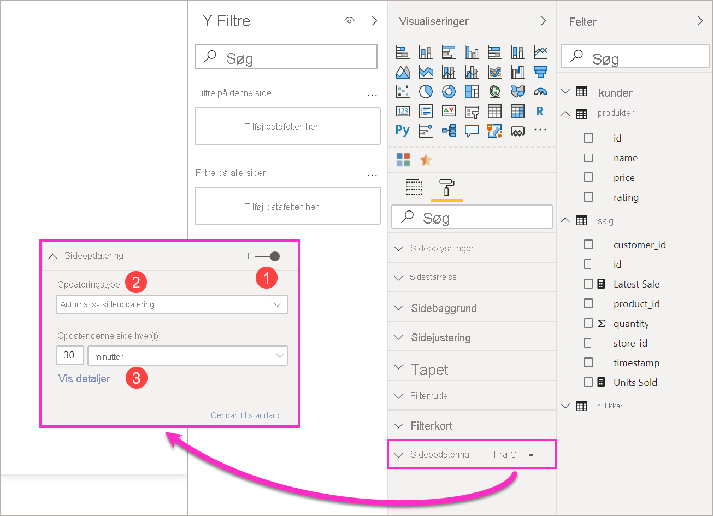
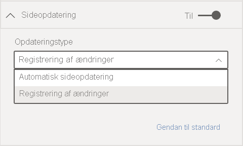
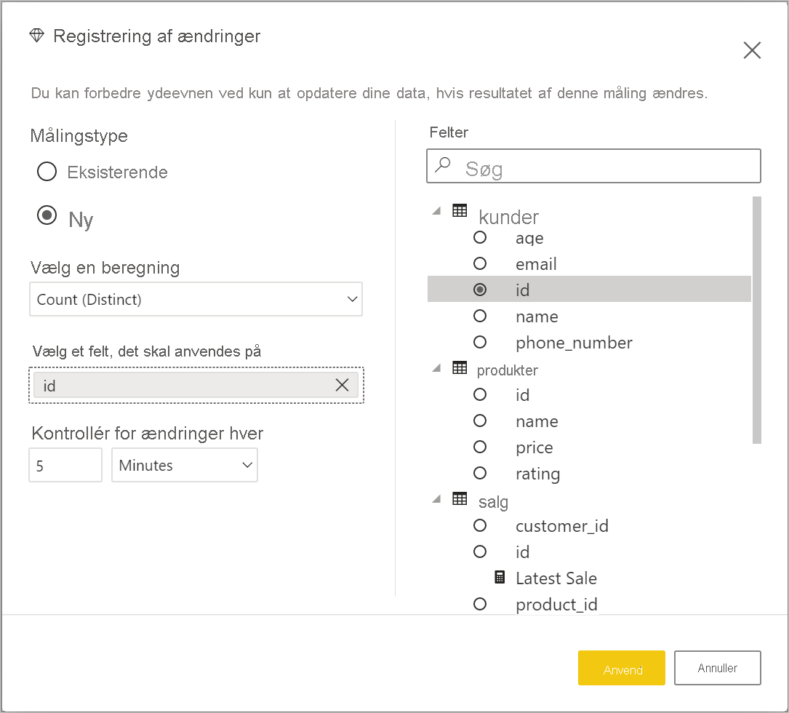
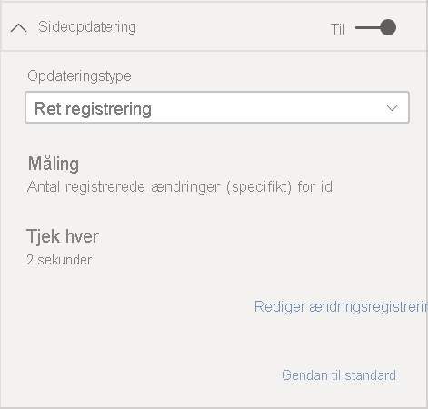
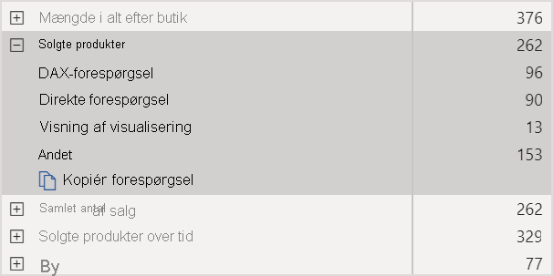
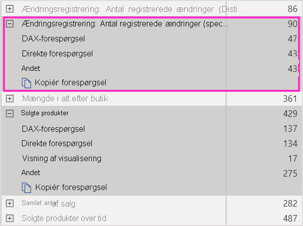
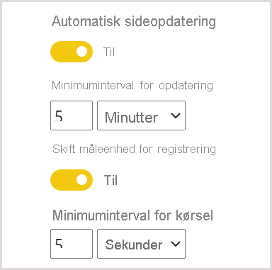

# Automatisk sideopdatering i Power BI

Når du overvåger kritiske hændelser, er det vigtigt, at data opdateres, så snart kildedataene opdateres. I produktionsindustrien er det for eksempel vigtigt at få vide, når en maskine ikke fungerer korrekt, eller hvis der er tegn på, at der snart opstår fejlfunktion. Hvis du overvåger signaler som synspunkter på sociale medier, vil du gerne vide mere om pludselige ændringer, så snart de forekommer.

Automatisk sideopdatering i Power BI gør det muligt for din aktive rapportside at forespørge om nye data med en foruddefineret hyppighed for [DirectQuery-kilder](../connect-data/desktop-directquery-about.md).

## Opdateringstyper

Når du bruger automatisk opdatering af sider, er der to tilgængelige opdateringstyper: fast interval og registrering af ændringer.

### Fast interval

Med denne opdateringstype kan du opdatere alle visuals på en rapportside på grundlag af et konstant interval, f. eks. et sekund eller fem minutter. Når det specifikke interval nås, sender alle visuals på den pågældende side en opdateringsforespørgsel til datakilden og opdateres tilsvarende.

### Ændre registrering

Denne opdateringstype giver dig mulighed for at opdatere visuals på en side på grundlag af registrering af ændringer i dataene i stedet for et bestemt opdateringsinterval. Denne måling forespørger, om der er ændringer af [DirectQuery-kilden](../connect-data/desktop-directquery-about.md). Udover at definere målingen skal du også vælge, hvor ofte Power BI Desktop skal kontrollere, om der er ændringer. Når du publicerer til tjenesten, understøttes denne opdateringstype kun i arbejdsområder, der er en del af en Premium-kapacitet. LiveConnect-kilder såsom Analysis Services og Power BI-datasæt understøttes ikke.

## Oprettelse af rapporter med automatisk sideopdatering i Power BI Desktop

Automatisk sideopdatering er tilgængelig til [DirectQuery-kilder](../connect-data/desktop-directquery-about.md) og nogle LiveConnect-scenarier, så det er kun tilgængeligt, når du har oprettet forbindelse til en understøttet datakilde. Denne begrænsning gælder for begge automatiske sideopdateringstyper.

Hvis du vil bruge automatisk sideopdatering i Power BI Desktop, skal du vælge den rapportside, du vil aktivere automatisk sideopdatering for. Vælg knappen **Formatering** (en malerulle) i ruden **Visualiseringer**, og find afsnittet **Sideopdatering** nederst i ruden.

1. Slår sideopdatering til eller fra.
2. Opdateringstype
3. Input og oplysninger (afhængigt af opdateringstype)

Kortet **Sideopdatering** er kun tilgængeligt, hvis du har forbindelse til en [DirectQuery-kilde](../connect-data/desktop-directquery-about.md). Hvis du vil aktivere automatisk sideopdatering, skal til/fra-knappen stå på Til. Det påkrævede input og de angivne oplysninger afhænger af den valgte opdateringstype.

### Konfiguration af Fast interval

Når du vælger **Opdatér side automatisk** som opdateringstype, skal du angive det ønskede opdateringsinterval. Standardværdien er 30 minutter. Det mindste opdateringsinterval er ét sekund. Din rapport begynder at blive opdateret med det interval, du har angivet.

Når du klikker på Vis detaljer vises der flere oplysninger i Power BI om følgende:

- Om funktionen er aktiveret af din administrator (kun når du er logget på din Power BI-konto)
- Det minimuminterval, din administrator har angivet (kun når du er logget på din Power BI-konto)
- Det faktiske opdateringsinterval (som regel længere end det valgte interval)
- Tidspunktet for den seneste opdatering

### Konfiguration af Ændre registrering

Når du vælger **Ændre registrering** som opdateringstype, får du vist et link til **Tilføj registrering af ændringer**. Du kan også få adgang til vinduet **Ændre registrering** fra fanen Modellering på båndet. Klik derefter på ikonet **Ændre registrering** i afsnittet **Sideopdatering**. Endelig kan du højreklikke på eller vælge rullelistepilen ud for en værdi i brønden Værdier og vælge **Ændre registrering** i menuen.

Når vinduet er åbent, får du vist indstillingen **Målingstype**, hvor du kan vælge en eksisterende måling eller oprette en ny fra bunden. Når du vælger en eksisterende, skal du blot vælge den ønskede måling på listen Felter eller trække den til og slippe den i afsnittet **Vælg eksisterende måling**. Når du opretter en ny måling, kan du i **Vælg en beregning** vælge en beregning for målingen. Mulighederne er Count, Count Distinct, Minimum, Maximum og Sum. Du kan f. eks. bruge Count Distinct til at tælle kunde-id'er og kun opdatere, når der føjes en ny kunde til listen. Når du har valgt en måling, skal du definere, hvor ofte Power BI skal **kontrollere, om der er ændringer**. Det er intervallet mellem beregningen af målingen i Power BI og pollingændringer. Når du klikker på Anvend, vises der en ny måling med ikonet Ændre registrering på din feltliste.

Når du er tilbage i afsnittet Sideopdatering kan du se oplysningerne om, hvilke målinger der bruges til registrering af ændringer og det definerede interval.

> [!NOTE]
> Der tillades kun én Ændre registrering-måling pr. model.

## Bestemmelse af opdateringsintervallet

Når automatisk sideopdatering er aktiveret, sender Power BI Desktop hele tiden forespørgsler til din DirectQuery-kilde. Når forespørgslen er sendt, går der et øjeblik, før der returneres data. I forbindelse med korte opdateringsintervaller skal du derfor bekræfte, at forespørgslerne returnerer de data, der forespørges efter, inden for det konfigurerede interval. Hvis dataene ikke returneres inden for intervallet, opdateres visuals sjældnere end konfigureret.

Disse overvejelser gælder for begge opdateringstyper: Fast interval og Ændre registrering. Den væsentligste forskel er, at i forbindelse med registrering af ændringer er der kun én forespørgsel, der går tilbage til kilden med et fast interval, og opdatering af visuals udløses kun, når værdien af målingen Ændre registrering ændres.

Som bedste fremgangsmåde skal opdateringsintervallet mindst svare til den forventede nye hastighed for datamodtagelse:

* Hvis der modtages nye data i kilden hvert 20. minut, kan opdateringsintervallet ikke være mindre end 20 minutter.
* Hvis der modtages nye data hvert sekund, skal intervallet indstilles til ét sekund.

Ved korte opdateringsintervaller som ét sekund skal du overveje følgende faktorer:

- Typen af DirectQuery-datakilde
- Den belastning, forespørgslerne opretter i den
- Rapportlæsernes afstand til kapacitetens datacenter

Du kan beregne returtiderne ved hjælp af [Effektivitetsanalyse](desktop-performance-analyzer.md) i Power BI Desktop og menuen Vis detaljer i afsnittet Sideopdatering for opdateringstypen Fast interval. Med Effektivitetsanalyse kan du kontrollere, om de enkelte visualforespørgsler har nok tid til at komme tilbage med resultaterne fra kilden. Du kan også se, hvor tiden bruges. På baggrund af resultaterne fra Effektivitetsanalyse kan du justere datakilden, eller du kan eksperimentere med andre visuelle elementer og målinger i din rapport.

På følgende billede vises resultaterne af en DirectQuery-kilde i Effektivitetsanalyse:

Lad os antage, at denne datakilde har nogle andre egenskaber:

- Data ankommer hvert andet sekund
- Effektivitetsanalyse viser den maksimale forespørgselstid + visningstid på ca. 4,9 sekunder (4,688 millisekunder)
- Datakilden er konfigureret til at håndtere cirka 1.000 samtidige forespørgsler pr. sekund
- Du forventer, at ca. 10 brugere skal have vist rapporten samtidig

Dette resulterer derfor i følgende ligning:

- **5 visuelle elementer x 10 brugere = cirka 50 forespørgsler**

Resultatet af denne beregning viser en meget større belastning, end datakilden kan understøtte. Dataene ankommer hvert andet sekund, så det skal være din opdateringshastighed. Men eftersom forespørgslen tager ca. fem sekunder, skal du angive opdateringshastigheden til mere end fem sekunder.

Bemærk også, at dette resultat kan være anderledes, når du publicerer din rapport i tjenesten. Denne forskel opstår, fordi rapporten vil bruge den Azure Analysis Services-forekomst, der er hostet i cloudmiljøet. Det kan være en god idé at justere opdateringshastighederne i overensstemmelse hermed.

Power BI tager højde for timing af forespørgsler og opdatering og kører kun den næste opdateringsforespørgsel, når alle de resterende opdateringsforespørgsler er fuldført. Så selvom dit opdateringsinterval er kortere end den tid, det tager at behandle dine forespørgsler, vil Power BI opdatere igen, når de resterende forespørgsler er fuldført.

I tilfælde af opdateringstypen Ændre registrering gælder disse overvejelser stadig. Desuden viser [Effektivitetsanalyse](desktop-performance-analyzer.md) resultaterne af forespørgslen om målingen Ændre registrering, selvom den ikke matcher noget visual i din rapport. Vi har stillet denne funktion til rådighed, så du kan foretage fejlfinding af denne bestemte type måling i henhold til de retningslinjer, vi nævnte tidligere. Den primære forskel for denne opdateringstype er, at der kun sendes én forespørgsel til datakilden i stedet for alle forespørgsler fra alle visuals. Dette er stadig tilfældet, hvis flere brugere får vist rapporten.

I det samme scenario vi beskrev før:

- **1 forespørgsel om målingen Ændre registrering for 5 visuals opretter kun én forespørgsel for et vilkårligt antal brugere**

- **Når målingen Ændre registrering udløser en opdatering, antages det samme scenarie som før med 5 visuals x 10 brugere = cirka 50 forespørgsler**

Det vil altså sige, at når der kun bruges registrering af ændringer, sendes der kun én forespørgsel til datakilden, indtil der registreres en ændring. Når det sker, anvendes den samme logik, der bruges til opdateringstypen Fast interval, og opdaterer alle visuals for alle brugere, hvilket opretter det samme antal forespørgsler. Denne fremgangsmåde burde være mere effektiv på langt sigt.

Lad os nu se på, hvordan du potentielt kan registrere og diagnosticere ydeevneproblemer som en kapacitetsadministrator. Du kan også se afsnittet [Ofte stillede spørgsmål](#frequently-asked-questions) senere i denne artikel, hvor du finder flere spørgsmål og svar om ydeevne og fejlfinding.

## Automatisk sideopdatering i Power BI-tjenesten

Du kan også angive automatisk sideopdatering for rapporter, der er publiceret i Power BI-tjenesten, så længe datakilden er [DirectQuery](../connect-data/desktop-directquery-about.md).

Hvis du vil konfigurere automatisk sideopdatering for rapporter i Power BI-tjenesten, er fremgangsmåden næsten den samme som i Power BI Desktop. Når den er konfigureret i Power BI-tjenesten, understøtter den automatiske opdatering af sider også [integreret Power BI](../developer/embedded/embedding.md)-indhold. På dette billede vises konfigurationen **Sideopdatering** for Power BI-tjenesten:

1. Slår sideopdatering til eller fra.
2. Opdateringstype
3. Input og oplysninger (afhængigt af opdateringstype)

> [!NOTE]
> Når du publicerer din rapport med automatisk sideopdatering aktiveret fra Power BI Desktop til tjenesten, skal du angive legitimationsoplysningerne for DirectQuery-datakilden i menuen Indstillinger for datasæt. Du kan konfigurere legitimationsoplysningerne, så rapportbrugerne får adgang til denne datakilde med deres egen identitet, samtidig med, at du respekterer den sikkerhed, der er konfigureret i kilden. Hvis der er tale om målingen Ændre registrering, evalueres den altid med forfatterens legitimationsoplysninger.

### Sideopdateringsintervaller

De sideopdateringsintervaller, der er tilladt i Power BI-tjenesten, påvirkes af rapportens arbejdsområdetype. Dette gælder for disse scenarier:

* Udgivelse af en rapport i et arbejdsområde, hvor automatisk sideopdatering er aktiveret.
* Redigering af et sideopdateringsinterval, der allerede findes i et arbejdsområde
* Oprettelse af en rapport direkte i tjenesten.

Power BI Desktop har ingen begrænsninger for opdateringsintervaller, og opdateringen kan derfor finde sted så hyppigt som hvert sekund. Når rapporter publiceres i Power BI-tjenesten, kan der dog gælde visse begrænsninger, som beskrives i følgende afsnit.

### Begrænsninger for opdateringsintervaller

I Power BI-tjenesten gælder der begrænsninger for automatisk sideopdatering baseret på det arbejdsområde, hvor rapporten publiceres, om du bruger Premium-tjenester, administratorindstillingerne for Premium-kapaciteten og typen af datakilde.

Vi vil tydeliggøre, hvordan disse begrænsninger fungerer, ved at begynde med nogle baggrundsoplysninger om kapaciteter og arbejdsområder.

*Kapaciteter* er et vigtigt Power BI-koncept. De repræsenterer et sæt ressourcer (lager, processor og hukommelse), der bruges til at hoste og levere Power BI-indhold. Kapaciteter er enten delte eller dedikerede. En *delt kapacitet* deles med andre Microsoft-kunder. En *dedikeret kapacitet* er fuldt allokeret til en enkelt kunde. Du finder en introduktion til dedikerede kapaciteter i artiklen [Administration af Premium-kapaciteter](../admin/service-premium-capacity-manage.md).

I en delt kapacitet kører dine arbejdsbelastninger på databehandlingsressourcer, der deles med andre kunder. Eftersom kapaciteten skal dele ressourcerne, pålægges der begrænsninger for at sikre *fair play*, f.eks. den maksimale modelstørrelse (1 GB) og den maksimale daglige opdateringshastighed (otte gange pr. dag).

Kapaciteter omfatter Power BI-*arbejdsområder*. De repræsenterer objektbeholdere til sikkerheds, samarbejde og udrulning. Hver bruger af Power BI har et personligt arbejdsområde, der er kendt som **Mit arbejdsområde**. Der kan oprettes flere arbejdsområder for at muliggøre samarbejde og udrulning. De kaldes *arbejdsområder*. Arbejdsområder, herunder personlige arbejdsområder, oprettes som standard i den delte kapacitet.

Her er nogle oplysninger om de to forskellige arbejdsområdescenarier:

**Delte arbejdsområder**. For almindelige arbejdsområder (arbejdsområder, der ikke er en del af en Premium-kapacitet) har den automatiske sideopdatering et minimuminterval på 30 minutter (det laveste tilladte interval). Opdateringstypen Ændre registrering er ikke tilgængelig i delte kapaciteter.

**Premium-arbejdsområder**. Tilgængeligheden af automatisk sideopdatering i Premium-arbejdsområder (både for Fast interval og Ændre registrering) afhænger af de arbejdsbelastningsindstillinger, Premium-administratoren har konfigureret til Power BI Premium-kapaciteten. Der er to variabler, som kan påvirke din mulighed for at konfigurere automatisk sideopdatering:

 - **Funktion til/fra**. Hvis kapacitetsadministratoren har deaktiveret funktionen, kan du ikke konfigurere nogen form for sideopdatering i din publicerede rapport. Fast interval og Ændre registrering kan slås til og fra separat.

 - **Minimuminterval for opdatering**. Når automatisk sideopdatering for Fast interval aktiveres, skal din kapacitetsadministrator konfigurere et minimumopdateringsinterval (standardværdien er 5 minutter). Hvis intervallet er lavere end minimumsintervallet, tilsidesætter Power BI-tjenesten intervallet for at overholde det minimumsinterval, der er angivet af kapacitetsadministratoren.

 - **Minimuminterval for udførelse**. Når Ændre registrering aktiveres, skal din kapacitetsadministrator konfigurere et minimuminterval for udførelse (standardværdien er 5 minutter). Hvis intervallet er lavere end minimumsintervallet, tilsidesætter Power BI-tjenesten intervallet for at overholde det minimumsinterval, der er angivet af kapacitetsadministratoren.

> [!WARNING]
> Når funktionen er aktiveret i dit datasæt, åbnes der en forbindelse til din DirectQuery-datakilde, når der registreres ændringer, for at beregne målingen og afstemningen af ændringer. Denne forbindelse adskiller sig fra de opdateringsforbindelser med lav prioritet, Power BI allerede foretager.

I denne tabel beskrives flere detaljer, hvor denne funktion er tilgængelig, og grænserne for hver kapacitetstype og [lagertilstand](../connect-data/service-dataset-modes-understand.md):

| Lagertilstand                                  | Dedikeret kapacitet                                                                                     | Delt kapacitet                                                                                       |
|-----------------------------------------------|--------------------------------------------------------------------------------------------------------|-------------------------------------------------------------------------------------------------------|
| DirectQuery                                   | **FI understøttes**: Ja  **ÆR understøttes**: Ja  **Minimum**: 1 sekund  **Tilsidesættelse af administrator**: Ja  | **FI understøttes**: Ja  **ÆR understøttes**: Nej  **Minimum**: 30 minutter  **Tilsidesættelse af administrator**: Nej |
| Importér                                        | **FI understøttes**: Nej  **ÆR understøttes**: Nej  **Minimum**: I/T  **Tilsidesættelse af administrator**: I/T         | **FI understøttes**: Nej  **ÆR understøttes**: Nej  **Minimum**: I/T  **Tilsidesættelse af administrator**: I/T        |
| Blandet tilstand (DirectQuery + andre datakilder) | **FI understøttes**: Ja  **ÆR understøttes**: Ja  **Minimum**: 1 sekund  **Tilsidesættelse af administrator**: Ja  | **FI understøttes**: Ja  **ÆR understøttes**: Nej  **Minimum**: 30 minutter  **Tilsidesættelse af administrator**: Nej |
| Analysis Services (Azure og i det lokale miljø)     | **FI understøttes**: Ja  **ÆR understøttes**: Nej  **Minimum**: 30 minutter  **Tilsidesættelse af administrator**: Ja | **FI understøttes**: Ja  **ÆR understøttes**: Nej  **Minimum**: 30 minutter  **Tilsidesættelse af administrator**: Nej |
| Power BI-datasæt (med DirectQuery-kilde)   | **FI understøttes**: Ja  **ÆR understøttes**: Nej  **Minimum**: 1 sekund  **Tilsidesættelse af administrator**: Ja  | **FI understøttes**: Ja  **ÆR understøttes**: Nej  **Minimum**: 30 minutter  **Tilsidesættelse af administrator**: Nej |
| Power BI Push-datasæt                        | **FI understøttes**: Ja  **ÆR understøttes**: Nej  **Minimum**: 30 minutter  **Tilsidesættelse af administrator**: Ja | **FI understøttes**: Ja  **ÆR understøttes**: Nej  **Minimum**: 30 minutter  **Tilsidesættelse af administrator**: Nej        |

*Tabelforklaring:*
1. *FI: Fast interval*
2. *ÆR: Ændre registrering*

> [!WARNING]
> Der er et kendt problem, når du opretter forbindelse fra Power BI Desktop til Analysis Services eller Power BI-datasæt, og opdateringsintervallet er 30 minutter eller mere. Der kan blive vist en fejl i visualiseringer på en rapportside efter 30 minutter.

## Overvejelser og begrænsninger

Der er et par ting, du skal være opmærksom på, når du bruger automatisk sideopdatering i Power BI Desktop eller Power BI-tjenesten:

* Importér lagringstilstand understøttes ikke for automatisk sideopdatering.  
* Sammensatte modeller, der har mindst én DirectQuery-datakilde, understøttes.
* Du kan kun have én måling af typen Ændre registrering pr. datasæt.
* Der kan maksimalt være 10 modeller med målingen Ændre registrering i en Power BI-lejer.

### Ydeevnediagnosticering

Automatisk sideopdatering kan bruges til at overvåge scenarier og udforske hurtigt skiftende data. I nogle tilfælde kan det dog belaste kapaciteten eller datakilden unødigt.

Power BI har disse sikkerhedsforanstaltninger for at forhindre unødig belastning af datakilder:

- Alle forespørgsler om automatisk sideopdatering kører ved en lavere prioritet for at sikre, at interaktive forespørgsler (f.eks. sideindlæsning og tværgående filtrering af visuelle elementer) har fortrinsret.
- Hvis forespørgslen ikke er færdig, før den næste opdateringscyklus er udført, udsteder Power BI ikke nye opdateringsforespørgsler, før den forrige forespørgsel er fuldført. Hvis du f.eks. har et opdateringsinterval på ét sekund, og dine forespørgsler i gennemsnit tager fire sekunder, udsteder Power BI kun en forespørgsel hvert fjerde sekund.

Der er to områder, hvor du stadig kan opleve flaskehalse for ydeevnen:

1. **Kapaciteten**. Forespørgslen søger først i Premium-kapaciteten, der udvides og evaluerer den DAX-forespørgsel, der genereres fra rapportvisualiseringerne, i kildeforespørgslerne.
2. **Typen af DirectQuery-datakilde**. De oversatte forespørgsler i det forrige trin køres derefter mod kilden. Kilden er dine SQL Server-forekomster, SAP Hana-kilder osv.

Hvis du bruger [appen Premium Capacity Metrics-appen ](../admin/service-admin-premium-monitor-capacity.md), der er tilgængelig for administratorer, kan du få visualiseret, hvor meget af kapaciteten der bruges af forespørgsler med lav prioritet.

Forespørgsler med lav prioritet består af automatiske sideopdateringsforespørgsler og forespørgsler om modelopdatering. Der er i øjeblikket ingen måde at skelne mellem belastningen fra automatisk sideopdatering og forespørgsler om modelopdatering.

Hvis du bemærker, at din kapacitet er overbelastet med forespørgsler med lav prioritet, er der nogle foranstaltninger, du kan træffe:

- Anmod om en større Premium-SKU.
- Kontakt rapportejeren for at få reduceret opdateringsintervallet.
- I portalen til kapacitetsadministration kan du:
   - Slå automatisk sideopdatering for den pågældende kapacitet fra.
   - Øge minimumsintervallet for opdatering, som påvirker alle rapporter i kapaciteten.

### Ofte stillede spørgsmål

**Jeg er rapportforfatter. Jeg har defineret opdateringsintervallet for min rapport til ét sek. i Power BI Desktop, men efter at jeg har publiceret min rapport, opdateres den ikke i tjenesten.**

* Kontrollér, at automatisk sideopdatering er slået til for siden. Da denne indstilling gælder pr. side, skal du sikre dig, at den er aktiveret for hver side i rapporten, som du vil opdatere.
* Kontrollér, om du har uploadet til et arbejdsområde med en tilknyttet Premium-kapacitet. Hvis du ikke har gjort det, låses dit opdateringsinterval i 30 minutter for et fast interval, og det vil ikke være tilgængeligt for registrering af ændringer.
* Hvis din rapport er i et Premium-arbejdsområde, skal du spørge din administrator, om denne funktion er aktiveret for den vedhæftede kapacitet. Sørg desuden for, at minimumintervallet for opdatering af kapaciteten er det samme som eller lavere end intervallet for din rapport. Dette gælder for både fast interval og registrering af ændringer

**Jeg er kapacitetsadministrator. Jeg har ændret indstillingerne for automatisk sideopdateringsinterval, men ændringerne afspejles ikke. Med andre ord opdateres rapporter stadig ved en uønsket hastighed eller opdateres slet ikke, selvom jeg har aktiveret automatisk sideopdatering.**

* Det tager op til fem minutter, før ændringer af indstillingerne for automatisk sideopdatering, der er foretaget i administratorgrænsefladen, træder i kraft i rapporter.
* Ud over at aktivere automatisk sideopdatering for kapaciteten skal du også aktivere funktionen for de sider i en rapport, du vil have opdateret.
* Begge opdateringstyper administreres separat, så du skal sørge for, at den opdateringstype, du aktiverer, er slået til.

**Min rapport fungerer i blandet tilstand. (blandet tilstand betyder, at rapporten har en DirectQuery-forbindelse og en import datakilde). Nogle visuals opdateres ikke.**

- Hvis dine visuals refererer til importtabeller, er dette forventeligt. Automatisk sideopdatering understøttes ikke for import.
- Se det første spørgsmål i dette afsnit.

**Min rapport er indtil nu blevet opdateret fint i tjenesten, men det er pludselig holdt op.**

* Prøv at opdatere siden for at se, om problemet løser sig selv.
* Kontakt din kapacitetsadministrator. Administratoren har muligvis slået funktionen fra eller øget minimumintervallet for opdatering. Se det andet spørgsmål i dette afsnit.

**Jeg er rapportforfatter. Mine visuals opdateres ikke med den hastighed, jeg har angivet. De opdateres med en lavere hastighed.**

* Hvis dine forespørgsler tager længere tid at køre, forsinkes opdateringsintervallet. Automatisk sideopdatering venter på, at alle forespørgsler er færdige, før der køres nye.
* Kapacitetsadministratoren kan have angivet et minimumsinterval for opdateringen, der er højere end det, du har angivet for din rapport. Bed din kapacitets administrator om at reducere minimumintervallet for opdatering.

**Håndteres automatiske sideopdateringer fra cachelageret?**

* Nej. Alle cachelagrede data tilsidesættes af forespørgsler om automatisk sideopdatering.

**Målingen Ændre registrering udløser ikke nogen opdateringer**

* Sørg for, at Ændre registrering er slået til for siden. Da denne indstilling gælder pr. side, skal du sikre dig, at den er aktiveret for hver side i rapporten, som du vil opdatere.
* Kontrollér, om du har uploadet til et arbejdsområde med en tilknyttet Premium-kapacitet. Hvis du ikke har gjort det, fungerer registrering af ændringer ikke.
* Hvis din rapport er i et Premium-arbejdsområde, skal du spørge din administrator, om denne funktion er aktiveret for den vedhæftede kapacitet. Sørg desuden for, at minimumintervallet for udførelse for kapaciteten er det samme som eller lavere end intervallet for din rapport.
* Hvis du har kontrolleret alle de elementer, der er nævnt før, skal du kontrollere Power BI Desktop eller redigeringstilstand, om målingen overhovedet ændrer sig. Det gør du ved at trække den til lærredet og kontrollere, om værdien ændres. Hvis det ikke er tilfældet, er målingen muligvis ikke et godt valg til ændringer i datakilden.

**Jeg kan ikke se APR-skifteren, når jeg har oprettet forbindelse til Analysis Services**

* Sørg for, at din Analysis Services-model er i [DirectQuery-tilstand](https://docs.microsoft.com/analysis-services/tabular-models/directquery-mode-ssas-tabular).

## Næste trin

Du kan finde flere oplysninger i disse artikler:

* [Brug af DirectQuery in Power BI](../connect-data/desktop-directquery-about.md)
* [Brug sammensatte modeller i Power BI Desktop](../transform-model/desktop-composite-models.md)
* [Brug Effektivitetsanalyse til at undersøge ydeevnen for rapportelementer](desktop-performance-analyzer.md)
* [Udrulning og administration af Power BI Premium-kapaciteter](../guidance/whitepaper-powerbi-premium-deployment.md)
* [Datakilder i Power BI Desktop](../connect-data/desktop-data-sources.md)
* [Udform og kombiner data i Power BI Desktop](../connect-data/desktop-shape-and-combine-data.md)
* [Opret forbindelse til Excel-projektmapper i Power BI Desktop](../connect-data/desktop-connect-excel.md)   
* [Angiv data direkte i Power BI Desktop](../connect-data/desktop-enter-data-directly-into-desktop.md)   
