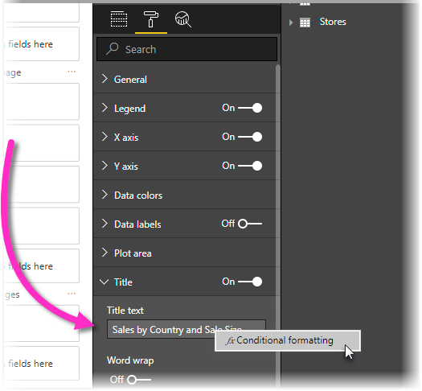

# <a name="expression-based-titles-in-power-bi-desktop"></a>Udtryksbaserede titler i Power BI Desktop

Du kan oprette dynamiske, tilpassede titler til dine visuelle elementer i Power BI. Ved at oprette DAX-udtryk (Data Analysis Expressions), der er baseret på felter, variabler eller andre programelementer, kan titlerne for dine visuelle elementer justeres automatisk efter behov. Disse ændringer er baseret på filtre, valg eller andre brugerinteraktioner og -konfigurationer.



Det er ligetil at oprette dynamiske titler (også nogle gange kaldet *udtryksbaserede titler*). 

## <a name="create-a-field-for-your-title"></a>Opret et felt til din titel

Det første trin i oprettelsen af en udtryksbaseret titel er at oprette et felt i din model, der skal bruges til titlen. 

Der er alle mulige forskellige kreative metoder til at få titlen på dit visuelle element til at afspejle, hvad du vil have det til at sige, eller hvad du vil udtrykke. Lad os tage et kig på et par eksempler.

Du kan oprette et udtryk, der er baseret på den filterkontekst, som det visuelle element modtager for produktets brandnavn. På følgende billede vises DAX-formlen for et sådant felt.


Et andet eksempel er brug af en dynamisk titel, der ændres på baggrund af brugerens sprog eller kultur. Du kan oprette sprogspecifikke titler i en DAX-måling ved hjælp funktionen `USERCULTURE()`. Denne funktion returnerer kulturkoden for brugeren baseret på vedkommendes operativsystem eller browserindstillinger. Du kan bruge følgende DAX-switch-sætning til at vælge den korrekte oversatte værdi. 

```
SWITCH (
  USERCULTURE(),
  "de-DE", “Umsatz nach Produkt”,
  "fr-FR", “Ventes par produit”,
  “Sales by product”
)
```

Eller du kan hente strengen fra en opslagstabel, der indeholder alle oversættelserne. Denne tabel placeres i din model. 

Dette er blot et par eksempler, som du kan bruge til at oprette dynamiske udtryksbaserede titler til dine visuelle elementer i Power BI Desktop. Det er kun din fantasi – og din model – der sætter grænser for det, du kan foretage dig med titler.


## <a name="select-your-field-for-your-title"></a>Vælg et felt til titlen

Når du har oprettet DAX-udtrykket for det felt, du opretter i din model, skal du anvende det i titlen på dit visuelle element.

Gå vil ruden **Visualiseringer** for at vælge feltet og anvende det. I området **Format** skal du vælge **Titel** for at få vist titelindstillingerne for det visuelle element. 

Når du højreklikker på **titeltekst**, vises en genvejsmenu, der giver dig mulighed for at vælge **<em>f.eks.</em>betinget formatering**. Når du vælger dette menupunkt, vises dialogboksen **Titeltekst**. 


Fra vinduet kan du vælge det felt, som du har oprettet til din titel.

## <a name="limitations-and-considerations"></a>Begrænsninger og overvejelser

Der er nogle få begrænsninger for den aktuelle implementering af udtryksbaserede titler til visualiseringer:

* Udtryksbaseret formatering understøttes ikke i øjeblikket i Python-visualiseringer, R-visualiseringer eller visualiseringer af nøglefaktorer.
* Det felt, du opretter til titlen, skal være en strengdatatype. Målinger, der returnerer tal eller dato/klokkeslæt (eller andre datatyper), understøttes ikke i øjeblikket.
* Udtryksbaserede titler overføres ikke, når du fastgør en visualisering til et dashboard.

## <a name="next-steps"></a>De næste trin

Denne artikel beskrev, hvordan du opretter DAX-udtryk, der ændrer titlerne på dine visuelle elementer til dynamiske felter, der kan ændres, når brugere interagerer med dine rapporter. Følgende artikler kan også være nyttige.

* [Betinget formatering af tabeller](desktop-conditional-table-formatting.md)
* [Brug tværgående detaljeadgang i rapport i Power BI Desktop](desktop-cross-report-drill-through.md)
* [Brug detaljeadgang i Power BI Desktop](desktop-drillthrough.md)
