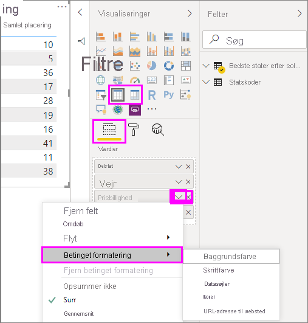
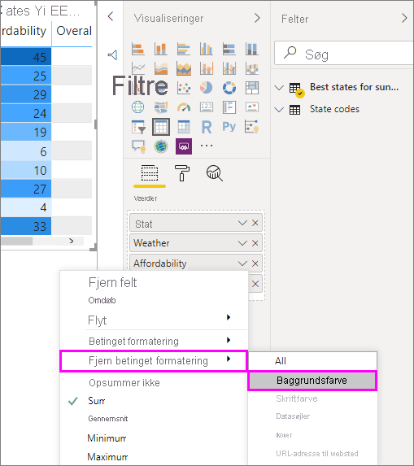
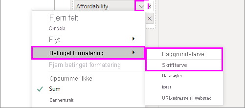
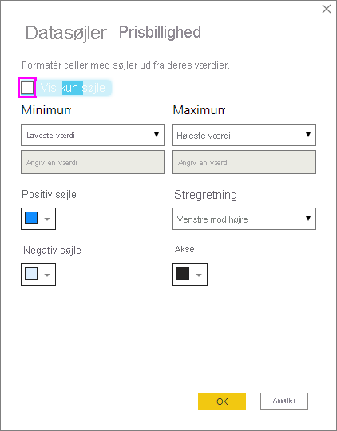
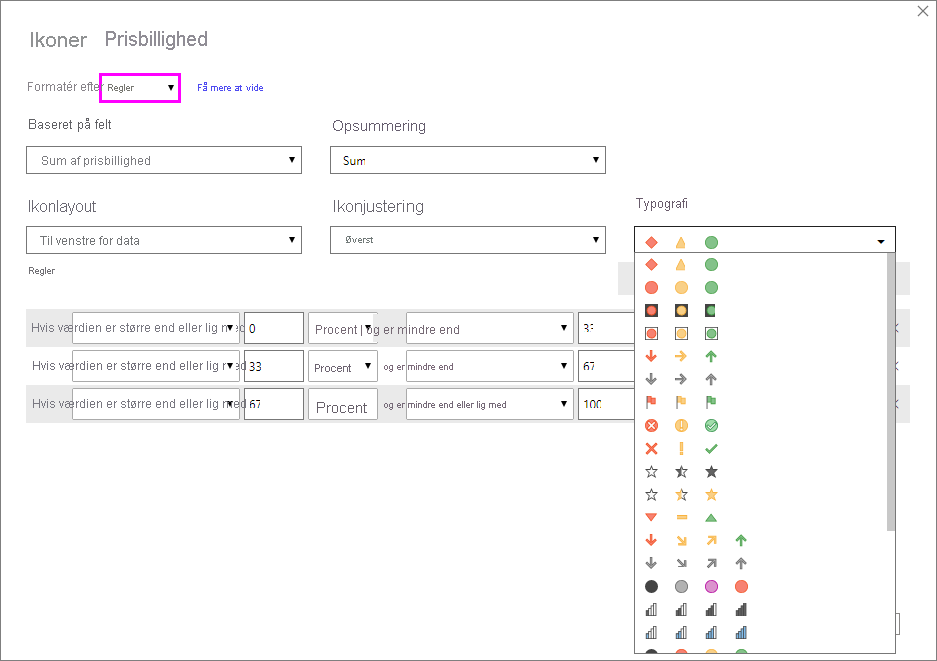
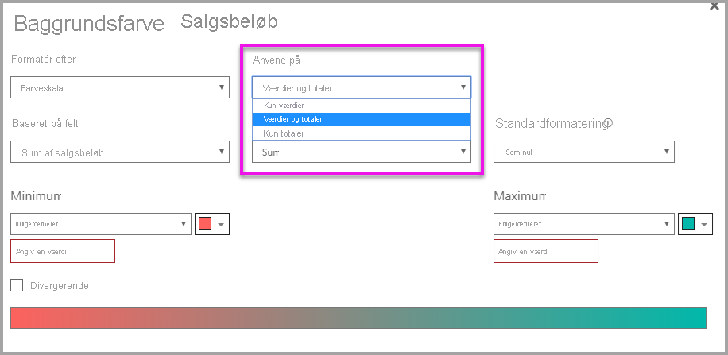

# Brug betinget formatering på tabeller 

Med betinget formatering af tabeller i Power BI Desktop kan du angive brugerdefinerede cellefarver, herunder farvegradueringer, på baggrund af feltværdier. Du kan også repræsentere celleværdier med datalinjer eller KPI-ikoner eller som aktive weblinks. Du kan anvende betinget formatering på ethvert tekst- eller datafelt, så længe du baserer formateringen på et felt, der har numerisk værdi, farvenavn eller hex-kode eller URL-værdier. 

Hvis du vil anvende betinget formatering, skal du vælge en visualisering af typen **Tabel** eller **Matrix** i Power BI Desktop. I afsnittet **Felter** i ruden **Visualiseringer** skal du højreklikke eller vælge pil ned ud for feltet i de **værdier**, du vil formatere. Vælg **Betinget formatering**, og vælg derefter den formattype, der skal anvendes.

> [!NOTE]
> Betinget formatering tilsidesætter en brugerdefineret baggrund eller skriftfarve, som du anvender på den celle, der har betinget formatering.

Hvis du vil fjerne betinget formatering fra en visualisering, skal du vælge **Fjern betinget formatering** fra feltets rullemenu og derefter vælge den type formatering, du vil fjerne.

I de følgende afsnit beskrives hver indstilling for betinget formatering. Du kan kombinere mere end én indstilling i en enkelt tabelkolonne.

## Formatér baggrund eller skriftfarve

Hvis du vil formatere cellebaggrunden eller skriftfarven, skal du vælge **Betinget formatering** for et felt og derefter vælge enten **Baggrundsfarve** eller **Skriftfarve** i rullemenuen. 

Dialogboksen **Baggrundsfarve** eller **Skriftfarve** åbnes med navnet på det felt, du formaterer, i titlen. Når du har valgt indstillinger for betinget formatering, skal du vælge **OK**. 

Indstillingerne **Baggrundsfarve** og **Skriftfarve** er de samme, men påvirker henholdsvis cellens baggrundsfarve og skriftfarve. Du kan anvende den samme eller en anden betinget formatering på et felts skriftfarve og baggrundsfarve. Hvis du gør et felts skrifttype og baggrund til den samme farve, blandes skrifttypen med baggrunden, så tabelkolonnen kun viser farverne.

## Farve efter farveskala

Hvis du vil formatere cellens baggrund eller skriftfarve efter farveskala, skal du i feltet **Formatér efter** i dialogboksen **Baggrundsfarve** eller **Skriftfarve** vælge **Farveskala**. Under **feltet Baseret på** skal du vælge det felt, som formateringen skal baseres på. Du kan basere formateringen på det aktuelle felt eller på et hvilket som helst felt i din model, der indeholder numeriske data eller farvedata. 

Under **Opsummering** skal du angive den sammenlægningstype, du vil bruge til det valgte felt. Vælg den formatering, der skal anvendes på tomme værdier, under **Standardformatering**. 

Under **Minimum** og **Maksimum** skal du vælge, om du vil anvende farveskemaet baseret på de laveste og højeste feltværdier eller på de brugerdefinerede værdier, du angiver. På rullelisten skal du vælge de farveprøver, der skal anvendes på minimum- og maksimumværdierne. Markér afkrydsningsfeltet **Divergerende** for også at angive en **Mellemste** værdi og farve. 

Et eksempel på en tabel med baggrundsformatering af farveskalaer på kolonnen **Prisbillighed** ser sådan ud:

Et eksempel på en tabel med skriftformatering af farveskalaer på kolonnen **Prisbillighed** ser sådan ud:

## Farve efter regler

Hvis du vil formatere cellens baggrund eller skriftfarve efter regler, skal du i feltet **Formatér efter** i dialogboksen **Baggrundsfarve** eller **Skriftfarve** vælge **Regler**. **Feltet Baseret på** viser igen det felt, som formateringen skal baseres på, og **Opsummering** viser sammenlægningstypen for feltet. 

Under **Regler** skal du angive et eller flere værdiområder og angive en farve for hver enkelt. Hvert værdiområde har en *Hvis værdi*-betingelse, en *og*-betingelse og en farve. Cellens baggrunde eller skrifttyper i hvert værdiområde er farvet med den angivne farve. Det følgende eksempel har tre regler:

Et eksempel på en tabel med regelbaseret baggrundsformatering af farver på kolonnen **Prisbillighed** ser sådan ud:

## Farve efter farveværdier

Hvis du har et felt eller en måling med farvenavn eller hex-værdidata, kan du bruge betinget formatering til automatisk at anvende disse farver på en kolonnes baggrund eller skriftfarve. Du kan også bruge brugerdefineret logik til at anvende farver på skrifttypen eller baggrunden.

Feltet kan bruge de farveværdier, der er angivet i specifikationen for CSS-farve på [https://www.w3.org/TR/css-color-3/](https://www.w3.org/TR/css-color-3/). Disse farveværdier kan omfatte:
- 3-, 6- eller 8-cifrede hex-koder, f.eks #3E4AFF. Sørg for at inkludere #-tegnet i starten af koden. 
- RGB- eller RGBA-værdier, som f.eks. RGBA (234, 234, 234, 0,5)
- HSL- eller HSLA-værdier, som f.eks. HSLA (123, 75 %, 75 %, 0,5)
- Farvenavne, f.eks. grøn, SkyBlue eller PeachPuff. 

Følgende tabel indeholder et farvenavn, der er knyttet til hver delstat: 

Hvis du vil formatere kolonnen **Farve** på baggrund af feltværdier, skal du vælge **Betinget formatering** for feltet **Farve** og derefter vælge **Baggrundsfarve** eller **Skriftfarve**. 

I dialogboksen **Baggrundsfarve** eller **Skriftfarve** skal du vælge **Feltværdi** på rullelisten **Formatér efter**.

Et eksempel på en tabel med værdibaseret farvefelt formatering **Baggrundsfarve** på feltet **Farve** ser sådan ud:

Hvis du også bruger **Feltværdi** til at formatere kolonnens **Skriftfarve**, er resultatet en dækkende farve i kolonnen **Farve**:

## Farve baseret på en beregning

Du kan oprette en beregning, som giver forskellige værdier baseret på de betingelser for forretningslogik, du vælger. Det er normalt hurtigere at oprette en formel end at oprette flere regler i dialogboksen Betinget formatering. 

Følgende formel anvender f.eks. hex-farveværdier i en ny kolonne for **Rangering efter prisbillighed**, baseret på eksisterende kolonneværdier for **Prisbillighed**:

Hvis du vil anvende farverne, skal du vælge **Baggrundsfarve** eller **Skriftfarve** betinget formatering for kolonnen **Prisbillighed** og basere formateringen på **Feltværdi** af kolonnen **Rangering efter prisbillighed**. 

Eksempel på tabel med baggrundsfarve for **Prisbillighed** baseret på beregnet **Rangering af prisbillighed** ser sådan ud:

Med lidt fantasi og nogle beregninger kan du oprette mange flere variationer.

## Tilføj datalinjer

Hvis du vil have vist datalinjer, der er baseret på celleværdier, skal du vælge **Betinget formatering** til feltet **Prisbillighed** og derefter vælge **Datalinjer** i rullemenuen. 

I dialogboksen **Datalinjer** er indstillingen **Vis kun søjle** som standard ikke markeret, så der vises både linjerne og de faktiske værdier i tabelcellerne. Hvis du kun vil have vist datalinjerne, skal du markere afkrydsningsfeltet **Vis kun søjle**.

Du kan angive værdierne **Minimum** og **Maksimum**, farver på datasøjler og retning samt aksens farve. 

Med datalinjer, der er anvendt på kolonnen **Prisbillighed**, ser eksempeltabellen sådan ud:

## Tilføj ikoner

Hvis du vil have vist ikoner, der er baseret på celleværdier, skal du vælge **Betinget formatering** til feltet og derefter vælge **Ikoner** i rullemenuen. 

I dialogboksen **Ikoner** under **Formatér efter** skal du vælge enten **Regler** eller **Feltværdi**. 

Hvis du vil formatere efter regler, skal du vælge **feltet Baseret på**, metoden **Opsummering**, **Ikonets layout**, **Ikonets justering**, ikonets **Typografi** og en eller flere **Regler**. Under **Regler** skal du angive en eller flere regler med en betingelse af typen *Hvis værdi* og en *og*-værdi og vælge et ikon, der skal anvendes på hver enkelt regel. 

Hvis du vil formatere efter feltværdier, skal du vælge **feltet Baseret på**, metoden **Opsummering**, **Ikonets layout** og **Ikonets justering**.

Følgende eksempel tilføjer ikoner, der er baseret på tre regler:

Vælg **OK**. Med ikoner anvendt på kolonnen **Prisbillighed** efter regler ser eksempeltabellen sådan ud:

## Formatér som webadresser

Hvis du har en kolonne eller måling, der indeholder webadresser, kan du bruge betinget formatering til at anvende disse URL-adresser til felter som aktive links. Følgende tabel har f.eks. en kolonne af typen **Websted** med URL-adresser til websteder for hver tilstand:

Hvis du vil have vist hver enkelt delstats navn som et dynamisk link til webstedet, skal du vælge **Betinget formatering** for feltet **State** og derefter vælge **URL-adresse til websted**. I dialogboksen **URL-adresse til websted** skal du under **feltet Baseret på** vælge **Websted** og derefter vælge **OK**. 

Med formatering for **URL-adresse til websted** anvendt på feltet **State** er hvert navn på en delstat et aktivt link til sit websted. Følgende eksempeltabel har formatering for **URL-adresse til websted** anvendt på kolonnen **State** og betingede **Datalinjer** og **Baggrundsformatering** anvendt på kolonnen **Prisbillighed**. 

## Totaler og subtotaler

Fra og med versionen fra april 2020 kan du anvende regler for betinget formatering på totaler og subtotaler for både tabel- og matrixvisualiseringer. 

Du anvender reglerne for betinget formatering ved at bruge rullelisten **Anvend på** i betinget formatering, som vist på følgende billede.

Du skal manuelt angive tærskler og intervaller for regler for betinget formatering. I forbindelse med matrixer refererer **værdier** til det laveste synlige niveau i matrixhierarkiet.

## Overvejelser og begrænsninger
Der er et par overvejelser, du skal gøre, når du arbejder med betinget formatering af tabeller:

- Betinget formatering anvendes kun på værdier i visualiseringer for Tabel eller Matrix og anvendes ikke på nogen subtotaler, samlede totaler eller rækken **Total**. 
- Alle tabeller, der ikke har en gruppering, vises som en enkelt række, der ikke understøtter betinget formatering.
- Du kan ikke anvende gradueringsformat med automatiske værdier for maksimum/minimum eller regelbaseret formatering med procentregler, hvis dine data indeholder *NaN*-værdier. NaN står for "Not a number" (ikke et tal) og skyldes ofte en fejl med division med nul. Du kan bruge [funktionen DIVIDE() DAX](/dax/divide-function-dax) til at undgå disse fejl.
- Betinget formatering skal have en sammenlægning eller en måling for at blive anvendt på værdien. Det er derfor, at du får vist 'Først' eller 'Sidst' i eksemplet **Farve efter værdi**. Hvis du opretter din rapport i en flerdimensionel Analysis Service-kube, kan du ikke bruge en attribut til betinget formatering, medmindre kubeejeren har oprettet en måling, der giver værdien.

## Næste trin

Du kan finde flere oplysninger om farveformatering under [Tip og tricks til farveformatering i Power BI](../visuals/service-tips-and-tricks-for-color-formatting.md)