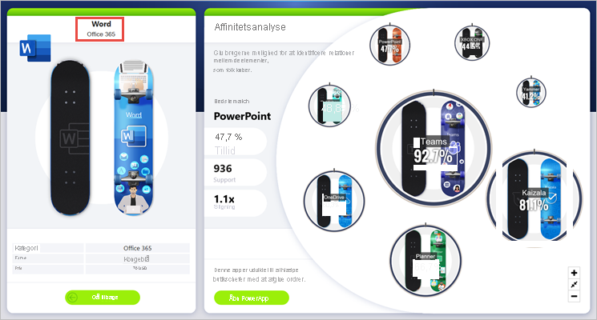
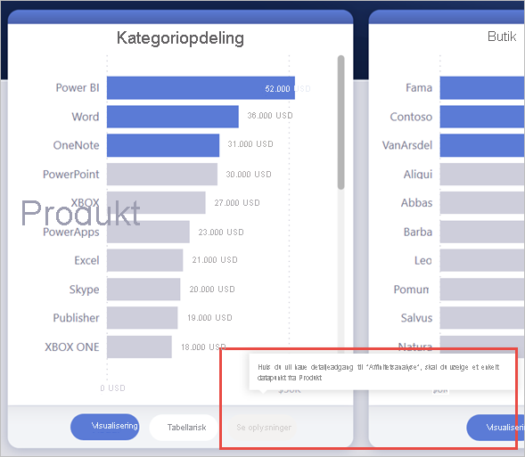
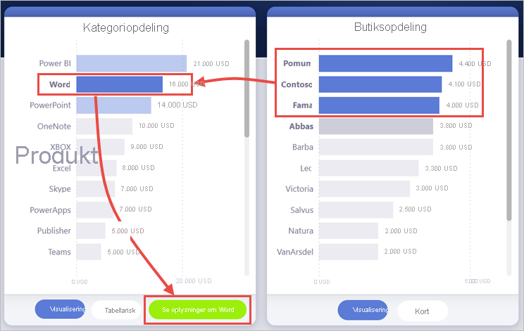
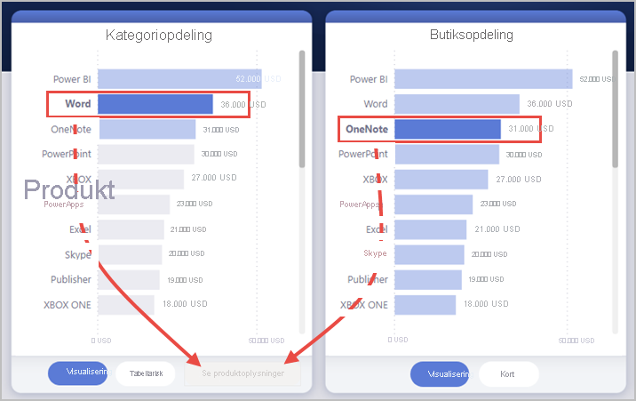
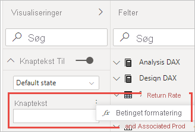
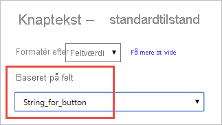
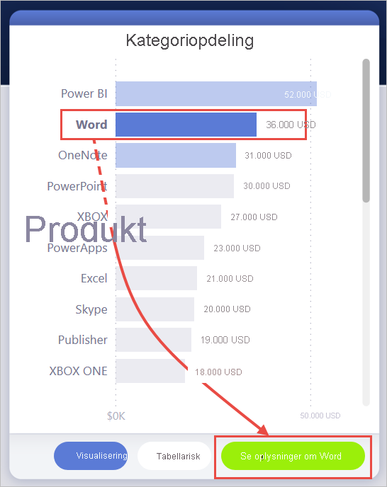
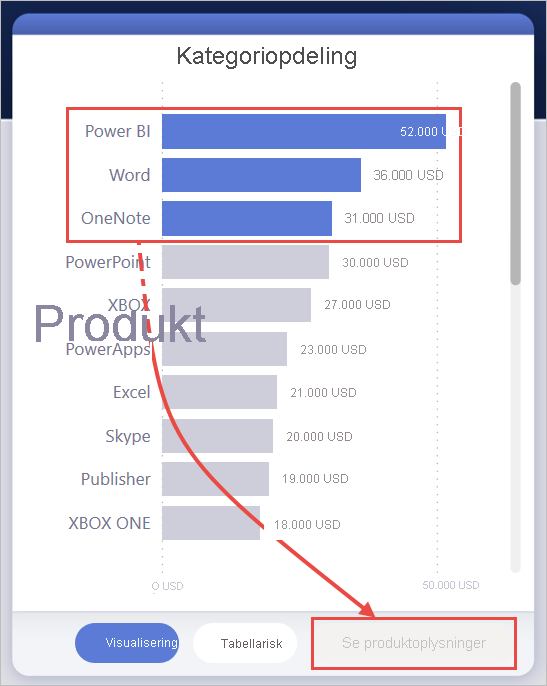

# <a name="create-a-drill-through-button-in-power-bi"></a>Opret en detaljeniveauknap i Power BI

Du kan oprette en *detaljeadgangsknap* i Power BI, som zoomer ind på en side med detaljer, der filtreres til en bestemt kontekst.

En måde at få detaljeret adgang på i en rapport er ved at højreklikke på en visualisering. Hvis du vil have, at detaljeadgangshandlingen er mere tydelig, kan du i stedet oprette en detaljeadgangsknap. Knappen øger synligheden af vigtige detaljeadgangscenarier i dine rapporter. Du kan angive betingelser for, hvordan knappen ser ud og fungerer. Du kan f.eks. få vist en anden tekst på en knap, hvis visse betingelser er opfyldt. Læs videre for at få flere oplysninger. 

Når du har valgt Word-panelet i diagrammet i dette eksempel, er knappen **Se detaljer** aktiveret.


Når du vælger knappen **Se detaljer**, får du detaljeadgang til siden Market Basket Analysis. Som du kan se af visual'et til venstre, er siden med detaljeadgang nu filtreret for Word.



## <a name="set-up-a-drill-through-button"></a>Konfigurer en detaljeniveauknap

Hvis du vil konfigurere en detaljeniveauknap, skal du først [konfigurere en gyldig side med detaljeadgang](desktop-drillthrough.md) i din rapport. Derefter skal du oprette en knap med **Detaljeadgang** som handlingstype og vælge siden med detaljeadgang som **Destination**.

Da detaljeadgangsknappen har to tilstande (aktiveret og deaktiveret), kan du se, at der er to indstillinger for værktøjstip.


Hvis du lader værktøjstipfelterne være tomme, opretter Power BI automatisk værktøjstip. Disse værktøjstips er baseret på destinations- og detaljeniveaufelterne.

Her er et eksempel på det automatisk oprettede værktøjstip, når knappen er deaktiveret:

"Hvis du vil have detaljeadgang til Market Place Analysis (destinationssiden), skal du vælge et enkelt datapunkt fra Product (detaljeadgangsfeltet)".



Og her er et eksempel på det automatisk oprettede værktøjstip, når knappen er aktiveret:

"Klik her for at få detaljeadgang til Market Basket Analysis (destinationssiden)".


Men hvis du vil angive brugerdefinerede værktøjstip, kan du altid angive en statisk streng. Du kan også anvende [betinget formatering af værktøjstip](#set-formatting-for-tooltips-conditionally).

## <a name="pass-filter-context"></a>Overfør filterkontekst

Knappen fungerer som den almindelige detaljeadgang: Du kan overføre filtre til ekstra felter ved at foretage krydsfiltrering af de visualiseringer, der indeholder detaljeadgangsfeltet. Hvis du f. eks. bruger **Ctrl** + **klik** og krydsfiltrering, kan du overføre flere filtre i Store til siden med detaljeadgang, fordi dine valg på krydsfiltrerer det visual, der indeholder detaljeniveaufeltet Product:



Når du vælger detaljeadgangsknappen, får du vist filtre for både Store og Product, der overføres til destinationssiden:


### <a name="ambiguous-filter-context"></a>Tvetydig filterkontekst

Da detaljeniveauknappen ikke er bundet til et enkelt visual, er knappen deaktiveret, hvis dit valg er tvetydigt.

I dette eksempel er knappen deaktiveret, fordi to visuals begge indeholder et enkelt produktvalg. Det er uklart, hvilket datapunkt fra hvilket visual detaljeadgangshandlingen skal knyttes til:



## <a name="customize-formatting-for-disabled-buttons"></a>Tilpas formatering for deaktiverede knapper
Du kan tilpasse formateringsindstillingerne for den deaktiverede tilstand for detaljeniveauknapper.


:::image type="content" source="media/desktop-drill-through-buttons/drill-through-customize-disabled-button.png" alt-text="Tilpas formatering for deaktiveret knap":::
 
Disse formateringsindstillinger omfatter:
- **Kontrolelementer for knaptekst**: tekst, farve, udfyldning, justering, størrelse og skrifttypefamilie

    :::image type="content" source="media/desktop-drill-through-buttons/drill-through-disabled-button-text.png" alt-text="Formatér tekst for deaktiveret knap":::

- **Kontrolelementer for knapudfyldning**: farve, gennemsigtighed og billede af *ny* udfyldning (mere om dette i næste afsnit)

    :::image type="content" source="media/desktop-drill-through-buttons/drill-through-disabled-button-fill.png" alt-text="Udfyldning for deaktiveret knap":::

- **Kontrolelementer for ikoner**: form, udfyldning, justering, stregfarve, gennemsigtighed og tykkelse

    :::image type="content" source="media/desktop-drill-through-buttons/drill-through-disabled-button-icon.png" alt-text="Ikoner for deaktiverede knapper":::

- **Kontrolelementer for disposition**: farve, gennemsigtighed, tykkelse og runde kanter

     :::image type="content" source="media/desktop-drill-through-buttons/drill-through-disabled-button-outline.png" alt-text="Disposition af deaktiverede knapper":::

## <a name="set-formatting-for-button-text-conditionally"></a>Angiv betinget formatering af knaptekst
Du kan bruge betinget formatering til at ændre knapteksten på basis af den valgte værdi for et felt. Hvis du vil gøre dette, skal du oprette en måling, der returnerer den ønskede streng på basis af DAX-funktionen SELECTEDVALUE.

Her er en eksempelmåling, der returnerer "Se produktoplysninger", hvis der IKKE er valgt en enkelt produktværdi. I modsat falde returnerer den "Se detaljer for [det valgte produkt]":

```dax
String_for_button = If(SELECTEDVALUE('Product'[Product], 0) == 0, "See product details", "See details for " & SELECTEDVALUE('Product'[Product]))
```

Når du har oprettet denne måling, skal du vælge indstillingen **Betinget formatering** for knapteksten:



Derefter skal du vælge den måling, du har oprettet til knapteksten:



Når der er valgt et enkelt produkt, er knapteksten:

"Se oplysninger om Word"



Når der enten ikke er valgt noget produkt, eller hvis der er valgt mere end ét produkt, er knappen deaktiveret. Knapteksten er:

"Se produktoplysninger"



## <a name="set-formatting-for-tooltips-conditionally"></a>Angiv betinget formatering af værktøjstip

Du kan angive betinget formatering af værktøjstippet til detaljeniveauknappen, når den aktiveres eller deaktiveres. Hvis du har brugt betinget formatering til dynamisk at angive destinationen for detaljeniveauet, kan du få værktøjstippet for knaptilstanden til at være mere informativt baseret på slutbrugerens valg. Her vises nogle eksempler:

- Du kan angive, at værktøjstippet for deaktiveret tilstand skal være afhængigt af det enkle tilfælde ved hjælp af en brugerdefineret måling. Hvis du f.eks. vil have, at brugeren skal vælge et enkelt produkt *og* et enkelt lager, før vedkommende kan få adgang til siden med markedsanalysen, kan du oprette en måling med følgende logik:

    Hvis brugeren ikke har valgt enten et enkelt produkt eller en enkelt butik, returnerer målingen: "Vælg et enkelt produkt og Ctrl + klik for også at vælge en enkelt butik".

    Hvis brugeren har valgt et enkelt produkt, men ikke en enkelt butik, returnerer målingen: "Ctrl + klik for også at vælge en enkelt butik".

- På samme måde kan du angive værktøjstippet for den aktiverede tilstand, så den er specifik for brugerens valg. Hvis du f.eks. vil have, at brugeren skal vide, hvilket produkt og hvilken butik detaljeniveausiden filtreres til, kan du oprette en måling, der returnerer:

    "Klik her for at få detaljeadgang til [sidenavnet for detaljeadgang] for at få vist flere oplysninger om salg for [produktnavn] i butikkerne [butiksnavn]".


## <a name="set-the-drill-through-destination-conditionally"></a>Sådan konfigurerer betinget detaljeadgang for destinationssiden

Du kan bruge betinget formatering til at angive destinationen for detaljeadgang baseret på resultatet af en måling.

Her er nogle scenarier, hvor du måske vil have, at destinationen for detaljeadgangsknappen er betinget:

- Du vil kun aktivere detaljeadgang til en side, **når flere betingelser er opfyldt**. I modsat fald er knappen deaktiveret.

    Du vil f.eks. gerne have, at brugerne vælger et enkelt produkt *og* en enkelt butik, før de kan få detaljeadgang til siden med markedsoplysninger. I modsat fald er knappen deaktiveret.

    :::image type="content" source="media/desktop-drill-through-buttons/drill-through-select-product-store.png" alt-text="Vælg et produkt og en butik":::
 
- Du vil have, at knappen **understøtter flere destinationer til detaljeadgang** baseret på brugernes valg.

    Lad os f.eks. sige, at du har flere destinationer (markedsoplysninger og butiksoplysninger), som brugerne kan få adgang til. Du kan få dem til at vælge en bestemt destination for detaljeadgang, før knappen bliver aktiveret for denne detaljeadgangsdestination.

    :::image type="content" source="media/desktop-drill-through-buttons/drill-through-select-product-destination.png" alt-text="Vælg produkt og destination":::
 
- Du kan også have interessante **sager til et hybridt scenarie** for at understøtte både flere detaljeadgangsdestinationer og bestemte betingelser, hvor knappen skal deaktiveres. Læs mere for at få mere at vide om disse tre muligheder.

### <a name="disable-the-button-until-multiple-conditions-are-met"></a>Deaktiver knappen, indtil flere betingelser er opfyldt

Lad os se på det første tilfælde, hvor du have, at knappen er deaktiveret, indtil yderligere betingelser er opfyldt. Du skal oprette en grundlæggende DAX-måling, der resulterer i en tom streng (""), medmindre betingelsen er opfyldt. Når den er opfyldt, vises navnet på destinationssiden for detaljeadgangen.

Her er et eksempel på en DAX-måling, der kræver, at der vælges en butik, før brugeren kan få detaljeadgang til siden med detaljer om produkter i en butik:

```dax
Destination logic = If(SELECTEDVALUE(Store[Store], “”)==””, “”, “Store details”)
```

Når du har oprettet denne måling, skal du vælge knappen til betinget formatering (fx) ud for **Destination** for knappen:

:::image type="content" source="media/desktop-drill-through-buttons/drill-through-select-formula.png" alt-text="Vælg knappen for betinget formatering":::
 
I det sidste trin skal du vælge den DAX-måling, du oprettede som feltværdien for destinationen:

:::image type="content" source="media/desktop-drill-through-buttons/drill-through-based-formula.png" alt-text="Destination baseret på felt"::: 

Nu kan du se, at knappen er deaktiveret, selvom der er valgt et enkelt produkt, da målingen også kræver, at du vælger en enkelt butik:

:::image type="content" source="media/desktop-drill-through-buttons/drill-through-button-disabled.png" alt-text="Detaljeadgangsknappen er deaktiveret":::

### <a name="support-multiple-destinations"></a>Understøt flere destinationer
 
I det andet almindelige tilfælde, hvor du vil understøtte flere destinationer, skal du begynde med at oprette en tabel med en enkelt kolonne med navnene på destinationerne for detaljeadgang:

:::image type="content" source="media/desktop-drill-through-buttons/drill-through-create-table.png" alt-text="Opret en tabel":::

Power BI bruger den nøjagtige strengforekomst til at angive destinationen for detaljeadgang. Du skal derfor dobbelttjekke, at de angivne værdier justeres præcist i forhold til navnene på detaljeadgangssiderne.

Når du har oprettet tabellen, kan du føje den til siden som et enkelt udsnit:

:::image type="content" source="media/desktop-drill-through-buttons/drill-through-slicer.png" alt-text="Udsnit til detaljeadgang":::
 
Hvis du har brug for mere lodret plads, kan du konvertere udsnittet til en rullemenu. Fjern overskriften i udsnittet, og tilføj et tekstfelt med titlen ved siden af:

:::image type="content" source="media/desktop-drill-through-buttons/drill-through-drop-down-slicer.png" alt-text="Udsnit til detaljeadgang uden header":::
 
Du kan også ændre listeudsnittet fra lodret til vandret retning:

:::image type="content" source="media/desktop-drill-through-buttons/drill-through-horizontal-slicer.png" alt-text="Vandret udsnit":::

I forbindelse med destinationsinputtet for detaljeadgangshandlingen skal du vælge knappen til betinget formatering (fx) ud for **Destination** for knappen:

:::image type="content" source="media/desktop-drill-through-buttons/drill-through-select-formula.png" alt-text="Vælg knappen for betinget formatering":::
 
Vælg navnet på den kolonne, du har oprettet, i dette tilfælde **Vælg en destination**:

:::image type="content" source="media/desktop-drill-through-buttons/drill-through-select-destination.png" alt-text="Vælg en destination":::
 
Nu kan du se, at detaljeadgangsknappen kun er aktiveret, når du har valgt et produkt *og* en destination:

:::image type="content" source="media/desktop-drill-through-buttons/drill-through-select-product-destination.png" alt-text="Vælg produkt og destination":::
 
### <a name="hybrid-of-the-two-scenarios"></a>En hybrid af de to scenarier

Hvis du er interesseret i en hybrid af de to scenarier, kan du oprette og referere til en DAX-måling for at tilføje yderligere logik for destinationsvalget.

Her er et eksempel på en DAX-måling, der kræver, at brugeren vælger en butik, før brugeren kan få detaljeadgang til et produkt på en af detaljeadgangssiderne:

```dax
Destination logic = If(SELECTEDVALUE(Store[Store], “”)==””, “”, SELECTEDVALUE(‘Table'[Select a destination]))
```

I det sidste trin skal du vælge den DAX-måling, du oprettede som feltværdien for destinationen:
I dette eksempel skal brugeren vælge et produkt, en butik *og* en destinationsside, før detaljeadgangsknappen aktiveres:

:::image type="content" source="media/desktop-drill-through-buttons/drill-through-product-store-destination.png" alt-text="Vælg et produkt, en butik og en destination":::

## <a name="limitations"></a>Begrænsninger

- Denne knap tillader ikke, at flere destinationer bruger en enkelt knap.
- Denne knap understøtter kun detaljeadgang i den samme rapport, hvilket med andre ord vil sige, at den ikke understøtter detaljeadgang på tværs af rapporter.
- Knappens formatering som deaktiveret er knyttet til farveklasserne i rapporttemaet. Få mere at vide om [farveklasser](desktop-report-themes.md#setting-structural-colors).
- Detaljeadgangshandlingen virker i alle indbyggede visuals og kan bruges sammen med *nogle* visuals, der er importeret fra AppSource. Det er dog ikke sikkert, at de kan bruges sammen med *alle* visuals, der er importeret fra AppSource.

## <a name="next-steps"></a>Næste trin
Du kan finde flere oplysninger om de funktioner, der er ens eller interagerer med knapper, i følgende artikler:

* [Opret knapper](desktop-buttons.md)
* [Brug detaljeadgang i Power BI-rapporter](desktop-drillthrough.md)
* [Brug bogmærker til at dele indsigt og oprette historier i Power BI](desktop-bookmarks.md)

