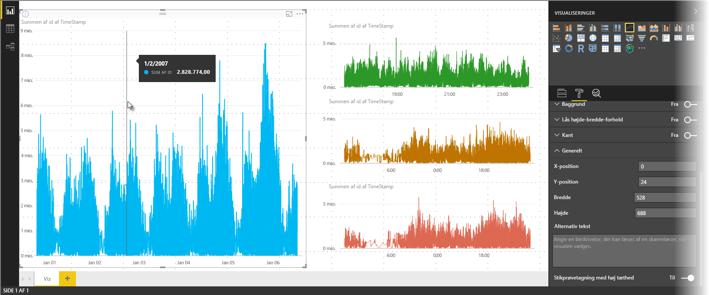
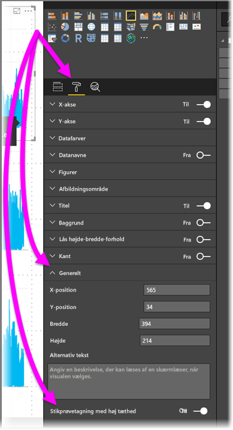

# Stikprøvetagning af linjer med høj tæthed i Power BI
Fra og med udgivelsen af **Power BI Desktop** fra juni 2017 og opdateringerne til **Power BI-tjenesten** findes der en ny algoritme til stikprøvetagning, som forbedrer visuelle elementer, der bruger stikprøver af data med høj tæthed. Du kan f.eks. oprette et kurvediagram ud fra dine detailbutikkers salgsresultater, hvor hver butik har mere end ti tusinde salgskvitteringer hvert år. I et kurvediagram med disse salgsoplysninger tages der en datastikprøve (der vælges en relevant repræsentation af disse data for at illustrere, hvordan salget varierer over tid) af dataene for hver enkelt butik, og der oprettes et kurvediagram med flere serier, som dermed repræsenterer de underliggende data. Dette er almindelig praksis ved visualisering af data med høj tæthed. Stikprøvetagning af data med høj tæthed er blevet forbedret i Power BI Desktop. Der er flere oplysninger om dette i denne artikel.

> [!NOTE]
> Algoritmen **Stikprøvetagning med høj tæthed**, der er beskrevet i denne artikel, er tilgængelig både i **Power BI Desktop** og **Power BI-tjenesten**.

## Sådan fungerer stikprøvetagning af linjer med høj tæthed
Tidligere valgte **Power BI** en samling af eksempeldatapunkter i alle de underliggende data på en deterministisk måde. I en visualisering af data med høj tæthed, som strækker sig over et kalenderår, kan der f.eks. vises 350 eksempeldatapunkter, som hver især er valgt for at sikre, at det fuldstændige dataområde (den samlede serie underliggende data) er repræsenteret i visualiseringen. For at hjælpe dig med at forstå, hvordan dette sker, kan du forestille dig, at du angiver aktiekursen i løbet af en periode på ét år og vælger 365 datapunkter for at oprette en visualisering i form af et kurvediagram (det er ét datapunkt for hver dag).

I denne situation er der mange værdier til en aktiekurs for hver enkelt dag. Der er naturligvis en daglig største- og mindsteværdi, men de kan optræde når som helst i løbet af dagen, når aktiemarkedet er åbent. Ved stikprøvetagning af linjer med høj tæthed, hvor den underliggende datastikprøve er taget kl. 10:30 og 12:00 hver dag, ville du få et repræsentativt snapshot af de underliggende data (kursen kl. 10:30 og 12:00), men du ville muligvis ikke få de faktiske højeste og laveste aktiekurser for det pågældende repræsentative datapunkt (den pågældende dag). I denne – og andre – situationer repræsenterer stikprøven de underliggende data, men den gengiver ikke altid vigtige punkter, som i dette tilfælde vil være de højeste og laveste aktiekurser for hver dag.

Stikprøver af data med høj tæthed tages pr. definition for at kunne oprette visualiseringer forholdsvist hurtigt og bruge disse visualiseringer interaktivt. For mange datapunkter i et visuelt element kan gøre det for tungt og gøre tendenserne mindre synlige. Algoritmen til stikprøvetagning er derfor udviklet for at tage en stikprøve af dataene, som giver den bedste visualisering. I Power BI Desktop er algoritmen nu blevet forbedret for at opnå den bedste kombination af svartid, repræsentation og tydelig bevarelse af vigtige punkter i hvert tidsrum.

## Sådan fungerer den nye algoritme for linjestikprøvetagning
Den nye algoritme for stikprøvetagning af linjer med høj tæthed er tilgængelig for visualiseringer i kurvediagrammer og områdediagrammer med en fortløbende X-akse.

I en visualisering med høj tæthed opdeler **Power BI** på intelligent vis dine data i dele med høj opløsning og vælger derefter vigtige punkter til at repræsentere hver del. Opdelingen af data med høj opløsning er specifikt tilpasset for at sikre, at det deraf følgende diagram ikke kan skelnes visuelt fra gengivelse af alle de underliggende datapunkter, men måden er væsentlig hurtigere og mere interaktiv.

### Minimum- og maksimumværdier for linjevisualiseringer med høj tæthed
For enhver given visualisering gælder følgende visuelle begrænsninger:

* Det maksimale antal datapunkter, der kan **vises** i visualiseringen, er *3.500* uanset antallet af underliggende datapunkter eller -serier (se *undtagelserne* på følgende punktliste). Hvis du derfor har 10 serier med 350 datapunkter i hver, har visualiseringen nået grænsen for det maksimale antal samlede datapunkter. Hvis du har én serie, kan den have op til 3.500 datapunkter, hvis det i den nye algoritme skønnes, at det er den bedste prøvetagning af de underliggende data.

* Enhver visualisering kan maksimalt have **60 serier**. Hvis du har mere end 60 serier, skal du opdele dataene og oprette flere visualiseringer med 60 serier eller færre. Det er en god ide at bruge et **udsnit** til kun at vise segmenter af dataene (kun bestemte serier). Hvis du f.eks. får vist alle underkategorier i forklaringen, kan du bruge et udsnit til at filtrere efter den overordnede kategori på samme rapportside.

Det maksimale antal datagrænser er højere for følgende visuelle typer, som er *undtagelser* for datapunktgrænsen på 3.500:

* Maksimalt **150.000** datapunkter for R-visuals.
* **30.000** datapunkter for Power BI-visuals.
* **10.000** datapunkter for punktdiagrammer (3.500 er standarden for punktdiagrammer).
* **3.500** for alle andre visualiseringer.

Disse parametre sørger for, at visualiseringer i Power BI Desktop gengives meget hurtigt og reagerer på interaktion med brugere. Parametrene medfører ikke unødvendigt forbrug af beregningsressourcer på den computer, der gengiver visualiseringen.

### Evaluering af repræsentative datapunkter for linjevisualiseringer med høj tæthed
Når antallet af underliggende datapunkter overstiger det maksimale antal datapunkter, der kan gengives i visualiseringen, startes en proces kaldet *gruppering i beholdere*, der deler de underliggende data i grupper kaldet *placeringer* og derefter gentagne gange justerer disse placeringer.

Algoritmen opretter så mange placeringer som muligt for at skabe den bedst mulige granulering for visualiseringen. Inden for hver placering finder algoritmen minimum- og maksimumdataværdien for at sikre, at vigtige og betydningsfulde værdier (f.eks. udenforliggende værdier) registreres og vises i visualiseringen. Baseret på resultaterne af grupperingen i beholdere og den efterfølgende evaluering af dataene af Power BI bestemmes den mindste opløsning for X-aksen i visualiseringen – for at sikre maksimal granulering for visualiseringen.

Som tidligere nævnt er minimumgranuleringen for hver serie 350 punkter, maksimumgranuleringen er 3.500 for de fleste visualiseringer med de *undtagelser*, der er angivet i de forrige afsnit.

Hver placering er repræsenteret af to datapunkter, der bliver placeringens repræsentative datapunkter i visualiseringen. Datapunkterne er simpelthen den mindste og højeste værdi for den pågældende placering og ved at vælge mindste og højeste sikrer processen til gruppering i beholdere, at vigtige høje værdier eller betydningsfulde lave værdier registreres og gengives i visualiseringen.

Det kan lyde som en stor mængde analyse for at sikre, at lejlighedsvise udenforliggende værdier registreres og gengives i visual'et, men det er netop årsagen til den nye algoritme og processen til gruppering i beholdere.

## Værktøjstip og stikprøvetagning af linjer med høj tæthed
Det er vigtigt at bemærke, at denne proces til gruppering af data, som resulterer i, at minimum- og maksimumværdien for en given placering registreres og vises, kan påvirke måden, som værktøjstip vises på, når du peger på datapunkterne. For at vise, hvordan og hvorfor dette sker, kan vi gå tilbage til vores eksempel med aktiekurserne.

Lad os forestille os, at du opretter et visual baseret på aktiekursen, og at du sammenligner to forskellige aktier, som begge bruger **Stikprøvetagning med høj tæthed**. De underliggende data for hver serie indeholder mange datapunkter (det kan være, at du registrerer aktiekursen hvert sekund på dagen). Algoritmen til stikprøvetagning af linjer med høj tæthed grupperer i beholdere for hver serie uafhængigt af hinanden.

Nu antager vi, at den første aktie stiger i pris kl. 12:02 og derefter hurtigt falder igen ti sekunder senere. Det er et vigtigt datapunkt. Når gruppering i beholdere finder sted for den pågældende aktie, vil den højeste værdi kl. 12:02 være et repræsentativt datapunkt for denne placering.

Men værdien for den anden aktie var hverken høj eller lav for den beholder, der inkluderede kl. 12:02. Måske indtraf den højeste og laveste værdi for den beholder, der indeholder kl. 12:02, tre minutter senere. Når kurvediagrammet oprettes, og du peger på 12:02, vil du i denne situation få vist en værdi i værktøjstippet til den første aktie (fordi den steg kl. 12:02, og denne værdi blev valgt som højeste datapunkt på denne placering), men du får *ikke* vist nogen værdi i værktøjstippet kl. 12:02 for den anden aktie. Det skyldes, at den anden aktie hverken havde en høj eller en lav værdi for den placering, der inkluderede 12:02. Der er ingen data at vise for den anden aktie kl. 12:02, og derfor vises der ingen værktøjstipdata.

Denne situation vil ofte opstå med værktøjstip. De høje og lave værdier for en bestemt placering stemmer muligvis ikke perfekt overens med de ligeligt skalerede værdipunkter på X-aksen, og værktøjstippet vil derfor ikke vise værdien.  

## Sådan slår du stikprøvetagning af linje med høj tæthed til
Den nye algoritme er som standard slået **til**. Hvis du vil ændre denne indstilling, skal du gå til ruden **Formatering** og vælge kortet **Generelt**. Nederst kan du se en til/fra-skyder med navnet **Stikprøvetagning med høj tæthed**. Hvis du vil slå den fra, skal du skubbe den hen på **Fra**.

## Overvejelser og begrænsninger
Den nye algoritme for stikprøvetagning af linjer med høj tæthed er en vigtig forbedring af Power BI, men der er et par ting, du skal vide, når du arbejder med værdier med høj tæthed og data.

* På grund af større granulering og processen til gruppering i beholdere vil **Værktøjstip** muligvis kun vise en værdi, hvis de repræsentative data er justeret efter markøren. Se afsnittet *Værktøjstip og stikprøvetagning af linjer med høj tæthed* i denne artikel for at få flere oplysninger.
* Når størrelsen på en samlet datakilde er for stor, eliminerer den nye algoritme serier (forklaringselementer) for at tilpasse maksimumbegrænsningen for dataimporten.
  
  * I denne situation placerer den nye algoritme forklaringsserier alfabetisk. Den arbejder sig ned ad listen over elementer i forklaringen i alfabetisk rækkefølge, indtil maksimum for importen er nået, og importerer ikke flere serier.
* Når et underliggende datasæt har mere end 60 serier (det maksimale antal serier som beskrevet tidligere), placerer den nye algoritme serien alfabetisk og fjerner serier ud over den 60. alfabetisk placerede serie.
* Hvis værdierne i dataene ikke er af typen *numerisk* eller *dato/klokkeslæt*, bruger Power BI ikke den nye algoritme og vender tilbage til den forrige algoritme (stikprøvetagning uden høj tæthed).
* Indstillingen **Vis elementer uden data** understøttes ikke med den nye algoritme.
* Den nye algoritme understøttes ikke, når du bruger en direkte forbindelse til en model, der hostes i SQL Server Analysis Services (version 2016 eller tidligere). Den understøttes i modeller, der hostes i **Power BI** eller Azure Analysis Services.

## Næste trin
Du kan finde oplysninger om stikprøvetagning med høj tæthed i punktdiagrammer i følgende artikel.

* [Stikprøvetagning med høj tæthed i Power BI-punktdiagrammer](desktop-high-density-scatter-charts.md)

