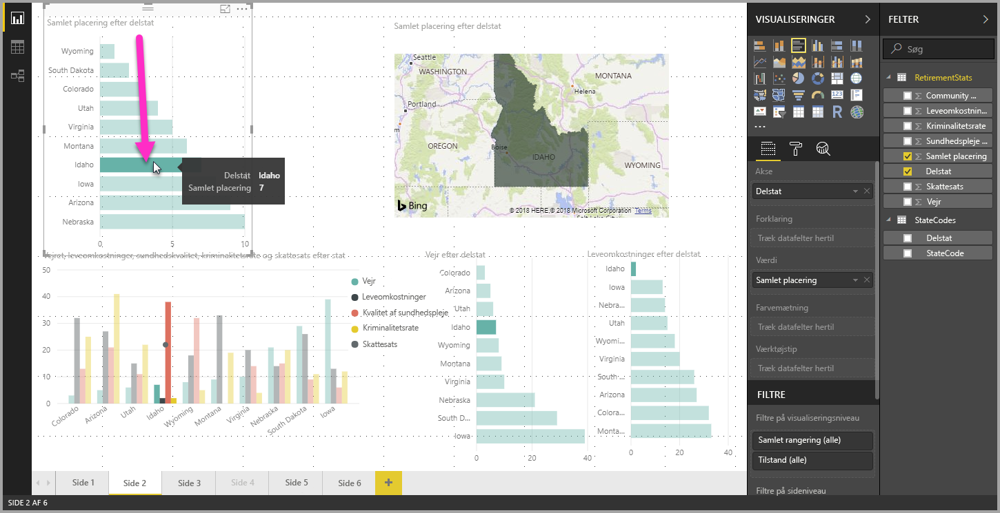
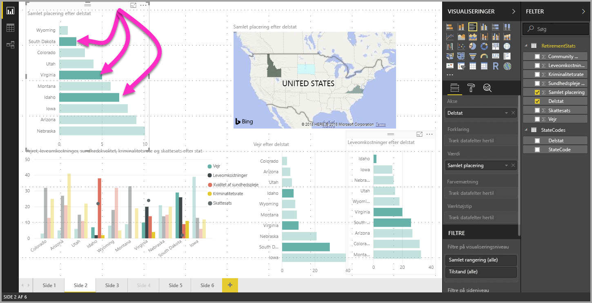

# Markér flere dataelementer, datapunkter og visualiseringer i Power BI Desktop

Du kan markere flere dataelementer i én visualisering, flere datapunkter i en visualisering eller flere visualiseringer i en rapport ved hjælp af Power BI Desktop. I følgende afsnit beskrives hver især skiftevist.

## Markér flere datapunkter

I Power BI Desktop kan du fremhæve et datapunkt i en hvilken som helst visualisering ved blot at klikke på datapunktet i visualiseringen. Hvis du f.eks. har et vigtigt søjle- eller diagramelement, og du gerne vil have, at andre visualiseringer på siden i rapporten fremhæver data på baggrund af din markering, kan du klikke på dataelementet i én visualisering og se resultatet afspejlet i andre visualiseringer på siden. Dette er grundlæggende – også kaldet fremhævning med enkelt markering. På følgende billede kan du se en grundlæggende fremhævning. 

Ved hjælp af markering af flere kan du nu markere mere end ét datapunkt på en side i din **Power BI Desktop**-rapport og fremhæve resultaterne på tværs af visualiseringerne på siden. Det svarer til en **og**-sætning eller funktionalitet, f.eks. "fremhæv resultater for Idaho **og** Virginia". Brug **CTRL + klik** for at markere flere datapunkter i visualiseringer. På følgende billede kan du se **flere datapunkter** markeret (vha. markering af flere).

Dette lyder som en simpel funktionalitet, men det åbner op for et hav af muligheder, når du opretter, deler og interagerer med rapporter. 

## Markér flere elementer ved hjælp af rektangulær markering (prøveversion)

Du kan markere flere dataelementer i en visualisering eller flere visualiseringer i en rapport ved hjælp af rektangulær markering, der ofte også refereres til som *lassomarkering*. 

### Markér flere visualiseringer på lærredet

Markér flere visualiseringer og andre rapportelementer ved at klikke på og trække henover lærredet for at skabe en rektangulær lasso. Alle visualiseringer, som er helt indkapslet i lassoen, markeres. Hvis du trykker på *Ctrl*- eller *Skift*-tasten (mens du markerer flere ved hjælp af Ctrl + klik på de enkelte visualiseringer), føjer yderligere indkapsling med lasso markeringer af visualiseringer til den aktuelle markering af flere. 

Hvis en visualisering allerede er markeret og den indkapsles af lassoen, fjernes denne markering, når *Ctrl* eller *Skift* bruges. Der markeres ikke enkelte visualiseringer i grupper med lassoen, men der kan markeres grupper ved at indkapsle hele gruppen.

Lærredet ruller ikke automatisk med den rektangulære lassomarkering. 

### Markér flere datapunkter i en visualisering

Du kan markere flere datapunkter i en visualisering ved hjælp af de samme trin med den rektangulære lasso. Klik og træk i en visualisering, mens du holder *Ctrl*-tasten nede, for at markere flere datapunkter. Når du slipper museknappen, markeres alle punkter, der overlapper markeringsrektanglet, og alle tidligere lassomarkeringer bevares også. Hvis du markerer et område med lasso, der indeholder tidligere markerede punkter ved hjælp af *Ctrl* under markeringen, fjernes markeringen af disse datapunkter (fjernes). Brug af lassoen har samme effekt som *Ctrl* + klik på hvert punkt enkeltvist. 

Når du bruger *Skift*-tasten, mens du bruger lassomarkering, bevares tidligere markeringer, og datapunkter, der allerede er markeret, forbliver markeret. Så brug af *Skift*, mens du bruger lassomarkering, føjer kun datapunkter til din markering i stedet for at skifte datapunkter i det markerede område.

Du kan rydde den aktuelle markering ved at klikke på et tomt område i afbildningsområdet uden at trykke på en tast på tastaturet.

Du kan finde yderligere oplysninger om denne funktion i [blogindlægget om udgivelsen af denne funktion](https://powerbi.microsoft.com/blog/power-bi-desktop-august-2020-feature-summary/#_Data_point).

Der er nogle få begrænsninger og overvejelser i forbindelse med markering af flere datapunkter i en visualisering:

* Kurve-, område-, punkt-, trædiagram samt kort understøtter lassomarkering
* Det maksimale antal datapunkter, du kan markere på én gang, er 300
* Når du får vist en rapport i Power BI-tjenesten, er rektangulær markering kun aktiveret, hvis funktionen med lassomarkering var aktiveret, da rapporten blev gemt og publiceret

## Næste trin

Du vil måske også være interesseret i følgende artikler:

* [Brug gitterlinjer og fastgørelse til gitter i Power BI Desktop-rapporter](desktop-gridlines-snap-to-grid.md)
* [Om filtre og fremhævning i Power BI-rapporter](power-bi-reports-filters-and-highlighting.md)

