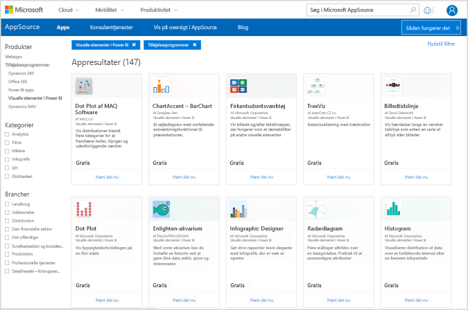
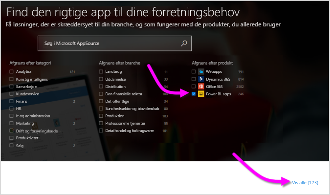
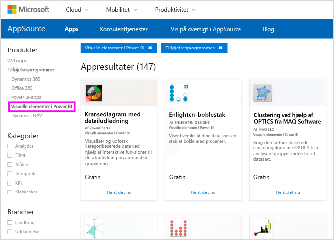
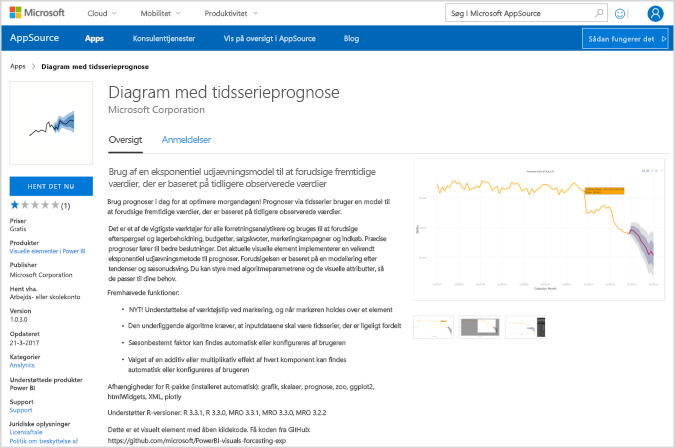
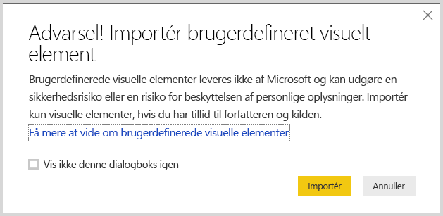
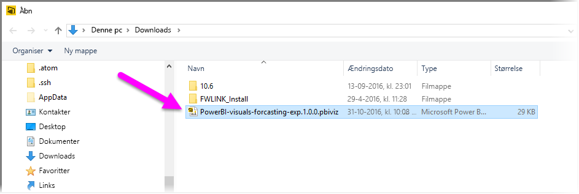
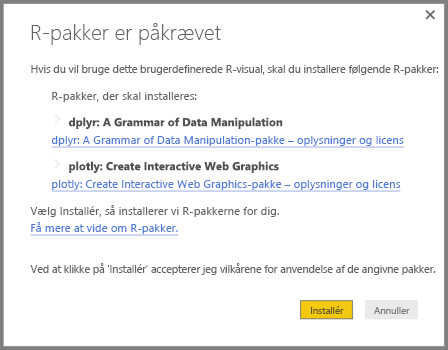
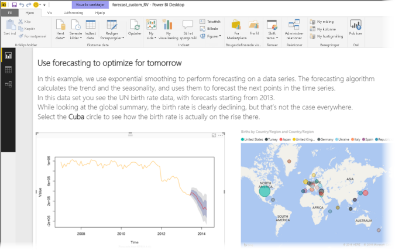
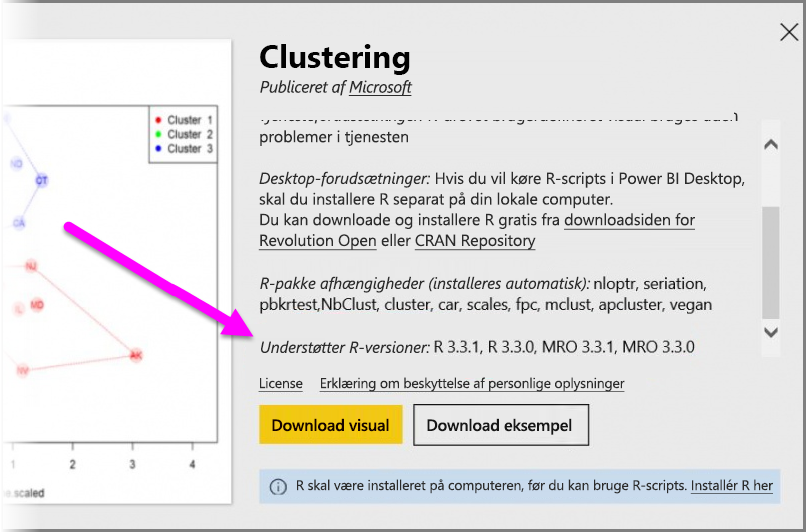

# Brug R-drevne Power BI-visualiseringer i Power BI

I **Power BI Desktop** og **Power BI-tjenesten** kan du bruge R-drevne Power BI-visualiseringer uden at have kendskab til R og uden et R-script. Det giver dig mulighed for at udnytte den analytiske og visuelle kraft i visuelle R-elementer og R-scripts uden at skulle lære R eller programmere.

Hvis du vil bruge R-drevne Power BI-visualiseringer, skal du første vælge og downloade den brugerdefinerede R-visualisering, som du vil bruge, fra galleriet [**AppSource**](https://appsource.microsoft.com/marketplace/apps?product=power-bi-visuals&page=1) med **Power BI-visualiseringer** til Power BI.

I de følgende afsnit beskrives det, hvordan du vælger, indlæser og bruger R-drevne visuelle elementer i **Power BI Desktop**.

## Brug R-visualiseringer i Power BI

Hvis du vil bruge R-drevne Power BI-visualiseringer, skal du downloade hver enkelt visualisering fra biblioteket med **Power BI-visualiseringer** og derefter bruge visualiseringen som enhver anden type visualisering i **Power BI Desktop**. Der er to måder, hvorpå du kan få Power BI-visualiseringer: Du kan downloade dem fra webstedet **AppSource**, eller du kan søge i og hente dem fra **Power BI Desktop**. 

### Hent Power BI-visualiseringer fra AppSource

Her er den fremgangsmåde, du skal benytte for at gennemse og vælge visuals på webstedet **AppSource**:

1. Gå til biblioteket med visuals i Power BI, som du finder på [https://appsource.microsoft.com](https://appsource.microsoft.com/). Markér afkrydsningsfeltet *Power BI apps* under *Afgræns efter produkt*, og vælg derefter linket **Se alle**.

   

2. Vælg [Brugerdefinerede visuals i Power BI](https://appsource.microsoft.com/marketplace/apps?product=power-bi-visuals&page=1) på bibliotekssiden **Brugerdefinerede visuals i Power BI** på listen over tilføjelsesprogrammer i venstre rude.

   

3. Vælg det **visuelle element**, som du er interesseret i at bruge, fra galleriet. Derefter sendes du videre til en side, som beskriver det visuelle element. Tryk på knappen **Hent det nu** for at downloade.

   > [!NOTE]
    > For at kunne redigere i **Power BI Desktop** skal du have R installeret på din lokale computer. Men når brugere vil have vist et R-drevet visual i **Power BI-tjenesten**, behøver de ikke at have R installeret lokalt.

   

   Du behøver ikke at installere R for at bruge R-drevne Power BI-visualiseringer i **Power BI-tjenesten**, men hvis du vil bruge R-drevne Power BI-visualiseringer i **Power BI Desktop**, *skal* du installere R på den lokale computer. Du kan downloade R fra følgende steder:

   * [CRAN](https://cran.r-project.org/)
   * [MRO](https://mran.microsoft.com/)

4. Når visualiseringen er downloadet (hvilket er ligesom at downloade enhver anden fil via din browser), skal du gå til **Power BI Desktop** og klikke på **Flere indstillinger** (...) i ruden **Visualiseringer**. Vælg derefter **Importér fra fil**.

   
5. Du bliver advaret om at importere en brugerdefineret visualisering, som vist på følgende billede:

   
6. Gå til den placering, hvor visualiseringsfilen blev gemt, og vælg derefter filen. Brugerdefinerede **Power BI Desktop**-visualiseringer har filtypenavnet .pbiviz.

   
7. Når du går tilbage til Power BI Desktop, kan du se den nye visualiseringstype i ruden **Visualiseringer**.

   
8. Når du importerer den nye visualisering (eller åbner en rapport, der indeholder en R-drevet brugerdefineret visualisering), installerer **Power BI Desktop** de påkrævede R-pakker.

   

9. Herfra kan du tilføje data til det visuelle element på samme måde som med andre visuelle **Power BI Desktop**-elementer. Når du er færdig, kan du se dine afsluttede visuelle elementer på lærredet. I det følgende visuelle element blev det R-drevne visuelle element **Prognose** brugt sammen med Forenede Nationers (FN) forudsigelser af fødselshyppighed (det visuelle element til venstre).

    

    Som ethvert andet visuelt **Power BI Desktop**-element kan du udgive denne rapport med dens R-drevne visuelle elementer til **Power BI-tjenesten** og dele den med andre.

    Besøg biblioteket ofte - der tilføjes nye visuelle elementer hele tiden.

### Hent Power BI-visualiseringer fra **Power BI Desktop**

1. Du kan også hente Power BI-visualiseringer fra **Power BI Desktop**. I **Power BI Desktop** skal du klikke på ellipsen (...) i ruden **Visualiseringer** og vælge **Importér fra Marketplace**.

   

2. Når du gør det, åbnes dialogboksen **Power BI-visualiseringer**, hvor du kan rulle gennem de tilgængelige Power BI-visualiseringer og vælge dem, du kan lide. Du kan søge efter navn, vælge en kategori eller blot rulle gennem de tilgængelige visualiseringer. Når du er klar, skal du blot vælge **Tilføj** for at føje det brugerdefinerede, visuelle element til **Power BI Desktop**.

   

## Bidrag med R-drevne Power BI-visualiseringer

Hvis du opretter dine egne R-visualiseringer til brug i dine rapporter, kan du dele disse visualiseringer globalt ved at bidrage med dine brugerdefinerede visualiseringer i **galleriet med Power BI-visualiseringer**. Bidrag er oprettet via GitHub, og processen er beskrevet på følgende placering:

* [Bidrag til galleriet med R-drevne Power BI-visualiseringer](https://github.com/Microsoft/PowerBI-visuals#building-r-powered-custom-visual-corrplot)

## Foretag fejlfinding af R-drevne Power BI-visualiseringer

R-drevne Power BI-visualiseringer har visse afhængigheder, der skal opfyldes, før visualiseringerne fungerer korrekt. Når R-drevne Power BI-visualiseringer ikke kører eller indlæses korrekt, er problemet normalt et af følgende:

* Programmet R mangler
* Fejl i R-scriptet, som det visuelle element er baseret på
* R-pakker mangler eller er forældede

I følgende afsnit beskrives de fejlfindingstrin, som du kan gennemgå for at afhjælpe de problemer, der måtte opstå.

### Manglende eller forældede R-pakker

Når du forsøger at installere en R-drevet visualisering, kan der opstå fejl, når der er manglende eller forældede R-pakker. Årsagen er normalt en af følgende:

* R-installationen er ikke kompatibel med R-pakken
* Firewallen, antivirussoftwaren eller proxyindstillingerne forhindrer R i at oprette forbindelse til internettet
* Internetforbindelsen er langsom, eller der er et problem med internetforbindelsen

Power BI-teamet arbejder aktivt på at mindske disse problemer, før de opstår hos dig, og den næste Power BI Desktop omfatter opdateringer, der har til formål at løse disse problemer. Indtil da kan du prøve en af de følgende løsninger for at afhjælpe problemerne:

1. Fjern det brugerdefinerede visuelle element, og installer det derefter igen. Dette starter en ny installation af R-pakkerne.
2. Hvis installationen af R ikke er aktuel, skal du opgradere R-installationen og derefter fjerne/geninstallere den brugerdefinerede visualisering, som beskrevet under forrige trin.

   Understøttede R-versioner er angivet i beskrivelsen af hvert R-drevne brugerdefinerede visuelle element, som vist på følgende billede.

     
    > [!NOTE]
    > Du kan beholde den oprindelige R-installation og kun knytte Power BI Desktop til den aktuelle version, som du installerer. Gå til **Fil > Indstillinger > Indstillinger > R scripting**.

3. Installer R-pakker manuelt vha. en R-konsol. Fremgangsmåden er følgende:

   a.  Download installationsscriptet for det R-drevne visual, og gem filen på et lokalt drev.

   b.  Fra R-konsollen skal du køre følgende:

       source("C:/Users/david/Downloads/ScriptInstallPackagesForForecastWithWorkarounds.R")

   Typiske standardinstallationsplaceringer er følgende:

       c:\Program Files\R\R-3.3.x\bin\x64\Rterm.exe (for CRAN-R)
       c:\Program Files\R\R-3.3.x\bin\x64\Rgui.exe (for CRAN-R)
       c:\Program Files\R\R-3.3.x\bin\R.exe (for CRAN-R)
       c:\Program Files\Microsoft\MRO-3.3.x\bin\R.exe (for MRO)
       c:\Program Files\Microsoft\MRO-3.3.x\bin\x64\Rgui.exe (for MRO)
       c:\Program Files\RStudio\bin\rstudio.exe (for RStudio)
4. Hvis de foregående trin ikke fungerer, kan du prøve følgende:

   a. Brug **R Studio**, og følg de trin, der er beskrevet i 3.b. ovenfor (kør scriptlinjen fra R-konsollen).

   b. Hvis det forrige trin ikke virker, kan du ændre **Værktøjer > Globale indstillinger > Pakker** i **R Studio**, markere afkrydsningsfeltet for **Brug Internet Explorer bibliotek/proxy for HTTP** og derefter gentage trin 3.b. fra trinnene ovenfor.

## De næste trin

Du kan finde flere oplysninger om R i Power BI i følgende artikler.

* [Galleri med Power BI-visuals](https://app.powerbi.com/visuals/)
* [Kørsel af R-scripts i Power BI Desktop](../connect-data/desktop-r-scripts.md)
* [Opret visuelle R-elementer i Power BI Desktop](desktop-r-visuals.md)
* [Brug en ekstern R-IDE med Power BI](../connect-data/desktop-r-ide.md)
