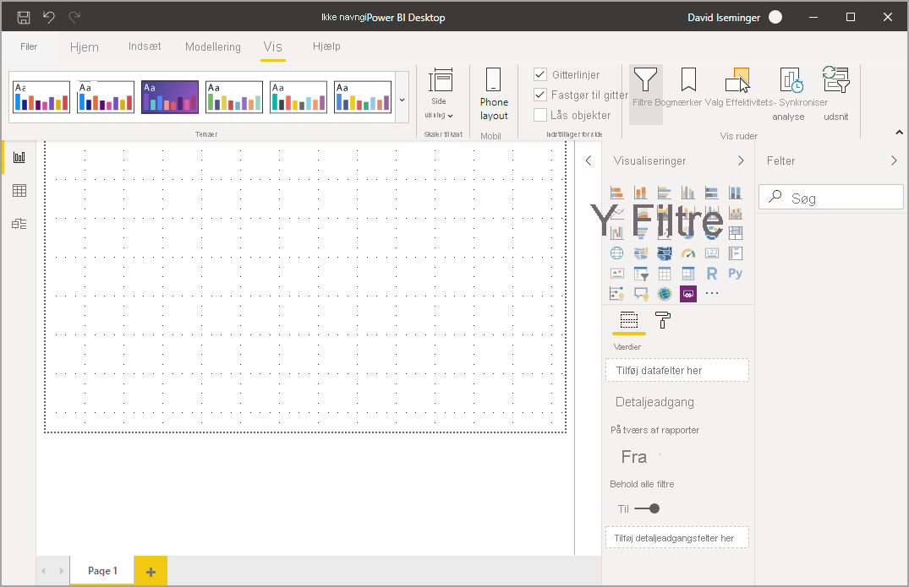

# Brug det opdaterede bånd i Power BI Desktop

Power BI Desktop har tilpasset sit bånd, så det matcher udseendet og oplevelsen i andre Microsoft-produkter, f.eks. Microsoft Office.

## Sådan aktiverer du det opdaterede bånd

Det opdaterede bånd er almindeligt tilgængeligt fra maj 2020-udgaven af Power BI Desktop. Det opdaterede bånd er som standard aktiveret fra og med opdateringen i marts 2020. 

## Funktioner på det opdaterede bånd

Opdateringen af vores bånd har til hensigt at gøre oplevelsen på tværs af Power BI Desktop samt i andre Microsoft-produkter nem og velkendt. 

Fordelene kan grupperes i følgende kategorier:

* **Forbedret udseende, funktionalitet og organisation** – ikonerne og funktionalitetet på det opdaterede Power BI Desktop bånd er tilpasset udseendet og organiseringen i de båndelementer, der findes i Office-programmerne.

    

* **Et galleri med intuitive temaer** – galleriet med temaer, der findes på båndet **Vis**, har det velkendte udseende og den funktionalitet, der kendes fra PowerPoint-temagalleriet. Således viser billederne på båndet, hvordan temaændringerne ser ud, hvis de anvendes på din rapport, f. eks. farvekombinationer og skrifttyper. 

    

* **Dynamisk indhold på båndet baseret på din visning** – på det eksisterende bånd for Power BI Desktop, var ikke-tilgængelige ikoner eller kommandoer blot nedtonede, hvilket gav en ikke-optimal oplevelse. På det opdaterede bånd vises og arrangeres ikonerne dynamisk, så du altid ved, hvilke muligheder der er tilgængelige for dig i den pågældende kontekst.

* **Et bånd med en enkelt linje, som er pladsbesparende, når den er skjult** – en anden fordel ved det opdaterede bånd er muligheden for at skjule selve båndet i en enkelt linje og dynamisk vise elementer på båndet på basis af konteksten. 

    

* **Tip til at navigere til og vælge knapper** – hvis du vil navigere rundt på båndet, kan du trykke på **Alt + Windows-tast** for at aktivere tastetip. Når funktionen er aktiveret, kan du trykke på de viste taster på tastaturet for at navigere.

    

* **Brugerdefinerede formatstrenge** – ud over at angive brugerdefinerede formatstrenge i ruden *Egenskaber* kan du også angive dem på båndet. Vælg den måling eller kolonne, du vil tilpasse, hvorefter den kontekstafhængige fane **Målingsværktøjer** eller **Kolonneværktøjer** vises, afhængigt af dit valg. I fanens formateringsafsnit kan du skrive den brugerdefinerede formatstreng direkte på rullelisten.

    

* **Tilgængelighed** – titellinjen, båndet og menuen Filer er fuldt tilgængelige. Tryk på Ctrl + F6 for at gå til afsnittet på båndet. Derefter kan du bruge **tabulatortasten** til at flytte mellem de øverste og nederste paneler og piletasterne til at flytte mellem elementer.

Ud over disse synlige ændringer giver et opdateret bånd også mulighed for, at vi kan foretage fremtidige opdateringer af Power BI Desktop og dets bånd, f. eks. følgende:

* Opret mere fleksible og intuitive kontrolelementer på båndet, f. eks. galleriet med visuals
* Føj de *sorte* og *mørkegrå* Office-temaer til Power BI Desktop
* Gør tilgængeligheden bedre

## Næste trin
Du kan oprette forbindelse til mange forskellige typer data ved hjælp af Power BI Desktop. Du kan finde flere oplysninger om datakilder i følgende ressourcer:

* [Hvad er Power BI Desktop?](../fundamentals/desktop-what-is-desktop.md)
* [Datakilder i Power BI Desktop](../connect-data/desktop-data-sources.md)
* [Udform og kombiner data med Power BI Desktop](../connect-data/desktop-shape-and-combine-data.md)
* [Opret forbindelse til Excel-projektmapper i Power BI Desktop](../connect-data/desktop-connect-excel.md)   
* [Angiv data direkte i Power BI Desktop](../connect-data/desktop-enter-data-directly-into-desktop.md)   
