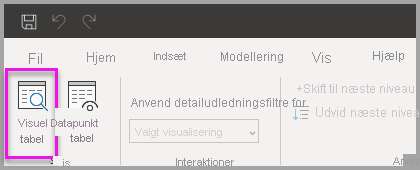
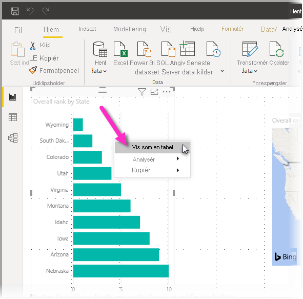
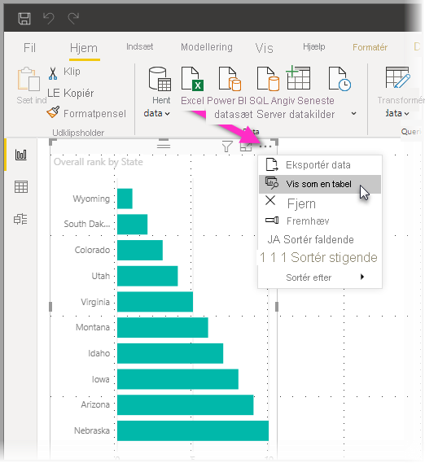
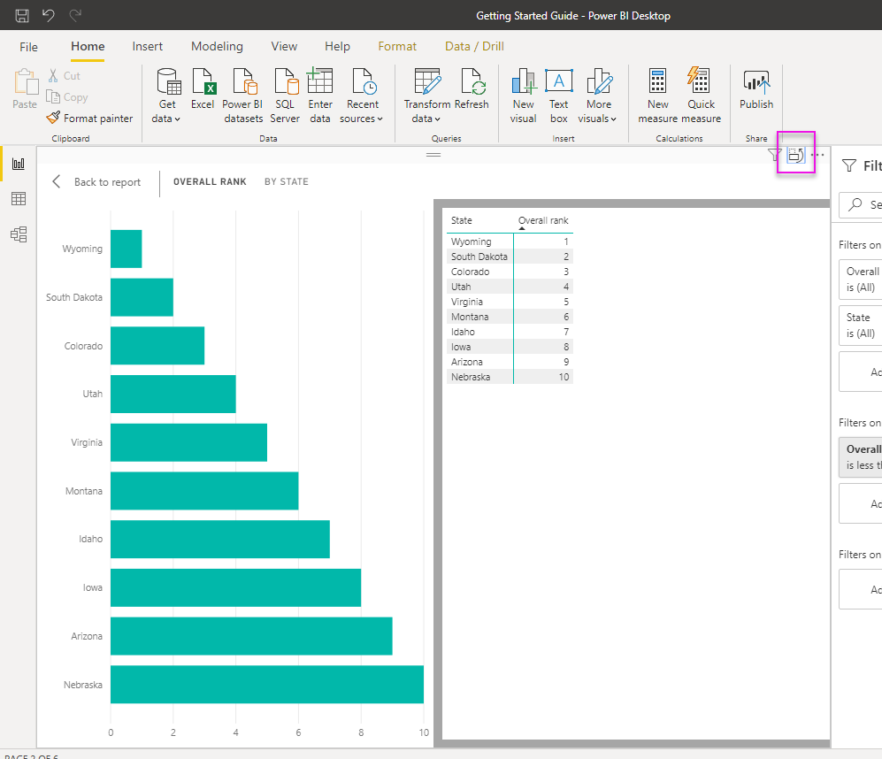

# Brug den visuelle tabel og datapunkttabellen i Power BI Desktop
I **Power BI Desktop** kan du analysere alle visualiseringers detaljer og få vist en tekstrepræsentation af de underliggende data eller enkelte dataposter for den valgte visual. Disse funktioner kaldes nogle gange for *klikfrekvens*, *detaljeadgang* eller *detaljeadgang til oplysninger*.

Du kan bruge **Visuelle tabel** til at få vist dataene i et visuelt element som en tabel eller bruge **Datapunkttabel** til at få vist en tabel med de data, der bruges til at beregne et enkelt datapunkt. 

>[!IMPORTANT]
>**Visuel tabel** og **Datapunkttabel** understøtter kun følgende visualiseringstyper:
>  - Liggende søjlediagram
>  - Søjlediagram
>  - Kransediagram
>  - Kartogram
>  - Tragt
>  - Kort
>  - Cirkeldiagram
>  - Træstruktur

## Brug Visuel tabel i Power BI Desktop

**Visuel tabel** viser de data, der ligger under en visualisering. **Visuel tabel** er placeret på fanen **Data/Analysér** i sektionen **Vis** på båndet, når en visualisering vælges.

Du kan også se dataene ved at højreklikke på en visualisering og derefter vælge **Vis Data** i den menu, der vises, eller ved at vælge **Flere indstillinger** (...) i øverste højre hjørne af en visualisering og derefter vælge **Vis som en tabel**.

&nbsp;&nbsp;

> [!NOTE]
> Du skal pege på et datapunkt i den pågældende visual, før højrekliksmenuen er tilgængelig.

Når du vælger **Visuel tabel** eller **Datapunkttabel**, vises den pågældende visualisering og tekstrepræsentationen af dataene på canvasset i Power BI Desktop. I den *vandrette visning* vises den pågældende visual på den øverste halvdel af canvasset, og dataene vises på den nederste halvdel. 

Du kan skifte mellem den vandrette visning og en *lodret visning* ved at vælge ikonet i øverste højre hjørne på canvasset.

Du vender tilbage til rapporten ved at vælge **< Tilbage til rapport** i øverste venstre hjørne på canvasset.

## Brug Datapunkttabel i Power BI Desktop

Du kan også fokusere på ét dataelement i en visualisering og analysere de underliggende data. Du bruger **Datapunkttabel** ved at vælge en visualisering, derefter vælge **Datapunkttabel** på fanen **Data/Analysér** i afsnittet **Visual Tools** på båndet og derefter vælge et datapunkt eller en datarække på visualiseringen. 

> [!NOTE]
> Hvis knappen **Datapunkttabel** på båndet er deaktiveret og nedtonet, betyder det, at den valgte visualisering ikke understøtter **Datapunkttabel**.

Du kan også højreklikke på et dataelement og vælge **Datapunkttabel** i den menu, der vises.

Når du vælger **Datapunkttabel** for et dataelement, vises alle de data, der er tilknyttet det valgte element, på canvasset i Power BI Desktop. 

Du vender tilbage til rapporten ved at vælge **< Tilbage til rapport** i øverste venstre hjørne på canvasset.

> [!NOTE]
>**Datapunkttabel** har følgende begrænsninger:
> - Du kan ikke ændre dataene i visningen **Datapunkttabel** og gemme dem i rapporten igen.
> - Du kan ikke bruge **Datapunkttabel**, når der benyttes en beregnet måling i det pågældende visualisering i en (flerdimensional) målingsgruppe.
> - Du kan ikke bruge **Datapunkttabel**, når du har oprettet forbindelse til en live flerdimensionel model.

## Næste trin
**Power BI Desktop** indeholder mange forskellige funktioner til formatering af rapporter og dataadministration. I følgende ressourcer kan du se nogle eksempler:

* [Brug gruppering og gruppering i beholder i Power BI Desktop](desktop-grouping-and-binning.md)
* [Brug gitterlinjer, fastgørelse til gitter, z-rækkefølge, justering og fordeling i Power BI Desktop-rapporter](desktop-gridlines-snap-to-grid.md)

