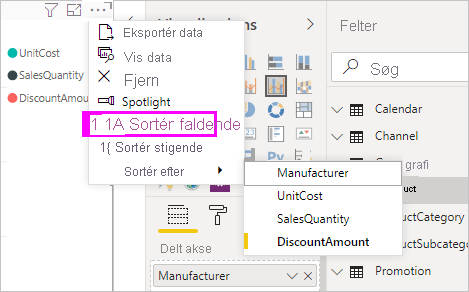
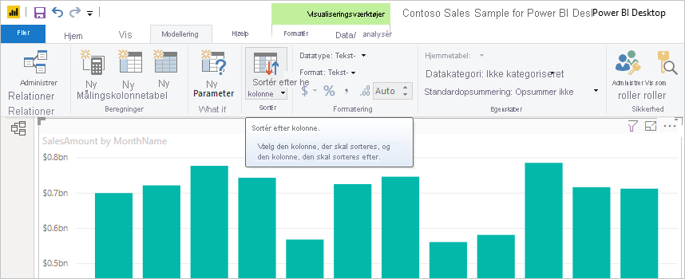
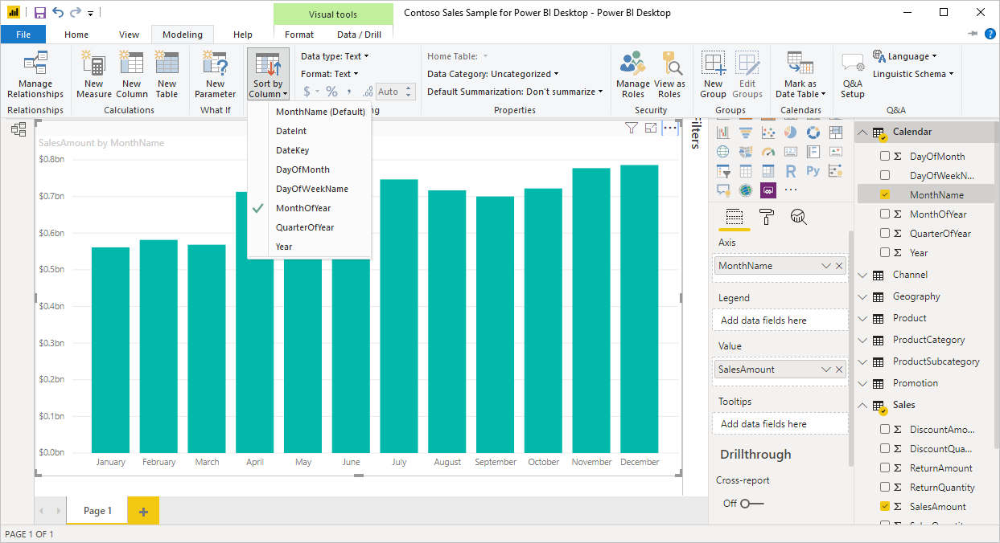

# Sorter efter kolonne i Power BI Desktop
I Power BI Desktop og Power BI-tjenesten kan du ændre, hvordan en visuel gengivelse ser ud, ved at sortere den efter forskellige datafelter. Hvis du ændrer, hvordan du sorterer en visualisering, kan du fremhæve de oplysninger, du vil formidle, og sikre, at visualiseringen afspejler eller fremhæver den tendens.

Uanset om du bruger numeriske data, f.eks. salgstal, eller tekstdata, f.eks. navne på byer, kan du sortere visualiseringerne for at få dem til at se ud, som du vil. Power BI indeholder mange sorteringsmuligheder og genvejsmenuer, som du kan bruge. Hvis du vil sortere et visual, skal du vælge menuen **Flere indstillinger** (...) for det pågældende visual, vælge **Sortér efter** og derefter vælge det felt, du vil sortere efter.

## Eksempel på sortering
Lad os bruge et eksempel med mere dybde og se, hvordan det fungerer i Power BI Desktop.

I den følgende visualisering kan du se omkostninger, antal og beløb efter producentnavn. Sådan ser visualiseringen ud, før der sorteres:

Visual'et sorteres i øjeblikket af kolonnen **SalesQuantity**. Vi kan bestemme sorteringskolonnen ved at matche farven på de stigende søjler med forklaringen, men der er en bedre måde: Menuen **Flere indstillinger**, som du får adgang til ved at vælge ellipsen (...).

Sorteringsmulighederne er følgende:

* Der sorteres aktuelt efter feltet **SalesQuantity**, hvilket er angivet, ved at **SalesQuantity** vises med fed og har en gul linje foran. 

* Den aktuelle sorteringsretning er stigende, hvilket er angivet, ved at **Sorté stigende** vises med fed og har en gul linje foran.

I de næste to afsnit ser vi nærmere på sorteringsfeltet og -retningen.

## Vælg, hvilken kolonne, der skal sorteres efter
Den gule linje ud før **SalesQuantity** i menuen **Flere indstillinger** angiver, at visual'et er sorteret efter kolonnen **SalesQuantity**. Det er nemt at sortere efter en anden kolonne: Vælg ellipsen (...) for at få vist menuen **Flere indstillinger**, vælg **Sortér efter**, og vælg derefter en anden kolonne.

På følgende billede vælger vi **DiscountAmount** som den kolonne, vi vil sortere efter. Den pågældende kolonne vises som en af kurverne på visual'et i stedet for en af søjlerne. 

Læg mærke til, hvordan den visuelle gengivelse er blevet ændret. Værdierne er nu sorteret fra den højeste **DiscountAmount**-værdi, som i denne visualisering er Fabrikam Inc., og ned til Northwind Traders, som har den laveste værdi. 

Men hvad nu, hvis vi vil sortere stigende i stedet for faldende? I næste afsnit kan du se, hvor nemt du kan gøre det.

## Vælg sorteringsrækkefølgen
Når vi ser nærmere på menuen **Flere indstillinger** fra det forrige billede, kan vi se, at **Sortér faldende** vises med fed med en gul linje foran.

Når **Sortér faldende** er valgt, betyder det, at den visuelle gengivelse sorteres efter den valgte kolonne fra den største værdi til den mindste værdi. Vil du ændre det? Det er ikke noget problem. du skal blot vælge **Sortér stigende**, og sorteringsrækkefølgen for den markerede kolonne ændres fra den mindste til den største værdi.

Her ses det samme visual, efter at du har ændret rækkefølgen af **DiscountAmount**. Bemærk, at Northwind Traders nu vises som den første producent, mens Fabrikam Inc. vises sidst. Sorteringen er nu modsat i forhold til før.

Du kan sortere enhver kolonne i visualiseringen. Vi kunne nemt have valgt **SalesQuantity** som den kolonne, vi vil sortere efter, for at vise producenterne med det største salg først og stadig bevare de øvrige kolonner i visual'et, da de er relateret til den pågældende producent. Her kan du se den visuelle gengivelse med disse indstillinger:

## Sortering med knappen Sortér efter kolonne
Du kan også sortere dine data ved at bruge knappen **Sortér efter kolonne** på båndet **Udformning**.

Denne fremgangsmåde kræver, at du først vælger kolonnen (feltet) for at sortere fra ruden **Felter** og derefter vælger **Modellering** > **Sortér efter kolonne** for at sortere dit visual. Hvis du ikke vælger en kolonne, er knappen **Sortér efter kolonne** inaktiv.

Lad os tage et kig på et almindeligt eksempel. Du har data fra hver måned på året, og du vil sortere dataene i kronologisk rækkefølge. Nedenfor kan du se, hvordan du skal gøre:

1. Læg mærke til, at når den visuelle gengivelse er valgt, men ingen kolonne er valgt i ruden **Felter**, er knappen **Sortér efter kolonne** inaktiv (nedtonet).
   
   

2. Når vi vælge den kolonne, der skal sorteres efter, bliver knappen **Sortér efter kolonne** i ruden **Felter** aktiv.
   
   
3. Når visualiseringen er valgt, kan vi vælge **MonthOfYear** i stedet for standarden **MonthName**, og visualiseringen sorteres i den ønskede rækkefølge: efter årets måneder.
   
   

<!---
This functionality is no longer active. Jan 2020

## Getting back to default column for sorting
You can sort by any column you'd like, but there may be times when you want the visual to return to its default sorting column. No problem. For a visual that has a sort column selected, open the **More options** menu and select that column again, and the visualization returns to its default sort column.

For example, here's our previous chart:

When we go back to the menu and select **SalesQuantity** again, the visual defaults to being ordered alphabetically by **Manufacturer**, as shown in the following image.

With so many options for sorting your visuals, creating just the chart or image you want is easy.
--->

## De næste trin

Du vil måske også være interesseret i følgende artikler:

* [Brug tværgående detaljeadgang i rapport i Power BI Desktop](desktop-cross-report-drill-through.md)
* [Udsnitsværktøjer i Power BI](../visuals/power-bi-visualization-slicers.md)
