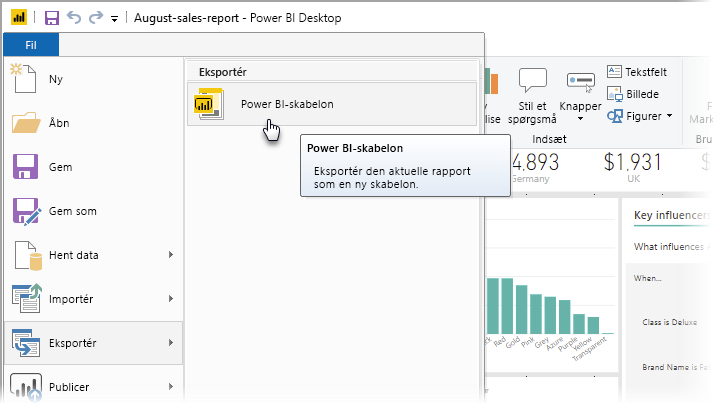
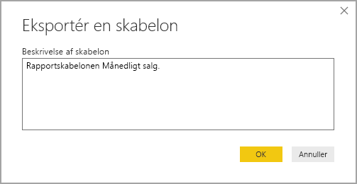
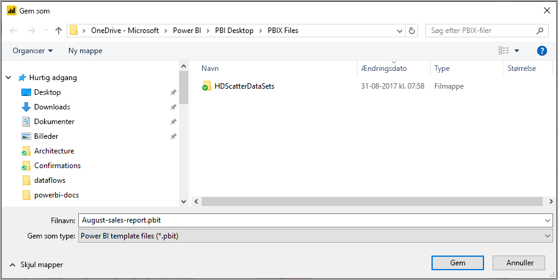
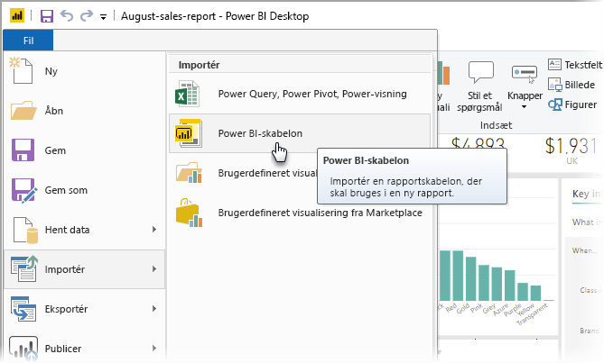
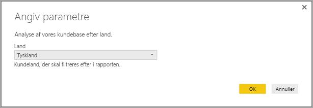

# Opret rapportskabeloner til Power BI Desktop

Med **Power BI Desktop** kan du oprette overbevisende rapporter til deling af indsigt på tværs af hele organisationen. Du kan bruge **skabeloner** i Power BI Desktop til at effektivisere dit arbejde ved at oprette en rapportskabelon, der er baseret på en eksisterende skabelon, som du eller andre brugere i din organisation kan bruge som udgangspunkt for en ny rapports layout, en datamodel og forespørgsler. Skabeloner i **Power BI Desktop** hjælper dig med at komme hurtigt i gang og standardisere oprettelsen af rapporter.

## Oprettelse af skabeloner

Power BI-rapportskabeloner indeholder følgende oplysninger fra den rapport, de blev genereret ud fra:

* **Rapportsider**, visualiseringer og andre visuelle elementer
* **Datamodeldefinitionen**, herunder skamaet, relationer, målinger og andre modeldefinitionsartefakter
* Alle **forespørgselsdefinitioner**, f. eks. forespørgsler, forespørgselsparametre og andre forespørgselselementer

Rapportens data er *ikke* inkluderet i skabelonerne. 

Rapportskabeloner bruger filtypenavnet .PBIT (mens Power BI Desktop-rapporter bruger filtypenavnet .PBIX). 

Du opretter en rapportskabelon ved at vælge **Fil > Ekportér > Power BI-skabelon** i menuen, hvilket åbner følgende vindue, hvor du bliver bedt om at give en beskrivelse af skabelonen. I dette eksempel er vores beskrivelse af skabelonen *Skabelon for månedlig salgsrapport.*

Vælg **OK**, hvorefter du bliver bedt om at angive en filplacering, hvor du vil gemme PBIT-skabelonfilen.

Herefter er din Power BI-rapportskabelon oprettet på den filplacering, du har angivet, med filtypenavnet PBIT.

> [!NOTE]
> Power BI-rapportskabelonfiler er generelt meget mindre end en Power BI Desktop-rapport, fordi skabeloner ikke indeholder data, men udelukkende rapportdefinitionerne. 

## Brug af skabeloner

Hvis du vil anvende en Power BI-rapportskabelon, skal du åbne den i Power BI Desktop og begynde at bruge den. Du kan åbne Power BI-rapportskabeloner på to måder:

* Dobbeltklik på en vilkårlig PBIT-fil for automatisk at åbne Power BI Desktop og indlæse skabelonen
* Vælg **Fil > Importér > Power BI-skabelon** i Power BI Desktop

Når du åbner en rapportskabelon, åbnes en dialogboks med værdier for de parametre, der er defineret i den rapport, som skabelonen er baseret på. Hvis en rapport f.eks. analyserer kunder på baggrund af land eller område og har parameteren *Land* til at angive kundens base, vises en prompt, hvor du kan vælge en værdi for *Land* på listen over de værdier, der blev angivet, da parameteren blev defineret. 

Når du har angivet de påkrævede parametre, bliver du bedt om at angive placeringen af de underliggende data, der er knyttet til rapporten. Den aktuelle opretter af en rapport kan derefter oprette forbindelse til data på baggrund af sine legitimationsoplysninger.

Når der er angivet parametre og data, oprettes en rapport med alle de sider, visualiseringer, datamodelartefakter og forespørgsler, der var en del af den rapport, som skabelonen er baseret på. 

Det er det hele. Det er nemt at oprette og bruge rapportskabeloner i Power BI Desktop, så du nemt kan genskabe overbevisende layout og andre rapportaspekter og dele dem med andre.

## De næste trin
Du er måske også interesseret i at få mere at vide om **forespørgselsparametre**:
* [Bruger du forespørgselsparametre i Power BI Desktop?](/power-query/power-query-query-parameters)

Herudover er der mange andre forskellige ting, du kan gøre med Power BI Desktop. Du kan finde flere oplysninger om funktionerne i følgende ressourcer:

* [Hvad er Power BI Desktop?](../fundamentals/desktop-what-is-desktop.md)
* [Oversigt over forespørgsler i Power BI Desktop](../transform-model/desktop-query-overview.md)
* [Datatyper i Power BI Desktop](../connect-data/desktop-data-types.md)
* [Udform og kombiner data med Power BI Desktop](../connect-data/desktop-shape-and-combine-data.md)
* [Almindelige forespørgselsopgaver i Power BI Desktop](../transform-model/desktop-common-query-tasks.md)