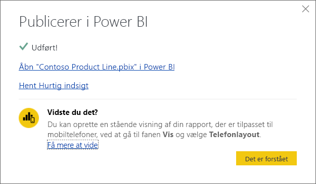
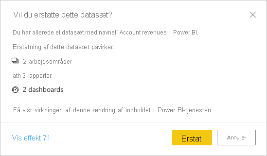

# Udgiv datasæt og rapporter fra Power BI Desktop
Når du udgiver en Power BI Desktop-fil i Power BI-tjenesten, udgiver du dataene i modellen på dit Power BI-arbejdsområde. Det samme gælder for de rapporter, du har oprettet i visningen **Rapport**. Du kan se et nyt datasæt med det samme navn og alle rapporter i navigatoren til dit arbejdsområde.

Hvis du udgiver fra Power BI Desktop, har det samme effekt, som hvis du bruger **Hent data** i Power BI til at oprette forbindelse til og overføre en Power BI Desktop-fil.

> [!NOTE]
> De ændringer, du foretager i rapporten i Power BI, gemmes ikke i den oprindelige Power BI Desktop-fil igen. Dette omfatter, når du tilføjer, sletter eller ændrer visualiseringer i rapporter.

## Sådan udgiver du Power BI Desktop-datasæt og -rapporter
1. I Power BI Desktop skal du vælge **Filer** \> **Udgiv** \> **Publicer i Power BI** eller vælge **Udgiv** på båndet.  

   

2. Log på Power BI, hvis du ikke allerede er logget på.
3. Vælg en destination. Fra og med udgivelsen i september 2020 kan du søge på listen over tilgængelige arbejdsområder for at finde det arbejdsområde, du vil publicere til. I søgefeltet kan du filtrere dine arbejdsområder. Vælg arbejdsområdet, og klik derefter på knappen **Vælg** for at publicere.

   

Når udgivelsen er fuldført, modtager du et link til rapporten. Vælg linket for at åbne rapporten på dit Power BI-websted.

## Udgiv igen eller erstat et datasæt, der er udgivet i Power BI Desktop
Datasættet og eventuelle rapporter, du har oprettet i Power BI Desktop, uploades til Power BI-webstedet, når du udgiver en Power BI Desktop-fil. Når du udgiver din Power BI Desktop-fil igen, erstattes datasættet på dit Power BI-websted med det opdaterede datasæt fra Power BI Desktop-filen.

Denne proces er ret ligetil, men der er et par ting, du skal vide:

* To eller flere datasæt i Power BI med samme navn som Power BI Desktop-filen kan forårsage, at udgivelsen måske ikke lykkedes. Kontrollér, at du kun har ét datasæt i Power BI med det samme navn. Du kan også omdøbe filen og udgive den og dermed oprette et nyt datasæt med samme navn som filen.
* Hvis du omdøber eller sletter en kolonne eller måling, kan eventuelle visualiseringer, du allerede har i Power BI med dette felt, blive brudt. 
* Power BI ignorerer nogle formatændringer af eksisterende kolonner. Hvis du f.eks. ændrer formatet for en kolonne fra 0,25 % til 25 %.
* Lad os sige, at du har en tidsplan for opdatering, der er konfigureret til dit eksisterende datasæt i Power BI. Når du føjer nye datakilder til din fil og derefter udgiver igen, skal du logge på dem før næste planlagte opdatering.
* Når du genudgiver et datasæt, der er udgivet fra Power BI Desktop, og har defineret en tidsplan for opdatering, startes en opdatering af datasættet, så snart du udgiver igen.
* Når du foretager en ændring af et datasæt og derefter publicerer det igen, vises der en meddelelse om, hvor mange arbejdsområder, rapporter og dashboards der potentielt kan blive påvirket af ændringen, og du bliver bedt om at bekræfte, at du vil erstatte det aktuelt udgivne datasæt med det, du har ændret. Meddelelsen indeholder også et link til hele effektanalysen af datasættet i Power BI-tjenesten, hvor du kan se flere oplysninger og foretage en handling for at afhjælpe risikoen ved ændringen.

   

   [Få mere at vide om Effektanalyse af datasæt](../collaborate-share/service-dataset-impact-analysis.md).

> [!NOTE]
> Nogle dataforbindelser i Power BI-rapporter kan indeholde links til data i stedet for at inkludere dataene i det datasæt, der importeres til Power BI-tjenesten. Det kan f.eks. være, at DirectQuery-forbindelser opretter forbindelse til data, mens opdateringer eller interaktioner forekommer, i stedet for at importere selve dataene. Hvis sammenkædede datakilder i din rapport er i det lokale miljø, kan du bruge en gateway til at få adgang til dem fra Power BI. Du kan finde flere oplysninger i [Hvad er en datagateway i det lokale miljø?](../connect-data/service-gateway-onprem.md).
> 

## Næste trin

Du kan gøre mange forskellige ting med Power BI Desktop. Du kan finde flere oplysninger om funktionerne i følgende ressourcer:

* [Hvad er Power BI Desktop?](../fundamentals/desktop-what-is-desktop.md)
* [Oversigt over forespørgsler i Power BI Desktop](../transform-model/desktop-query-overview.md)
* [Datatyper i Power BI Desktop](../connect-data/desktop-data-types.md)
* [Selvstudium: Form og kombiner data i Power BI Desktop](../connect-data/desktop-shape-and-combine-data.md)
* [Almindelige forespørgselsopgaver i Power BI Desktop](../transform-model/desktop-common-query-tasks.md)
