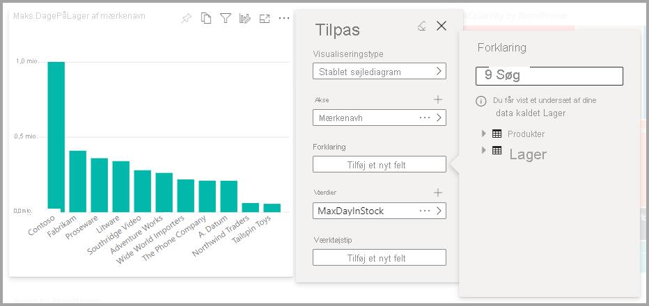
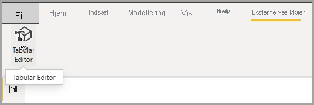
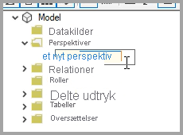
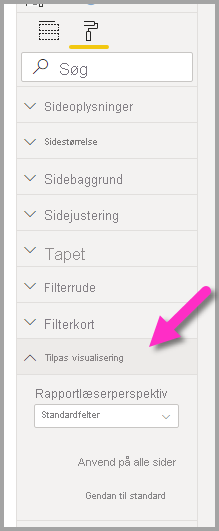
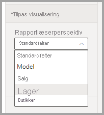
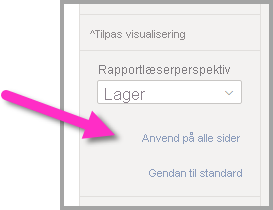

# Lad brugerne tilpasse visualiseringer i en rapport

[!INCLUDE [applies-to](../includes/applies-to.md)] [!INCLUDE [yes-desktop](../includes/yes-desktop.md)] [!INCLUDE [yes-service](../includes/yes-service.md)]

Når du deler en rapport med en bred målgruppe, vil nogle af brugerne måske gerne se en lidt anden visning af bestemte visualiseringer. Måske vil de gerne bytte om på aksen, ændre visualiseringstype eller føje noget til værktøjstippet. Det er svært at lave én visualisering, der opfylder alles krav. Med denne nye funktionalitet giver du dine forbrugere mulighed for at udforske og tilpasse visualiseringer – alt sammen i læsevisningen af rapporten. De kan tilpasse visualiseringen, lige som de vil, og gemme den som et bogmærke, så de kan vende tilbage til den. De behøver ikke at have redigeringstilladelser til rapporten eller henvende sig til rapportforfatteren med en ændring.

:::image type="content" source="media/power-bi-personalize-visuals/power-bi-personalize-visual.png" alt-text="Tilpas en visualisering":::
 
## Hvad kan forbrugere af rapporter ændre?

Denne funktion giver forbrugerne mulighed for at få yderligere indsigt via ad hoc-udforskning af visualiseringer i en Power BI-rapport. Hvis du vil have mere at vide om, hvordan du bruger denne funktion som forbruger, skal du se [Tilpas visualiseringer i dine rapporter](../consumer/end-user-personalize-visuals.md). Funktionen er ideel til rapportudviklere, der gerne vil aktivere grundlæggende udforskningsscenarier for læserne af deres rapport. Læserne af rapporten kan udføre følgende ændringer:

- Ret visualiseringstypen
- Udskift en måling eller dimension
- Tilføj eller fjern en forklaring
- Sammenlign to eller flere målinger
- Skift sammenlægninger osv.

Denne funktion muliggør ikke kun nye udforskningsegenskaber. Den omfatter også måder for forbrugerne at registrere og dele deres ændringer på:

- Registrer deres ændringer
- Del deres ændringer
- Nulstil alle deres ændringer af en rapport
- Nulstil alle deres ændringer af en visualisering
- Ryd deres seneste ændringer

## Brug perspektiver for at få en mere fokuseret visning

Hvis du vil tilpasse visualiseringer, kan du bruge **perspektiver** til at vælge et undersæt af en model, hvilket giver en mere fokuseret visning. Det kan være nyttigt at vælge et undersæt, når du arbejder med en stor datamodel, så du kan fokusere på et undersæt af feltet, der kan administreres, og ikke overvælde læserne af rapporten med hele samlingen af felter i den store model. 

Vær opmærksom på følgende, når du arbejder med perspektiver:

* Perspektiver er ikke beregnet til at blive brugt som en sikkerhedsmekanisme. Det er værktøjer, du kan bruge til at give slutbrugeren en bedre oplevelse. Al sikkerhed for et perspektiv nedarves fra den underliggende model.

* Perspektiver i både tabellariske og flerdimensionelle modeller understøttes. Men for perspektiver i flerdimensionelle modeller kan du kun indstille perspektivet til at være den samme som udgangskuben for rapporten.

* Før du sletter et perspektiv fra en model, skal du huske at kontrollere, at perspektivet ikke bruges i oplevelsen Tilpas visualiseringer. 

Hvis du vil bruge perspektiver, skal du aktivere Tilpas visualiseringer for rapporten. Du skal også oprette mindst ét perspektiv, der indeholder de dimensioner og målinger, du ønsker, at slutbrugerne skal interagere med i forbindelse med oplevelsen Tilpas visualiseringer.

Hvis du vil oprette perspektivet, skal du bruge [Tabular Editor](https://tabulareditor.com/), som du kan downloade fra følgende placering: Download af Tabular Editor

Når du har installeret **Tabular Editor**, skal du åbne din rapport i **Power BI Desktop** og starte **Tabular Editor** under fanen **Eksterne værktøjer** på båndet som vist på følgende billede.

I Tabular Editor skal du højreklikke på mappen **Perspektiver** for at oprette et nyt perspektiv.

Du kan dobbeltklikke på teksten for at omdøbe perspektivet.

Derefter skal du føje felter til perspektivet ved at åbne mappen **Tabeller** i Tabular Editor og højreklikke på de felter, du vil have vist i perspektivet.

Gentag processen for hvert af de felter, du vil føje til perspektivet. Du kan ikke tilføje duplikerede felter i et perspektiv, så muligheden for at tilføje felter er deaktiveret for de felter, du allerede har føjet til et perspektiv.

Når du har tilføjet alle de ønskede felter, skal du sørge for at gemme dine indstillinger både i Tabular Editor og derefter også i Power BI Desktop.

Når du har gemt det nye perspektiv i modellen, og du har gemt Power BI Desktop-rapporten, skal du navigere til ruden **Formatér** for siden, hvor du kan se en ny sektion for **Tilpas visualisering**.

Indstillingen for *Rapport-læser-perspektiv* er som udgangspunkt angivet til *Standardfelter*. Når du vælger rullelistepilen, kan du se de andre perspektiver, du har oprettet.

Når du har angivet perspektivet for rapportsiden, filtreres oplevelsen Tilpas visualiseringer for den pågældende side til det valgte perspektiv. Hvis du vælger **Anvend på alle sider**, kan du anvende indstillingen for Perspektiv på alle eksisterende sider i rapporten.

## Aktivér prøveversionsfunktionen

Da denne funktion er en prøveversion, skal du først slå funktionskontakten til. Gå til **Filer** > **Indstillinger** > **Indstillinger**. Under **Globale** indstillinger > **Prøveversionsfunktioner** skal du sørge for, at **Tilpas visualiseringer** er valgt.

:::image type="content" source="media/power-bi-personalize-visuals/power-bi-preview-personalize-visual.png" alt-text="Slå Tilpas visualiseringer til":::

Du skal måske genstarte Power BI Desktop for at se den under indstillingerne for den aktuelle fil.

## Aktivér tilpasning i en rapport

Når du har slået prøveversionskontakten til, skal du aktivere den specifikt for de rapporter, som forbrugerne skal kunne tilpasse visualiseringer for.

Du kan aktivere denne funktion enten i Power BI Desktop eller Power BI-tjenesten.

### I Power BI Desktop

Du aktiverer funktionen i Power BI Desktop ved at gå til **Filer** > **Indstillinger** > **Indstillinger** > **Aktuel fil** > **Rapportindstillinger**. Sørg for, at **Tilpas visualiseringer (prøveversion)** er slået til.

:::image type="content" source="media/power-bi-personalize-visuals/power-bi-report-settings-personalize-visual.png" alt-text="Aktivér tilpasning i en rapport":::

### I Power BI-tjenesten

Du aktiverer funktionen i Power BI-tjenesten ved at gå til **Indstillinger** for din rapport.

:::image type="content" source="media/power-bi-personalize-visuals/power-bi-report-service-settings-personalize-visual.png" alt-text="Rapportindstillinger i Power BI-tjenesten":::

Slå **Tilpas visualiseringer (prøveversion)** til  > **Gem**.

:::image type="content" source="media/power-bi-personalize-visuals/power-bi-report-service-personalize-visual.png" alt-text="Slå Tilpas visualiseringer i tjenesten til":::

## Vælg de visualiseringer, der kan tilpasses

Når du aktiverer denne indstilling for en given rapport, kan alle visualiseringer i denne rapport som standard tilpasses. Hvis du ikke ønsker, at alle visualiseringer skal kunne tilpasses, kan du slå indstillingen til eller fra for hver visualisering.

Vælg visualiseringen > vælg **Formatér** i ruden **Visualiseringer** > udvid **Overskrift i visualisering**.

:::image type="content" source="media/power-bi-personalize-visuals/power-bi-format-visual-header-personalize.png" alt-text="Vælg overskrift i visualisering":::
 
Slå skyderen for **Tilpas visualisering** >  **Til** eller **Fra**.

:::image type="content" source="media/power-bi-personalize-visuals/power-bi-format-visual-personalize-on-off.png" alt-text="Skyder for tilpasning af visualisering til eller fra":::

## Begrænsninger og kendte problemer

Der er i øjeblikket nogle få begrænsninger for funktionen, som du skal være opmærksom på.

- Denne funktion understøttes ikke i integrerede scenarier, herunder publicer på internettet.
- Brugerudforskninger bevares ikke automatisk. Du skal gemme din visning som et personligt bogmærke for at registrere dine ændringer.
- Denne funktion understøttes i Power BI-mobilapps til iOS- og Android-tablets og i Power BI Windows-appen. Den understøttes ikke i Power BI-mobilapps til telefoner. Ændringer af visualiseringer, som du gemmer som et personligt bogmærke, mens du er i Power BI-tjenesten, bevares i alle Power BI-mobilapps.

Der er også nogle kendte problemer, som vi er i gang med at håndtere:

- Tilføjelse af hierarki understøttes ikke. Du skal tilføje de enkelte underordnede elementer.
- Du kan ikke ændre et datohierarki til en dato eller omvendt. 
- Med personlige bogmærker får du måske resultater, der er lidt anderledes, afhængigt af den valgte sekvens. Der kan være uoverensstemmelser, fordi vi ikke registrerer den fulde stilstand af rapporten, men kun de foretagne ændringer. Du kan løse problemet ved at vælge **Nulstil til standard** og derefter vælge det bogmærke, du vil have vist. 

## Næste trin

[Tilpas visualiseringer i dine rapporter](../consumer/end-user-personalize-visuals.md).     

Prøv den nye funktionalitet til tilpasning af visualiseringer. Giv os din feedback på denne funktion, og hvordan vi fortsat kan forbedre den, på [webstedet med Power BI-ideer](https://ideas.powerbi.com/forums/265200-power-bi). 

Har du flere spørgsmål? [Prøv at spørge Power BI-community'et](https://community.powerbi.com/)
