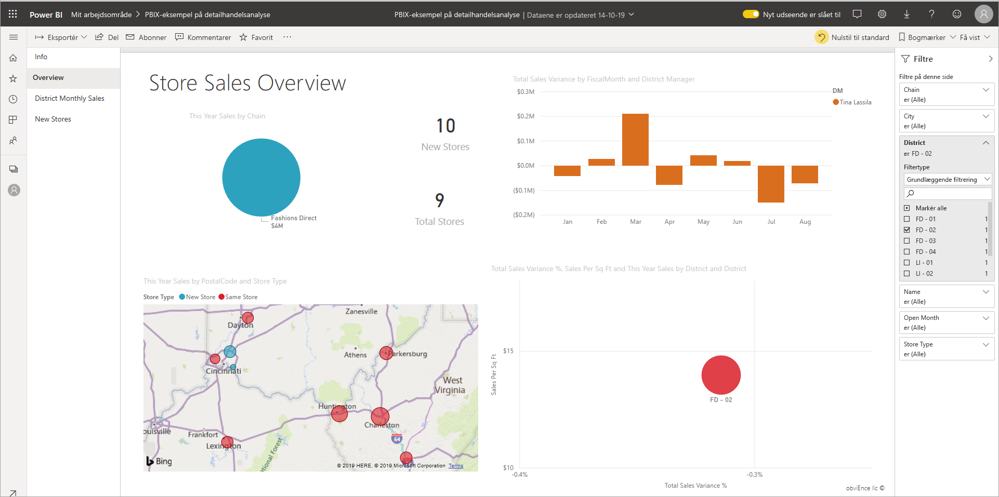
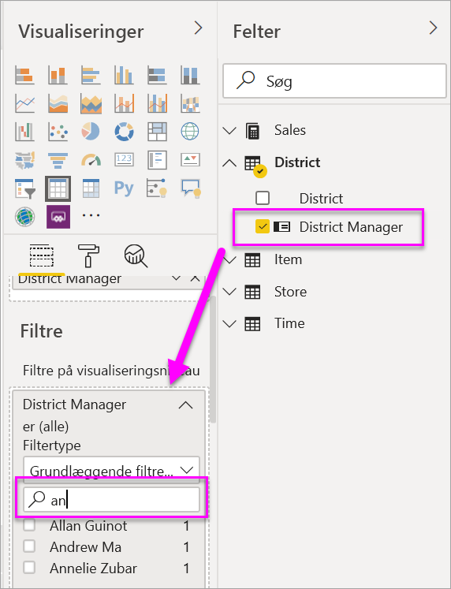

# Føj et filter til en rapport i Power BI

I denne artikel forklares det, hvordan du tilføjer et visualiserings filter, et sidefilter eller et rapportfilter til en rapport i Power BI. Du skal kunne redigere en rapport for at tilføje filtre. Eksemplerne i denne artikel er i Power BI-tjeneste, og trinnene er næsten identiske i Power BI Desktop. Leder du efter en oversigt? Tjek [filtre og fremhævning i Power bi rapporter](power-bi-reports-filters-and-highlighting.md) først.

Power BI tilbyder en række forskellige former for filtre, fra manuelle og automatiske til detaljeadgang og pass-through. Læs om de [forskellige typer af filtre](power-bi-report-filter-types.md).

Når du har tilføjet filtre, kan du [formatere filtrene i dine Power bi rapporter](power-bi-report-filter.md) , så de ser ud og fungerer, som du ønsker det.

## Filtre i redigeringsvisning eller læsevisning
Du interagerer med rapporter i to forskellige visninger: læsevisning og redigeringsvisning. I denne artikel beskrives det, hvordan du opretter filtre i **redigeringsvisning**  til rapporter.  Du kan finde flere oplysninger om filtre i læsevisning i afsnittet om [brug af filtre i læsevisning](../consumer/end-user-report-filter.md).

Da filtre *bevares*, når du navigerer væk fra rapporten, bevarer Power BI de ændringer, som du foretager i filtre, udsnit og andre datavisninger. Du kan derfor fortsætte, hvor du slap, når du vender tilbage til rapporten. Hvis du ikke ønsker, at dine filter ændringer skal være permanente, skal du vælge **Nulstil til standard** på den øverste menulinje.

:::image type="content" source="../consumer/media/end-user-report-filter/power-bi-reset-icon.png" alt-text="Nulstil til standardikon.":::

Vær opmærksom på, at da rapport opretteren, hvilke filtre du gemmer med rapporten, bliver *standardfilter tilstanden* for alle dine rapport læsere. Når de vælger **Nulstil til standard**, er det det, de returnerer til.

## Forskellige filterniveauer i ruden Filtre
Uanset om du bruger Power BI Desktop eller Power BI-tjeneste, vises ruden filtre langs højre side af rapport lærredet. Hvis ruden Filtre ikke er vist, skal du vælge ikonet ">"øverst til højre for at udvide den.

Du kan angive filtre på tre forskellige niveauer for rapporten: visualiserings niveau, sideniveau og rapport niveau. I denne artikel forklares det, hvordan du angiver forskellige niveauer.

## Tilføj et filter i en visual
Visualiseringer har to forskellige typer filtre.
Du kan føje et filter på visualiserings niveau til et visuelt element på to forskellige måder. 

* De felter, der findes i en visualisering, er automatisk filtre for det pågældende visuelle element. 
* Som Rapportdesigner kan du identificere et felt, der ikke allerede er det visuelle element, og føje dette felt direkte til Bucket **filtre for visualiserings niveau** .
 
På den måde bruger artiklen Retail Analysis Sample, hvis du vil installere den og følge med. Installér indholdspakken til [Retail Analysis Sample](sample-retail-analysis.md#get-the-content-pack-for-this-sample) .

### Filtrer med et felt, der ikke er i den pågældende visual

1. Vælg **flere indstillinger (...)**  >  i Power bi-tjeneste **Rediger** for at åbne din rapport i redigeringsvisning.
   
   

2. Åbn ruderne visualiseringer, filtre og felter, hvis de ikke allerede er åbne.
   
   

3. Vælg først en visualisering for at aktivere den. I dette tilfælde er det punktdiagram på siden Oversigt. Alle felterne i visualiseringen findes i ruden **visualiseringer** . De vises også i ruden **filtre** under **filtrene på denne visuelle** overskrift.
   
   
  
1. Vælg i ruden Felter det felt, du vil tilføje som et nyt filter på visualiseringsniveau, og træk det til **området Filtre på visualiseringsniveau**.  I dette eksempel trækker vi **kategori** for at **tilføje datafelter her** under **filtre på denne visualisering**.
     
    

    Meddelelses **kategori** føjes *ikke* til selve visualiseringen.
     
1. Vælg **børn**. Punktdiagrammet filtreres, men de øvrige visuelle elementer forbliver det samme.
     
    

    Hvis du gemmer din rapport med dette filter, kan rapport læsere interagere med **kategori** filteret i læsevisning, markere eller fjerne værdier.
    
    Hvis du trækker en *numerisk kolonne* til filterruden for at oprette et filter på visualiseringsniveau, anvendes filteret på de *underliggende datarækker*. Hvis du f.eks. tilføjer et filter på feltet **UnitCost** og angiver det til at være **UnitCost** > 20, får du kun vist data for de produktrækker, hvor Unit Cost var større end 20, uanset hvad de viste samlede Unit Cost for datapunkterne er i visualiseringen.

## Føj et filter til en hel side

Du kan også tilføje et filter på sideniveau for at filtrere en hel side.

1. Åbn rapporten med detailhandelsanalysen i Power BI-tjenesten, og gå derefter til siden **District Monthly Sales**. 

2. Vælg **...**  > **Rediger rapport** for at åbne rapporten i redigeringsvisning.
   
   

2. Åbn ruderne visualiseringer, filtre og felter, hvis de ikke allerede er åbne.

3. Vælg i ruden Felter det felt, du vil tilføje som et nyt filter på sideniveau, og træk det til **området Filtre på sideniveau**.  
4. Vælg de værdier, du vil filtrere efter, og angiv enten kontrolelementet **Basic** eller **Advanced**.
   
   Alle visualiseringer på siden tegnes igen, så ændringen afspejles.
   
    Hvis du gemmer din rapport med filteret, kan rapportlæsere interagere med filteret i læsevisning og markere eller fjerne markering af værdier.

## Tilføj et filter på rapportniveau for at filtrere en hel rapport

1. Vælg **Rediger rapport** for at åbne rapporten i Redigeringsvisning.
   
   

2. Åbn ruderne Visualiseringer og Filtre og ruden Felter, hvis de ikke allerede er åbne.
3. Vælg i ruden Felter det felt, du vil tilføje som et nyt filter på rapporteringsniveau, og træk det til området **Filtre på rapporteringsniveau**.  
4. Vælg de værdier, du vil filtrere.

    De visuelle elementer på den aktive side og på alle sider i rapporten ændres for at afspejle det nye filter. Hvis du gemmer din rapport med filteret, kan rapportlæsere interagere med filteret i læsevisning og markere eller fjerne markering af værdier.

1. Vælg tilbage-pilen for at vende tilbage til den forrige rapportside.

## Overvejelser og fejlfinding

- Hvis du ikke kan se ruden felter, skal du sørge for, at du er i [redigeringsvisning](service-interact-with-a-report-in-editing-view.md)for en rapport.
- Hvis du har foretaget mange ændringer af filtrene og vil vende tilbage til standardindstillingerne, skal du vælge **Nulstil til standard** på den øverste menulinje. Husk: som rapport forfatter kan de filtre, der er på plads, når du gemmer rapporten, *blive* standardfilter indstillinger.

## Næste trin

[Formatér filtrene i dine Power BI-rapporter](power-bi-report-filter.md)

[Få en præsentation af ruden Rapportfiltre](../consumer/end-user-report-filter.md)

[Filtre og fremhævning i rapporter](power-bi-reports-filters-and-highlighting.md)

[Forskellige typer af filtre i Power BI](power-bi-report-filter-types.md)

Har du flere spørgsmål? [Prøv at spørge Power BI-community'et](https://community.powerbi.com/)
