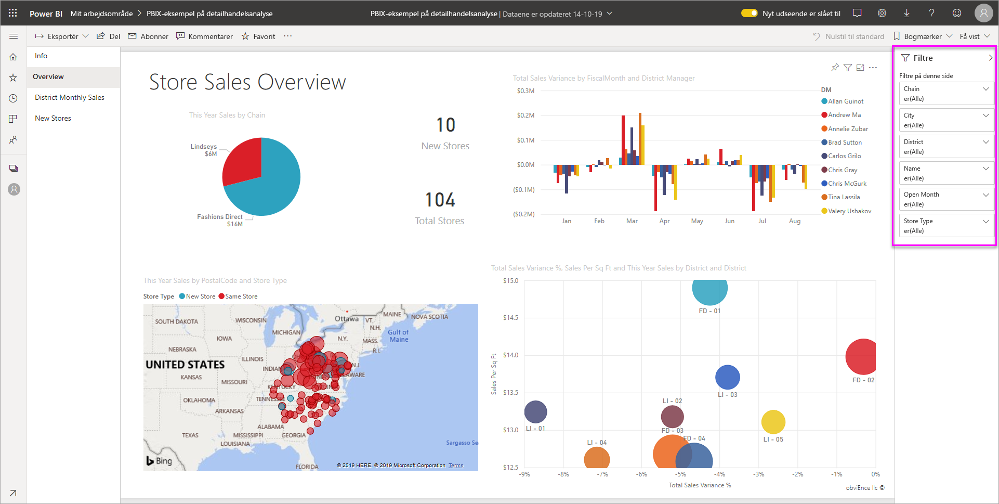
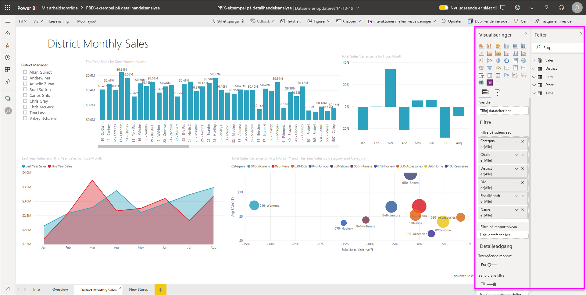
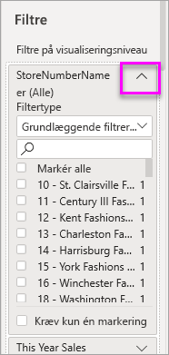
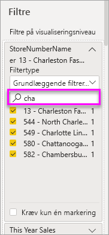
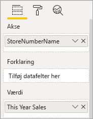
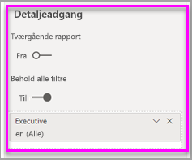
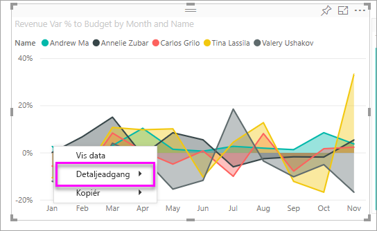
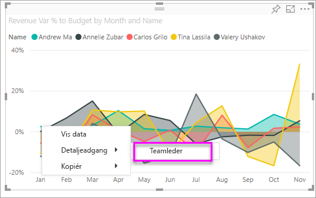

# Føj et filter til en rapport i Power BI

[!INCLUDE [power-bi-service-new-look-include](../includes/power-bi-service-new-look-include.md)]

I denne artikel forklares det, hvordan du føjer et sidefilter, visualiseringsfilter, rapportfilter eller detaljeadgangsfilter til en rapport i Power BI. Eksemplerne i denne artikel er i Power BI-tjenesten. Trinnene er stort set de samme i Power BI Desktop.

**Vidste du det?** Power BI indeholder en ny filtreringsoplevelse. Læs mere om [den nye filtreringsoplevelse i Power BI-rapporter](power-bi-report-filter.md).

Power BI tilbyder en række forskellige former for filtre, fra manuelle og automatiske til detaljeadgang og pass-through. Læs om de [forskellige typer af filtre](power-bi-report-filter-types.md).

## Filtre i redigeringsvisning eller læsevisning
Du kan interagere med rapporter i to forskellige visninger: læsevisning og redigeringsvisning. Hvilke filterfunktioner der er tilgængelige, afhænger af, hvilken visning du arbejder i. Læs alt [om filtre og fremhævning i Power BI-rapporter](power-bi-reports-filters-and-highlighting.md) for at få mere at vide.

I denne artikel beskrives det, hvordan du opretter filtre i **redigeringsvisning**  til rapporter.  Du kan finde flere oplysninger om filtre i læsevisning i afsnittet om [brug af filtre i læsevisning](../consumer/end-user-report-filter.md).

Da filtre *bevares*, når du navigerer væk fra rapporten, bevarer Power BI de ændringer, som du foretager i filtre, udsnit og andre datavisninger. Du kan derfor fortsætte, hvor du slap, når du vender tilbage til rapporten. Hvis du ikke vil bevare dine filterændringer, skal du vælge **Nulstil til standard** på den øverste menulinje.

## Forskellige filterniveauer i ruden Filtre
Uanset om du bruger Desktop-versionen eller Power BI-tjenesten, vises ruden Filtre i højre side af rapportcanvasset. Hvis ruden Filtre ikke er vist, skal du vælge ikonet ">"øverst til højre for at udvide den.

Du kan angive filtre på tre forskellige niveauer for rapporten: filtre på visualiseringsniveau, sideniveau og rapportniveau. Du kan også angive detaljeadgangsfiltre. I denne artikel beskrives de forskellige niveauer.

## Tilføj et filter i en visual
Du kan føje et filter på visualiseringsniveau til en bestemt visualisering på to forskellige måder. 

* Filtrer et felt, der allerede bruges i den pågældende visual.
* Identificer et felt, der ikke allerede bruges i den pågældende visual, og føj dette felt direkte til bucket'en **Filtre på visualiseringsniveau**.

Denne procedure anvender i øvrigt Retail Analysis-eksemplet, hvis du gerne vil downloade den og følge med. Download indholdspakken med [et eksempel på en detailhandelsanalyse](sample-retail-analysis.md#get-the-content-pack-for-this-sample).

### Filtrer felterne i denne visual

1. Vælg **Flere indstillinger (...)**  > **Rediger rapport** for at åbne din rapport i redigeringsvisning.
   
   

2. Åbn ruden Visualizations and Filters (Visualiseringer og filtre) og ruden Felter (hvis de ikke allerede er åbne).
   
   
3. Vælg først en visualisering for at aktivere den. Alle felter, der bruges af det visuelle element, findes i ruden **Felter** og er desuden angivet i ruden **Filtre** under overskriften **Filtre på visualiseringsniveau**.
   
   
4. Herefter føjer vi et filter til et felt, der allerede bruges i visualiseringen. 
   
    Rul ned til området **Filtre på visualiseringsniveau**, og brug pilen til at udvide det felt, du vil filtrere efter. I dette eksempel filtrerer vi efter **StoreNumberName**.
     
     
    
    Angiv et af kontrolelementerne **Basic**, **Advanced** eller **Top N**. I dette eksempel søger vi efter **cha** i Grundlæggende filtrering og vælger de fem butikker.
     
     
   
    Visualiseringen ændres for at afspejle det nye filter. Hvis du gemmer din rapport med filteret, kan rapportlæsere se den visual, der filtreres fra starten, og interagere med filteret i læsevisning og markere eller fjerne markering af værdier.
     
    
    
    Når du bruger filteret på et felt, der bruges i visualiseringen, hvor feltet er samlet (f.eks. en sum, et gennemsnit eller et antal), filtrerer du den *samlede* værdi i hvert datapunkt. Så ved at filtrere visualiseringen ovenfor efter **This Year Sales > 500000**, får du kun vist datapunktet **13 – Charleston Fashion Direct** i resultatet. Filtrering efter [modelmålinger](../transform-model/desktop-measures.md) gælder altid for den samlede værdi af datapunktet.

### Filtrer med et felt, der ikke er i den pågældende visual

Nu skal vi føje et nyt felt til vores visual som et filter på visualiseringsniveau.
   
1. Vælg i ruden Felter det felt, du vil tilføje som et nyt filter på visualiseringsniveau, og træk det til **området Filtre på visualiseringsniveau**.  I dette eksempel trækker vi **District Manager** til bucket'en **Filtre på visualiseringsniveau**, søger efter **an** og vælger de tre chefer.
     
    

    Bemærk, at **District Manager***ikke* føjes til selve visualiseringen. Visualiseringen består stadig af **StoreNumberName** som akse og **This Year Sales** som værdi.  
     
    

    Og selve visualiseringen filtreres nu, så kun disse chefers omsætning dette år for de angivne butikker vises.
     
    

    Hvis du gemmer din rapport med filteret, kan rapportlæsere interagere med filteret **District Manager** i læsevisning og markere eller fjerne markering af værdier.
    
    Hvis du trækker en *numerisk kolonne* til filterruden for at oprette et filter på visualiseringsniveau, anvendes filteret på de *underliggende datarækker*. Hvis du f.eks. tilføjer et filter på feltet **UnitCost** og angiver det til at være **UnitCost** > 20, får du kun vist data for de produktrækker, hvor Unit Cost var større end 20, uanset hvad de viste samlede Unit Cost for datapunkterne er i visualiseringen.

## Føj et filter til en hel side

Du kan også tilføje et filter på sideniveau for at filtrere en hel side.

1. Åbn rapporten med detailhandelsanalysen i Power BI-tjenesten, og gå derefter til siden **District Monthly Sales**. 

2. Vælg **...**  > **Rediger rapport** for at åbne rapporten i redigeringsvisning.
   
   
2. Åbn ruden Visualizations and Filters (Visualiseringer og filtre) og ruden Felter (hvis de ikke allerede er åbne).
3. Vælg i ruden Felter det felt, du vil tilføje som et nyt filter på sideniveau, og træk det til **området Filtre på sideniveau**.  
4. Vælg de værdier, du vil filtrere efter, og angiv enten kontrolelementet **Basic** eller **Advanced**.
   
   Alle visualiseringer på siden tegnes igen, så ændringen afspejles.
   
   

    Hvis du gemmer din rapport med filteret, kan rapportlæsere interagere med filteret i læsevisning og markere eller fjerne markering af værdier.

## Tilføj et filter til detaljeadgang
Med detaljeadgang i Power BI-tjenesten og Power BI Desktop kan du oprette en *destination* på en rapportside, som fokuserer på en bestemt enhed – f.eks. en leverandør, en kunde eller en producent. Nu kan brugere via andre rapportsider højreklikke på et datapunkt for denne enhed og opnå detaljeadgang til den fokuserede side.

### Opret et filter til detaljeadgang
Følg med ved at downloade [eksemplet Customer Profitability](sample-customer-profitability.md#get-the-content-pack-for-this-sample). Antag, at du vil have en side med fokus på overordnede forretningsområder.

1. Åbn rapporten med detailhandelsanalysen i Power BI-tjenesten, og gå derefter til siden **District Monthly Sales**.

2. Vælg **Flere indstillinger (...)**  > **Rediger rapport** for at åbne din rapport i redigeringsvisning.
   
   

1. Føj en ny side til rapporten, og kald den **Team Executive**. Denne side bliver *destinationen* for detaljeadgang.
2. Tilføj visualiseringer, der sporer vigtige målepunkter for teamets overordnede forretningsområder.    
3. I tabellen **Executives** skal du trække **Executive** til beholderen med detaljeadgangsfiltre.    
   
    
   
    Bemærk, at Power BI føjer en tilbage-pil til rapportsiden.  Når tilbage-pilen vælges, returneres brugere til den *oprindelige* rapportside – den side, de var placeret på, da de valgte detaljeadgang. I redigeringsvisning skal du holde Ctrl nede for at vælge pil tilbage
   
     

### Brug filteret til detaljeadgang
Lad os se, hvordan filteret til detaljeadgang fungerer.

1. Start på rapportsiden **Team Scorecard**.    
2. Antag, at du er Andrew Ma, og at du vil have vist rapportsiden Team Executive filtreret udelukkende efter dine data.  Højreklik i områdediagrammet øverst til venstre på et vilkårligt grønt datapunkt for at åbne menupunktet Detaljeadgang.
   
    
3. Vælg **Detaljeadgang > Team Executive** for at få detaljeadgang til rapportsiden med navnet **Team Executive**. Siden filtreres, så den viser oplysninger om det datapunkt, du har højreklikket fra, i dette tilfælde Andrew Ma. Alle filtre på den oprindelige side anvendes på detaljeadgangssiden i rapporten.  
   
    

## Tilføj et filter på rapportniveau for at filtrere en hel rapport

1. Vælg **Rediger rapport** for at åbne rapporten i Redigeringsvisning.
   
   

2. Åbn ruderne Visualiseringer og Filtre og ruden Felter, hvis de ikke allerede er åbne.
3. Vælg i ruden Felter det felt, du vil tilføje som et nyt filter på rapporteringsniveau, og træk det til området **Filtre på rapporteringsniveau**.  
4. Vælg de værdier, du vil filtrere.

    De visuelle elementer på den aktive side og på alle sider i rapporten ændres for at afspejle det nye filter. Hvis du gemmer din rapport med filteret, kan rapportlæsere interagere med filteret i læsevisning og markere eller fjerne markering af værdier.

1. Vælg tilbage-pilen for at vende tilbage til den forrige rapportside.

## Overvejelser og fejlfinding

- Hvis du ikke får vist ruden Felter, skal du sikre dig, at du er i [Redigeringsvisning](service-interact-with-a-report-in-editing-view.md) for rapporten    
- Hvis du har foretaget mange ændringer af filtrene, og du vil vende tilbage til de indstillinger, som rapportens forfatter har angivet, skal du vælge **Nulstil til standard** på den øverste menulinje.

## De næste trin
[Få en præsentation af ruden Rapportfiltre](../consumer/end-user-report-filter.md)

[Filtre og fremhævning i rapporter](power-bi-reports-filters-and-highlighting.md)

[Forskellige typer af filtre i Power BI](power-bi-report-filter-types.md)

Har du flere spørgsmål? [Prøv at spørge Power BI-community'et](https://community.powerbi.com/)
