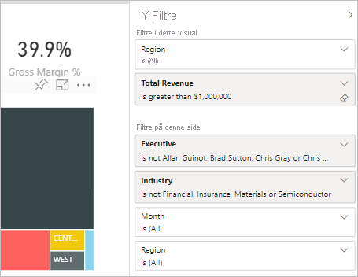

# Typer af filtre i Power BI-rapporter

Filtre fungerer ikke alle på samme måde, fordi de ikke er oprettet på samme måde. Hvordan du opretter dem, har indflydelse på, hvordan de fungerer i filtreringsruden i redigeringstilstand. I denne artikel beskriver vi de forskellige typer filtre: de forskellige måder, du har oprettet dem på, og de forskellige ting, de kan bruges til. Læs om, hvordan du kan [føje filtre til rapporter](power-bi-report-add-filter.md). 

Lad os starte med de to mest almindelige filtertyper: manuelle og automatiske.

## Manuelle filtre 

Manuelle filtre er de filtre, som rapportoprettere kan trække og slippe overalt i den nye filtreringsrude. Brugere med redigeringstilladelse til rapporten kan redigere, slette, rydde, skjule, låse, omdøbe eller sortere dette filter i den nye rude.

## Automatiske filtre 

Automatiske filtre er de filtre, der automatisk tilføjes på visualiseringsniveau i filtreringsruden, når du bygger en visualisering. Disse filtre er baseret på de felter, der udgør din visualisering. Brugere med redigeringstilladelse til rapporten kan redigere, rydde, skjule, låse, omdøbe eller sortere dette filter i den nye rude. De kan ikke slette automatiske filtre, fordi visualiseringen refererer til disse felter.

## Mere avancerede filtre

De næste filtertyper er mindre almindelige, men det er stadig vigtigt at forstå dem, hvis de vises i din rapport. Derudover kan de være nyttige for dig, så du kan oprette det helt rigtige filter til din rapport.

## Filtre for inkludering og udeladelse

Filtre for inkludering og udeladelse føjes automatisk til filtreringsruden, når du bruger funktionalitet for inkludering og udeladelse for en visualisering. Brugere med redigeringstilladelse til rapporten kan slette, låse, skjule eller sortere dette filter i den nye rude. De kan ikke redigere, rydde eller omdøbe et filter for inkludering eller udeladelse, fordi det er knyttet til funktionalitet for inkludering og udeladelse af visualiseringer.

## Detailudledningsfiltre

Detailudledningsfiltre føjes automatisk til filtreringsruden, når du bruger funktionalitet for detailudledning for en visualisering i din rapport. Brugere med redigeringstilladelse til rapporten kan redigere eller rydde filteret i den nye rude. De kan ikke slette, skjule, låse, omdøbe eller sortere dette filter, fordi det er knyttet til funktionen for detailudledning af visualiseringer. Hvis du vil fjerne detailudledningsfilteret, skal du klikke på knappen for færre detaljer for visualiseringen.

## Tværudledningsfiltre

Tværudledningsfiltre føjes automatisk til den nye rude, når et detailudledningsfilter sendes til en anden visualisering på rapportsiden via funktionen for tværgående filtrering eller funktionen for tværgående fremhævning. Brugere med redigeringstilladelse kan ikke slette, rydde, skjule, låse, omdøbe eller sortere dette filter, fordi det er knyttet til funktionen for detailudledning af visualiseringer. De kan heller ikke redigere dette filter, fordi det kommer fra detailudledning i en anden visualisering. Hvis du vil fjerne detailudledningsfilteret, skal du klikke på knappen for færre detaljer for den visualisering, der sender filteret.

## Detaljeadgangsfiltre

Detaljeadgangsfiltre overføres fra én side til en anden via funktionen for detaljeadgang. De vises i ruden for detaljeadgang. Der findes to typer detaljeadgangsfiltre. Den første type er den, der starter detaljeadgangen. Personer, der redigerer rapporter, kan redigere, slette, rydde, skjule eller låse denne type filter. Den anden type er det detaljeadgangsfilter, der sendes til destinationen baseret på filtrene på sideniveau for kildesiden. Personer, der redigerer rapporter, kan redigere, slette eller rydde denne midlertidige type af detaljeadgangsfilter. De kan ikke låse eller skjule dette filter for slutbrugere.

## URL-filtre

Du kan føje URL-filtre til den nye rude ved at tilføje en URL-forespørgselsparameter. Brugere med redigeringstilladelse til rapporten kan redigere, slette eller rydde filteret i den nye rude. De kan ikke skjule, låse, omdøbe eller sortere dette filter, fordi det er knyttet til URL-parameteren. Hvis du vil fjerne filteret, skal du fjerne parameteren fra URL-adressen. Her er et eksempel på en URL-adresse med en parameter:

app.powerbi.com/groups/me/apps/*app-id*/reports/*report-id*/ReportSection?filter=Stores~2FStatus%20eq%20'Off'

Læs mere om [URL-filtre](../collaborate-share/service-url-filters.md).

## Pass-through-filtre

Pass-through-filtre er filtre på visualiseringsniveau, der er oprettet via spørgsmål og svar. Forfattere kan slette, skjule eller sortere disse filtre i den nye rude. Men de kan ikke omdøbe, redigere, rydde eller låse disse filtre.

## Sammenligning af filtertyper

I denne tabel sammenlignes det, som forfattere kan gøre med de forskellige filtertyper.

| Filtertype | Rediger | Clear | Slet | Skjul | Lås | Sort | Omdøb |
|----|----|----|----|----|----|----|----|
| Manuelle filtre | Y | Y | Y | Y | Y | Y | Y |
| Automatiske filtre | Y | Y | N | Y | Y | Y | Y |
| Filtre for Inkluder/Ekskluder | N | N | Y | Y | Y | Y | N |
| Detailudledningsfiltre | Y | Y | N | N | N | N | N |
| Tværudledningsfiltre | N | N | N | N | N | N | N |
| Detaljeadgangsfiltre (aktiverer detaljeadgang) | Y | Y | Y | Y | Y | N | N |
| Detaljeadgangsfiltre (midlertidige) | Y | Y | Y | N | N | N | N |
| URL-filtre – midlertidige | Y | Y | Y | N | N | N | N |
| Pass-through-filtre | N | N | Y | Y | N | Y | N |

## De næste trin

[Føj filtre til rapporter](power-bi-report-add-filter.md)

[Få en præsentation af ruden Rapportfiltre](../consumer/end-user-report-filter.md)

[Filtre og fremhævning i rapporter](power-bi-reports-filters-and-highlighting.md)

Har du flere spørgsmål? [Prøv at spørge Power BI-community'et](https://community.powerbi.com/)
