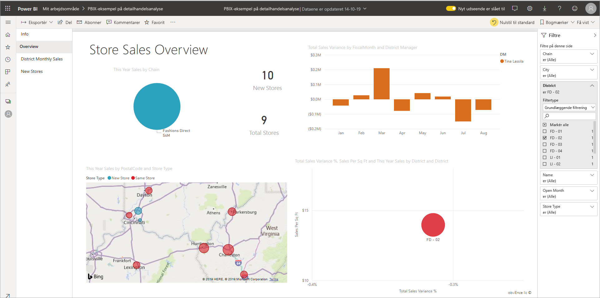
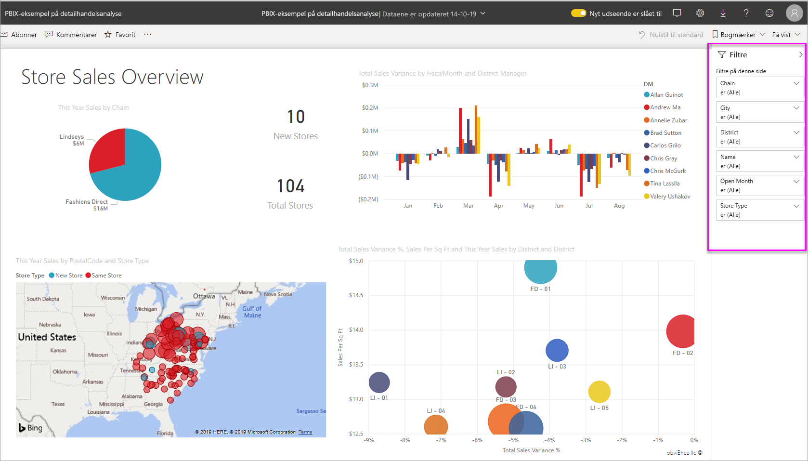
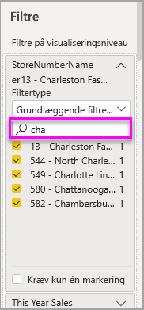
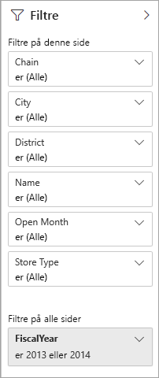
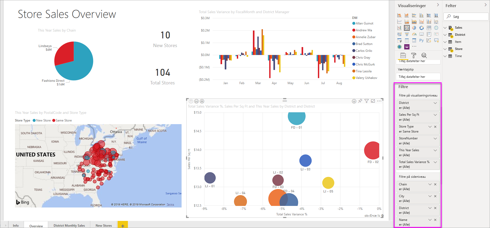

# Filtre og fremhævning i Power BI-rapporter

 Denne artikel introducerer dig for filtrering og fremhævning i Power BI-tjenesten. Brugeroplevelsen er stort den samme i Power BI Desktop. *Filtre* fjerner alt andet end de data, du vil fokusere på. *Fremhævning* filtreres generelt ikke. I de fleste visuelle elementer fjerner fremhævning ikke de ikke-relaterede data. I stedet fremhæves de relaterede data i stedet. Resten af dataene forbliver synlige, men nedtonede. Du kan finde flere oplysninger under [kryds filtrering og tværgående fremhævning](#cross-filter-and-cross-highlight-visuals) senere i denne artikel.

Der er mange forskellige måder, hvorpå du kan filtrere og fremhæve rapporter i Power BI. Det vil sige, at alle disse oplysninger i én artikel er meget, så vi har opdele dem i følgende afsnit:

* Introduktion til filtre og fremhævning – den artikel, du er ved at læse nu.
* Hvordan [filtre og fremhævning arbejder i læsevisning](../consumer/end-user-interactions.md) i Power bi-tjeneste. Det, du kan gøre, er mere begrænset end redigeringsvisning, men du har stadig mange forskellige muligheder for filtrering og fremhævning.  
* Hvordan du [opretter filtre i ruden filtre](power-bi-report-add-filter.md) i Power bi desktop og i Power bi-tjeneste. Når du har redigeringsrettigheder til en rapport, kan du oprette, ændre og slette filtre i rapporter.
* Når du har tilføjet filtre, kan du [formatere filtrene](power-bi-report-filter.md) , så de fungerer, som du ønsker det, og se resten af rapporten.
* Du har lært, hvordan filtre og fremhævning fungerer som standard. Nu kan du få mere at vide om, hvordan du [ændrer måden visualiseringer på et sidefilter og fremhæver hinanden](service-reports-visual-interactions.md).
* Læs mere om andre [typer filtre i Power bi rapporter](power-bi-report-filter-types.md).

## Introduktion til ruden Filtre

Du kan anvende filtre i ruden **filtre** , eller du kan [foretage valg i udsnit](../visuals/power-bi-visualization-slicers.md) direkte på selve rapportsiden. Ruden filtre viser felterne i de enkelte visuelle elementer og alle andre filtre, som Report Designer tilføjer. 

Der er fire standardtyper af filtre, som du opretter i ruden filtre.

- Et **visuelt filter** gælder for et enkelt visuelt element på en rapport side. Du kan se filtre på visualiserings niveau, når du vælger en visualisering på rapport lærredet. Selvom du ikke kan redigere en rapport, kan du vælge en visualisering og filtrere den.
- **Sidefilteret** gælder for alle visualiseringer på rapportsiden.
- **Rapportfilter** gælder for alle sider i rapporten.
- **Detalje adgangs filter** Med detailudledning i Power BI-tjeneste og Power BI Desktop kan du oprette en *destinations* rapport side, der fokuserer på et bestemt objekt, f. eks. en leverandør. På de andre rapportsider kan brugere højreklikke på et datapunkt for den pågældende enhed og få detaljeadgang til siden med fokus.

Hvis du vil oprette de første tre, det visuelle element, den side og de rapportfiltre, der er oprettet, skal du se [Føj et filter til en rapport i Power bi](power-bi-report-add-filter.md). 

Hvis du vil oprette detalje adgangs filtre, skal du se [Konfigurer detailudledning i Power bi rapporter](desktop-drillthrough.md).

### Grundlæggende og avanceret filtrering

Som standard kan rapport læsere skifte mellem **grundlæggende** og **Avanceret** filtrering. 

**Basic-filtre** viser en liste over alle værdierne i feltet. Du kan søge i side-, visual- og rapportfiltre, i læse- eller redigeringsvisning, for at finde og vælge den værdi, du ønsker. 

Et filter med ordet **all** ud for det er ufiltreret og viser alle værdierne i feltet.  **Kæden er** f. eks. den rapport side, der indeholder data om alle lager kæderne. I modsætning hertil er filter FiscalYear på rapport niveau **2013 eller 2014** betyder, at rapporten kun viser data for regnskabsårene for 2013 og 2014.

Med **Avancerede filtre** kan du bruge mere komplicerede filtre. Du kan f. eks. søge efter værdier, der indeholder eller ikke indeholder, starte med eller ikke starte med, en bestemt værdi. 

:::image type="content" source="media/power-bi-reports-filters-and-highlighting/power-bi-advanced-filter.png" alt-text="Avancerede filtre tilbyder flere nuancerede filtreringsmuligheder.":::

Når du opretter en rapport, kan du slå Skift fra og [ikke lade rapport læsere ændre filtertyper](power-bi-report-filter.md#restrict-changes-to-filter-type). Du kan også slå søgning fra i ruden filter.

## Filtre i læse- eller redigeringsvisning

Der er to tilstande, der kan bruges til at interagere med rapporter i Power BI-tjeneste: læsevisning og redigeringsvisning. Hvilke filterfunktioner der er tilgængelige, afhænger af, hvilken tilstand du arbejder i.

* I [læsevisning](#filters-in-reading-view)kan du interagere med eventuelle filtre, der allerede findes i rapporten, og gemme de indstillinger, du foretager. Du kan ikke tilføje nye filtre.
* I [redigeringsvisning](#filters-in-editing-view)kan du tilføje alle typer filtre. Når du gemmer rapporten, gemmes filtrene sammen med rapporten, også selvom rapport læsere åbner den i en mobilapp. Personer, der kigger på rapporten i læsevisning, interagerer med de filtre, du har tilføjet, men kan ikke tilføje nye filtre.

### Filtre i læsevisning

Hvis du vælger et visuelt element i læsevisning i Power BI-tjeneste, ligner ruden filtre følgende:

Hvert enkelt Visual har filtre for alle felterne i visualiseringen. Når du opretter en rapport, kan du tilføje flere. I denne Filterrude har Visual tre filtre.

I læsevisning kan du udforske dataene ved at ændre de eksisterende filtre. Du filtrerer kun din visning af rapporten. Når du afslutter rapporten, gemmes de ændringer, du foretager, i visningen af rapporten, også selvom du åbner rapporten i en mobilapp. Hvis du vil annullere filtreringen og vende tilbage til de standardværdier, der er angivet i rapportens forfatter, skal du vælge **Nulstil til standard** på menulinjen.

:::image type="content" source="../consumer/media/end-user-report-filter/power-bi-reset-icon.png" alt-text="Nulstil til standardikon.":::

Få mere at vide om læsevisning: [få en rundvisning i ruden rapportfiltre](../consumer/end-user-report-filter.md).

### Filtre i redigeringsvisning
Når du åbner en rapport i Power BI Desktop, kan du se, at **filtre** kun er én af de mange redigerings ruder, der er tilgængelige. Du kan se de samme ruder, hvis du åbner en rapport i redigeringsvisning i Power BI-tjeneste.

Vi ser denne side i rapporten har tre filtre på sideniveau og ét filter på rapport niveau. Når du vælger søjlediagrammet, kan vi se, at det også har tre filtre på visualiserings niveau.

#### Arbejd med filtre i redigeringsvisning

- Få mere at vide om, hvordan du [føjer filtre til en rapport](power-bi-report-add-filter.md) i Power bi desktop og i redigeringsvisning i Power bi-tjeneste.

- Når du har tilføjet filtre, har du mange formateringsindstillinger for dem. Du kan f. eks. skjule, låse eller ændre rækkefølgen af filtre eller formatere dem, så de stemmer overens med resten af rapporten. Få mere at vide om, hvordan du [formaterer filtre i en rapport](power-bi-report-filter.md). 

- Du kan også ændre den måde, visualiseringer interagerer på. Hvis du vil finjustere tværgående fremhævning og kryds filtrering, skal du se [Rediger, hvordan visualiseringer interagerer i rapporter](service-reports-visual-interactions.md).

## Tværgående filtre og visuelle elementer med tværgående fremhævning

Du kan udforske relationerne mellem de visuelle elementer i din rapport uden at bruge filtre eller udsnitsværktøjer. Vælg en værdi-eller akseetiket i ét visuelt element for at *kryds filtrere* eller *tværgående fremhævning* af de relaterede værdier i andre visualiseringer på siden. De fungerer ikke alle sammen. 

- **Tværgående fremhævning** Når du vælger en værdi i en visualisering, fremhæves de relaterede data i visualiseringer, f. eks. søjlediagrammer og liggende søjlediagrammer. Tværgående fremhævning fjerner ikke de ikke-relaterede data fra disse visualiseringer. De ikke-relaterede data er stadig synlige, men nedtonede. 
- **Kryds filtrering** Hvis du vælger en værdi i en visualisering, fungerer det mere som et filter i andre visuals, f. eks. kurvediagrammer og punktdiagrammer. I disse visualiseringer forbliver kun de relaterede data synlige. De ikke-relaterede data er ikke synlige, på samme måde som du ville se med et filter. 

Hvis du vil fjerne fremhævningen, skal du vælge værdien igen eller vælge et blankt område i den samme visualisering. Du kan finde flere eksempler i afsnittet [kryds filtrering og tværgående fremhævning](../consumer/end-user-interactions.md#cross-filtering-and-cross-highlighting) af "hvordan visuelle elementer kryds filtrerer hinanden i en Power BI rapport".

## Næste trin

- [Føj et filter til en rapport i redigeringsvisning](power-bi-report-add-filter.md)
- [Formatér filtre i Power BI rapporter](power-bi-report-filter.md)
- [Få en præsentation af rapportfiltre](../consumer/end-user-report-filter.md)
- [Hvordan visuelle elementer i rapporter kryds filtrerer og kryds fremhævning af hinanden i en rapport](../consumer/end-user-interactions.md)

Har du flere spørgsmål? [Prøv at spørge Power BI-community'et](https://community.powerbi.com/)
