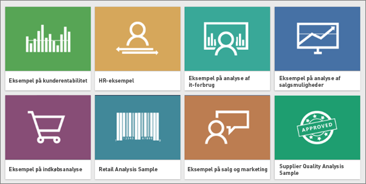
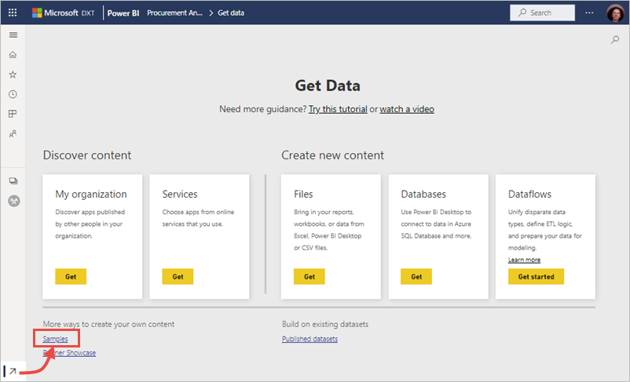
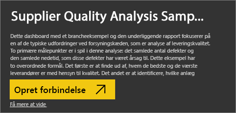
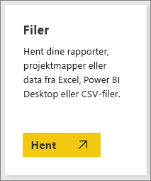
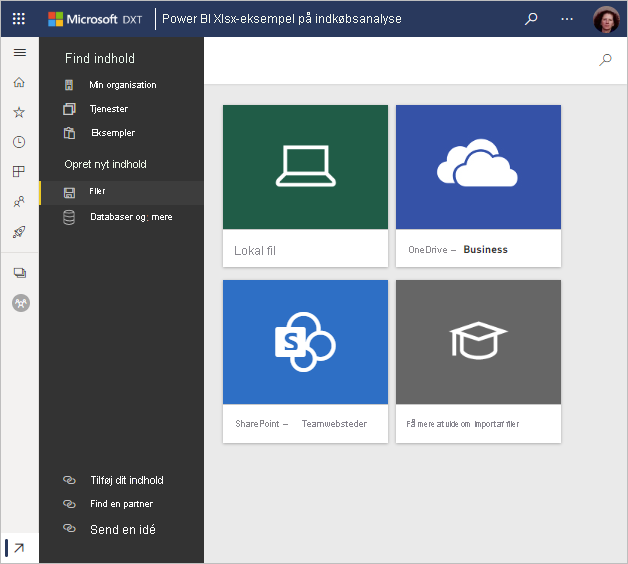
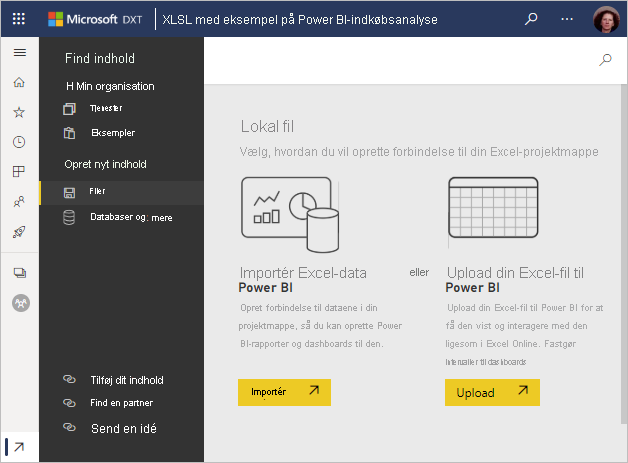
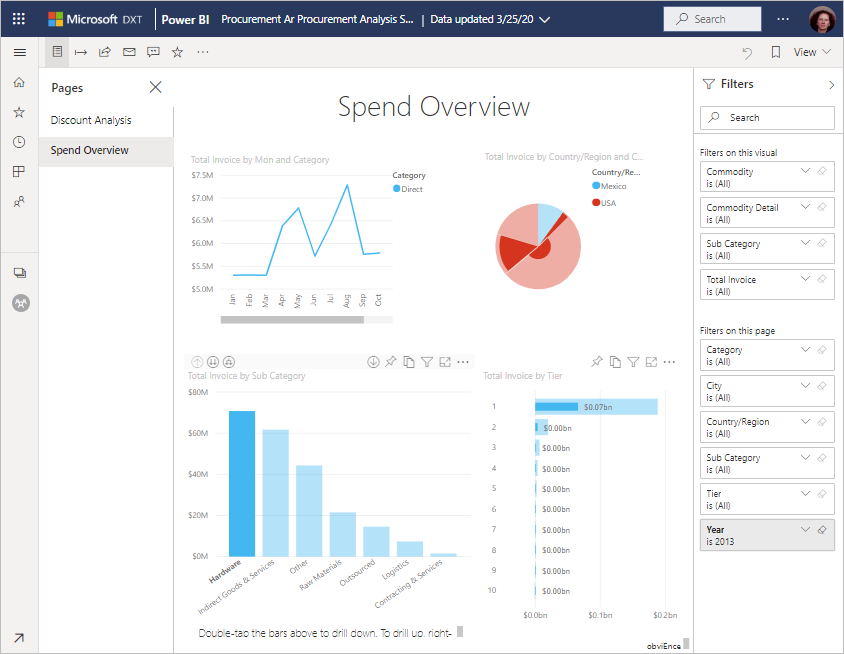

# Hent eksempler til Power BI
Lad os antage, at du ikke kender Power BI og vil afprøve det, men ikke har nogen data.  Eller måske vil du se rapporter, der illustrerer nogle af funktionerne i Power BI. Du kan få nogen af os.

Power BI omfatter forskellige typer eksempler til forskellige formål: 
- En **[Power BI rapport](#sales--returns-sample-pbix-file) (. pbix-fil)** , du kan få vist i datahistoriegalleriet, åbne og udforske i Power BI Desktop eller uploade til Power BI-tjenesten.
- En **[eksempelapp](#sample-app-from-appsource)** , du downloader fra AppSource, også direkte i Power BI-tjenesten. Apps omfatter dashboards, rapporter og datasæt. Du kan ændre dem og derefter distribuere dem til dine kolleger.
- **[Otte oprindelige indbyggede eksempler](#eight-original-samples)** i Power BI-tjenesten som *indholdspakker* med dashboards, rapporter og datasæt. Du installerer dem direkte i Power BI-tjenesten. De indbyggede eksempler er også tilgængelige som Power BI-rapporter (. pbix) og Excel-projektmapper (. xlsx).
- **[Excel-projektmappe](#download-sample-excel-files)** versioner af de indbyggede eksempler, der indeholder datamodellen og Power View-ark. Du kan udforske eller redigere datamodellen i Excel og bruge Excel-projektmappen som datakilde for en Power BI-rapport. Du kan også overføre projektmappen som en Excel-fil og få vist Excel-visuals og -pivottabeller i Power BI-rapporter. 
- Desuden kan der også hentes en **[eksempelprojektmappe med økonomiske data](sample-financial-download.md)** , der er en enkel, flad tabel i en Excel-fil. Den indeholder anonymiserede data med fiktive produkter, hvor salg er fordelt på segmenter og lande/områder. Det er en nyttig grundlæggende datakilde til en Power BI-rapport.

De samme eksempler bruges i selvstudier og andet materiale i vores onlinedokumentation, så du kan følge med.

## .pbix-eksempelfilen Sales & Returns

:::image type="content" source="media/sample-datasets/sales-returns-sample-pbix.png" alt-text=".pbix-eksempelfilen Sales & Returns":::

*Eksempelrapporten Sales & Returns*

Power BI-rapportdesignerne Miguel Myers og Chris Hamill har oprettet .pbix-filen Sales & Returns for at vise de mange nye funktioner i Power BI, herunder knapper, detaljeadgang, betinget formatering, what if-parametre og brugerdefinerede værktøjstip. 

Scenariet for denne rapport er en virksomhed, der sælger skateboards med Microsoft-tema. Virksomheden ønsker at se status for deres salg og returneringer og analysere, hvordan de skal ændre deres drift. 

Du kan udforske det på følgende måder:

- Få vist og interagere med den i Power BI Community's [datahistoriegalleri](https://community.powerbi.com/t5/Data-Stories-Gallery/Sales-amp-Returns-Sample-Report/m-p/876607).
- Download. pbix-filen, og udforsk den i dybden. Tag et kig "bag kulisserne" for at se, hvordan Miguel gjorde det. Hvis du vælger dette link, hentes filen automatisk: [Eksempelrapporten Sales & Returns](https://github.com/microsoft/powerbi-desktop-samples/blob/main/Sample%20Reports/Sales%20%26%20Returns%20Sample%20v201912.pbix).
- Læs om rapporten i Power BI's blogindlæg [Få en rundvisning i den nye eksempelrapport (Take a tour of the new Sales & Returns sample report)](https://powerbi.microsoft.com/blog/take_a_tour_of_the_new_sales_returns_sample_report/).

## Eksempelapp fra AppSource

*Appen* Marketing and Sales er tilgængelig fra Microsoft AppSource. En app er en Power BI-indholdstype, hvor relaterede dashboards og rapporter kombineres på ét sted. En app kan have et eller flere dashboards og en eller flere rapporter, der alle er samlet. Du kan downloade appen Marketing and Sales fra **Apps** i Power BI-tjenesten eller ved at gå til AppSource i din browser.

- I artiklen [Installér og brug apps](../consumer/end-user-app-view.md) forklares det, hvordan du downloader en app fra Power BI-tjenesten.
- Dette link fører dig til [appen Sales & Marketing](https://appsource.microsoft.com/product/power-bi/microsoft-retail-analysis-sample.salesandmarketingsample?tab=Overview) i AppSource.

Når du har installeret den, kan du se den i din samling af apps.

:::image type="content" source="media/sample-datasets/power-bi-sales-marketing-app.png" alt-text="Felt for appen Sales & Marketing":::

Når du åbner den, skal du vælge **Udforsk med eksempeldata**. 

:::image type="content" source="media/sample-datasets/power-bi-explore-app.png" alt-text="Udforsk appen":::

Du kan se appvisningen med dashboardet og de individuelle rapportsider i navigationsruden. 

:::image type="content" source="media/sample-datasets/power-bi-sales-marketing-app-navigation.png" alt-text="Appnavigationsrude":::

Da du har installeret den, kan du også åbne *arbejdsområdet* og redigere elementerne i appen. Vælg blyantsikonet **Rediger** for at åbne arbejdsområdet.

:::image type="content" source="media/sample-datasets/power-bi-app-edit-pencil.png" alt-text="Rediger appen":::

Nu kan du se dashboardet, rapporten og datasættet fra appen i listevisning i arbejdsområdet. Her i arbejdsområdet kan du redigere hver enkelt af dem.

:::image type="content" source="media/sample-datasets/power-bi-sales-marketing-workspace.png" alt-text="Arbejdsområde for Sales & Marketing":::

Du kan distribuere denne app til hvem som helst i din organisation. Vælg **Opdater program**.

:::image type="content" source="media/sample-datasets/power-bi-update-app.png" alt-text="Knappen Opdater app":::

Udfyld fanen **Opsætning**, hvor du f.eks. skal vælge en **apptemafarve**. 

:::image type="content" source="media/sample-datasets/power-bi-app-setup.png" alt-text="Vælg appopsætning":::

Udfyld fanerne **Navigation** og **Tilladelse**, og vælg derefter **Opdater app**.

:::image type="content" source="media/sample-datasets/power-bi-select-update-app.png" alt-text="Vælg fanen Opdater for at publicere den":::

Læs mere om [publicering af apps i Power BI](../collaborate-share/service-create-distribute-apps.md).

## Otte oprindelige eksempler
Der er otte oprindelige eksempler, du kan bruge. De repræsenterer hver især forskellige brancher. Du kan arbejde med dem i forskellige formater:

- Installér [de indbyggede indholdspakker](#install-built-in-content-packs) i Power BI-tjenesten.
- Hent [Power BI-rapportfilerne](#download-original-sample-power-bi-files) (. pbix).
- Hent [Excel-projektmappefilerne](#download-sample-excel-files) (. xlsx), og overfør dem derefter til Power BI-tjenesten.
- Udforsk de [Excel-filerne i selve Excel](#explore-excel-samples-inside-excel).

Virksomheden obviEnce ([www.obvience.com](http://www.obvience.com/)) og Microsoft har slået sig sammen om at oprette eksempler, som du kan bruge sammen med Power BI.  Dataene er anonymiseret og repræsenterer forskellige brancher: finans, HR, salg med mere. 

Hvert af disse eksempler findes i flere formater: som en indholdspakke, som en Excel-projektmappe og som en Power BI-.pbix-fil. Hvis du ikke ved, hvad disse ting er, eller hvordan du får fat i dem – så bare rolig. Det hele forklares i denne artikel. Vi har oprettet en *rundvisning* for hvert af disse eksempler. Rundvisninger er artikler, der fortæller historien bag eksemplet og fører dig gennem forskellige scenarier. Et scenarie kan være at besvare spørgsmål for din leder, et andet at søge efter konkurrencemæssig indsigt eller oprette rapporter og dashboards til deling eller at forklare et forretningsskift.

Men før vi begynder, skal du læse disse juridiske retningslinjer for brug af eksemplerne. Derefter introducerer vi eksemplerne og viser, hvordan du bruger dem.

### Retningslinjer for brug af eksempler på Excel-projektmapper

&copy;2015 Microsoft Corporation. All rights reserved. Dokumenterne og projektmapperne er leveret "som de er og forefindes". Oplysninger og visninger i projektmapperne, herunder URL-adresser og andre referencer til websteder, kan ændres uden varsel. Du påtager dig risikoen ved at bruge dem. Nogle eksempler er kun til illustration og er fiktive. Ingen virkelig forbindelse er tilsigtet eller kan udledes. Microsoft giver ingen garantier, udtrykkeligt eller underforstået, hvad angår de oplysninger, der er angivet her.

Projektmapperne giver dig ikke nogen juridiske immaterielle rettigheder til noget Microsoft-produkt. Du kan kopiere og bruge denne projektmappe til dine interne referenceformål.

Projektmapperne og de relaterede data leveres af obviEnce. [www.obvience.com](http://www.obvience.com)

ObviEnce er en uafhængig softwareleverandør og en inkubator af immaterielle rettigheder med fokus på Microsoft Business Intelligence. ObviEnce arbejder tæt sammen med Microsoft om at udvikle bedste praksis og thought leadership til at kickstarte og udrulle Microsoft Business Intelligence-løsninger.

Projektmapperne og dataene tilhører obviEnce, LLC og er kun blevet delt med henblik på at demonstrere funktioner i Power BI med eksempeldata fra brancher.

Enhver anvendelse af projektmapperne og/eller dataene skal indeholde ovenstående juridiske meddelelse (dvs. også på inforegnearket med hver projektmappe). Projektmappen og visualiseringer skal være ledsaget af følgende copyrightmeddelelse: obviEnce &copy;.

Ved at klikke på nedenstående links til download af Excel-projektmappefiler eller .pbix-filer accepterer du ovenstående vilkår.

### Eksempel på kunderentabilitet  
[Få en introduktion til eksemplet på kunderentabilitet](sample-customer-profitability.md)

I dette brancheeksempel analyseres en finansdirektørs vigtigste målepunkter for virksomhedens direktører, produkter og kunder. Du kan undersøge, hvilke faktorer der påvirker virksomhedens rentabilitet.

### Eksempel på HR 
[Få en introduktion til HR-eksemplet](sample-human-resources.md)

I dette brancheeksempel fokuseres der på ansættelsesstrategien for en virksomhed ved at analysere nyansættelser, aktive medarbejdere og medarbejdere, der har forladt virksomheden.  Ved at undersøge dataene kan du finde tendenser i frivillige separationer og antagelser i ansættelsesstrategien.

### Eksempel på analyse af it-forbrug 
[Få en introduktion til eksemplet på analyse af it-forbrug](sample-it-spend.md)

I dette brancheeksempel analyseres de planlagte omkostninger sammenlignet med de faktiske omkostninger for it-afdelingen i en virksomhed. Sammenligningen hjælper os med at forstå, om virksomheden har lagt en god plan for året, og giver os mulighed for at undersøge de områder, som afviger væsentligt fra planen. Virksomheden i eksemplet gennemgår en årlig planlægningscyklus og genererer et nyt 'Seneste estimat' (Latest Estimate, LE) hvert kvartal for at gøre det nemmere at analysere ændringer i it-forbruget i løbet af regnskabsåret.

### Eksempel på analyse af salgsmuligheder 
[Få en introduktion til eksemplet på analyse af salgsmuligheder](sample-opportunity-analysis.md)

Dette brancheeksempel undersøger en softwarevirksomheds salgskanal. Salgschefer overvåger deres direkte og partneres salgskanaler ved at spore muligheder og indtægter efter område, handlens omfang samt kanal.

### Eksempel på indkøbsanalyse  
[Få en introduktion til eksemplet på indkøbsanalyse](sample-procurement.md)

I dette brancheeksempel analyseres en finansdirektørs vigtigste målepunkter for virksomhedens direktører, produkter og kunder. Du kan undersøge, hvilke faktorer der påvirker virksomhedens rentabilitet.

### Eksempel på analyse af detailhandel  
[Få en introduktion til eksemplet på detailanalyse](sample-retail-analysis.md)

Dette brancheeksempel analyserer data om detailsalg for varer, der er solgt på tværs af flere butikker og distrikter. De metriske værdier sammenligner dette års resultat med sidste års på følgende områder: salg, enheder, bruttoavance og varians samt analyse af nye butikker.

### Eksempel på salg og marketing  
[Få en introduktion til eksemplet på salg og marketing](sample-sales-and-marketing.md)

Dette brancheeksempel tager udgangspunkt i produktionsvirksomheden VanArsdel Ltd. Det giver marketingchefen mulighed for at se branchen og markedsandelen for VanArsdel.  Ved at udforske eksemplet kan du finde virksomhedens markedsandel, produktvolumen, salg og synspunkt.

### Eksempel på leverandørkvalitet  
[Få en introduktion til eksemplet på leverandørkvalitet](sample-supplier-quality.md)

Dette brancheeksempel fokuserer på en af de typiske udfordringer ved forsyningskæden – analyse af leverandørkvalitet. To primære målepunkter er i spil i denne analyse: Det samlede antal defekter og den samlede nedetid, som disse defekter har været årsag til. Dette eksempel har to overordnede formål: At forstå, hvem de bedste og de værste leverandører er med hensyn til kvalitet, og identificere, hvilke fabrikker der er bedst til at finde og afvise defekter og dermed reducere nedetiden.

### Installér indbyggede indholdspakker

Lad os starte med *indholdspakkerne*. De indbyggede eksempler er tilgængelige i Power BI-tjenesten. Du behøver ikke at gå ud af Power BI for at finde dem. En indholdspakke er en samling af et eller flere dashboards, datasæt og rapporter, som en person opretter, og som kan bruges sammen med Power BI-tjenesten. Hver eksempelindholdspakke til Power BI indeholder et datasæt, en rapport og et dashboard.  Indholdspakker er stadig tilgængelige, men de frarådes. De er ikke tilgængelige for Power BI Desktop.

1. Åbn Power BI-tjenesten (app.powerbi.com), og log på.
2. Gå til Mit arbejdsområde eller et andet arbejdsområde, hvor du vil installere eksemplet. 
2. Vælg **Hent data** i nederste venstre hjørne.

    
3. Vælg **Eksempler** på siden Hent data, der vises.

   
4. Vælg et af eksemplerne for at åbne en beskrivelse af det pågældende eksempel, og vælge **Opret forbindelse**.  

   
5. Power BI importerer indholdspakken og føjer et nyt dashboard, en rapport og et datasæt til dit aktuelle arbejdsområde. Brug eksemplerne til give Power BI en testkørsel.  

   

Nu hvor du har data, er du i gang.  Afprøv nogle af vores selvstudier ved hjælp af eksempelindholdspakkerne eller ved blot at åbne Power BI-tjenesten og udforske dem.

### Download de oprindelige Power BI-eksempelfiler
Alle eksempelindholdspakkerne er også tilgængelige som en Power BI .pbix-fil. .pbix-filerne er udviklet til brug med Power BI Desktop.  

1. Download filerne enkeltvist ved hjælp af linkene nedenfor. Når disse links markeres, gemmes filen automatisk i mappen Overførsler. 

   - [Eksempel på kunderentabilitet PBIX](https://download.microsoft.com/download/6/A/9/6A93FD6E-CBA5-40BD-B42E-4DCAE8CDD059/Customer%20Profitability%20Sample%20PBIX.pbix)
   - [HR-eksempel PBIX](https://download.microsoft.com/download/6/9/5/69503155-05A5-483E-829A-F7B5F3DD5D27/Human%20Resources%20Sample%20PBIX.pbix)
   - [Eksempel på indkøbsanalyse PBIX](https://download.microsoft.com/download/D/5/3/D5390069-F723-413B-8D27-5888500516EB/Procurement%20Analysis%20Sample%20PBIX.pbix)
   - [Eksempel på detailhandelsanalyse PBIX](https://download.microsoft.com/download/9/6/D/96DDC2FF-2568-491D-AAFA-AFDD6F763AE3/Retail%20Analysis%20Sample%20PBIX.pbix)
   - [Eksempel på salg og marketing PBIX](https://download.microsoft.com/download/9/7/6/9767913A-29DB-40CF-8944-9AC2BC940C53/Sales%20and%20Marketing%20Sample%20PBIX.pbix)
   - [Eksempel-PBIX på analyse af leverandørkvalitet](https://download.microsoft.com/download/8/C/6/8C661638-C102-4C04-992E-9EA56A5D319B/Supplier-Quality-Analysis-Sample-PBIX.pbix)

1. Vælg **Filer > Åbn** i Power BI Desktop, og gå til det sted, hvor du har gemt .pbix-eksempelfilen.

4. Vælg .pbix-filen for at åbne den i Power BI Desktop.

### Hent Excel-eksempelfilerne
Alle eksempelindholdspakkerne er også tilgængelige som en Excel-projektmappe. Excel-projektmapperne er udviklet til brug sammen med Power BI-tjenesten.  

1. Download filerne hver for sig ved hjælp af linkene nedenfor, eller [download en zip-fil med alle eksempelfilerne](https://go.microsoft.com/fwlink/?LinkId=535020). Hvis du er mere erfaren bruger, kan du vælge at downloade Excel-projektmapperne for udforske eller redigere datamodellerne.

   - [Customer Profitability Sample](https://go.microsoft.com/fwlink/?LinkId=529781)
   - [Human Resources Sample](https://go.microsoft.com/fwlink/?LinkId=529780)
   - [Opportunity Tracking Sample](https://go.microsoft.com/fwlink/?LinkId=529782)
   - [Procurement Analysis Sample](https://go.microsoft.com/fwlink/?LinkId=529784)
   - [Retail Analysis Sample](https://go.microsoft.com/fwlink/?LinkId=529778)
   - [Sales and Marketing Sample](https://go.microsoft.com/fwlink/?LinkId=529785)
   - [Supplier Quality Analysis Sample](https://go.microsoft.com/fwlink/?LinkId=529779)

2. Gem den downloadede fil. Det gør en forskel, hvor du gemmer filen.

      **Lokal** – Hvis du gemmer filen på et lokalt drev på din computer eller en anden placering i din organisation fra Power BI, kan du importere filen til Power BI. Filen forbliver på den lokale harddisk, så det er ikke hele filen, der importeres til Power BI. Der sker det, at et nyt datasæt oprettes på dit Power BI-websted, og data – og i nogle tilfælde datamodellen – indlæses i datasættet. Hvis filen indeholder rapporter, vises de på Power BI-webstedet under Rapporter.
    
     **OneDrive – Business** – Hvis du har OneDrive for Business, og du logger på med den samme konto, som du bruger til at logge på Power BI, er OneDrive for Business klart det bedste sted at holde dit arbejde i Excel, Power BI eller en .CSV-fil synkroniseret med datasættet, rapporter og dashboards i Power BI. Da både Power BI og OneDrive findes i clouden, opretter Power BI forbindelse til din fil på OneDrive ca. hver time. Hvis der findes ændringer, opdateres datasættet, rapporter og dashboards automatisk i Power BI.
    
     **SharePoint – teamwebsteder**    Lagring af Power BI-filer på SharePoint – teamwebsteder er stort set det samme som at gemme på OneDrive for Business. Den største forskel er, hvordan du opretter forbindelse til filen fra Power BI. Du kan angive en URL-adresse, eller du kan oprette forbindelse til rodmappen.
1. Åbn Power BI-tjenesten (app.powerbi.com), og log på.

1. Gå til Mit arbejdsområde eller til et andet arbejdsområde, eller opret et arbejdsområde udelukkende til eksemplet.

4. Vælg **Hent data** i nederste venstre hjørne i navigationsruden.

    
5. Vælg **Filer > Hent** på siden **Hent data**, der vises.

    
6. Vælg den placering, hvor du har downloadet og gemt eksemplet.

    
7. Vælg filen. Afhængigt af hvor du har gemt filen, skal du vælge **Opret forbindelse** eller **Åbn**.

8. Vælg, om du vil importere dataene eller overføre projektmappen til Power BI, og se dem præcist som i Excel online.

    
9. Hvis du vælger **Importér**, importerer Power BI eksempelprojektmappen og tilføjer den som et nyt dashboard, en ny rapport og et nyt datasæt med navnet **Eksempel på indkøbsanalyse**.

    - Da projektmappen indeholder Power View-ark, opretter Power BI en rapport med en side for hvert Power BI-ark. 
    - Der oprettes et nyt dashboard med et nyt tomt felt i Power BI.  Hvis du vælger dette felt, føres du til den rapport, du lige har tilføjet.

10. Åbn rapporten. Vælg de forskellige elementer i rapporten for at udforske deres interaktioner. 

    

### Udforsk Excel-eksempler i Excel

(Valgfrit) Ønsker du at forstå, hvordan dataene i en Excel-projektmappe bliver konverteret til Power BI-datasæt og -rapporter? Nogle af svarene ligger i åbning af Excel-eksempler *i Excel* og udforskning af regnearkene.

- Når du først åbner en eksempelprojektmappe i Excel, kan du få vist to advarsler. I den første advarsel står der, at projektmappen er i beskyttet visning. Vælg **Aktivér redigering**. I den anden advarsel står der muligvis, at projektmappen har forbindelse til eksterne data. Vælg **Aktivér indhold**.
- Hver projektmappe indeholder flere ark til Power-visning. Hvis du vil se arkene til Power-visning i Excel, skal du [aktivere tilføjelsesprogrammet Power-visning](https://support.office.com/article/flash-silverlight-and-shockwave-controls-blocked-in-microsoft-office-55738f12-a01d-420e-a533-7cef1ff6aeb1) ved at downloade en pakke af nøgler til registreringsdatabasen.
- Så hvor er de faktiske data? De er i Power Pivot-datamodellen. Arkene til Power-visning behøver ikke at se dataene. På fanen **PowerPivot** skal du vælge **Administrer**.

    Kan du ikke se fanen **Power Pivot**? [Aktivér tilføjelsesprogrammet Power Pivot](https://support.office.com/article/Start-Power-Pivot-in-Microsoft-Excel-2013-add-in-A891A66D-36E3-43FC-81E8-FC4798F39EA8).

    I Power Pivot kan du se dataene i alle underliggende tabeller samt alle DAX-formler. 

- Fanen Info indeholder oplysninger om obviEnce, firmaet, der oprettede eksemplet.

## Næste trin
[Grundlæggende begreber for designere i Power BI-tjenesten](../fundamentals/service-basic-concepts.md)

[Selvstudium: Opret forbindelse til Power BI-eksemplerne](sample-tutorial-connect-to-the-samples.md)

[Datakilder til Power BI](../connect-data/service-get-data.md)

Har du flere spørgsmål? [Prøv at spørge Power BI-community'et](https://community.powerbi.com/)
