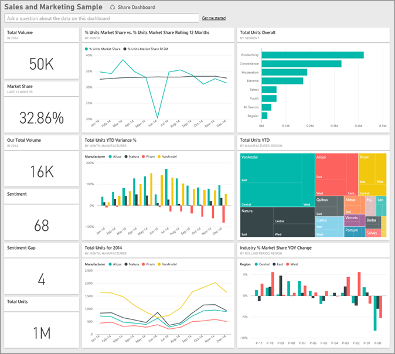
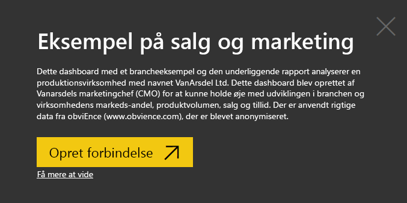
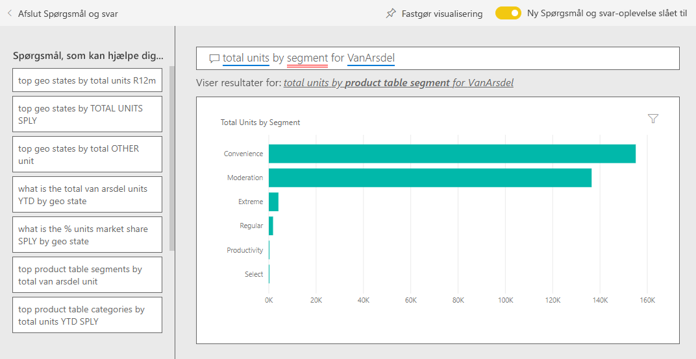
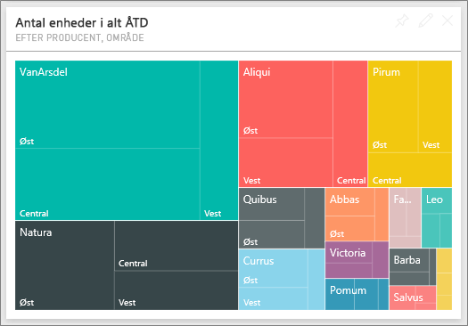
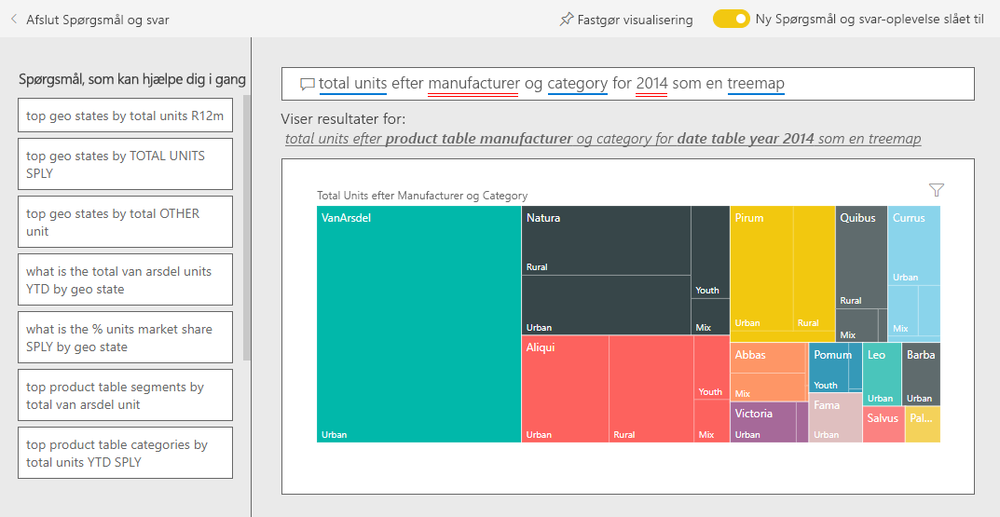
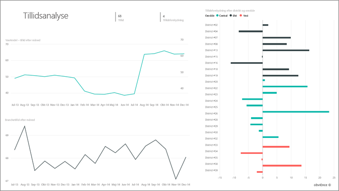
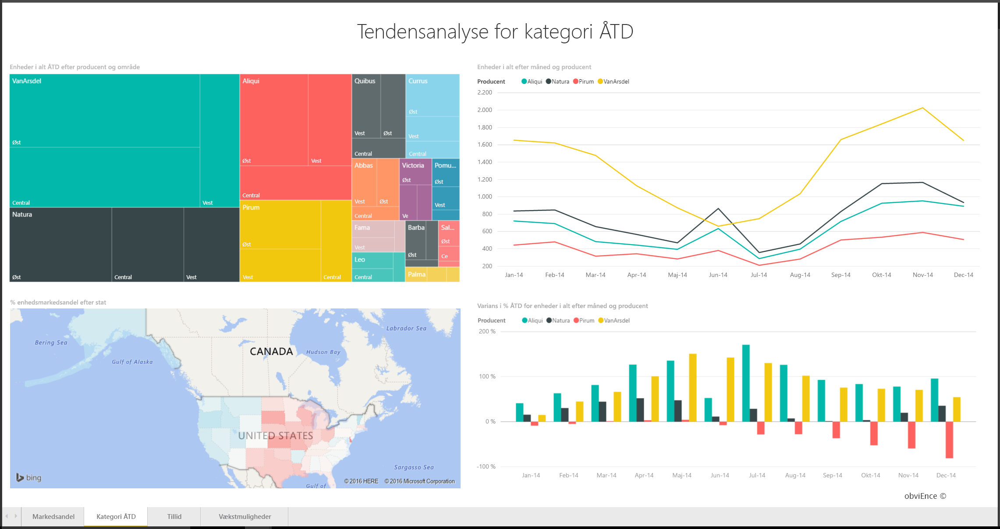
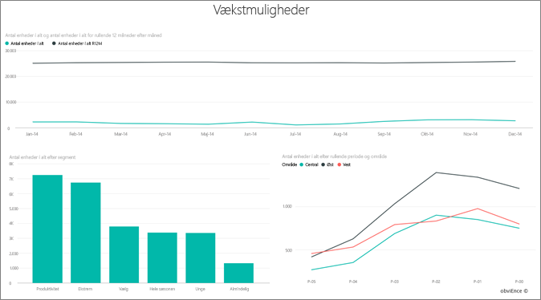

# Eksempel på salg og marketing til Power BI: Få en introduktion

Eksempel på salg og marketing indeholder et dashboard og en rapport tilhørende et fiktivt produktionsfirma ved navn VanArsdel Ltd. VanArsdels marketingchef (CMO) oprettede dette dashboard for at kunne holde øje med udviklingen i branchen og virksomhedens markedsandel, produktvolumen, salg og tillid.

VanArsdel har mange konkurrenter, men er førende inden for branchen. Marketingchefen ønsker at øge markedsandelen og finde nye muligheder for vækst. Men af ukendte årsager er Vanarsdels markedsandel begyndt at falde, og nedgangen var stor i juni måned.

Dette eksempel er en del af en serie, der viser, hvordan du kan bruge Power BI med forretningsrelaterede data, rapporter og dashboards. Det blev oprettet af [obviEnce](http://www.obvience.com/) med rigtige data, som er blevet anonymiseret. Dataene er tilgængelige i flere formater: prøve i produkt, .pbix-fil til Power BI Desktop eller Excel-projektmappe. Se [Eksempler til Power BI](sample-datasets.md). 

I dette selvstudium udforskes eksemplet på salgs- og marketinganalyse i Power BI-tjenesten. Da rapportoplevelsen i Power BI Desktop og i tjenesten minder meget om hinanden, kan du også følge med ved at bruge .pbix-eksempelfilen i Power BI Desktop. 

Du behøver ikke en Power BI-licens for at udforske eksemplerne i Power BI Desktop. Hvis du ikke har en Power BI Pro-licens, kan du gemme eksemplet i Mit arbejdsområde i Power BI-tjenesten. 

## Hent eksemplet

Før du kan bruge eksemplet, skal du først downloade [dashboardet, rapporten og datasættet](#get-the-sample-from-the-power-bi-service), [pbix-filen](#get-the-pbix-file-for-this-sample) eller [Excel-projektmappen](#get-the-excel-workbook-for-this-sample).

### Hent eksemplet fra Power BI-tjenesten

1. Åbn Power BI-tjenesten (app.powerbi.com), log på, og åbn det arbejdsområde, hvor du vil gemme eksemplet.

   Hvis du ikke har en Power BI Pro-licens, kan du gemme eksemplet i Mit arbejdsområde.

2. Vælg **Hent data** i nederste venstre hjørne.
   
   
3. På siden **Hent data**, der vises, skal du vælge **Eksempler**.
   
4. Vælg **Eksempel på salg og marketing**, og vælg derefter **Opret forbindelse**.   
  
   
   
5. Power BI importerer eksemplet og føjer derefter et nyt dashboard, en ny rapport og et nyt datasæt til dit aktuelle arbejdsområde.
   
   
  
### Hent .pbix-filen knyttet til dette eksempel

Du kan også hente eksemplet fra salg og marketing som en [pbix-fil](https://download.microsoft.com/download/9/7/6/9767913A-29DB-40CF-8944-9AC2BC940C53/Sales%20and%20Marketing%20Sample%20PBIX.pbix), som er beregnet til brug med Power BI Desktop.

### Hent Excel-projektmappen for dette eksempel

Hvis du vil have vist datakilden for dette eksempel, er den også tilgængelig som en [Excel-projektmappe](https://go.microsoft.com/fwlink/?LinkId=529785). Projektmappen indeholder Power View-ark, som du kan få vist og redigere. Hvis du vil se rådataene, skal du aktivere tilføjelsesprogrammerne Dataanalyse og derefter vælge **Power Pivot > Administrer**. Hvis du vil aktivere tilføjelsesprogrammerne Power View og Power Pivot, kan du finde flere oplysninger under [Udforsk Excel-eksemplerne i Excel](sample-datasets.md#explore-excel-samples-inside-excel).

## Hvad fortæller vores dashboard os?
Lad os starte vores rundvisning på dashboardet og tage et kig på de felter, som marketingchefen har valgt at fastgøre. Vi kan se oplysninger om vores markedsandel, salg og tillid. Dataene er opdelt efter region, tid og konkurrence.

* Felterne med tal i venstre kolonne viser branchens omsætning for det seneste år (50.000), markedsandel (32,86 %), omsætning (16.000), tillidstal (68), forskel i tillid (4) og samlet antal solgte enheder (1 mio.).
* Det øverste kurvediagram ( **% enhedsmarkedsandel og % enhedsmarkedsandel rullende 12 måneder**) viser, hvordan vores markedsandel varierer over tid. Bemærk det store fald i juni. Vores andel på rullende 12 måneder (R12M), som et stykke tid var stigende, er nu også begyndt at stagnere.
* Vores største konkurrent er Aliqui, hvilket tydeligt ses i det midterste felt med søjlediagrammet (**Varians i % for antal enheder ÅTD**).
* De fleste af vores forretningsaktiviteter finder sted i det østlige og centrale område.
* Kurvediagrammet nederst (**Antal enheder i alt for 2014**) viser, at vores fald i juni ikke er sæsonbestemt – ingen af vores konkurrenter har den samme tendens.
* Felterne **Antal enheder i al** og **Antal enheder ÅTD** til højre viser antal solgte enheder efter segment og efter område/producent. De største markedssegmenter for vores branche er **Produktivitet** og **Praktisk**.

## Brug Spørgsmål og svar til at komme lidt mere i dybden

Du kan finde flere oplysninger i dataene ved hjælp af Spørgsmål og svar.

### Hvilke segmenter var det, der drev vores salg? Stemmer de overens med tendensen i branchen?
1. Vælg feltet **Antal enheder i alt efter segment**, som åbner Spørgsmål og svar og udfylder det med forespørgslen, *samlet antal enheder efter segment*.
2. Tilføj *for VanArsdel* i slutningen af den eksisterende forespørgsel. Spørgsmål og svar fortolker spørgsmålet og viser et opdateret diagram med svaret. Bemærk, at vores produktvolumen hovedsageligt stammer fra segmenterne **Praktisk** og **Indstilling**.

   
3. Vores andel i kategorierne **Indstilling** og **Praktisk** er stor. Det er i disse segmenter, hvor vi konkurrerer.
4. Gå tilbage til dashboardet ved at vælge **Eksempel på salg og markering** i den øverste navigationsrude.

### Hvordan ser den samlede markedsandel per enhed ud baseret på kategori (i forhold til region)?
1. Læg mærke til feltet **Enheder i alt ÅTD efter producent, område**. Hvad er den samlede markedsandel per enhed efter kategori?

   
2. Skriv spørgsmålet *enheder i alt efter producent og kategori for 2014 som en træstruktur*, i spørgsmålsfeltet øverst på dashboardet. Se, hvordan visualiseringen opdateres, mens du skriver spørgsmålet.

   
3. Du kan sammenligne resultaterne ved at fastgøre diagrammet til dit dashboard. Bemærk denne interessante oplysning: I 2014 solgte VanArsdel kun produkter i kategorien **By**.
4. Vend tilbage til dashboardet.

## Salg og marketing-eksempelrapport

Dashboards fungerer som et adgangspunkt til rapporter. Hvis et felt er oprettet baseret på en underliggende rapport, kan du åbne rapporten ved at vælge feltet.

På vores dashboard viser linjen **% enhedsmarkedsandel R12M** i diagrammet **% enhedsmarkedsandel og % enhedsmarkedsandel rullende 12 måneder**, at vores markedsandel ikke længere er stigende over tid. Den er endda lidt faldende. Og hvorfor oplever vi et stort fald i markedsandel i juni måned? 

Rapporten til eksemplet fra Salg og marketing består af fire sider.
 
### VanArsdel – markedsandelsside
Side et i rapporten fokuserer på VanArsdels markedsandel.

1. På dashboardet skal du markere diagrammet **% enhedsmarkedsandel og % enhedsmarkedsandel rullende 12 måneder** for at åbne siden **VanArsdel – Markedsandel** i eksempelrapporten Salg og marketing.

   

2. Se søjlediagrammet **Enheder i alt efter måned og isVanArsdel** nederst i rapporten. Den sorte kolonne repræsenterer VanArsdel (vores produkter), og den grønne kolonne er vores konkurrenter. Det fald, som VanArsdel oplevede i juni 2014, oplevede konkurrenterne ikke.

3. Det liggende søjlediagram **Kategoriens omsætning i alt efter segment** til højre filtreres for at få vist VanArsdels to bedste segmenter. Se her, hvordan dette filter blev oprettet:  

   a. Vælg diagrammet **Samlet kategorivolumen efter segment**.

   b. Vis ruden **Filtre** til højre for at udvide den.  

   c. Bemærk under **Filtre på visualiseringsniveau**, at **Segment** er filtreret, så det kun indeholder segmenterne **Praktisk** og **Indstilling**.  

   d. Rediger filteret ved at vælge **Segment** og udvide det, og afkryds derefter **Produktivitet** for at tilføje dette segment.  

4. I diagrammet **Enheder i alt efter måned og isVanArsdel** skal du vælge **Ja** i forklaringen for at filtrere siden med et tværgående filter efter VanArsdel. Bemærk i diagrammet **Samlet kategorivolumen efter segment**, at vi ikke konkurrerer i segmentet **Produktivitet**.

5. Vælg **Ja** igen i forklaringen for at fjerne filteret.

6. Se kurvediagrammet **% enhedsmarkedsandel og % enhedsmarkedsandel R12M per måned**. Det viser vores månedlige markedsandel og markedsandel for de rullende 12 måneder. Data om de rullende 12 måneder hjælper os med at udjævne månedlige udsving og viser de langsigtede tendenser. I søjlediagrammet **Samlet kategorivolumen efter segment** skal du vælge **Praktisk** og derefter **Indstilling** for at se svingningerne er i markedsandel for hvert segment. Bemærk, at segmentet **Indstilling** viser et meget større udsving i markedsandelen.

Vi prøver stadig på at finde ud af, hvorfor vores markedsandel faldt sådan i juni. Lad os derefter kigge på siden **Tillidsanalyse** i rapporten.

### Siden Tillidsanalyse
Side 3 i rapporten fokuserer på forbrugertillid.

Tweets, Facebook, blogs og artikler bidrager alle til forbrugertillid, som vises i de to kurvediagrammer til venstre på siden. Diagrammet **VanArsdel – tillid efter måned** i øverste venstre hjørne viser, at holdningen til vores produkter for det meste var neutral indtil februar. I februar begyndte et stort fald, som nåede sit laveste i juni. Hvad var årsagen til dette fald i tillid? 

Lad os kigge på eksterne kilder. Flere artikler og blogindlæg vurderede i februar VanArsdels kundeservice som den værste i branchen. Denne dårlige PR havde en direkte indflydelse på kundernes tillid og salget. VanArsdel arbejdede hårdt for at forbedre kundeservicen, og det bemærkede kunderne og branchen. I juli begyndte den positive tillid at stige, og den opnåede det bedste resultat nogensinde, da den kom op i 60'erne. Denne stigning i tillid afspejles af diagrammerne **Samlede antal enheder pr. måned** på side 1 og 2 i rapporten. Det forklarer måske delvist vores fald i markedsandel i juni?

Forskelle i tillid er et andet område, der kan være værd at udforske. I hvilke områder findes de største forskelle i tillid, hvordan kan ledelsen udnytte det, og hvordan kan den replikere det i andre områder?

### Siden Tendensanalyse for kategori ÅTD
Side 2 i rapporten fokuserer på tendensen for år til dato-kategorien.

Bemærk følgende oplysninger:
* VanArsdel er den største virksomhed i denne kategori, og de største konkurrenter er Natura, Aliqui og Pirium. Dem vil vi holde øje med.
* Aliqui er i vækst, men produktvolumenen er sammenlignet med vores stadig lav.
* I træstrukturen er VanArsdel grøn. I det østlige område foretrækker kunderne vores konkurrent, men i det centrale område går det fint. Vores andel i det østlige område er vores laveste.
* Geografien har en indvirkning på antallet af solgte enheder. Det østlige område er det dominerende for de fleste producenter, og VanArsdel har også en stærk tilstedeværelse i det midterste område.
* Bemærk, at vi har positiv varians i diagrammet **Samlede enheder ÅTD Var % efter måned og producent** nederst til højre, hvilket er et godt tegn. Det går bedre for os end sidste år, men det gør det også for vores konkurrent Aliqui.

### Siden Vækstmuligheder
Side 4 af rapporten fokuserer på konkurrenceanalyse.

Bemærk følgende oplysninger:
* Diagrammet **Antal enheder i alt efter segment** nederst til venstre viser alle kategorisegmenterne bortset fra VanArsdels to stærkeste segmenter. Vælg hvert af segmenterne enkeltvis for at identificere potentielle udvidelsesområder for VanArsdel. 
* Bemærk, at segmenterne **Ekstrem** og **Produktivitet** vokser hurtigere end andre. Men vi konkurrerer ikke inden for disse segments. Hvis vi ønsker at bevæge os ind i disse segmenter, kan vi bruge vores data til at se, hvilke segmenter der er populære i hvilke områder. Vi kan undersøge spørgsmål, såsom hvilket område der vokser hurtigst, og hvem der ville være vores største konkurrent i dette segment, mere dybdegående.
* Kan du huske faldet i vores markedsandel i juni? Juni er en meget vigtig måned for segmentet **Produktivitet**, altså et segment, som vi slet ikke konkurrerer i. Denne oplysning kunne være en del af forklaringen for faldet i vores markedsandel i juni.

Ved at filtrere visualiseringer efter VanArsdel, segment, måned og region kan vi finde nye muligheder for vækst for VanArsdel.

## Næste trin: Opret forbindelse til dine data
Det er sikkert at eksperimentere i dette miljø, fordi du kan vælge ikke at gemme dine ændringer. Hvis du gemmer dem, kan du altid vælge **Hent data** for at få en ny kopi af dette eksempel.

Vi håber, at denne rundtur har vist, hvordan Power BI-dashboards, spørgsmål og svar samt rapporter kan give indsigt i HR-data. Nu er det din tur: Opret forbindelse til dine egne data. Med Power BI kan du oprette forbindelse til en lang række datakilder. Få mere at vide ved at se [Introduktion til Power BI-tjenesten](../fundamentals/service-get-started.md).
