# Eksempel på analyse af leveringskvalitet til Power BI: Få en introduktion

Dette eksempel på et dashboard og den underliggende rapport for en bestemt branche fokuserer på en af de typiske udfordringer ved forsyningskæden – analyse af leveringskvalitet. To primære målepunkter er i spil i denne analyse: det samlede antal defekter og den samlede nedetid, som disse defekter har været årsag til. 

Dette eksempel har to overordnede formål:

* At finde ud af hvem de bedste og de værste leverandører er med hensyn til kvalitet.
* At identificere de anlæg, der er bedst til at finde og kassere defekter og dermed reducere nedetiden.

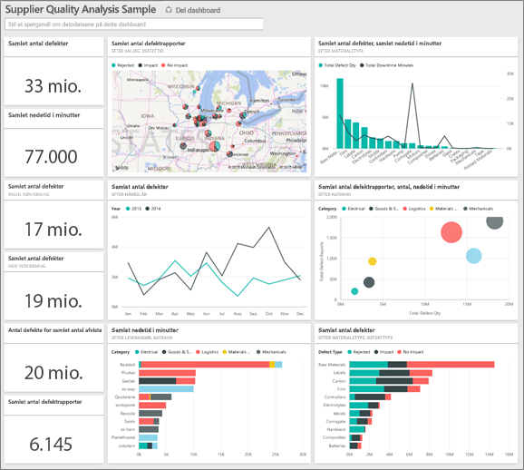

Dette eksempel er en del af en serie, der viser, hvordan du kan bruge Power BI med forretningsrelaterede data, rapporter og dashboards. Det blev oprettet af [obviEnce](http://www.obvience.com/) med rigtige data, som er blevet anonymiseret. Dataene er tilgængelige i flere formater: indholdspakke, .pbix-fil til Power BI Desktop eller Excel-projektmappe. Se [Eksempler til Power BI](sample-datasets.md). 

I dette selvstudium udforskes indholdspakken med eksemplet på analyse af leverandørkvalitet i Power BI-tjenesten. Da rapportoplevelsen i Power BI Desktop og i tjenesten minder meget om hinanden, kan du også følge med ved at bruge .pbix-eksempelfilen i Power BI Desktop. 

Du behøver ikke en Power BI-licens for at udforske eksemplerne i Power BI Desktop. Hvis du ikke har en Power BI Pro-licens, kan du gemme eksemplet i Mit arbejdsområde i Power BI-tjenesten. 

## Hent eksemplet

Før du kan bruge eksemplet, skal du først downloade det som en [indholdspakke](#get-the-content-pack-for-this-sample), [.pbix-fil](#get-the-pbix-file-for-this-sample) eller [Excel-projektmappe](#get-the-excel-workbook-for-this-sample).

### Hent indholdspakken for dette eksempel

1. Åbn Power BI-tjenesten (app.powerbi.com), log på, og åbn det arbejdsområde, hvor du vil gemme eksemplet.

   Hvis du ikke har en Power BI Pro-licens, kan du gemme eksemplet i Mit arbejdsområde.

2. Vælg **Hent data** i nederste venstre hjørne.
   
   
3. På siden **Hent data**, der vises, skal du vælge **Eksempler**.
   
4. Vælg **Eksempel på analyse af leverandørkvalitet**, og vælg derefter **Opret forbindelse**.  
   
   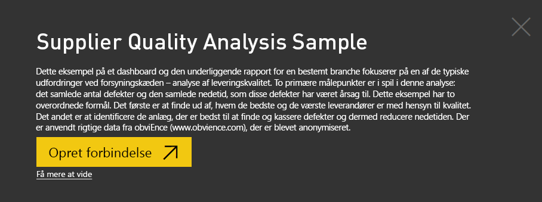

5. Power BI importerer indholdspakken og føjer derefter et nyt dashboard, en ny rapport og et nyt datasæt til dit aktuelle arbejdsområde.
   
   
  
### Hent .pbix-filen knyttet til dette eksempel

Du kan også hente eksemplet på analyse af leverandørkvalitet som en [PBIX-fil](https://download.microsoft.com/download/8/C/6/8C661638-C102-4C04-992E-9EA56A5D319B/Supplier-Quality-Analysis-Sample-PBIX.pbix), som er beregnet til brug sammen med Power BI Desktop.

### Hent Excel-projektmappen for dette eksempel

Hvis du vil have vist datakilden for dette eksempel, er den også tilgængelig som en [Excel-projektmappe](https://go.microsoft.com/fwlink/?LinkId=529779). Projektmappen indeholder Power View-ark, som du kan få vist og redigere. Hvis du vil se rådataene, skal du aktivere tilføjelsesprogrammerne Dataanalyse og derefter vælge **Power Pivot > Administrer**. Hvis du vil aktivere tilføjelsesprogrammerne Power View og Power Pivot, kan du finde flere oplysninger under [Udforsk Excel-eksemplerne i Excel](sample-datasets.md#explore-excel-samples-inside-excel).

## Nedetid på grund af defekte materialer
Lad os analysere den nedetid, der skyldes defekte materialer, og se, hvilke forhandlere der er ansvarlige.  

1. På dashboardet skal du vælge **Antal defekter i alt** eller **Nedetid i minutter i alt**.

     

   Rapporten Eksempel på analyse af leverandørkvalitet åbner siden **Analyse af nedetid**.

   Bemærk, at vi har 33.000.000 defekte dele, der tilsammen forårsager en nedetid på 77.000 minutter. Selvom nogle materialer har færre defekte dele, kan de give forsinkelser, hvilket medfører en længere nedetid. Lad os se nærmere på dem på siden med rapporter.  
2. Hvis vi ser på linjen **Nedetid i minutter i alt** i kombinationsdiagrammet **Defekter og nedetid (min.) efter materialetype** kan vi se, at korrugerede materialer forårsager mest nedetid.  
3. Vælg kolonnen **Korrugeret** for at få vist, hvilke anlæg der påvirkes mest af denne defekt, og hvilken leverandør der er ansvarlig.  

     
4. På kortet **Nedetid (min.) efter anlæg** skal du vælge de individuelle anlæg på kortet for at se, hvilken forhandler eller hvilket materiale der er ansvarligt for nedetid på det pågældende anlæg.

### Hvem er de værste forhandlere?
 Vi vil gerne finde de otte værste forhandlere og finde ud af, hvilken procentdel af nedetiden de er ansvarlige for. Det kan vi gøre ved at ændre områdediagrammet **Nedetid (min.) efter forhandler** til en træstruktur.  

1. På siden **Analyse af nedetid** i rapporten skal du vælge **Rediger rapport** i øverste venstre hjørne.  
2. Vælg områdediagrammet **Nedetid (min.) efter leverandør**, og vælg **Træstruktur** i ruden **Visualiseringer**.  

   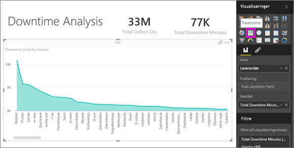  

    Træstrukturen angiver automatisk feltet **Leverandør** til **Gruppe**.  

    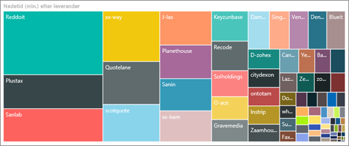  

   I træstrukturen kan vi se de otte første leverandører som otte blokke til venstre. Vi kan også se, at de står for 50 % af alle minutterne i nedetiden.  
3. Vælg **Eksempel på analyse af leverandørkvalitet** i den øverste navigationsrude for at vende tilbage til dashboardet.

### Sammenligning af anlæg
Nu vil vi se nærmere på, hvilke anlæg der er bedst til administration af defekte materialer, hvilket resulterer i mindre nedetid.  

1. Vælg kortfeltet **Rapporter med defekter i alt efter anlæg, defekttype** i dashboardet.      

   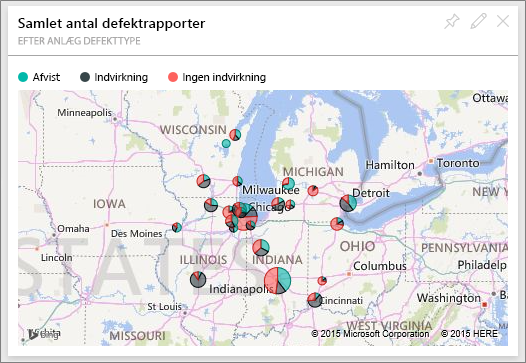  

   Rapporten åbner siden **Analyse af leverandørkvalitet**.  

2. I forklaringen til **Rapporter med defekter i alt efter anlæg og defekttype** skal du vælge cirklen **Indvirkning**.  

      

    Læg mærke til, at **Logistik** er den mest problematiske kategori i boblediagrammet. Det er den største kategori i forhold til det samlede antal defekter, defektrapporter og nedetid i minutter. Lad os se nærmere på denne kategori.  
3. Vælg boblen **Logistik** i boblediagrammet, og læg mærke til anlæggene i Springfield, IL og Naperville, IL. Naperville ser ud til at klare sig meget bedre inden for administration af defekte leveringer, fordi den har et højt antal kasseringer og få indvirkninger, sammenlignet med Springfield's høje antal indvirkninger.  

   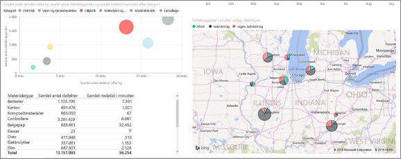  
4. Vælg **Eksempel på analyse af leverandørkvalitet** i den øverste navigationsrude for at vende tilbage til dashboardet.

## Hvilken materialetype er bedst administreret?
Den bedst administrerede materialetype er den med den korteste nedetid eller ingen indvirkning, uanset antallet af defekter.

1. Se på feltet **Antal defekter i alt efter materialetype, defekttype** på dashboardet.

   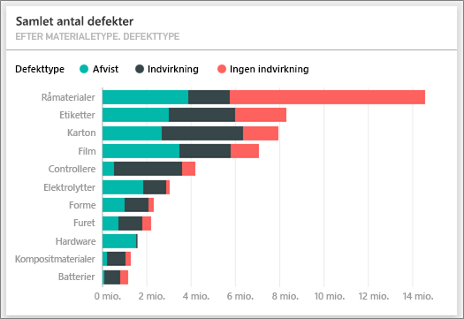

   Bemærk, at materialetypen **Råmaterialer** har et højt antal defekter i alt, men at de fleste af defekterne enten afvises eller ingen indvirkning har.

   Lad os bekræfte, at denne materialetype ikke medfører en masse nedetid trods det høje antal defekter.

2. Se på feltet **Antal defekter i alt , samlet nedetid i minutter efter materialetype** på dashboardet.

   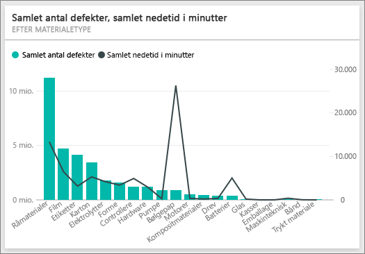

   Tilsyneladende administreres råmaterialer godt: Selvom de har flere defekter, har de en kortere nedetid i minutter.

### Sammenlign defekter i forhold til nedetid efter år
1. Vælg kortfeltet **Rapporter med defekter i alt efter anlæg, defekttype** for at åbne rapporten til den første **Analyse af leverandørkvalitet**.
2. I diagrammet **Samlet antal defekter efter måned og år** skal du lægge mærke til, at antallet af defekter er højere i 2014 end i 2013.  

      
3. Betyder flere defekter mere nedetid? Vi kan stille spørgsmål i Spørgsmål og svar for at finde ud af det.  
4. Vælg **Eksempel på analyse af leverandørkvalitet** i den øverste navigationsrude for at vende tilbage til dashboardet.  
5. Da vi ved, at råmaterialer har det højeste antal defekter, kan du skrive *Vis materialetyper, år og samlet antal defekter* i spørgsmålsfeltet.  

    Der var mange flere defekte råmaterialer i 2014 end i 2013.  

      
6. Nu skal du ændre spørgsmålet til _Vis materialetyper, år og samlet **nedetid i minutter**_ .  

   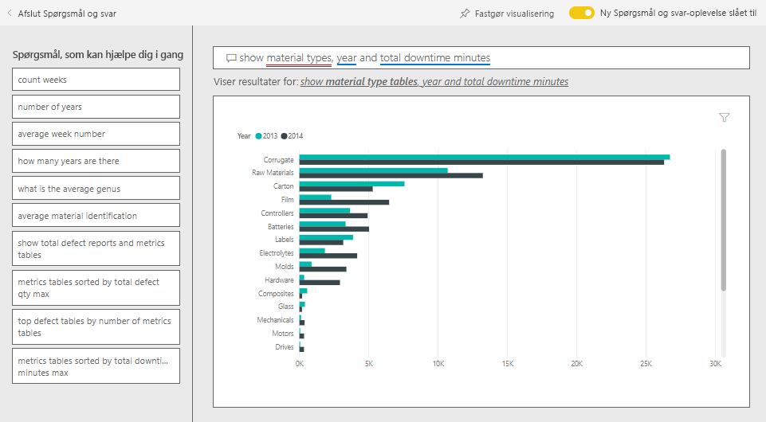

   Bemærk, at nedetiden pga. råmaterialer var cirka den samme i 2013 og 2014, selvom der var mange flere defekte råmaterialer i 2014. Det ser ud til, at flere defekter i forbindelse med råmaterialer i 2014 ikke har ført til meget mere nedetid for råmaterialer i 2014.

### Sammenlign defekter i forhold til nedetid måned efter måned
Lad os se på et andet dashboardfelt, der har relation til det samlede antal defekte materialer.  

1. Vælg **Afslut spørgsmål og svar** i øverste venstre hjørne for at vende tilbage til dashboardet.  

    Se nærmere på feltet **Samlet antal defekter efter måned, år**. Det viser, at det første halvår af 2014 næsten havde det samme antal defekter som i 2013, men i andet halvår af 2014 steg antallet af defekter væsentligt.  

    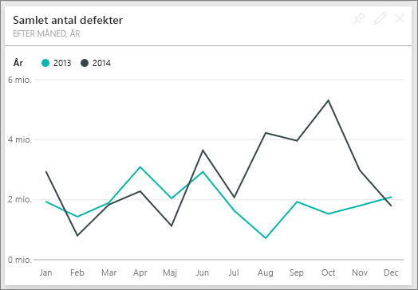  

    Lad os se, om denne forøgelse i antallet af defekter førte til en lignende forøgelse af nedetiden i minutter.  
2. Skriv *samlet nedetid i minutter efter måned og år som et kurvediagram* i feltet til spørgsmål.  

   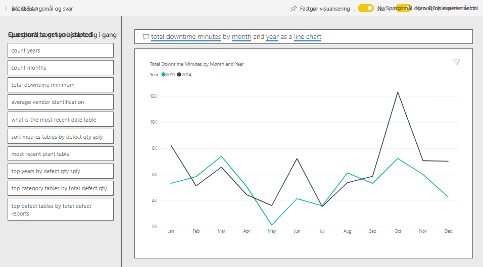

   Vi kan se et spring i nedetiden i minutter i juni og oktober, men derudover resulterede antallet af defekter ikke i væsentlig længere nedetid. Det viser, at vi administrerer defekter korrekt.  
3. Hvis du vil fastgøre diagrammet til dit dashboard, skal du vælge tegnestiftikonet  over feltet med spørgsmål.  
4. For at se nærmere på de afvigende måneder kan du f.eks. se på nedetiden i minutter i oktober efter materialetype, anlæggets placering, kategori osv. og stille spørgsmål som f.eks. *samlet nedetid i minutter i oktober efter anlæg*. 
5. Vælg **Afslut spørgsmål og svar** i øverste venstre hjørne for at vende tilbage til dashboardet.

## Næste trin: Opret forbindelse til dine data
Det er sikkert at eksperimentere i dette miljø, fordi du kan vælge ikke at gemme dine ændringer. Hvis du gemmer dem, kan du altid vælge **Hent data** for at få en ny kopi af dette eksempel.

Vi håber, at denne rundtur har vist, hvordan Power BI-dashboards, spørgsmål og svar samt rapporter kan give indsigt i eksempeldata. Nu er det din tur: Opret forbindelse til dine egne data. Med Power BI kan du oprette forbindelse til en lang række datakilder. Få mere at vide ved at se [Introduktion til Power BI-tjenesten](../fundamentals/service-get-started.md).
