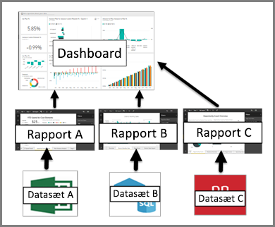

# Introduktion til dashboards for Power BI-designere

Et *dashboard* i Power BI er en enkelt side, der ofte kaldes et lærred, som fortæller en historie via visualiseringer. Da det er begrænset til én side, indeholder et dashboard, der er godt designet, kun de vigtigste elementer fra historien. Læsere kan få vist relaterede rapporter med detaljerne.

Et dashboard er kun en funktion i Power BI-tjenesten. De er ikke tilgængelige i Power BI Desktop. Selvom du ikke kan oprette dashboards på mobilenheder, kan du [få vist og dele](../consumer/mobile/mobile-apps-view-dashboard.md) dem der.

## Grundlæggende om dashboards 

De visualiseringer, du kan se på dashboardet, kaldes *felter*. Du *fastgør* felter til et dashboard via rapporter. Hvis du ikke har arbejdet med Power BI før, kan du få et godt overblik ved at læse [Grundlæggende begreber for designere i Power BI-tjenesten](../fundamentals/service-basic-concepts.md).

Visualiseringerne på et dashboard stammer fra rapporter, og alle rapporter er baseret på et datasæt. Du kan f.eks. se et dashboard som en måde at få adgang til de underliggende rapporter og datasæt på. Når du vælger en visualisering, bliver du ført til den pågældende rapport (og det pågældende datasæt), som er brugt til oprettelsen af visualiseringen.

## Fordele ved dashboards
Dashboards er en fantastisk måde at holde øje med din virksomhed på og hurtigt få et overblik over de vigtigste data. Visualiseringer på et dashboard kan stamme fra ét underliggende datasæt eller mange og fra én underliggende rapport eller mange. Et dashboard kombinerer data fra det lokale miljø og cloudmiljøet, hvilket giver dig en samlet visning, uanset hvor dataene er gemt.

Et dashboard er ikke kun et flot billede. Det er yderst interaktivt, og felterne opdateres, når de underliggende data ændres.

## Hvem kan oprette et dashboard?
Muligheden for at oprette et dashboard anses som en *opretterfunktion*  og kræver redigeringsrettigheder til rapporten. Redigeringstilladelser er tilgængelige for rapportoprettere og de kolleger, opretteren giver adgang til. Hvis David f.eks. opretter en rapport i arbejdsområde ABC og tilføjer dig som medlem af dette arbejdsområde, har både du og David redigeringsrettigheder. På den anden side, hvis en rapport er blevet delt med dig direkte eller som en del af en [Power BI-app](../collaborate-share/service-create-distribute-apps.md), så *bruger* du rapporten. Du kan muligvis ikke fastgøre felter til et dashboard. 

> [!IMPORTANT]
> Du skal have en [Power BI Pro](../fundamentals/service-features-license-type.md)-licens for at oprette dashboards i arbejdsområder. Du kan oprette dashboards i dit eget Mit arbejdsområde uden en Power BI Pro-licens.

## Dashboards sammenlignet med rapporter
[Rapporter](../consumer/end-user-reports.md) og dashboards virker ens, da de begge er lærreder fyldt med visualiseringer. Men der er store forskelle, som du kan se i følgende tabel.

| **Egenskab** | **Dashboards** | **Rapporter** |
| --- | --- | --- |
| Sider |Én side |Én eller flere sider |
| Datakilder |Én eller flere rapporter og et eller flere datasæt pr. dashboard |Et enkelt datasæt pr. rapport |
| Tilgængelig i Power BI Desktop |Nej | Ja. Kan udarbejde og få vist rapporter i Power BI Desktop |
| Abonner |Ja. Der kan abonneres på et dashboard |Ja. Muligt at abonnere på en rapportside |
| Filtrering |Nej. Der kan ikke filtreres eller laves udsnit |Ja. Der er mange forskellige måder at filtrere, fremhæve og lave udsnit på |
| Fremhævet |Ja. Muligt at angive ét dashboard som dit *udvalgte* dashboard |Nej |
| Favorit | Ja. Muligt at vælge flere dashboards som *favoritter* | Ja. Muligt at vælge flere rapporter som *favoritter*
| Angivelse af beskeder |Ja. Tilgængelig for dashboardfelter i visse tilfælde |Nej |
| Forespørgsler på et naturligt sprog (Spørgsmål og svar) |Ja | Ja, hvis du har tilladelse til at redigere rapporten og det underliggende datasæt |
| Kan underliggende datasættabeller og felter ses? |Nej. Data kan eksporteres, men tabeller og felter på selve dashboardet kan ikke ses |Ja |

## Næste trin
* Bliv fortrolig med dashboards ved at se præsentationen af et af vores [eksempler på et dashboard](sample-tutorial-connect-to-the-samples.md).
* Få mere at vide om [dashboardfelter](service-dashboard-tiles.md).
* Vil du holde øje med et enkelt dashboardfelt og modtage en mail, når den når en bestemt grænse? [Opret en besked på et felt](service-set-data-alerts.md).
* Få mere at vide om, hvordan du bruger [Spørgsmål og svar i Power BI](power-bi-tutorial-q-and-a.md) til at stille et spørgsmål om dine data og få svar i form af en visualisering.
