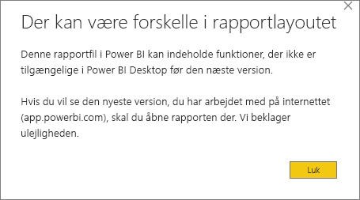
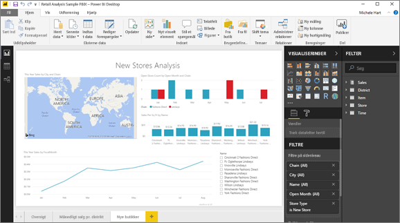

# Download en rapport fra Power BI-tjenesten til Power BI Desktop (prøveversion)
      
I Power BI Desktop kan du publicere en rapport (en *.pbix*-fil) fra din lokale computer til Power BI-tjenesten. Power BI-rapporter kan også gå i den modsatte retning: Du kan downloade en rapport fra Power BI-tjenesten til Power BI Desktop. Filtypenavnet for en Power BI-rapport er i begge tilfælde .pbix.

Der er et par begrænsninger og overvejelser, du skal være opmærksom på, som behandles i afsnittet [Overvejelser og fejlfinding](#considerations-and-troubleshooting) i denne artikel.

## Download rapporten som en .pbix-fil

Du kan kun downloade rapporter, [der er oprettet med Power BI Desktop](/learn/modules/publish-share-power-bi/2-publish-reports) efter den 23. november 2016 og opdateret siden da. Hvis den var oprettet før da, er menuindstillingen **Download rapport** nedtonet i Power BI-tjenesten.

Følg disse trin for at downloade .pbix-filen:

1. Åbn den rapport, du vil downloade, i [Redigeringsvisning](https://docs.microsoft.com/power-bi/service-interact-with-a-report-in-editing-view) i Power BI-tjenesten.

2. Vælg **Filer > Download rapport** i den øverste navigationsrude.
   
3. Mens rapporten downloades, vises statussen på et statusbanner. Når filen er klar, bliver du spurgt, hvor du vil gemme .pbix-filen. Standardnavnet på filen matcher titlen på rapporten.
   
4. Hvis du ikke allerede har gjort det, så skal du [installere Power BI Desktop](../fundamentals/desktop-get-the-desktop.md) og derefter åbne .pbix-filen i Power BI Desktop.
   
    Når du åbner rapporten i Power BI Desktop, vises der muligvis en advarsel om, at visse funktioner, der er tilgængelige i rapporten i Power BI-tjenesten, muligvis ikke er tilgængelige i Power BI Desktop.
   
    

5. Rapporteditoren i Power BI Desktop og rapporteditoren i Power BI-tjenesten ligner hinanden.  
   
    

## Overvejelser og fejlfinding

Der er nogle få vigtige overvejelser og begrænsninger knyttet til download af en .pbix-fil fra Power BI-tjenesten.

* Hvis du vil downloade filen, skal du have adgang til at redigere rapporten.
* Rapporten skal være oprettet ved hjælp af Power BI Desktop og være *publiceret* i Power BI-tjenesten, eller .pbix-filen skal være *uploadet* til Power BI-tjenesten.
* Rapporter skal være publiceret eller opdateret efter 23. november 2016. Rapporter, der er publiceret tidligere, kan ikke downloades.
* Denne funktion fungerer ikke sammen med rapporter og indholdspakker, der oprindeligt er oprettet i Power BI-tjenesten.
* Du skal altid bruge den nyeste version af Power BI Desktop, når du åbner downloadede filer. Downloadede .pbix-filer åbnes muligvis ikke i versioner af Power BI Desktop, der ikke er de nyeste.
* Hvis administratoren har deaktiveret muligheden for at downloade data, er denne funktion ikke synlig i Power BI-tjenesten.
* Datasæt med trinvis opdatering kan ikke downloades til en .pbix-fil.
* Datasæt, der er aktiveret for [store modeller,](../admin/service-premium-large-models.md) kan ikke downloades til en. pbix-fil.
* Datasæt, der er ændret ved hjælp af [XMLA-slutpunkt](../admin/service-premium-connect-tools.md) kan ikke downloades til en. pbix-fil.
* Hvis du opretter en Power BI-rapport, der er baseret på et datasæt i ét arbejdsområde og publicerer den i et andet arbejdsområde, kan du og dine brugere ikke downloade den. Overførselsfunktionen understøttes i øjeblikket ikke i dette scenarie.

## Næste trin

Se videoen **Guy in a Cube** om denne funktion, den varer ét minut:

<iframe width="560" height="315" src="https://www.youtube.com/embed/ymWqU5jiUl0" frameborder="0" allowfullscreen></iframe>

Her er nogle flere artikler, der kan hjælpe dig med at lære at bruge Power BI-tjenesten:

* [Rapporter i Power BI](../consumer/end-user-reports.md)
* [Grundlæggende begreber for designere i Power BI-tjenesten](../fundamentals/service-basic-concepts.md)

Når du har installeret Power BI Desktop, kan du se følgende artikel for at få hjælp til at komme i gang hurtigt:

* [Introduktion til Power BI Desktop](../fundamentals/desktop-getting-started.md)

Har du flere spørgsmål? [Prøv at spørge Power BI-community'et](https://community.powerbi.com/).
