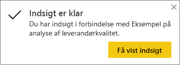
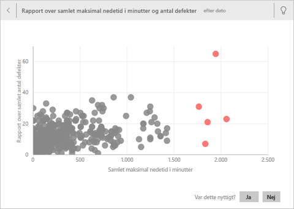
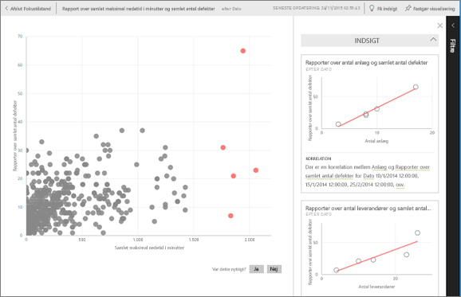

# Generér automatisk dataindsigt i dit datasæt med Power BI
Har du et nyt datasæt, og er du ikke sikker på, hvor du skal starte?  Har du brug for hurtigt at oprette et dashboard?  Vil du hurtigt søge efter indsigter, som du måske gik glip af?

Kør hurtig indsigt for at generere interessante visualiseringer, der er baseret på dine data. I denne artikel forklares det, hvordan du kan køre hurtig indsigt på et helt datasæt (hurtig indsigt). Du kan også køre [hurtig indsigt på et bestemt dashboardfelt](../consumer/end-user-insights.md) (begrænset indsigt). Du kan endda køre indsigter på en indsigt!

> [!NOTE]
> Insights fungerer ikke med DirectQuery. Det fungerer kun med data, der er uploadet til Power BI.
> 

Vi har bygget indsigtsfunktionen i et voksende [sæt avancerede analysealgoritmer](../consumer/end-user-insight-types.md), som vi udviklede med Microsoft Research. Vi bruger fortsat disse algoritmer til at hjælpe flere personer med at få indsigt i deres data på nye og intuitive måder. Du vil måske også være interesseret i at lære, hvordan du [optimerer dine data til hurtig indsigt](service-insights-optimize.md).

## Kør Quick Insights på et datasæt
Se, hvordan Amanda kører hurtig indsigt i et datasæt, og åbn en indsigt i fokustilstand. Amanda fastgør en indsigt som et felt på dashboardet og får derefter indsigt i et dashboardfelt.

<iframe width="560" height="315" src="https://www.youtube.com/embed/et_MLSL2sA8" frameborder="0" allowfullscreen></iframe>

Nu er det din tur. Udforsk Insights ved hjælp af [Eksempel på analyse af leverandørkvalitet](sample-supplier-quality.md).

1. På fanen **Datasæt** skal du vælge **Flere indstillinger** (...) og derefter vælge **Få hurtig indsigt**.
   
    
   
    
2. Power BI bruger [forskellige algoritmer](../consumer/end-user-insight-types.md) til at søge efter tendenser i dit datasæt.
   
    
3. Dine indsigter er klar på få sekunder.  Vælg **Vis indsigt** for at vise visualiseringer.
   
    
   
    > [!NOTE]
    > Nogle datasæt kan ikke generere indsigt, da dataene ikke er statistisk vigtige.  Hvis du vil vide mere, kan du se [Optimer dine data til indsigt](service-insights-optimize.md).
    > 
    
4. Visualiseringerne vises på et særligt **Hurtig indsigt**-lærred med op til 32 separate indsigtskort. Hvert kort har et diagram eller en graf samt en kort beskrivelse.
   
    

## Interager med indsigtskortene

1. Hold markøren over et kort, og vælg ikonet med tegnestiften for at føje visualiseringen til et dashboard.

2. Hold over et kort, vælg **Flere indstillinger** (...), og vælg derefter **Vis indsigt**. 

    Skærmbilledet Indsigt åbnes i fokustilstand.
   
    
3. I fokustilstand kan du:
   
   * Filtrér visualiseringerne. Hvis ruden **Filtre** ikke allerede er åben, skal du udvide den ved at vælge pilen i højre side af vinduet.

       
   * Fastgør indsigtskortet til et dashboard ved at vælge **Fastgør visuelt element**.
   * Kør indsigt på selve kortet, der ofte kaldes for *Områdebaseret indsigt*. Øverst til højre skal du vælge ikonet med elpæren  eller **Få indblik**.
     
       
     
     Indsigten vises til venstre. Nye kort, som udelukkende er baseret på dataene i den enkelte indsigt, vises til højre.
     
       
4. Vælg **Afslut Fokustilstand** øverst til venstre, hvis du vil vende tilbage til det oprindelige indsigtslærred.

## Næste trin
- Hvis du ejer et datasæt, [kan du optimere det til Hurtig indsigt](service-insights-optimize.md).
- Få mere at vide om de [tilgængelige typer Hurtig indsigt](../consumer/end-user-insight-types.md).

Har du flere spørgsmål? [Prøv at spørge Power BI-community'et](https://community.powerbi.com/).
