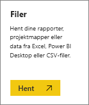
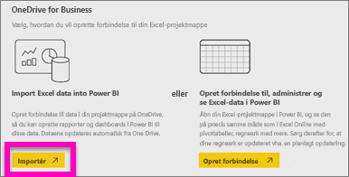
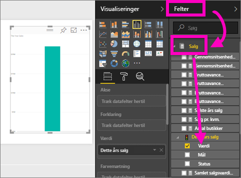
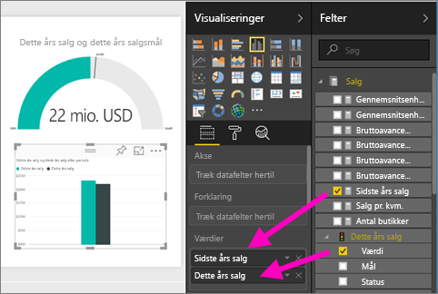

# Opret en rapport fra en Excel-fil i Power BI-tjenesten
Du har læst [Rapporter i Power BI](../consumer/end-user-reports.md), og nu vil du oprette din egen. Der er forskellige måder at oprette en rapport på. I denne artikel starter vi med at oprette en grundlæggende rapport i Power BI-tjenesten fra en Excel-fil. Når du har forstået de grundlæggende ting i forbindelse med at oprette en rapport, skal du se de [Næste trin](#next-steps) nederst for at se mere avancerede rapportemner.  

## Forudsætninger
- [Tilmeld dig Power BI-tjenesten](../fundamentals/service-self-service-signup-for-power-bi.md). 
- [Download Excel-filen med Retail Analysis-eksemplet](https://go.microsoft.com/fwlink/?LinkId=529778), og gem den på din computer eller i OneDrive for Business.

## Importér Excel-filen
Denne metode til oprettelse af en rapport starter med en fil og et tomt rapportlærred. Du kan følge med ved at se Excel-filen med Retail Analysis-eksemplet.

1. Vælg **Mit arbejdsområde** i navigationsruden.
   
   :::image type="content" source="media/service-report-create-new/power-bi-select-my-workspace.png" alt-text="Skærmbillede af valg af Mit arbejdsområde.":::
2. Vælg **Hent data** nederst i navigationsruden.
   
   
3. Vælg **Filer**, og naviger til den placering, hvor du har gemt Retail Analysis-eksemplet.
   
    
4. Til denne øvelse skal du vælge **Importér**.
   
   
5. Vælg **Åbn**.

   Når Excel-filen er importeret, angives den som et *datasæt* på listen i arbejdsområdet.

1. Vælg **Flere indstillinger (...)** ud for datasættet, og vælg **Opret rapport**.
   
   :::image type="content" source="media/service-report-create-new/power-bi-dataset-create-report.png" alt-text="Skærmbillede af valg af Opret rapport.":::
6. Rapporteditoren åbnes. 
   
   

> [!TIP]
> Vælg menuikonet for at skjule navigationsruden, så du får mere plads.
> 
> :::image type="content" source="../media/power-bi-hide-navigation-pane.png" alt-text="Skærmbillede af Vælg menuikonet for at skjule navigationsruden.":::

## Føj en radial måler til rapporten
Nu hvor vores datasæt er blevet importeret, så lad os komme i gang med at besvare nogle spørgsmål.  Vores marketingchef (CMO) vil vide, hvor tæt vi er på at nå dette års salgsmål. En måler er et [godt visualiseringsvalg](../visuals/power-bi-report-visualizations.md) til at vise denne type oplysninger.

1. I ruden Fields skal du vælge **Sales** > **This Year Sales** > **Værdi**.
   
    
2. Konvertér din visual til en måler ved at vælge skabelonen Gauge  i ruden **Visualiseringer**.
   
    
3. Træk **Sales** > **This Year Sales** > **Goal** til feltet **Target value**. Det ser ud til, at vi er meget tæt på vores mål.
   
    
4. Det er nu en god idé at gemme rapporten.
   
   

## Tilføj et områdediagram og et udsnit i rapporten
Vores marketingchef har nogle yderligere spørgsmål, vi skal besvare. Vedkommende vil gerne vide, hvordan salget i år er sammenlignet med sidste år. Og vedkommende vil gerne have vist resultaterne efter område.

1. Vi starter med at lave plads på vores lærred. Markér måleren, og flyt den til øverste højre hjørne. Træk derefter i hjørnerne for at gøre den mindre.
2. Fjern markeringen af måleren. I ruden Felter skal du vælge **Sales** > **This Year Sales** > **Value** og vælge **Sales** > **Last Year Sales**.
   
    
3. Konvertér din visualisering til et områdediagram ved at vælge skabelonen Area chart  i ruden **Visualiseringer**.
4. Vælg **Time** > **Period** for at føje den til feltet **Axis**.
   
    
5. Hvis du vil sortere visualiseringen efter tidsperiode, skal du vælge ellipsen og vælge **Sortér efter periode**.
6. Nu vil vi tilføje udsnittet. Markér et tomt område på lærredet, og vælg skabelonen Udsnit  . Vi har nu et tomt udsnit på vores lærred.
   
        
7. Vælg **District** > **District** i ruden Fields. Flyt og tilpas størrelsen af udsnitsværktøjet.
   
      
8. Brug udsnitsværktøjet til at søge efter mønstre og indsigt efter område (District).
   
     

Fortsæt med at udforske dine data og tilføje visualiseringer. Når du finder interessant viden, kan du [fastgøre den til et dashboard](service-dashboard-pin-tile-from-report.md).

## Næste trin

* [Fastgør visualiseringer til et dashboard](service-dashboard-pin-tile-from-report.md)
* [Skift rapportindstillinger i Power BI-tjenesten](power-bi-report-settings.md)
* Har du flere spørgsmål? [Prøv at spørge Power BI-community'et](https://community.powerbi.com/)
