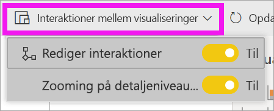
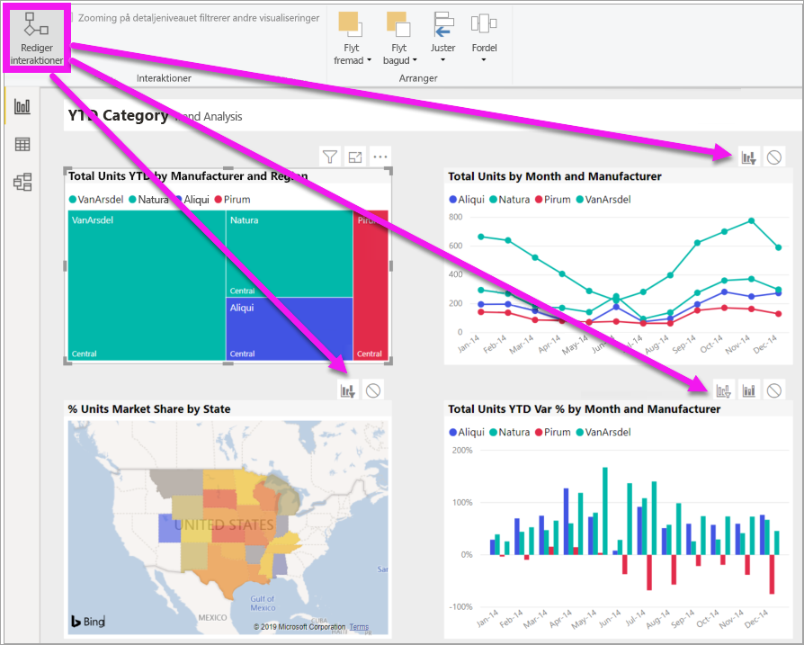
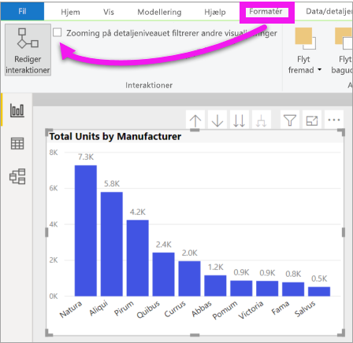

# Rediger, hvordan visualiseringer interagerer i en Power BI-rapport
Hvis du har redigeringsrettigheder til en rapport, kan du bruge **Visuelle interaktioner** til at ændre, hvor visualiseringer på en rapportside påvirker hinanden. 

## Introduktion til visualinteraktioner
Som standard kan visualiseringer på en rapportside bruges til tværgående filtrering og tværgående fremhævning af de andre visualiseringer på siden.
Hvis der for eksempel vælges en delstat på en kortvisualisering, fremhæves søjlediagrammet, og kurvediagrammet filtreres for kun at vise data, som gælder for denne ene delstat.
Se [Om filtrering og fremhævning](power-bi-reports-filters-and-highlighting.md). Og hvis du har visuelle effekter, der understøtter [detailudledning](../consumer/end-user-drill.md) som standard, har det ingen indvirkning på andre visualiseringer på rapportsiden, at du foretager detailudledning i én visualisering. Men begge disse standardfunktionsmåder kan tilsidesættes, og interaktioner indstilles for den enkelte visualisering.

Denne artikel viser, hvordan du kan bruge **visualinteraktioner** i Power BI Desktop. Processen er den samme i [redigeringsvisning](service-interact-with-a-report-in-editing-view.md) i Power BI-tjenesten. Hvis du kun har adgang til læsevisning, eller hvis rapporten er blevet delt med dig, kan du ikke ændre indstillingerne for visualinteraktioner.

Begreberne *tværgående filtrering* og *tværgående fremhævning* bruges til at skelne mellem den funktionsmåde, der er beskrevet her, og hvad der sker, når du bruger ruden **Filtre** til at *filtrere* og *fremhæve* visualiseringer.  

> [!NOTE]
> Denne video bruger ældre versioner af Power BI Desktop og Power BI-tjenesten. 
>
>

<iframe width="560" height="315" src="https://www.youtube.com/embed/N_xYsCbyHPw?list=PL1N57mwBHtN0JFoKSR0n-tBkUJHeMP2cP" frameborder="0" allowfullscreen></iframe>

## Aktivér kontrolelementerne for visualinteraktion
Hvis du har redigeringsrettigheder til en rapport, kan du slå kontrolelementer for visualinteraktion til og derefter tilpasse, hvordan visualiseringerne på din rapportside filtrerer og fremhæver hinanden. 

1. Vælg en visualisering for at aktivere den.  
2. Vis indstillingerne for **visuelle interaktioner**.
    

    - Vælg **Format > Interaktioner** under Desktop.

        

    - Åbn rapporten i redigeringsvisning i Power BI-tjenesten, og vælg rullelisten på rapportmenulinjen.

        

3. Hvis du vil have viste interaktionskontrolelementerne for visualisering, skal du vælge **Rediger interaktioner**. I Power BI føjes der filter- og fremhævningsikoner til alle de andre visualiseringer på rapportsiden. Vi kan se, at træstrukturen krydsfiltrerer kurvediagrammet og kortet og krydsfremhæver søjlediagrammet. Du kan nu ændre, hvordan den valgte visualisering interagerer med de andre visualiseringer på rapportsiden.
   
    

## Skift funktionsmåden for interaktion
Bliv fortrolig med, hvordan dine visualiseringer interagerer, ved at vælge de enkelte visualiseringer på din rapport side, én ad gangen.  Vælg et datapunkt, en søjle eller en form, og se effekten på de andre visualiseringer. Hvis den funktionsmåde, du ser, ikke er det, du foretrækker, kan du ændre interaktionerne. Disse ændringer gemmes sammen med rapporten, så du og dine kunder får den samme oplevelse med visualinteraktionen.

Begynd med at vælge en visualisering for at aktivere den.  Bemærk, at alle andre visualiseringer på siden nu indeholder interaktionsikoner. Det fremhævede ikon er det, der anvendes. Find ud af, hvilken effekt den **valgte visualisering** skal have på de andre visualiseringer.  Og gentag eventuelt for alle andre visualiseringer på rapportsiden.

Hvis den valgte visualisering:
   
   * skal krydsfiltrere en af de andre visualiseringer på siden, skal du vælge ikonet **Filtrér** i øverste højre hjørne af den pågældende visualisering .
   * skal krydsfremhæve en af de andre visualiseringer på siden, skal du vælge ikonet **Fremhæv** .
   * ikke skal have nogen indvirkning på de andre visualiseringer på siden, skal du vælge ikonet **Ingen indvirkning** .

## Skift interaktionerne for visualiseringer med mulighed for detailudledning
[Der er mulighed for detailudledning i visse Power BI-visualiseringer](../consumer/end-user-drill.md). Når du foretager detailudledning af en visualisering, har den som standard ingen effekt på de andre visualiseringer på rapportsiden. Du kan dog ændre denne funktionsmåde. 

> [!TIP]
> Prøv selv at bruge [eksempel PBIX-filen Human Resources](https://download.microsoft.com/download/6/9/5/69503155-05A5-483E-829A-F7B5F3DD5D27/Human%20Resources%20Sample%20PBIX.pbix). Der er et søjlediagram med detailudledning under fanen **Nye ansættelser**.
>

1. Markér det pågældende visual for at aktivere det. 

2. Slå detailudledning til ved at vælge ikonet Detailudledning.

    

2. På menulinjen skal du vælge **Format** > **Detailudledning filtrerer andre visuals**.  Når du analyserer ned (og op) i en visualisering, ændres de andre visualiseringer på rapportsiden for at afspejle det aktuelle valg af detailudledning. 

    

3. Hvis den funktionsmåde, du ser, ikke er det, du foretrækker, kan du ændre interaktionerne [som beskrevet ovenfor](#change-the-interaction-behavior).

## Overvejelser og fejlfinding
Hvis du opretter en matrix med felter fra forskellige tabeller og derefter forsøger at krydsfremhæve ved at vælge flere elementer på forskellige niveauer i hierarkiet, får du vist fejl i de andre visualiseringer. 

    
## De næste trin
[Filtrering og fremhævning i Power BI-rapporter](power-bi-reports-filters-and-highlighting.md)