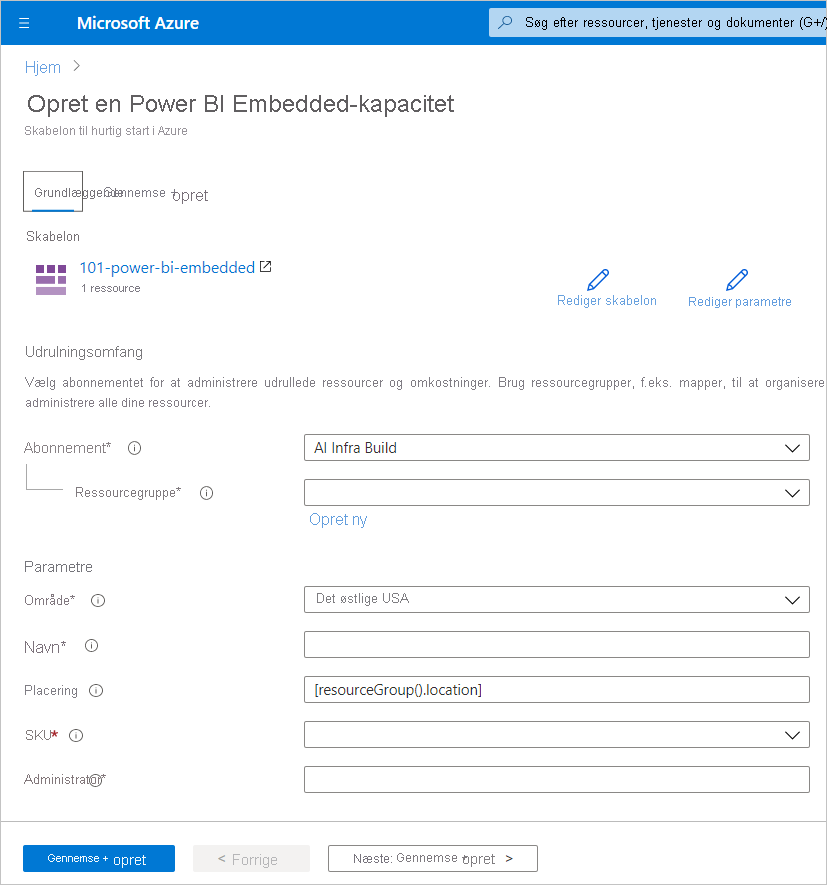
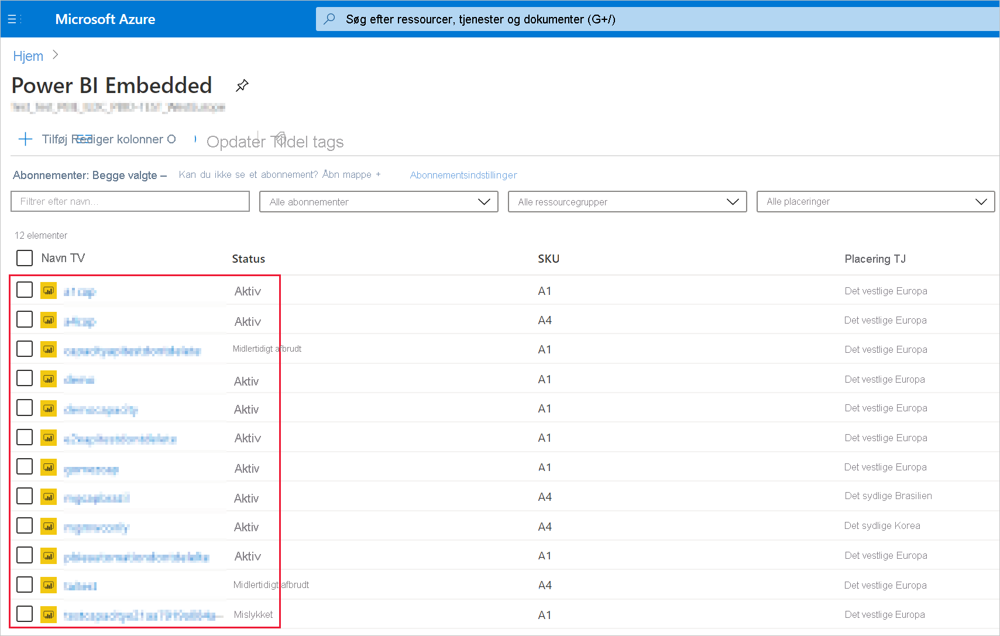

# <a name="create-power-bi-embedded-capacity-in-the-azure-portal"></a>Opret Power BI Embedded-kapacitet på Azure-portalen

Denne artikel indeholder en beskrivelse af, hvordan du opretter [Power BI Embedded](azure-pbie-what-is-power-bi-embedded.md)-kapacitet i Microsoft Azure. Power BI Embedded gør det nemmere for dig at bruge Power BI-funktionerne, så du hurtigt kan tilføje imponerende visualiseringer, rapporter og dashboards i dine apps.

## <a name="before-you-begin"></a>Inden du starter

For at følge denne hurtige start skal du have følgende:

* **Azure-abonnement:** Gå til [den gratis prøveversion af Azure](https://azure.microsoft.com/free/) for at oprette en konto.

* **Azure Active Directory:** Abonnementet skal være tilknyttet en AAD-lejer (Microsoft Azure Active Directory). Du skal desuden ***være logget på Azure med en konto i den lejer***. Microsoft-konti understøttes ikke. Du kan finde flere oplysninger under [Godkendelse og brugertilladelser](https://docs.microsoft.com/azure/analysis-services/analysis-services-manage-users).

* **Power BI-lejer:** Mindst én konto i din AAD-lejer skal være tilmeldt Power BI.

* **Ressourcegruppe:** Brug en eksisterende ressourcegruppe, eller [opret en ny](https://docs.microsoft.com/azure/azure-resource-manager/resource-group-overview).

## <a name="create-a-capacity"></a>Opret kapacitet

Før du opretter en Power BI Embedded-kapacitet, skal du sørge for, at du har logget på Power BI mindst én gang.

# <a name="portal"></a>[Portal](#tab/portal)

1. Log på [Azure-portalen](https://portal.azure.com/).

2. Søg efter *Power BI Embedded* i søgefeltet.

3. Vælg **Tilføj** i Power BI Embedded.

4. Angiv de påkrævede oplysninger, og klik derefter på **Gennemse + Opret**.

    

    * **Abonnement** – det abonnement, som kapaciteten skal oprettes for.

    * **Ressourcegruppe** – den ressourcegruppe, der indeholder den nye kapacitet. Vælg mellem en eksisterende ressourcegruppe, eller opret en anden. Du kan finde flere oplysninger under [Oversigt over Azure Resource Manager](https://docs.microsoft.com/azure/azure-resource-manager/resource-group-overview).

    * **Ressourcenavn** – ressourcenavnet på kapaciteten.

    * **Placering** – den placering, hvor Power BI hostes for din lejer. Din standardplacering er dit lokale område, men du kan ændre placeringen ved hjælp af [Multi-Geo-indstillinger](embedded-multi-geo.md).

    * **Størrelse** – det [A-varenummer](../../admin/service-admin-premium-purchase.md#purchase-a-skus-for-testing-and-other-scenarios), du har brug for. Du kan finde flere oplysninger under [Varenummerhukommelse og beregningskraft](/power-bi/developer/embedded/embedded-capacity).

    * **Power BI-kapacitetsadministrator** – en administrator for kapaciteten.
        >[!NOTE]
        >* Kapacitetsadministratoren er som standard den bruger, der opretter kapaciteten.
        >* Du kan vælge en anden bruger eller tjenesteprincipal som kapacitetsadministrator.
        >* Kapacitetsadministratoren skal tilhøre lejeren, hvor kapaciteten er klargjort. B2B-brugere (business to business) kan ikke være kapacitetsadministratorer.

# <a name="azure-cli"></a>[Azure-kommandolinjegrænseflade](#tab/CLI)

### <a name="use-azure-cloud-shell"></a>Brug Azure Cloud Shell

Azure hoster i Azure Cloud Shell, et interaktivt Shell-miljø, som du kan bruge via din browser. Du kan bruge enten Bash eller PowerShell sammen med Cloud Shell for at arbejde med Azure-tjenester. Du kan bruge forudinstallerede Cloud Shell-kommandoer til at køre koden i denne artikel uden at skulle installere noget i det lokale miljø.

Sådan starter du Azure Cloud Shell:

| Indstilling | Eksempel/link |
|-----------------------------------------------|---|
| Vælg **Prøv det** i øverste højre hjørne af en kodeblok. Hvis du vælger **Prøv det**, kopieres koden ikke automatisk til Cloud Shell. |  |
| Gå til [https://shell.azure.com](https://shell.azure.com), eller vælg knappen **Start Cloud Shell** for at åbne Cloud Shell i din browser. | [](https://shell.azure.com) |
| Vælg knappen **Cloud Shell** på menulinjen øverst til højre i [Azure Portal](https://portal.azure.com). |  |

Sådan kører du koden i denne artikel i Azure Cloud Shell:

1. Start Cloud Shell.

2. Vælg knappen **Kopiér** på en kodeblok for at kopiere koden.

3. Indsæt koden i Cloud Shell-sessionen ved at vælge **CTRL**+**Skift**+**V** på Windows og Linux eller vælge **Cmd**+**Skift**+**V** på macOS.

4. Vælg **Enter** for at køre koden.

## <a name="prepare-your-environment"></a>Forbered dit miljø

Power BI-integrerede kapacitetskommandoer kræver version 2.3.1 eller nyere af Azure-kommandolinjegrænsefladen. Kør `az --version` for at finde versionen og de afhængige biblioteker, der er installeret. Hvis du vil installere eller opgradere, skal du se [Installér Azure-kommandolinjegrænsefladen](/cli/azure/install-azure-cli).

1. Log på.

   Hvis du bruger en lokal installation af kommandolinjegrænsefladen, skal du logge på med kommandoen [AZ-logon](/cli/azure/reference-index#az-login).

    ```azurecli
    az login
    ```

    Følg de trin, der vises i din terminal, for at fuldføre godkendelsesprocessen.

2. Installér udvidelsen af Azure-kommandolinjegrænsefladen.

    Når du arbejder med udvidelsesreferencer til Azure-kommandolinjegrænsefladen, skal du først installere udvidelsen.  Udvidelser af Azure-kommandolinjegrænsefladen giver dig adgang til eksperimentelle og foreløbige kommandoer, der endnu ikke er udsendt som en del af kernekommandolinjegrænsefladen.  Hvis du vil vide mere om udvidelser, herunder opdatering og fjernelse, skal du se [Brug udvidelser med Azure-kommandolinjegrænsefladen](/cli/azure/azure-cli-extensions-overview).

    Installér udvidelsen til Power BI-integreret kapacitet ved at køre følgende kommando:

    ```azurecli
    az extension add --name powerbidedicated
    ```

### <a name="create-a-capacity-with-azure-cli"></a>Opret en kapacitet med Azure-kommandolinjegrænsefladen

Brug kommandoen [az Power BI embedded-capacity create](https://docs.microsoft.com/cli/azure/ext/powerbidedicated/powerbi/embedded-capacity?view=azure-cli-latest#ext-powerbidedicated-az-powerbi-embedded-capacity-create) for at oprette en kapacitet.

```azurecli
az powerbi embedded-capacity create --location westeurope
                                    --name
                                    --resource-group
                                    --sku-name "A1"
                                    --sku-tier "PBIE_Azure"
```

### <a name="delete-a-capacity-with-azure-cli"></a>Slet en kapacitet med Azure-kommandolinjegrænsefladen

Hvis du vil slette en kapacitet ved hjælp af Azure-kommandolinjegrænsefladen, skal du bruge kommandoen [az powerbi embedded-capacity delete](https://docs.microsoft.com/cli/azure/ext/powerbidedicated/powerbi/embedded-capacity?view=azure-cli-latest#ext-powerbidedicated-az-powerbi-embedded-capacity-delete).

```azurecli
az powerbi embedded-capacity delete --name
                                    --resource-group
```

### <a name="manage-your-capacity-with-azure-cli"></a>Administrer din kapacitet med Azure-kommandolinjegrænsefladen

Du kan få vist alle kommandoer i Power BI Embedded Azure-kommandolinjegrænsefladen i [az powerbi](https://docs.microsoft.com/cli/azure/ext/powerbidedicated/powerbi?view=azure-cli-latest).

# <a name="arm-template"></a>[ARM-skabelon](#tab/ARM-template)

### <a name="use-resource-manager-template"></a>Brug Resource Manager-skabelon

[Resource Manager-skabelonen](https://docs.microsoft.com/azure/azure-resource-manager/templates/overview) er en JavaScript Object Notation-fil (JSON), der definerer infrastrukturen og konfigurationen for dit projekt. Skabelonen bruger deklarativ syntaks, som gør det muligt for dig at angive, hvad du vil installere uden at skulle skrive hele sekvensen af programmeringskommandoer for at oprette den. Hvis du vil vide mere om, hvordan du udvikler Resource Manager-skabeloner, skal du se [Resource Manager-dokumentation](https://docs.microsoft.com/azure/azure-resource-manager/) og [-skabelonreference](https://docs.microsoft.com/azure/templates/).

Hvis du ikke har et Azure-abonnement, skal du oprette en [gratis konto](https://azure.microsoft.com/free/), før du begynder.

### <a name="review-the-template"></a>Gennemse skabelonen

Den skabelon, der anvendes i denne hurtigstart, er fra [Azure-skabeloner til hurtig start](https://azure.microsoft.com/resources/templates/101-power-bi-embedded).

```json
{
    "$schema": "https://schema.management.azure.com/schemas/2019-04-01/deploymentTemplate.json#",
    "contentVersion": "1.0.0.0",
    "parameters": {
        "name": {
            "type": "string",
            "metadata": {
              "description": "The capacity name, which is displayed in the Azure portal and the Power BI admin portal"
            }
        },
        "location": {
            "type": "string",
            "defaultValue": "[resourceGroup().location]",
            "metadata": {
              "description": "The location where Power BI is hosted for your tenant"
            }
        },
        "sku": {
            "type": "string",
            "allowedValues": [
                "A1",
                "A2",
                "A3",
                "A4",
                "A5",
                "A6"
            ],
            "metadata": {
              "description": "The pricing tier, which determines the v-core count and memory size for the capacity"
            }
        },
        "admin": {
            "type": "string",
            "metadata": {
              "description": "A user within your Power BI tenant, who will serve as an admin for this capacity"
            }
        }
    },
    "resources": [
        {
            "type": "Microsoft.PowerBIDedicated/capacities",
            "apiVersion": "2017-10-01",
            "name": "[parameters('name')]",
            "location": "[parameters('location')]",
            "sku": {
                "name": "[parameters('sku')]"
            },
            "properties": {
                "administration": {
                    "members": [
                        "[parameters('admin')]"
                    ]
                }
            }
        }
    ]
}
```

Én Azure-ressource er defineret i skabelonen, [Microsoft.PowerBIDedicated/capacities Az](https://docs.microsoft.com/azure/templates/microsoft.powerbidedicated/allversions) – Opret en Power BI Embedded-kapacitet.

### <a name="deploy-the-template"></a>Anvend skabelonen

1. Vælg følgende link for at logge på Azure og åbne en skabelon. Skabelonen opretter en Power BI Embedded-kapacitet.

    [](https://portal.azure.com/#create/Microsoft.Template/uri/https%3a%2f%2fraw.githubusercontent.com%2fAzure%2fazure-quickstart-templates%2fmaster%2f101-power-bi-embedded%2fazuredeploy.json)

2. Angiv de påkrævede oplysninger, og klik derefter på **Gennemse + Opret**.

    

    * **Abonnement** – det abonnement, som kapaciteten skal oprettes for.

    * **Ressourcegruppe** – den ressourcegruppe, der indeholder den nye kapacitet. Vælg mellem en eksisterende ressourcegruppe, eller opret en anden. Du kan finde flere oplysninger under [Oversigt over Azure Resource Manager](https://docs.microsoft.com/azure/azure-resource-manager/resource-group-overview).

    * **Område** – det område, som kapaciteten tilhører.

    * **Navn** – kapacitetsnavnet.

    * **Placering** – den placering, hvor Power BI hostes for din lejer. Din standardplacering er dit lokale område, men du kan ændre placeringen ved hjælp af [Multi-Geo-indstillinger](https://docs.microsoft.com/power-bi/developer/embedded/embedded-multi-geo
).

    * **Varenummer** – det [A-varenummer](../../admin/service-admin-premium-purchase.md#purchase-a-skus-for-testing-and-other-scenarios), du har brug for. Du kan finde flere oplysninger under [Varenummerhukommelse og beregningskraft](/power-bi/developer/embedded/embedded-capacity).

    * **Administrator** – en administrator for kapaciteten.
        >[!NOTE]
        >* Kapacitetsadministratoren er som standard den bruger, der opretter kapaciteten.
        >* Du kan vælge en anden bruger eller tjenesteprincipal som kapacitetsadministrator.
        >* Kapacitetsadministratoren skal tilhøre lejeren, hvor kapaciteten er klargjort. B2B-brugere (business to business) kan ikke være kapacitetsadministratorer.

### <a name="validate-the-deployment"></a>Godkend udrulningen

Gør følgende for at validere udrulningen:

1. Log på [Azure-portalen](https://portal.azure.com/).

2. Søg efter *Power BI Embedded* i søgefeltet.

3. Gennemse listen over Power BI Embedded-kapaciteter, og kontrollér, at den nye kapacitet, du har oprettet, er angivet.

    

### <a name="clean-up-resources"></a>Fjern ressourcer

Hvis du vil slette den kapacitet, du har oprettet, skal du følge disse trin:

1. Log på [Azure-portalen](https://portal.azure.com/).

2. Søg efter *Power BI Embedded* i søgefeltet.

3. Åbn genvejsmenuen for den kapacitet, du har oprettet, og klik på **Slet**.

    

4. Angiv navnet på kapaciteten på bekræftelsessiden, og klik på **Slet**.

    

---

## <a name="next-steps"></a>Næste trin

>[!div class="nextstepaction"]
>[Administrer kapaciteter](../../admin/service-admin-premium-manage.md)

>[!div class="nextstepaction"]
>[Stands og start din Power BI Embedded-kapacitet på Azure Portal](azure-pbie-pause-start.md)

>[!div class="nextstepaction"]
>[Integrer Power BI-indhold i en applikation for dine kunder](embed-sample-for-customers.md)

>[!div class="nextstepaction"]
>[Har du flere spørgsmål? Prøv at spørge Power BI-community'et](https://community.powerbi.com/)
