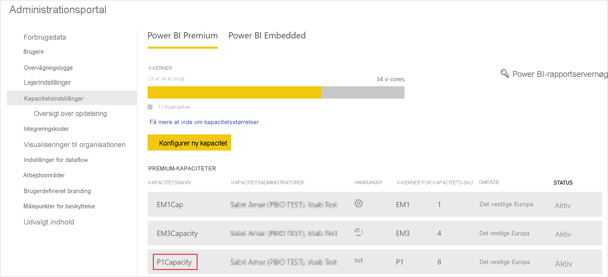
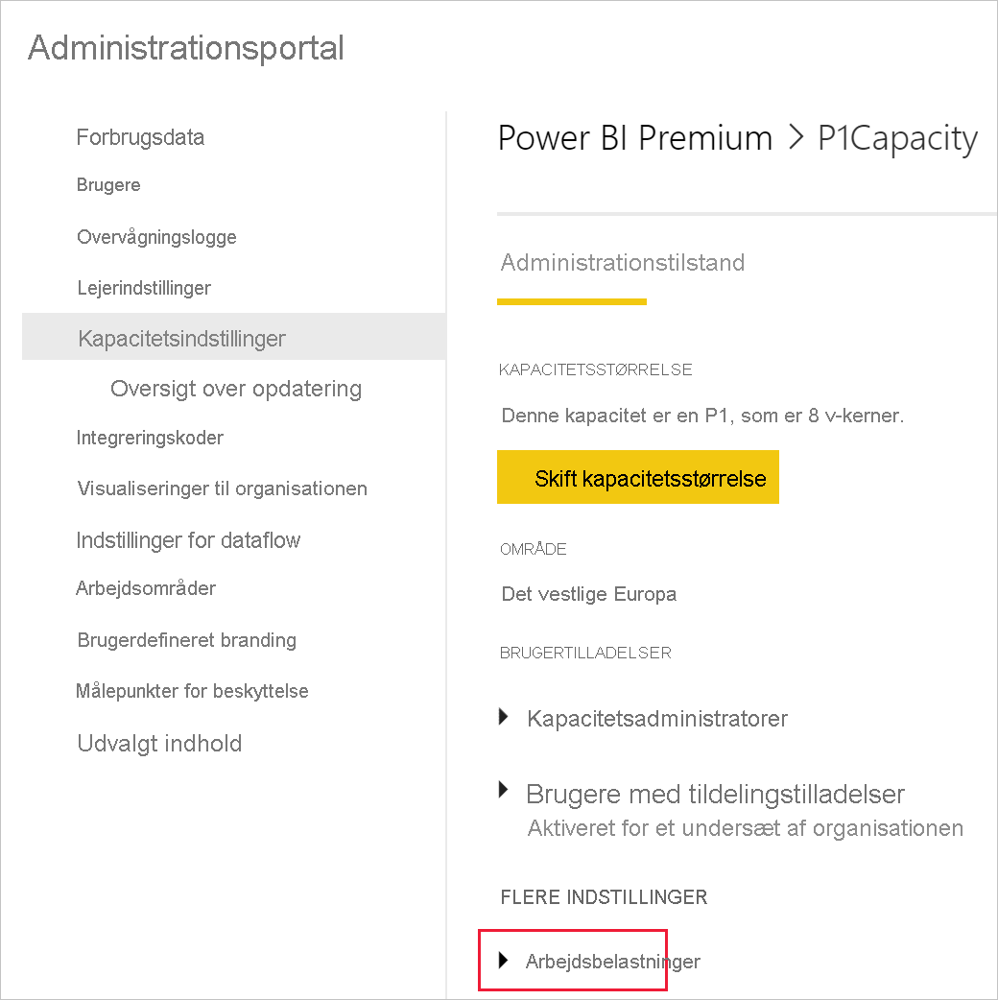
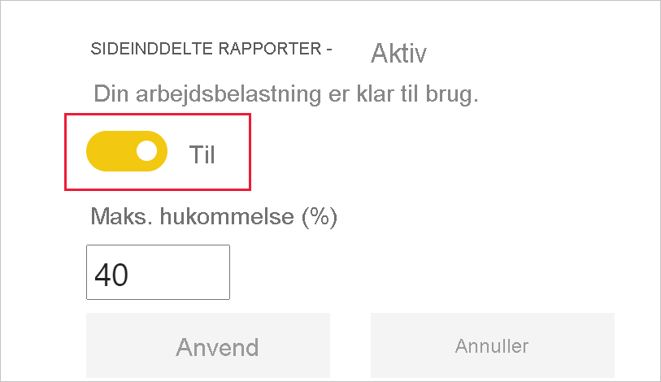
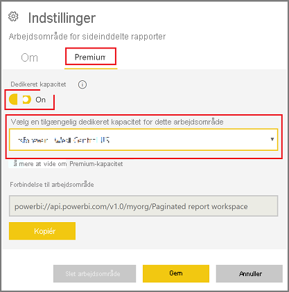
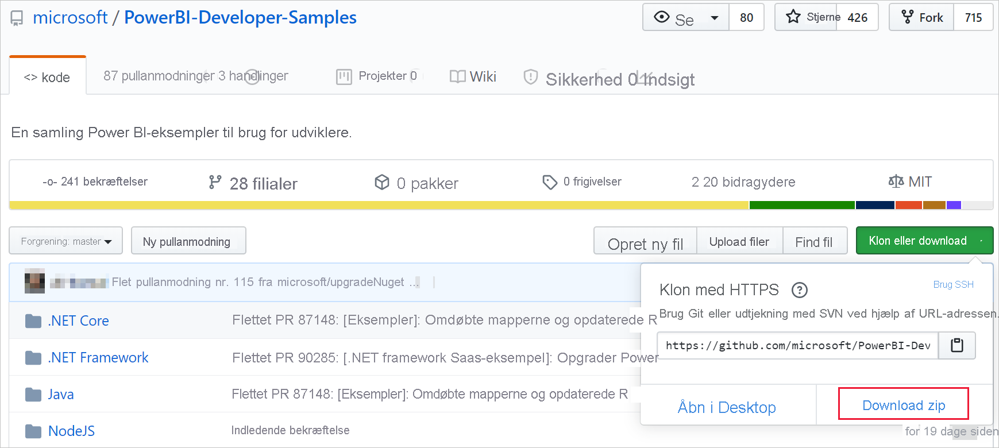

# <a name="tutorial-embed-power-bi-paginated-reports-into-an-application-for-your-organization"></a>Selvstudium: Integrer sideinddelte Power BI-rapporter i et program til din organisation

I **Power BI** kan du integrere sideinddelte rapporter i et program til din organisation ved hjælp af scenariet *brugeren ejer data*.

Sideinddelte rapporter er rapporter, der er udviklet til udskrivning i høj kvalitet. Disse rapporter indeholder normalt en masse data, der gengives på en måde, så de passer til sider, der udskrives.
Hvis du vil vide, hvordan Power BI understøtter sideinddelte rapporter, kan du se [Hvad er sideinddelte rapporter i Power BI Premium?](../../paginated-reports/paginated-reports-report-builder-power-bi.md)

Ved hjælp af funktionen **Brugeren ejer data** kan programmet udvide Power BI-tjenesten til at bruge integreret analyse. Dette selvstudium viser, hvordan du integrerer en sideinddelt rapport i et program.

Du kan bruge Power BI .NET SDK med Power BI JavaScript-API'en til at integrere Power BI i et program for din organisation.


I dette selvstudium får du at vide, hvordan du udfører følgende opgaver:
> [!div class="checklist"]
> * Registrere en app i Azure.
> * Integrer en sideinddelt Power BI-rapport i et program ved hjælp af din Power BI-lejer.

## <a name="prerequisites"></a>Forudsætninger
Du skal have følgende for at komme i gang:

* En [Power BI Pro-konto](../../admin/service-admin-purchasing-power-bi-pro.md).

* Du skal have din egen konfiguration af [Azure Active Directory-lejer](create-an-azure-active-directory-tenant.md).

* Som minimum en P1-kapacitet. Se [Hvilken størrelse Premium-kapacitet for sideinddelte rapporter skal jeg bruge?](../../paginated-reports/paginated-reports-faq.md#what-size-premium-capacity-do-i-need-for-paginated-reports)

Hvis du ikke er tilmeldt **Power BI Pro**, kan du [tilmelde dig en gratis prøveversion](https://powerbi.microsoft.com/pricing/), før du begynder.

>[!NOTE]
>[Premium pr. bruger](../../admin/service-premium-per-user-faq.md) understøttes. Men hvis du bruger Premium pr. bruger, er det kun brugere af Premium pr. bruger i din organisation, der har adgang til din løsning.

## <a name="set-up-your-power-bi-environment"></a>Konfigurer dit Power BI-miljø

Følg vejledningen i dette afsnit for at konfigurere Power BI til integrering af sideinddelte rapporter.

### <a name="register-a-server-side-web-application-app"></a>Registrer en app til et serverbaseret webprogram

Følg vejledningen i [Registrer et Microsoft Azure Active Directory-program, som skal bruges sammen med Power BI](register-app.md) for at registrere en app til et serverbaseret webprogram.

>[!NOTE]
>Når du registrerer appen, skal du sørge for at gøre følgende:
>* Hent programhemmeligheden
>* Anvend **Report.ReadAll**-tilladelser (område) på din app.

### <a name="create-a-capacity"></a>Opret kapacitet

Når du opretter en kapacitet, kan du drage fordel af at have en ressource for indholdet i dit apparbejdsområde. I forbindelse med sideinddelte rapporter skal du som minimum understøtte dit apparbejdsområde med en P1-kapacitet. Du kan oprette en kapacitet ved hjælp af [Power BI Premium ](../../admin/service-premium-what-is.md).

I følgende tabel vises Power BI Premium SKU'er, der kan bruges til at oprette en kapacitet til sideinddelte rapporter i [Microsoft Office 365](../../admin/service-admin-premium-purchase.md):

| Kapacitetsnode | Samlet antal vCores<br/>(back-end + front-end) | Back end-vCores | Front-end-vCores | Grænser for DirectQuery/liveforbindelser |
| --- | --- | --- | --- | --- | --- |
| P1 |8 vCores |4 vCores, 25 GB RAM |4 vCores |30 pr. sekund |
| P2 |16 vCores |8 vCores, 50 GB RAM |8 vCores |60 pr. sekund |
| P3 |32 vCores |16 vCores, 100 GB RAM |16 vCores |120 pr. sekund |
| P4 |64 vCores |32 vCores, 200 GB RAM |32 vCores |240 pr. sekund |
| P5 |128 vCores |64 vCores, 400 GB RAM |64 vCores |480 pr. sekund |
|||||

### <a name="enable-paginated-reports-workload"></a>Aktivér arbejdsbelastning for sideinddelte rapporter

Du skal aktivere arbejdsbelastningen for sideinddelte rapporter på din kapacitet.

1. Log på [Power BI > Administrationsportal > Kapacitetsindstillinger](https://app.powerbi.com/admin-portal/capacities).

2. Vælg kapacitet med det arbejdsområde, du vil overføre den sideinddelte rapport til.

    

3. Udvid **Arbejdsbelastninger**.

    

4. Aktivér arbejdsbelastningen for sideinddelte rapporter.

    

### <a name="assign-an-app-workspace-to-a-capacity"></a>Tildel et apparbejdsområde til en kapacitet

Når du har oprettet en kapacitet, kan du tildele dit apparbejdsområde til kapaciteten. Gennemgå følgende trin for at udføre denne handling:

1. Udvide arbejdsområder i Power BI-tjenesten, og vælge **Mere** for det arbejdsområde, du bruger til integrering af dit indhold. Vælg derefter **Indstillinger for arbejdsområde**.

    

2. Vælg **Premium**, og aktivér **Kapacitet**. Vælg den kapacitet, du har oprettet. Vælg derefter **Gem**.

    

3. Når du har valgt **Gem**, kan du se en rombe ud for navnet på apparbejdsområdet.

    

### <a name="create-and-publish-your-power-bi-paginated-reports"></a>Opret og publicer dine sideinddelte Power BI-rapporter

Du kan oprette dine sideinddelte rapporter ved hjælp af [Power BI Report Builder](../../paginated-reports/paginated-reports-report-builder-power-bi.md#create-reports-in-power-bi-report-builder). Derefter kan du [uploade rapporten](../../paginated-reports/paginated-reports-quickstart-aw.md#upload-the-report-to-the-service) til et apparbejdsområde, der som minimum er tildelt til en P1-kapacitet, og slå [arbejdsbelastningen for sideinddelte rapporter](#enable-paginated-reports-workload) til. Den slutbruger, der uploader rapporten, skal have en Power BI Pro-licens for at kunne udgive til et apparbejdsområde.
   
## <a name="embed-your-content-by-using-the-sample-application"></a>Integrer dit indhold ved hjælp af eksempelprogrammet

Dette eksempel er med vilje enkelt, da det kun skal bruges til demonstrationen.

Følg nedenstående trin for at begynde at integrere indhold ved hjælp af eksempelprogrammet.

1. Download [Visual Studio](https://www.visualstudio.com/) (version 2013 eller nyere). Sørg for at downloade den nyeste [NuGet-pakke](https://www.nuget.org/profiles/powerbi).

2. Hent [PowerBI-Developer-Samples](https://github.com/Microsoft/PowerBI-Developer-Samples), og åbn .NET Framework > Embed for your organization > integrate-web-app > **PBIWebApp**.

    

3. Åbn filen **Cloud. config** i eksempelprogrammet, og udfyld følgende felter for at køre dit program:
    * [Program-id](#application-id)
    * [Arbejdsområde-id](#workspace-id)
    * [Rapport-id](#report-id)
    * [AADAuthorityUrl](#aadauthorityurl)

    

### <a name="application-id"></a>Program-id

Udfyld oplysningerne om **applicationId** med **program-id'et** fra **Azure**. **Program-id'et** bruges af programmet til at identificere sig selv over for de brugere, du anmoder om tilladelser fra.

Hvis du vil hente **applicationId**, skal du følge disse trin:

1. Log på [Azure-portalen](https://portal.azure.com).

2. Vælg **Alle tjenester** i navigationsruden til venstre, og vælg **Appregistreringer**.

3. Vælg programmet, der skal bruge **applicationId**.

    

4. Der er angivet et **program-id** som GUID. Brug dette **Program-id** som **applicationId** for programmet.

    

### <a name="workspace-id"></a>Id for arbejdsområde

Udfyld oplysningerne for **workspaceId** med GUID for programarbejdsområdet fra Power BI. Du kan få disse oplysninger enten fra URL-adressen, når du er logget på Power BI-tjenesten, eller ved hjælp af PowerShell.

URL-adresse <br>


PowerShell <br>

```powershell
Get-PowerBIworkspace -name "User Owns Embed Test"
```

   

### <a name="report-id"></a>Rapport-id

Udfyld **reportId** med GUID for rapporten fra Power BI. Du kan få disse oplysninger enten fra URL-adressen, når du er logget på Power BI-tjenesten, eller ved hjælp af PowerShell.


PowerShell <br>

```powershell
Get-PowerBIworkspace -name "User Owns Embed Test" | Get-PowerBIReport -Name "Sales Paginated Report"
```


### <a name="aadauthorityurl"></a>AADAuthorityUrl

Udfyld oplysningerne for **AADAuthorityUrl** med den URL-adresse, der enten gør det muligt at integrere med din organisations lejer eller integrere med en gæstebruger.

Brug URL-adressen – *https://login.microsoftonline.com/common/oauth2/authorize* for at integrere med din organisations lejer.

Hvis du vil integrere med en gæst, skal du bruge URL-adressen – *`https://login.microsoftonline.com/report-owner-tenant-id`* – hvor du tilføjer lejer-id'et for rapportens ejer i stedet for *report-owner-tenant-id*.

### <a name="run-the-application"></a>Kør programmet

1. Vælg **Kør** i **Visual Studio**.

    

2. Vælg derefter **Integrer rapport**. Afhængigt af hvilket indhold du vælger at udføre test med – rapporter, dashboards eller felter – skal du vælge den pågældende indstilling i programmet.

    

3. Du kan nu se rapporten i eksempelprogrammet.

    

## <a name="next-steps"></a>Næste trin

I dette selvstudium har du fået at vide, hvordan du integrerer sideinddelte Power BI-rapporter i et program ved hjælp af din Power BI-organisationskonto. 

> [!div class="nextstepaction"]
> [Integrer fra apps](embed-from-apps.md)

> [!div class="nextstepaction"]
>[Integrer Power BI-indhold til dine kunder](embed-sample-for-customers.md)

> [!div class="nextstepaction"]
>[Integrer sideinddelte Power BI-rapporter til dine kunder](embed-paginated-reports-customers.md)

Hvis du har flere spørgsmål, kan du [prøve at spørge Power BI-community'et](http://community.powerbi.com/).