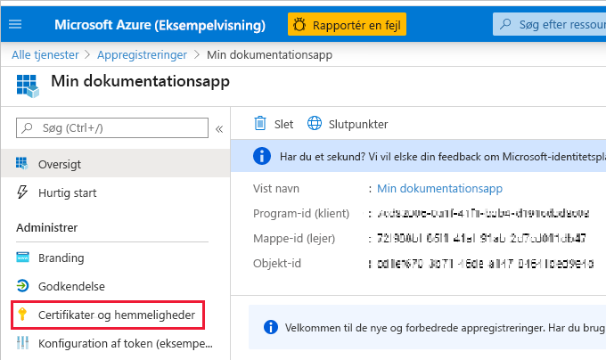

# <a name="embed-power-bi-content-with-service-principal-and-an-application-secret"></a>Integrer Power BI-indhold med tjenesteprincipal og en programhemmelighed

[!INCLUDE[service principal overview](../../includes/service-principal-overview.md)]

I denne artikel beskrives godkendelse af tjenesteprincipalen ved hjælp af et *program-id* og en *programhemmelighed*.

>[!NOTE]
>Vi anbefaler, at du sikrer dine backend-tjenester ved hjælp af certifikater i stedet for hemmelige nøgler.
>* [Få mere at vide om at hente adgangstoken fra Azure AD ved hjælp af hemmelige nøgler eller certifikater](/azure/architecture/multitenant-identity/client-assertion).
>* [Integrer Power BI-indhold med tjenesteprincipal og et certifikat](embed-service-principal-certificate.md).

## <a name="method"></a>Metode

Hvis du vil bruge tjenesteprincipalen og et program-id med integreret analyse, skal du følge disse trin:

1. Opret en [Microsoft Azure AD-app](/azure/active-directory/manage-apps/what-is-application-management).

    1. Opret Microsoft Azure AD-appens hemmelighed.
    
    2. Hent appens *program-id* og *programhemmelighed*.

    >[!NOTE]
    >Disse trin er beskrevet i **trin 1**. Du kan finde flere oplysninger om, hvordan du opretter en Microsoft Azure AD-app, i artiklen [Opret en Microsoft Azure ADD-app](/azure/active-directory/develop/howto-create-service-principal-portal).

2. Opret en Microsoft Azure AD-sikkerhedsgruppe.

3. Aktivér indstillingerne for Power BI-tjenesteadministration.

4. Føj tjenesteprincipalen til dit arbejdsområde.

5. Integrer dit indhold.

> [!IMPORTANT]
> Når du aktiverer en tjenesteprincipal, der skal bruges med Power BI, er AD-tilladelserne for programmet ikke længere gældende. Tilladelserne for programmet administreres derefter via Power BI-administrationsportalen.

## <a name="step-1---create-an-azure-ad-app"></a>Trin 1 – Opret en Microsoft Azure AD-app

Opret en Microsoft Azure AD-app ved hjælp af en af disse metoder:

* Opret appen i [Microsoft Azure-portalen](https://portal.azure.com/#allservices)

* Opret appen ved hjælp af [PowerShell-](/powershell/azure/create-azure-service-principal-azureps).

### <a name="creating-an-azure-ad-app-in-the-microsoft-azure-portal"></a>Oprettelse af en Microsoft Azure AD-app i Microsoft Azure-portalen

[!INCLUDE[service create app](../../includes/service-principal-create-app.md)]

7. Klik på fanen **Certifikater og hemmeligheder**.

     


8. Klik på **Ny klienthemmelighed**

    

9. Angiv en beskrivelse i vinduet *Tilføj klienthemmelighed*, angiv, hvornår klientens hemmelighed skal udløbe, og klik på **Tilføj**.

10. Kopiér og gem værdien for *Klienthemmelighed*.

    

    >[!NOTE]
    >Når du forlader dette vindue, skjules værdien for klienthemmeligheden, og du kan ikke se eller kopiere den igen.

### <a name="creating-an-azure-ad-app-using-powershell"></a>Oprettelse af en Microsoft Azure AD-app ved hjælp af PowerShell

Dette afsnit indeholder et eksempelscript til oprettelse af en ny Microsoft Azure AD-app ved hjælp af [PowerShell](/powershell/azure/create-azure-service-principal-azureps).

```powershell
# The app ID - $app.appid
# The service principal object ID - $sp.objectId
# The app key - $key.value

# Sign in as a user that's allowed to create an app
Connect-AzureAD

# Create a new Azure AD web application
$app = New-AzureADApplication -DisplayName "testApp1" -Homepage "https://localhost:44322" -ReplyUrls "https://localhost:44322"

# Creates a service principal
$sp = New-AzureADServicePrincipal -AppId $app.AppId

# Get the service principal key
$key = New-AzureADServicePrincipalPasswordCredential -ObjectId $sp.ObjectId
```
[!INCLUDE[service create steps two, three and four](../../includes/service-principal-create-steps.md)]

## <a name="step-5---embed-your-content"></a>Trin 5 – Integrer dit indhold

Du kan integrere dit indhold i et eksempelprogram eller i dit eget program.

* [Integrer indhold ved hjælp af eksempelprogrammet](embed-sample-for-customers.md#embed-content-using-the-sample-application)
* [Integrer indhold i dit program](embed-sample-for-customers.md#embed-content-within-your-application)

Når dit indhold er integreret, er du klar til at [gå videre til produktionen](embed-sample-for-customers.md#move-to-production).

[!INCLUDE[service principal limitations](../../includes/service-principal-limitations.md)]

## <a name="next-steps"></a>Næste trin

>[!div class="nextstepaction"]
>[Registrer et program](register-app.md)

> [!div class="nextstepaction"]
>[Power BI Embedded til dine kunder](embed-sample-for-customers.md)

>[!div class="nextstepaction"]
>[Objekter for et program og en tjenesteprincipal i Azure Active Directory](/azure/active-directory/develop/app-objects-and-service-principals)

>[!div class="nextstepaction"]
>[Sikkerhed på rækkeniveau ved hjælp af datagateway i det lokale miljø med tjenesteprincipal](embedded-row-level-security.md#on-premises-data-gateway-with-service-principal)

>[!div class="nextstepaction"]
>[Integrer Power BI-indhold med tjenesteprincipal og et certifikat](embed-service-principal-certificate.md)