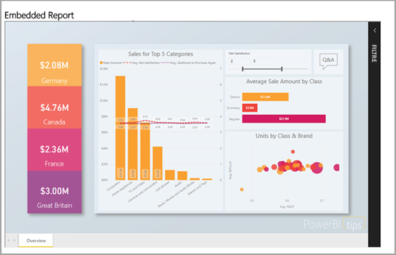

# Integreret analyse med Power BI

Power BI-tjenesten (SaaS) og tjenesten Power BI Embedded i Azure (PaaS) har API'er, du kan bruge til at integrere dine dashboards og rapporter. Når du integrerer indhold, får du adgang til de nyeste funktioner i Power BI, f.eks. dashboards, gateways og arbejdsområder.

Du kan gennemgå [Embedding-konfigurationsværktøjet](https://aka.ms/embedsetup) for hurtigt at komme i gang og downloade en eksempelapp.

Vælg den løsning, der er den rette for dig:

* Med [Embedding for your organization](embedding.md#embedding-for-your-organization) kan du udvide Power BI-tjenesten. Implementer løsningen [Integrer for din organisation](https://aka.ms/embedsetup/UserOwnsData) for at gøre det.
* Med [Integrering for dine kunder](embedding.md#embedding-for-your-customers) kan du integrere dashboards og rapporter for de brugere, der ikke har en Power BI-konto. Implementer løsningen [Integrer for dine kunder](https://aka.ms/embedsetup/AppOwnsData) for at gøre det.

## Brug API'er

Der er to hovedscenarier til integrering af Power BI-indhold:
- Integrering for organisationens brugere (som har licenser til Power BI). 
 
- Integrering for dine brugere og kunder uden krav om licenser til Power BI. 

[REST API'en for Power BI](/rest/api/power-bi/) muliggør begge scenarier.

For kunder og brugere uden Power BI-licenser kan du integrere dashboards og rapporter i dit brugerdefinerede program ved hjælp af den samme API for enten at betjene din organisation eller dine kunder. Dine kunder ser de data, der administreres af programmet. Power BI-brugere i din organisation har desuden yderligere indstillinger, som de kan bruge til at få vist *deres data* direkte i Power BI eller i konteksten af det integrerede program. Du kan fuldt ud benytte JavaScript- og REST-API'erne til dine integreringsbehov.

Se [Eksemplet på integrering af JavaScript](https://microsoft.github.io/PowerBI-JavaScript/demo/) for at forstå, hvordan integrering fungerer.

## Integrer for din organisation

Med **Embedding for your organization** kan du udvide Power BI-tjenesten. Denne type integrering kræver, at brugerne af dit program logger på Power BI-tjenesten for at få vist indholdet. Når en person i din organisation logger på, har vedkommende kun adgang til dashboards og rapporter, som de ejer, eller som er delt med vedkommende i Power BI-tjenesten.

Eksempler på integrering for din organisation omfatter interne programmer, f.eks. [SharePoint Online](https://powerbi.microsoft.com/blog/integrate-power-bi-reports-in-sharepoint-online/), [Integrering med Microsoft Teams (du skal have administratorrettigheder)](https://powerbi.microsoft.com/blog/power-bi-teams-up-with-microsoft-teams/) og [Microsoft Dynamics](/dynamics365/customer-engagement/basics/add-edit-power-bi-visualizations-dashboard).

Hvis du vil integrere for din organisation, skal du se [Selvstudium: Integrer Power BI-indhold i et program for din organisation](embed-sample-for-your-organization.md).

Funktionaliteten i selvbetjeningsportalen, f.eks. rediger, gem og meget mere, er tilgængelig via [JavaScript-API'en](https://github.com/Microsoft/PowerBI-JavaScript) ved integrering i forbindelse med Power BI-brugere.

Du kan gennemgå [værktøjet til konfiguration af integrering](https://aka.ms/embedsetup/UserOwnsData) for at komme i gang og downloade et eksempelprogram, der guider dig gennem integrering af en rapport for din organisation.

## Integrer for dine kunder

Med **Integrering for dine kunder** kan du integrere dashboards og rapporter for brugere, som ikke har en Power BI-konto. Denne type integrering kaldes også *Power BI Embedded*.

[Power BI Embedded](azure-pbie-what-is-power-bi-embedded.md) er en **Microsoft Azure**-tjeneste, der gør det muligt for uafhængige softwareleverandører (ISV'er) og udviklere hurtigt at integrere visualiseringer, rapporter og dashboards i et program. Denne integrering udføres via en kapacitetsbaseret model, der måles pr. time.

Power BI Embedded giver fordele til ISV'er, udviklere og kunder. En ISV kan f.eks. begynde at oprette visuelle elementer gratis vha. Power BI Desktop. Ved at minimere det analytiske udviklingsarbejde med visualiseringer kan ISV'er opnå hurtigere lancering på markedet og skille sig ud fra konkurrenterne ved at give differentierede dataoplevelser. ISV'er kan også vælge at opkræve en merpris for den ekstra værdi, de skaber vha. den integrerede analyse.

Med Power BI Embedded behøver dine kunder ikke at have kendskab til Power BI. Du kan bruge to forskellige metoder til at oprette et integreret program:
- Power BI Pro-konto 
- Tjenesteprincipal 

Power BI Pro-kontoen fungerer som en masterkonto for dit program (tænk på den som en proxykonto). Denne konto giver dig mulighed for at generere integreringstokens, som giver adgang til programmets Power BI-dashboards og -rapporter.

En [tjenesteprincipal](embed-service-principal.md) kan integrere Power BI-indhold i et program ved hjælp af et **kun program**-token. Den giver dig også mulighed for at generere integreringstokens, som giver adgang til programmets Power BI-dashboards og -rapporter.

Udviklere, der bruger Power BI Embedded, kan fokusere på at udarbejde kernefunktionaliteten i deres program i stedet for at bruge tid på at udvikle visualiseringer og analyse. De kan hurtigt imødekomme kunders efterspørgsel på rapporter og dashboards og nemt integrere med fuldt dokumenterede API'er og SDK'er. ISV'er kan give kunder mulighed for at træffe hurtige databaserede beslutninger i kontekst fra enhver enhed ved at muliggøre intuitiv udforskning af data i deres apps.

> [!IMPORTANT]
> Selvom integrering kræver Power BI-tjenesten, behøver dine kunder ikke at have en Power BI-konto for at få vist det integrerede indhold i programmet. 

Når du er klar til at overgå til produktion, skal arbejdsområdet tildeles til en dedikeret kapacitet. Power BI Embedded i Microsoft Azure tilbyder [dedikeret kapacitet](azure-pbie-create-capacity.md), som du kan bruge til dine apps.

I [Sådan integrerer du Power BI-indhold](embed-sample-for-customers.md) kan de se flere oplysninger om integrering.

## Næste trin

Nu kan du prøve at integrere Power BI-indhold i en app, eller du kan prøve at integrere Power BI-indhold for dine kunder.

> [!div class="nextstepaction"]
> [Integrer til din organisation](embed-sample-for-your-organization.md)

> [!div class="nextstepaction"]
> [Hvad er Power BI Embedded?](azure-pbie-what-is-power-bi-embedded.md)

> [!div class="nextstepaction"]
>[Integrer indhold for dine kunder](embed-sample-for-customers.md)

Har du flere spørgsmål? [Prøv at spørge Power BI-community'et](https://community.powerbi.com/)