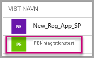
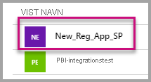

# <a name="tutorial-automate-configuration-of-template-app-installation-using-an-azure-function"></a>Selvstudium: Automatiser konfigurationen af installationen af skabelonprogrammer ved hjælp af en Azure-funktion

Skabelonprogrammer er en fantastisk måde for kunder at begynde at få indsigt i deres data på. Med skabelonprogrammer kommer de hurtigt i gang, da de får indsigt i deres data og rapporter, der er oprettet på forhånd, som de kan tilpasse, hvis de vil.

Kunderne ved ikke altid, hvordan de skal få indsigt i deres data, og det kan være svært for dem at skulle levere disse oplysninger, når de installerer et skabelonprogram.

Hvis du er datatjenesteudbyder og har oprettet et skabelonprogram for at hjælpe dine kunder med at komme i gang med at arbejde med deres data på din tjeneste, kan du gøre det nemmere for dem at installere dit skabelonprogram ved at automatisere konfigurationen af parametrene for dit skabelonprogram. Når kunden logger på din portal, klikker de på et særligt link, du har forberedt. Dette starter automatiseringen, hvor de nødvendige oplysninger indsamles, parametrene for skabelonprogrammet forudkonfigureres, og kunden omdirigeres til vedkommendes Power BI-konto, hvor vedkommende kan installere programmet. Alt, hvad kunderne skal gøre, er at klikke på Installér, godkende i forhold til deres datakilde, og så er de klar! 

Denne kundeoplevelse er illustreret nedenfor.


I dette selvstudium skal du bruge en prøve på automatiseret installation af Azure Functions, som vi har oprettet for at forudkonfigurere og installere dit skabelonprogram. Denne prøve er lavet simpel med vilje med henblik på demonstration. Den indkapsler konfigurationen af en Azure-funktion for at gøre brug af Power BI-API'er med henblik på automatisk installation af et skabelonprogram og konfiguration af det for brugerne.

Du kan finde flere oplysninger om det generelle automatiseringsflow og de API'er, som det bruger, i [Automatiser konfigurationen af installationen af et skabelonprogram](template-apps-auto-install.md)

Vores simple program bruger en Azure-funktion. Du kan finde flere oplysninger om Azure Functions i [dokumentationen til Azure Functions](https://docs.microsoft.com/azure/azure-functions/).

## <a name="basic-flow"></a>Grundlæggende flow

Følgende er det grundlæggende flow for, hvad programmet gør, når kunden starter det ved at klikke på linket på din portal.

1. Brugeren logger på ISV'ens portal og klikker på det leverede link. Dette starter flowet. I denne fase forberedes den brugerspecifikke konfiguration på ISV'ens portal.

2. ISV'en henter et token **kun til programmer** baseret på en [tjenesteprincipal (token kun til programmer)](../embedded/embed-service-principal.md), der er registreret i ISV'ens lejer.

3. Ved hjælp af [REST API'er til Power BI](https://docs.microsoft.com/rest/api/power-bi/) opretter ISV'en en **installationsbillet**, der indeholder den brugerspecifikke parameterkonfiguration, som ISV'en har forberedt.

4. ISV'en omdirigerer brugeren til Power BI ved hjælp af en ```POST```-omdirigeringsmetode, som indeholder installationsbilletten.

5. Brugeren omdirigeres til sin Power BI-konto med installationsbilletten og bliver bedt om at installere skabelonprogrammet. Når brugeren klikker på Installér, installeres skabelonprogrammet.

>[!Note]
>Selvom parameterværdierne er konfigureret af ISV'en, når installationsbilletten oprettes, leveres legitimationsoplysninger relateret til datakilden kun af brugeren i de sidste faser af installationen. Dette forhindrer, at de eksponeres til en tredjepart, hvorved en sikker forbindelse mellem brugeren og datakilderne for skabelonprogrammet sikres.

## <a name="prerequisites"></a>Forudsætninger

Før du starter, skal du have:

* Konfiguration af din egen Azure Active Directory-lejer. Se [Opret en Azure Active Directory-lejer](https://docs.microsoft.com/power-bi/developer/embedded/create-an-azure-active-directory-tenant) for at få oplysninger om, hvordan du konfigurerer en.

* En [tjenesteprincipal (token kun til programmer)](https://docs.microsoft.com/power-bi/developer/embedded/embed-service-principal) registreret i ovennævnte lejer.

* Et parameteriseret [skabelonprogram](https://docs.microsoft.com/power-bi/connect-data/service-template-apps-overview), der er klar til installation. Skabelonprogrammet skal være oprettet i den samme lejer, som du registrerer programmet i Azure Active Directory (Azure AD) i. Se [tip til skabelonprogram](https://docs.microsoft.com/power-bi/connect-data/service-template-apps-tips) eller [Opret et skabelonprogram i Power BI](https://docs.microsoft.com/power-bi/connect-data/service-template-apps-create) for at få flere oplysninger.

* En **Power BI Pro-licens**. Hvis du ikke er tilmeldt Power BI Pro, kan du [tilmelde dig en gratis prøveversion](https://powerbi.microsoft.com/pricing/), før du begynder.

## <a name="set-up-your-template-apps-automation-development-environment"></a>Konfigurer dit udviklingsmiljø til automatisering af skabelonprogrammer

Før du fortsætter med at konfigurere dit program, skal du følge vejledningen i [Hurtig start: Opret et Azure Functions-program med Azure App Configuration](https://docs.microsoft.com/azure/azure-app-configuration/quickstart-azure-functions-csharp) for at udvikle en Azure-funktion sammen med en Azure App Configuration. Opret din App Configuration som beskrevet i artiklen.

### <a name="register-an-application-in-azure-active-directory-azure-ad"></a>Registrer et program i Azure Active Directory (Azure AD)

Opret en tjenesteprincipal som beskrevet i [Integrer Power BI-indhold med en tjenesteprincipal og en programhemmelighed](https://docs.microsoft.com/power-bi/developer/embedded/embed-service-principal).

Sørg for at registrere programmet som et **serverbaseret webprogram**. Du registrerer et serverbaseret webprogram for at oprette en programhemmelighed.

Gem *program-id'et* (klient-id) og *programhemmeligheden* (klienthemmelighed) til senere trin.

Du kan gennemgå [konfigurationsværktøjet til integrering](https://aka.ms/embedsetup/AppOwnsData) for hurtigt at komme i gang med at oprette en programregistrering. Hvis du bruger [værktøjet til registrering af Power BI-program](https://app.powerbi.com/embedsetup), skal du vælge indstillingen *Integrer for dine kunder*.

## <a name="template-app-preparation"></a>Forberedelse af skabelonprogram

Når du har oprettet dit skabelonprogram, og det er klar til installation, skal du gemme følgende oplysninger til de næste trin:

* *App-id*, *pakkenøgle* og *ejer-id*, som de vises i URL-adressen til installation i slutningen af processen [Definer egenskaber for skabelonprogrammet](../../connect-data/service-template-apps-create.md#define-the-properties-of-the-template-app), da programmet blev oprettet.

    Du kan også få det samme link ved at klikke på **Hent link** i [Udgivelsesadministration](../../connect-data/service-template-apps-create.md#manage-the-template-app-release) for skabelonprogrammet.

* *Parameternavne*, som defineret i datasættet for skabelonprogrammet. Der skelnes mellem store og små bogstaver i parameternavne, og de kan også hentes via fanen **Parameterindstillinger**, når du [definerer egenskaberne for skabelonprogrammet](../../connect-data/service-template-apps-create.md#define-the-properties-of-the-template-app) eller fra indstillingerne for datasæt i Power BI.

>[!NOTE]
>Du kan teste det forudkonfigurerede installationsprogram på dit skabelonprogram, hvis skabelonprogrammet er klar til installation, selvom det endnu ikke er offentligt tilgængeligt på AppSource. Men før brugere uden for din lejer kan bruge det automatiserede installationsprogram til at installere dit skabelonprogram, skal skabelonprogrammet være offentligt tilgængeligt på [markedspladsen til Power BI-programmer](https://app.powerbi.com/getdata/services). Så før du distribuerer skabelonprogrammet ved hjælp af det automatiserede installationsprogram, du opretter, skal du sørge for at publicere det i [Partnercenter](https://docs.microsoft.com/azure/marketplace/partner-center-portal/create-power-bi-app-offer).


## <a name="install-and-configure-your-template-app-using-our-azure-function-sample"></a>Installér og konfigurer dit skabelonprogram ved hjælp af vores prøve på Azure Functions

I dette afsnit skal du bruge en prøve på automatiseret installation af Azure Functions, som vi har oprettet for at forudkonfigurere og installere dit skabelonprogram. Denne prøve er lavet simpel med vilje med henblik på demonstration. Det giver dig mulighed for at gøre brug af [Azure Functions](https://docs.microsoft.com/azure/azure-functions/functions-overview) og [Azure App Configuration](https://docs.microsoft.com/azure/azure-app-configuration/overview) for nemt at udrulle og bruge API'en til automatiseret installation til dine skabelonprogrammer.

### <a name="download-visual-studio-version-2017-or-later"></a>Download [Visual Studio](https://www.visualstudio.com/) (version 2017 eller nyere)

Download [Visual Studio](https://www.visualstudio.com/) (version 2017 eller nyere). Sørg for at downloade den nyeste [NuGet-pakke](https://www.nuget.org/profiles/powerbi).

### <a name="download-the-automated-install-azure-function-sample"></a>Download prøven på automatiseret installation af Azure Functions

Download [prøven på automatiseret installation af Azure Functions](https://github.com/microsoft/Template-apps-examples/tree/master/Developer%20Samples/Automated%20Install%20Azure%20Function) fra GitHub for at komme i gang.


### <a name="setup-your-azure-app-configuration"></a>Konfigurer Azure App Configuration

Hvis du vil køre denne prøve, skal du konfigurere Azure App Configuration med værdierne og nøglerne, som beskrevet nedenfor. Nøglerne er **program-id**, **programhemmelighed** og dit skabelonprograms **program-id**, **pakkenøgle** og **ejer-id**. Du kan finde oplysninger om, hvordan du henter disse værdier i afsnittene nedenfor. 

Nøglerne er også defineret i filen **Constants.cs**.

| Konfigurationsnøgle | Betydning           |
|---------------    |-------------------|
| TemplateAppInstall:Application:AppId | *Program-id* fra [URL-adressen til installation](#getting-the-template-app-properties) |
| TemplateAppInstall:Application:PackageKey | *Pakkenøgle* fra [URL-adressen til installation](#getting-the-template-app-properties) |
| TemplateAppInstall:Application:OwnerId | *Ejer-id* fra [URL-adressen til installation](#getting-the-template-app-properties) |
| TemplateAppInstall:ServicePrincipal:ClientId | Tjenesteprincipalens [program-id](#getting-the-application-id) |
| TemplateAppInstall:ServicePrincipal:ClientSecret | Tjenesteprincipalens [programhemmelighed](#getting-the-application-secret) |
|||


Filen **Constants.cs**:


#### <a name="getting-the-template-app-properties"></a>Sådan hentes egenskaberne for skabelonprogrammet
Udfyld alle relevante egenskaber for skabelonprogrammet som defineret, da programmet blev oprettet. Disse egenskaber er skabelonprogrammets **program-id**, **pakkenøgle** & **ejer-id**.

Følg disse trin for at hente ovenstående værdier:

1. Log på [Power BI](https://app.powerbi.com).

2. Gå til programmets oprindelige arbejdsområde.

3. Åbn ruden Udgivelsesadministration.

    

4. Vælg programversionen, og hent linket til installationen.

    

5. Kopiér linket til Udklipsholder.

    

6. Denne URL-adresse til installation indeholder de tre parametre for URL-adressen, som du skal bruge. Brug værdierne **program-id**, **pakkenøgle** & **ejer-id** for programmet. En URL-adresse som prøve vil ligne nedenstående.

    ```html
    https://app.powerbi.com/Redirect?action=InstallApp&appId=3c386...16bf71c67&packageKey=b2df4b...dLpHIUnum2pr6k&ownerId=72f9...1db47&buildVersion=5
    ```

#### <a name="getting-the-application-id"></a>Sådan hentes program-id'et

Udfyld oplysningerne om **applicationId** med **program-id'et** fra **Azure**. **Program-id'et** bruges af programmet til at identificere sig selv over for de brugere, du anmoder om tilladelser fra.

Hvis du vil hente **applicationId**, skal du følge disse trin:

1. Log på [Azure-portalen](https://portal.azure.com).

2. Vælg **Alle tjenester** i navigationsruden til venstre, og vælg **Appregistreringer**.

    

3. Vælg programmet, der skal bruge **applicationId**.

    

4. Der er angivet et **program-id** som GUID. Brug dette **Program-id** som **applicationId** for programmet.

    

#### <a name="getting-the-application-secret"></a>Sådan hentes programhemmeligheden

Udfyld oplysningerne for **ApplicationSecret** ud fra sektionen **Nøgler** i sektionen **Appregistreringer** i **Azure**.  Denne attribut fungerer, når du bruger [tjenesteprincipal](../embedded/embed-service-principal.md).

Hvis du vil hente **ApplicationSecret**, skal du følge disse trin:

 1. Log på [Azure Portal](https://portal.azure.com).

 2. Vælg **Alle tjenester** i navigationsruden til venstre, og vælg derefter **Appregistreringer**.

    

3. Vælg programmet, der skal bruge **ApplicationSecret**.

    

4. Vælg **Certifikater og hemmeligheder** under **Administrer**.

5. Vælg **Nye kundehemmeligheder**.

6. Angiv et navn i feltet **Beskrivelse**, og vælg en varighed. Vælg derefter **Gem** for at hente **værdien** til dit program. Når du lukker ruden **Nøgler** efter at have gemt nøgleværdien, vises feltet med værdien kun som skjult. På det tidspunkt kan du ikke hente nøgleværdien. Hvis du mister nøgleværdien, skal du oprette en ny i Azure Portal.

    

## <a name="test-your-function-locally"></a>Test din funktion lokalt

Følg trinnene som beskrevet i [Kør funktionen lokalt](https://docs.microsoft.com/azure/azure-functions/functions-create-your-first-function-visual-studio#run-the-function-locally) for at køre funktionen.

Konfigurer din portal for at sende en ```POST```-anmodning til URL-adressen for funktionen (f.eks. ```POST http://localhost:7071/api/install```). Anmodningsteksten skal være et JSON-objekt, der beskriver nøgleværdipar, hvor nøgler er *parameternavne* (defineret i Power BI Desktop), og værdier er de ønskede værdier, der skal angives for hver parameter i skabelonprogrammet.

>[!Note]
> I produktion udledes parameterværdier for hver bruger ud fra portalens forventede logik.

Det ønskede flow skal være:

1. Portalen forbereder anmodningen pr. bruger\session.
2. ```POST /api/install```-anmodningen sendes til din Azure-funktion. Anmodningsteksten består af nøgleværdipar, hvor nøglen er parameternavnet, og værdien er den ønskede værdi, der skal angives. 
3. Hvis alt er konfigureret korrekt, bør browseren automatisk omdirigere til kundens Power BI-konto og vise det automatiserede installationsflow.
4. Ved installationen angives parameterværdier som konfigureret i trin 1 og 2.
 
## <a name="next-steps"></a>Næste trin

### <a name="publish-your-project-to-azure"></a>Publicer dit projekt på Azure

Følg [dokumentationen til Azure Functions](https://docs.microsoft.com/azure/azure-functions/functions-create-your-first-function-visual-studio#publish-the-project-to-azure) for at få oplysninger om, hvordan du publicerer dit projekt i Azure, så du kan integrere API'er til automatiseret installation af skabelonprogrammer i dit produkt og begynde at teste det i produktionsmiljøer.
