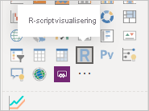
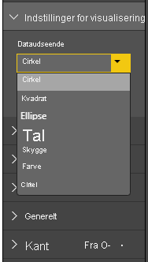

# <a name="tutorial-create-an-r-powered-power-bi-visual"></a>Selvstudium: Opret en R-drevet Power BI-visualisering

I dette selvstudium beskrives det, hvordan du opretter en R-drevet visualisering til Power BI.

I dette selvstudium lærer du, hvordan du kan:

> [!div class="checklist"]
>
> * Opret en R-drevet visualisering
> * Rediger R-scriptet i Power BI Desktop
> * Føj biblioteker til visualiseringen
> * Tilføj en statisk egenskab

## <a name="prerequisites"></a>Forudsætninger

* En **Power BI Pro-konto**. [Tilmeld dig en gratis prøveversion](https://powerbi.microsoft.com/pricing/), før du går i gang.
* R-programmet. Du kan downloade det gratis fra mange forskellige steder, herunder [downloadsiden for Revolution Open](https://mran.revolutionanalytics.com/download/) og [CRAN Repository](https://cran.r-project.org/bin/windows/base/). Du kan finde flere oplysninger under [Opret i Power BI-visuals ved hjælp af R](../../create-reports/desktop-r-visuals.md).
* [Power BI Desktop](../../fundamentals/desktop-get-the-desktop.md).
* Windows-brugere skal have [Windows PowerShell](/powershell/scripting/install/installing-windows-powershell?view=powershell-6) version 4 eller nyere og OSX-brugere skal have [Terminal](https://macpaw.com/how-to/use-terminal-on-mac).

## <a name="getting-started"></a>Introduktion

1. Forbered eksempeldata for visualiseringen. Du kan gemme disse værdier i en Excel-database eller *.csv*-fil og importere den i Power BI Desktop.

    | MonthNo | Enheder i alt |
    |-----|-----|
    | 1 | 2303 |
    | 2 | 2319 |
    | 3 | 1732 |
    | 4 | 1615 |
    | 5 | 1427 |
    | 6 | 2253 |
    | 7 | 1147 |
    | 8 | 1515 |
    | 9 | 2516 |
    | 10 | 3131 |
    | 11 | 3170 |
    | 12 | 2762 |

1. Hvis du vil oprette en visualisering, skal du åbne PowerShell eller Terminal og køre følgende kommando:

   ```cmd
   pbiviz new rVisualSample -t rvisual
   ```

   Denne kommando opretter en ny mappestruktur baseret på skabelonen `rvisual`. Denne skabelon indeholder en grundlæggende, klargjort R-drevet visualisering, som kører følgende R-script:

   ```r
   plot(Values)
   ```

   Datarammen `Values` vil indeholde kolonner i datarollen `Values`.

1. Tildel visuelle elementer til udvikleren ved at føje **MonthNo** og **Enheder i alt** til **Værdier** for det visuelle element.

   

## <a name="editing-the-r-script"></a>Redigering af R-scriptet

Når du bruger `pbiviz` til at oprette den R-drevne visualisering, der er baseret på skabelonen `rvisual`, oprettes der en fil med navnet *script.r* i visualiseringens rodmappe. Denne fil indeholder det R-script, der køres for at generere billedet for en bruger. Du kan oprette dit R-script i Power BI Desktop.

1. Vælg **R-scriptvisualisering** i Power BI Desktop:

   

1. Indsæt denne R-kode i **R-scripteditoren**:

    ```r
    x <- dataset[,1] # get the first column from dataset
    y <- dataset[,2] # get the second column from dataset

    columnNames = colnames(dataset) # get column names

    plot(x, y, type="n", xlab=columnNames[1], ylab=columnNames[2]) # draw empty plot with axis and labels only
    lines(x, y, col="green") # draw line plot
    ```

1. Vælg ikonet **Kør script** for at se resultatet.

    

1. Når R-scriptet er klar, kan du kopiere det til filen `script.r` i det visuelle projekt, der blev oprettet i et af de forrige trin.

1. Skift `name` af `dataRoles` i *capabilities.json* til `dataRoles`. Power BI overfører data som datarammeobjektet `dataset` til R-scriptvisualiseringen, men R-scriptvisualiseringen henter datarammenavnet efter `dataRoles` navne.

    ```json
    {
      "dataRoles": [
        {
          "displayName": "Values",
          "kind": "GroupingOrMeasure",
          "name": "dataRoles"
        }
      ],
      "dataViewMappings": [
        {
          "scriptResult": {
            "dataInput": {
              "table": {
                "rows": {
                  "select": [
                    {
                      "for": {
                        "in": "dataset"
                      }
                    }
                  ],
                  "dataReductionAlgorithm": {
                    "top": {}
                  }
                }
              }
            },
            ...
          }
        }
      ],
    }
    ```

1. Tilføj følgende kode for at understøtte tilpasning af billedets størrelse i filen *src/visual.ts*.

    ```typescript
      public onResizing(finalViewport: IViewport): void {
          this.imageDiv.style.height = finalViewport.height + "px";
          this.imageDiv.style.width = finalViewport.width + "px";
          this.imageElement.style.height = finalViewport.height + "px";
          this.imageElement.style.width = finalViewport.width + "px";
      }
    ```

## <a name="add-libraries-to-visual-package"></a>Føj biblioteker til visualiseringspakken

Denne fremgangsmåde gør det muligt for din visualisering at bruge `corrplot`-pakken.

1. Føj biblioteksafhængigheden for visualiseringen til `dependencies.json`. Her er et eksempel på filens indhold:

    ```json
    {
      "cranPackages": [
        {
          "name": "corrplot",
          "displayName": "corrplot",
          "url": "https://cran.r-project.org/web/packages/corrplot/"
        }
      ]
    }
    ```

    Pakken `corrplot` er en grafisk visning af en korrelationsmatrix. Du kan finde flere oplysninger om `corrplot`under [En introduktion til corrplot-pakke](https://cran.r-project.org/web/packages/corrplot/vignettes/corrplot-intro.html).

1. Når du har foretaget disse ændringer, kan du begynde at bruge pakken i din `script.r`-fil.

    ```r
    library(corrplot)
    corr <- cor(dataset)
    corrplot(corr, method="circle", order = "hclust")
    ```

Resultatet af at bruge `corrplot`-pakken ser ud som i dette eksempel:


## <a name="adding-a-static-property-to-the-property-pane"></a>Tilføjelse af en statisk egenskab i egenskabsruden

Gør det muligt for brugerne at ændre indstillingerne for brugergrænsefladen. Det kan du gøre ved at føje egenskaber til egenskabsruden, der ændrer R-scriptets funktion ud fra brugerinput.

Du kan konfigurere `corrplot` ved hjælp af argumentet `method` for funktionen `corrplot`. Standardscriptet bruger en cirkel. Rediger visualiseringen, så brugeren kan vælge mellem flere indstillinger.

1. Definer objektet og egenskaben i filen *capabilities.json*. Brug derefter dette objektnavn i optællingsmetoden for at hente disse værdier fra egenskabsruden.

    ```json
    {
      "settings": {
      "displayName": "Visual Settings",
      "description": "Settings to control the look and feel of the visual",
      "properties": {
        "method": {
          "displayName": "Data Look",
          "description": "Control the look and feel of the data points in the visual",
          "type": {
            "enumeration": [
              {
                "displayName": "Circle",
                "value": "circle"
              },
              {
                "displayName": "Square",
                "value": "square"
              },
              {
                "displayName": "Ellipse",
                "value": "ellipse"
              },
              {
                "displayName": "Number",
                "value": "number"
              },
              {
                "displayName": "Shade",
                "value": "shade"
              },
              {
                "displayName": "Color",
                "value": "color"
              },
              {
                "displayName": "Pie",
                "value": "pie"
              }
            ]
          }
        }
      }
    }
    ```

1. Åbn filen *src/settings.ts*. Opret en `CorrPlotSettings`-klasse med den offentlige egenskab `method`. Typen er `string`, og standardværdien er `circle`. Føj egenskaben `settings` til klassen `VisualSettings` med standardværdien:

    ```typescript
    "use strict";

    import { dataViewObjectsParser } from "powerbi-visuals-utils-dataviewutils";
    import DataViewObjectsParser = dataViewObjectsParser.DataViewObjectsParser;

    export class VisualSettings extends DataViewObjectsParser {
      public rcv_script: rcv_scriptSettings = new rcv_scriptSettings();
      public settings: CorrPlotSettings = new CorrPlotSettings();
    }

    export class CorrPlotSettings {
      public method: string = "circle";
    }

    export class rcv_scriptSettings {
      public provider;
      public source;
    }
    ```

    Efter disse trin kan du ændre egenskaben for visualiseringen.

   

    Endelig skal R-scriptet starte med en egenskab. Hvis brugeren ikke ændrer egenskaben, modtager visualiseringen ikke nogen værdi for denne egenskab.

    For R-runtime-variabler for egenskaberne er navngivningskonventionen `<objectname>_<propertyname>`, i dette tilfælde `settings_method`.

1. Skift R-scriptet i visualiseringen, så det passer til følgende kode:

    ```r
    library(corrplot)
    corr <- cor(dataset)

    if (!exists("settings_method"))
    {
        settings_method = "circle";
    }

    corrplot(corr, method=settings_method, order = "hclust")
    ```

Den sidste visualisering ser ud som i det følgende eksempel:


## <a name="next-steps"></a>Næste trin

Hvis du vil vide mere om R-drevne visualiseringer, kan du se [Brug af R-drevne Power BI-visualiseringer i Power BI](../../create-reports/desktop-r-powered-custom-visuals.md).

Du kan finde flere oplysninger om R-drevne visualiseringer i Power BI Desktop, se [Opret visuelle Power BI-elementer ved hjælp af R](../../create-reports/desktop-r-visuals.md).