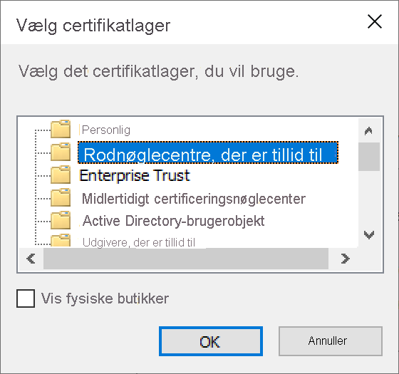
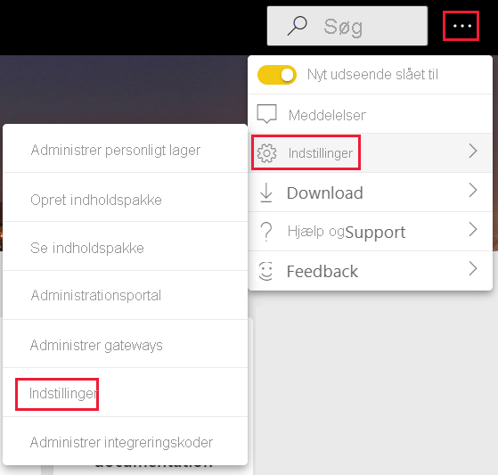
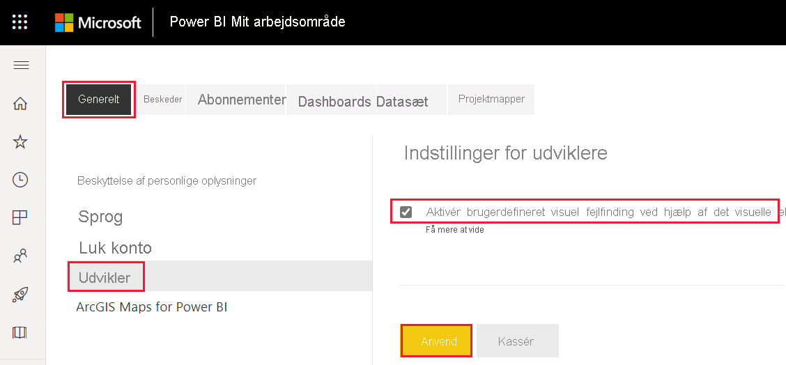
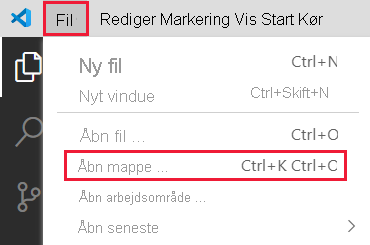
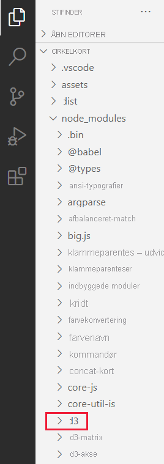
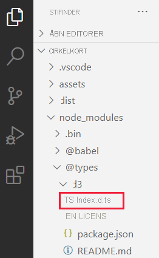

# <a name="set-up-your-environment-for-developing-a-power-bi-visual"></a>Konfigurer dit miljø for at udvikle en Power BI-visualisering

I denne artikel får du mere at vide om, hvordan du konfigurerer dit miljø til udvikling af en Power BI-visualisering.

Før du går i gang med at udvikle visualiseringen, skal du installere **node.js** og **pbiviz**-pakken. Du skal også oprette og installere et certifikat. Når dit lokale miljø er konfigureret, skal du konfigurere Power BI-tjenesten til udvikling af en Power BI-visualisering.

I denne artikel får du mere at vide om, hvordan du:
> [!div class="checklist"]
> * Installerer *noder. js*.
> * Installerer *pbiviz*.
> * Opretter og installerer et certifikat.
> * Konfigurerer Power BI-tjenesten til udvikling af en visualisering.
> * Installerer flere biblioteker (kræves for at udvikle en visualisering).

## <a name="install-nodejs"></a>Installér node.js

*Node.js* er en JavaScript-kørsel, der er bygget på Chromes V8 JavaScript-program. Det giver udviklere mulighed for at køre alle apps, der er oprettet på JavaScript.

1. Hvis du vil installere *node.js*, skal du gå til [node.js](https://nodejs.org) i en webbrowser.

2. Download det nyeste MSI-installationsprogram.

3. Kør installationsprogrammet, og udfør derefter installationstrinnene. Acceptér vilkårene i licensaftalen og alle standarder.

4. Genstart computeren.

## <a name="install-pbiviz"></a>Installér pbiviz

*pbiviz*-værktøjet, der er skrevet ved hjælp af JavaScript, kompilerer den visuelle kildekode for *pbiviz*-pakken.

*pbiviz*-pakken er et komprimeret Power BI-visualiseringsprojekt med alle de nødvendige scripts og aktiver.

1. Åbn Windows PowerShell, og angiv følgende kommando.

    ```powershell
    npm i -g powerbi-visuals-tools
    ```

## <a name="create-and-install-a-certificate"></a>Opret og installér et certifikat

For at en klient (din computer) og en server (Power BI-tjenesten) kan interagere sikkert, kræves der et [SSL-certifikat (Secure Sockets Layer)](create-ssl-certificate.md). Uden et certifikat, der sikrer sikker interaktion, blokeres de af browseren.

# <a name="windows"></a>[Windows](#tab/windows)

I denne proces beskrives det, hvordan du kører en PowerShell-kommando, der starter **guiden til import af certifikater**. Følg nedenstående trin for at konfigurere certifikatet i guiden.

>[!IMPORTANT]
>Luk ikke PowerShell-vinduet under denne procedure.

1. Åbn Windows PowerShell, og angiv følgende kommando.

    ```powershell
    pbiviz --install-cert
    ```

    Denne kommando gør to ting:
    * Den returnerer et *adgangsudtryk*. I dette tilfælde er *adgangsudtrykket* 9765328806094.
    * Guiden til import af certifikatet startes også.
    
    >[!div class="mx-imgBorder"]
    >

2. I guiden til import af certifikater skal du bekræfte, at lagerplaceringen er angivet til *Aktuel bruger*, og vælge **Næste**.

    >[!div class="mx-imgBorder"]
    >

3. I vinduet **Fil, der skal importeres** skal du vælge **Næste**.

4. I vinduet **Beskyttelse af private nøgler** skal du indsætte det adgangsudtryk, du modtog, da du udførte PowerShell-kommandoen (trin 1), i tekstfeltet *Adgangskode* og vælge **Næste**. I dette tilfælde er adgangsudtrykket 9765328806094.

    >[!div class="mx-imgBorder"]
    >

5. I vinduet **Certifikatlager** skal du vælge indstillingen **Placer alle certifikater i følgende lager** og derefter vælge **Gennemse**.

    >[!div class="mx-imgBorder"]
    >

6. Vælg **Nøglecentre, der er tillid til** i vinduet **Vælg certifikatlager**, og vælg derefter **OK**.

    >[!div class="mx-imgBorder"]
    >

7. Vælg *Næste* i vinduet **Certifikatlager**.

    >[!div class="mx-imgBorder"]
    >

8. I vinduet **Afslutter guiden Certifikatimport** skal du kontrollere dine indstillinger og vælge **Udfør**.

    >[!NOTE]
    >Hvis du modtager en sikkerhedsadvarsel, skal du vælge **Ja**.


# <a name="osx"></a>[OSX](#tab/sdk2osx)

1. Hvis låsen øverst til venstre er låst, så skal du vælge den for at låse den op. Søg efter *localhost*, og dobbeltklik på certifikatet.

    

2. Vælg **Hav altid tillid til**, og luk vinduet.

    

3. Angiv dit brugernavn og din adgangskode, og vælg **Opdater indstillinger**.

    

4. Luk alle åbne browsere.

> [!NOTE]
> Hvis certifikatet ikke genkendes, skal du genstarte computeren.

---

## <a name="optional-verify-that-your-environment-is-set-up"></a>(Valgfrit) Kontrollér, at dit miljø er konfigureret

Kontrollér, at pakken Power BI Visual Tools er installeret. I PowerShell skal du køre kommandoen `pbiviz` og gennemse resultatet, herunder listen over understøttede kommandoer.

>[!div class="mx-imgBorder"]
>

## <a name="set-up-power-bi-service-for-developing-a-visual"></a>Konfigurer Power BI-tjenesten til udvikling af en visualisering

Hvis du vil udvikle en Power BI-visualisering, skal du aktivere fejlfinding af brugerdefinerede visualiseringer i Power BI-tjenesten. Følg vejledningen i dette afsnit for at aktivere denne indstilling.

1. Log på [Power BI.com](https://powerbi.microsoft.com/).

2. Gå til **Indstillinger** > **Indstillinger** > **Indstillinger**.

    >[!div class="mx-imgBorder"]
    >

3. Under fanen **Generelt** skal du vælge **Udvikler**. I **Indstillinger for udviklere** skal du markere afkrydsningsfeltet **Aktivér brugerdefineret visuel fejlfinding ved hjælp af det visuelle element til udviklere** og vælge **Anvend**.

    >[!div class="mx-imgBorder"]
    >

## <a name="install-development-libraries"></a>Installér udviklingsbiblioteker

Hvis du vil udvikle din egen Power BI-visualisering, skal du installere flere biblioteker. I dette afsnit beskrives det, hvordan du installerer disse biblioteker, og det kontrolleres, at installationen er fuldført.

Hvis du vil installere de biblioteker, der er angivet i denne artikel, skal du åbne PowerShell og angive installationskommandoen for hver komponent.

>[!NOTE]
>Når disse biblioteker er installeret på din computer, kan du bruge dem til alle projekter med Power BI-visualiseringer. Dette er en installationsprocedure, der skal udføres én gang pr. maskine.


### <a name="d3-javascript-library"></a>D3 JavaScript-bibliotek

[D3](https://d3js.org/) er et JavaScript-bibliotek til oprettelse af dynamiske, interaktive datavisualiseringer i webbrowsere. Det bruger SVG- (Scalable Vector Graphics), HTML5- og CSS-standarder, der er implementeret i stort omfang.

```powershell
npm i d3@^5.0.0 --save
```

### <a name="typescript-definitions"></a>TypeScript-definitioner

Installér TypeScript-definitioner, så du kan udvikle din Power BI-visualisering i [TypeScript](https://www.typescriptlang.org/), et undersæt af JavaScript.

```powershell
npm i @types/d3@^5.0.0 --save
```

### <a name="core-js"></a>core-js

[core-js](https://www.npmjs.com/package/core-js) er et modulopbygget standardbibliotek til JavaScript, der omfatter polyfills for ECMAScript.

```powershell
npm i core-js@3.2.1 --save
```

### <a name="powerbi-visual-api"></a>powerbi-visual-api

Installér API-definitionerne for Power BI-visualiseringer.

```powershell
npm i powerbi-visuals-api --save-dev
```

### <a name="optional-verify-that-the-d3-library-is-installed"></a>(Valgfrit) Kontrollér, at D3-biblioteket er installeret

[Visual Studio Code](https://code.visualstudio.com/) (VS Code) er et ideelt IDE (integreret udviklingsmiljø) til udvikling af TypeScript-programmer. I dette afsnit bruger vi VS Code til at kontrollere, at det D3-bibliotek, du skal bruge til at udvikle din Power BI-visualisering, er installeret korrekt.

>[!NOTE]
>Den kontrolproces, der er beskrevet i dette afsnit, forudsætter, at du allerede har et Power BI-visualiseringsprojekt. Hvis du ikke har et Power BI-visualiseringsprojekt, kan du oprette et ved at følge vejledningen på [cirkelkortet til oprettelse af projekter](develop-circle-card.md#create-a-development-project).

1. Åbn VS Code.

    >[!TIP]
    >Du kan åbne VS Code fra PowerShell ved at udføre følgende kommando:
    >
    >```powershell
    >code .
    >```
2. I VS Code skal du åbne menuen **Filer** og vælge **Åbn mappe**.

    >[!div class="mx-imgBorder"]
    >

3. I vinduet **Åbn mappe** skal du vælge den mappe, der indeholder din Power BI-visualisering, og vælge **Vælg mappe**.

    >[!div class="mx-imgBorder"]
    >

4. I ruden **Stifinder** skal du udvide mappen **node_modules** og kontrollere, at **D3-biblioteket** er installeret.

    >[!div class="mx-imgBorder"]
    >

5. I ruden **Stifinder** skal du udvide **node_modules > @types > d3** og kontrollere, at filen **index.t.ds** er installeret.

    >[!div class="mx-imgBorder"]
    >

## <a name="next-steps"></a>Næste trin

> [!div class="nextstepaction"]
> [Opret en Power BI-cirkelkortvisualisering](develop-circle-card.md)

> [!div class="nextstepaction"]
> [Opret en Power BI-visualisering af liggende søjlediagram](create-bar-chart.md)