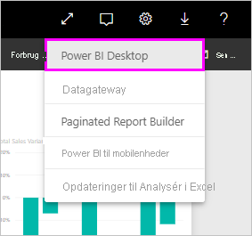
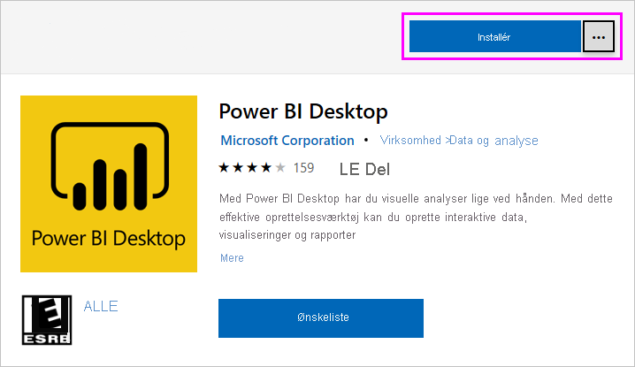
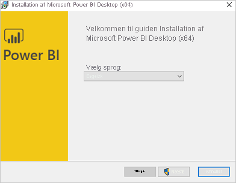
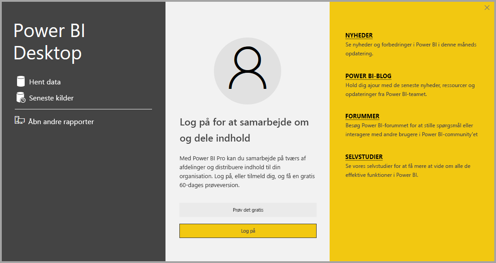

# <a name="get-power-bi-desktop"></a>Hent Power BI Desktop
Med Power BI Desktop kan du oprette avancerede forespørgsler, modeller og rapporter, som visualiserer data. Med Power BI Desktop kan du skabe datamodeller, oprette rapporter og dele dit arbejde ved at publicere det i Power BI-tjenesten. Power BI Desktop kan downloades gratis.

Du kan hente Power BI Desktop på to måder, som beskrevet i følgende afsnit:

* [Installér som en app fra Microsoft Store](#install-as-an-app-from-the-microsoft-store).
* [Download det direkte som en eksekverbar pakke, du downloader og installerer på din computer](#download-power-bi-desktop-directly).

Ved begge fremgangsmåder hentes den nyeste version af Power BI Desktop på computeren, men der er et par forskelle, du skal være opmærksom på, som beskrevet i følgende afsnit.

## <a name="install-as-an-app-from-the-microsoft-store"></a>Installér som en app fra Microsoft Store
Der er et par måder, hvorpå du kan få adgang til den nyeste version af Power BI Desktop fra Microsoft Store. 

1. Brug en af følgende indstillinger for at åbne siden **Power BI Desktop** i Microsoft Store:

   - Åbn en browser, og gå direkte til [siden Power BI Desktop](https://aka.ms/pbidesktopstore) i Microsoft Store.

    - Fra [Power BI-tjenesten](https://docs.microsoft.com/power-bi/service-get-started) skal du vælge ikonet **Download** i øverste højre hjørne og derefter vælge **Power BI Desktop**.

      

   - Gå til [produktsiden Power BI Desktop](https://powerbi.microsoft.com/desktop/), og vælg derefter **Download gratis**.
  
2. Når du er kommet til siden **Power BI Desktop** i Microsoft Store, skal du vælge **Installér**.

     

Der er nogle fordele ved at hente Power BI Desktop via Microsoft Store:

* **Automatiske opdateringer**: Windows downloader automatisk den nyeste version i baggrunden, så snart den bliver tilgængelig, så din version altid er opdateret.
* **Mindre downloads**: Microsoft Store sikrer, at det kun er komponenter, der er ændret i de enkelte opdateringer, som downloades til computeren, hvilket resulterer i mindre downloads for hver opdatering.
* **Der kræves ikke administratorrettigheder**: Når du downloader pakken direkte og installerer den, skal du være administrator, før installationen kan fuldføres. Når du henter Power BI Desktop via Microsoft Store, kræves der *ikke* administratorrettigheder.
* **It-udrulning er aktiveret**: Via Microsoft Store til Virksomheder kan du nemmere *udrulle* Power BI Desktop til alle i din organisation

* **Registrering af sprog**: Versionen fra Microsoft Store indeholder alle understøttede sprog og kontrollerer, hvilket sprog der bruges på computeren, hver gang den startes. Denne sprogunderstøttelse påvirker også lokaliseringen af modeller, der oprettes i Power BI Desktop. Indbyggede hierarkier matcher f.eks. det sprog, som bruges i Power BI Desktop, når .pbix-filen oprettes.

Følgende overvejelser og begrænsninger gælder, når du installerer Power BI Desktop fra Microsoft Store:

* Hvis du bruger SAP-connectoren, skal du muligvis flytte dine SAP-driverfiler til mappen *Windows\System32*.
* Brugerindstillingerne fra .exe-versionen kopieres ikke, når du installerer Power BI Desktop via Microsoft Store. Du skal muligvis oprette forbindelse til dine seneste datakilder igen og angive dine legitimationsoplysninger til datakilden igen. 

> [!NOTE]
> Power BI-rapportserverversionen af Power BI Desktop er en separat version og adskiller sig fra de versioner, der er beskrevet i denne artikel. Du kan finde oplysninger om rapportserverversionen af Power BI Desktop under [Opret en Power BI-rapport til Power BI-rapportserveren](../report-server/quickstart-create-powerbi-report.md).
> 
> 

## <a name="download-power-bi-desktop-directly"></a>Download Power BI Desktop direkte
  
  Du downloader den eksekverbare Power BI Desktop-fil fra Download Center ved at vælge **Download** via [siden Download Center](https://www.microsoft.com/download/details.aspx?id=58494). Angiv den 32-bit eller 64-bit installationsfil, du vil downloade.

  

### <a name="install-power-bi-desktop-after-downloading-it"></a>Installér Power BI Desktop, når du har downloadet den
Du bliver bedt om at køre installationsfilen, når du er færdig med at downloade den.

Fra og med udgivelsen i juli 2019 sendes Power BI Desktop som en enkelt .exe-installationspakke, der indeholder alle understøttede sprog med en separat .exe-fil til 32-bit og 64-bit versionerne. .msi-pakkerne ophørte fra og med udgivelsen i september 2019, hvorved den eksekverbare .exe-fil til installation kræves. Denne tilgang gør distribution, opdateringer og installation (især for administratorer) meget nemmere og mere praktisk. Du kan også bruge kommandolinjeparametre til at tilpasse installationsprocessen, som beskrevet i afsnittet [Brug af kommandolinjeindstillinger under installationen](#using-command-line-options-during-installation).

Efter du har startet installationspakken, installeres Power BI Desktop som et program og køres på din computer.



> [!NOTE]
> Du kan ikke installere den downloadede version (MSI), som er udgået, og Microsoft Store-versionen af Power BI Desktop på samme computer, hvilket også kaldes for en *side om side*-installation. Du skal fjerne Power BI Desktop manuelt, før du downloader den fra Microsoft Store.
> 

## <a name="using-power-bi-desktop"></a>Brug Power BI Desktop
Når du starter Power BI Desktop, vises der et velkomstbillede.



Hvis det er første gang, du bruger Power BI Desktop, dvs. hvis installationen ikke er en opgradering, bliver du bedt om at udfylde en formular eller logge på Power BI-tjenesten, før du kan fortsætte.

Herfra kan du gå i gang med at oprette datamodeller eller rapporter og dele dem med andre brugere af Power BI-tjenesten. Se afsnittet [Næste trin](#next-steps) for at få links til vejledninger, der kan hjælpe dig med at komme i gang med at bruge Power BI Desktop.

## <a name="minimum-requirements"></a>Minimumkrav
Følgende liste indeholder minimumkravene til at køre Power BI Desktop:

* Windows 7/Windows Server 2008 R2 eller nyere
* .NET 4.5
* Internet Explorer 10 eller nyere
* Hukommelse (RAM): Mindst 1 GB ledig hukommelse, 1,5 GB eller mere anbefales.
* Skærm: Mindst 1440 x 900 eller 1600 x 900 (16:9) anbefales. En lavere opløsning, f.eks. 1024 x 768 eller 1280 x 800 anbefales ikke, da visse kontrolelementer (f.eks. lukning af startskærmen) vises over disse opløsninger.
* Indstillinger for Windows-skærm: Hvis dine skærmindstillinger er angivet til at ændre størrelsen på tekst, apps og andre elementer til mere end 100 %, kan du muligvis ikke se visse dialogbokse, som du skal interagere med for at fortsætte med at bruge Power BI Desktop. Hvis du oplever dette problem, skal du kontrollere dine skærmindstillinger i Windows ved at gå til **Indstillinger** > **System** > **Skærm** og bruge skyderen for at ændre skærmindstillingerne tilbage til 100 %.
* CPU: 1 gigahertz (GHz) eller hurtigere, 32-bit eller 64-bit, x86-processor anbefales.

## <a name="considerations-and-limitations"></a>Overvejelser og begrænsninger

Vi ønsker, at du får en fantastisk oplevelse med Power BI Desktop. Da du til tider kan støde på et problem med Power BI Desktop, indeholder dette afsnit løsninger eller forslag til at løse disse problemer. 

### <a name="using-command-line-options-during-installation"></a>Brug af kommandolinjeindstillinger under installationen 

Når du installerer Power BI Desktop, kan du angive egenskaber og indstillinger med kommandolinjeparametre. Disse indstillinger er især nyttige for administratorer, der administrerer eller faciliterer installationen af Power BI Desktop på tværs af organisationer. Disse indstillinger gælder for .msi- og .exe-installationer. 


|Kommandolinjeindstilling  |Adfærd  |
|---------|---------|
|-q, -quiet, -s, -silent     |Uovervåget installation         |
|-passive     |Vis kun statuslinjen under installationen         |
|-norestart     |Undertryk kravet om genstart af computeren         |
|-forcerestart     |Genstart computeren efter installation uden en prompt         |
|-promptrestart     |Spørg brugeren, om der kræves genstart af computeren (standard)         |
|-l<>, -log<>     |Logfør installationen af en bestemt fil med den fil, der er angivet i <>         |
|-uninstall     |Fjern Power BI Desktop         |
|-repair     |Reparer installationen (eller installér, hvis det ikke er installeret i øjeblikket)         |
|-package, -update     |Installér Power BI Desktop (standard, så længe -uninstall eller -repair ikke er angivet)         |

Du kan også bruge følgende syntaksparametre, som du angav med syntaksen *property = value*:

|Parameter  |Betydning  |
|---------|---------|
|ACCEPT_EULA     |Kræver værdien 1 for automatisk at acceptere slutbrugerlicensaftalen         |
|ENABLECXP     |Værdien 1 tilmelder programmet for kundeoplevelsen, hvor telemetri om brug af produktet registreres         |
|INSTALLDESKTOPSHORTCUT     |Værdien 1 tilføjer en genvej på skrivebordet         |
|INSTALLLOCATION     |Filsti til det sted, hvor den skal installeres         |
|LANGUAGE     |Landestandardkoden (f.eks. en-US, de-DE, pr-BR) til at gennemtvinge standardsproget for programmet. Hvis du ikke angiver sproget, vises Windows OS-sproget i Power BI Desktop. Du kan ændre denne indstilling i dialogboksen **Indstillinger**.         |
|REG_SHOWLEADGENDIALOG     |Værdien 0 deaktiverer visning af den viste dialogboks, før du er logget på Power BI Desktop.         |
|DISABLE_UPDATE_NOTIFICATION     |En værdi på 1 deaktiverer opdateringsmeddelelser.         |


Du kan f.eks. køre Power BI Desktop med følgende indstillinger og parametre for at installere uden nogen brugergrænseflade ved hjælp af det tyske sprog: 

```-quiet LANG=de-DE ACCEPT_EULA=1```

### <a name="installing-power-bi-desktop-on-remote-machines"></a>Installation af Power BI Desktop på eksterne maskiner

Hvis du udruller Power BI Desktop til dine brugere med et værktøj, der kræver en Windows-installationsfil (.msi-fil), kan du udtrække .msi-filen fra .exe-installationsfilen til Power BI Desktop. Brug et værktøj fra tredjepart, f.eks. WiX Toolset.

> [!NOTE]
> Da WiX Toolset er et tredjepartsprodukt, kan indstillingerne blive ændret uden varsel. Se deres dokumentation for at få de nyeste oplysninger, og kontakt deres mailliste for brugere for at få hjælp.

1. På den computer, hvor du har downloadet Power BI Desktop-installationsprogrammet, skal du installere den nyeste version af [WiX Toolset](https://wixtoolset.org/).
2. Åbn et kommandolinjevindue som administrator, og naviger til den mappe, hvor du har installeret WiX Toolset.
3. Kør følgende kommando: 
    
    ```Dark.exe <path to Power BI Desktop installer> -x <output folder>```

    Eksempel:

    ``` Dark.exe C:\PBIDesktop_x64.exe -x C:\output```

    Outputmappen indeholder en mappe med navnet *AttachedContainer*, som indeholder. msi-filerne.

Opgradering af en installation fra en .exe til en .msi, som du har udtrukket fra en .exe, understøttes ikke.   Hvis du vil foretage denne opgradering, skal du først fjerne den gamle version af Power BI Desktop.

### <a name="issues-when-using-previous-releases-of-power-bi-desktop"></a>Problemer med brug af tidligere udgaver af Power BI Desktop

Nogle brugere støder måske på en fejlmeddelelse, der svarer til følgende meddelelse, når de bruger en forældet version af Power BI Desktop: 

*Vi kunne ikke gendanne den gemte database til modellen* 

Du kan som regel løse problemet ved at opdatere til den aktuelle version af Power BI Desktop.

### <a name="disabling-notifications"></a>Deaktivering af meddelelser
Vi anbefaler, at du opdaterer til den nyeste version af Power BI Desktop for at drage fordel af fremskridt inden for funktioner, ydeevne, stabilitet og andre forbedringer. Nogle organisationer vil måske ikke have, at brugerne opdaterer til hver eneste nye version. Du kan deaktivere meddelelser ved at redigere registreringsdatabasen via følgende trin:

1. Naviger til nøglen **HKEY_LOCAL_MACHINE\SOFTWARE\Microsoft\Microsoft Power BI Desktop** i editoren af registreringsdatabasen.
2. Opret en ny post af typen **REG_DWORD** i nøglen med følgende navn: **DisableUpdateNotification**.
3. Angiv værdien af den nye post til **1**.
4. Genstart computeren, så ændringerne kan træde i kraft.

### <a name="power-bi-desktop-loads-with-a-partial-screen"></a>Power BI Desktop indlæses med en delvis skærm

Nogle brugere kan i visse tilfælde, herunder ved visse konfigurationer af skærmopløsningen, se Power BI Desktop gengive indhold med store sorte områder. Dette problem er generelt et resultat af de seneste opdateringer af operativsystemet, som påvirker den måde elementer gengives på, i stedet for et direkte resultat af den måde indhold vises på i Power BI Desktop. Følg disse trin for at håndtere dette problem:

1. Tryk på tasten **Start**, og angiv *blurry* i den viste søgelinje.
2. I den dialogboks, der vises, skal du vælge: **Lad Windows rette apps, der er slørede.**
3. Genstart Power BI Desktop.

Dette problem løses muligvis efter udgivelsen af efterfølgende Windows-opdateringer. 
 

## <a name="next-steps"></a>Næste trin
Når du har installeret Power BI Desktop, kan du se følgende indhold for at få hjælp til at komme i gang hurtigt:

* [Hvad er Power BI Desktop?](desktop-what-is-desktop.md)
* [Oversigt over forespørgsler i Power BI Desktop](../transform-model/desktop-query-overview.md)
* [Datakilder i Power BI Desktop](../connect-data/desktop-data-sources.md)
* [Opret forbindelse til data i Power BI Desktop](../connect-data/desktop-connect-to-data.md)
* [Udform og kombiner data i Power BI Desktop](../connect-data/desktop-shape-and-combine-data.md)
* [Almindelige forespørgselsopgaver i Power BI Desktop](../transform-model/desktop-common-query-tasks.md)   
