# Kom i gang med Power BI Desktop
Velkommen til Introduktionsvejledning til Power BI Desktop. I denne præsentation kan du se, hvordan Power BI Desktop fungerer, hvad det kan gøre, og hvordan du bygger robuste datamodeller og fantastiske rapporter for at styrke din business intelligence.

Du kan få et hurtigt overblik over, hvordan Power BI Desktop fungerer, og hvordan du bruger det, ved kun at scanne skærmbillederne i denne vejledning på få minutter. Hvis du vil have en mere grundig forståelse, kan du læse hver sektion, udføre trinene og slutte af med at få din egen Power BI Desktop-fil, der er klar til at blive postet i [Power BI-tjenesten](https://app.powerbi.com/) og blive delt med andre.

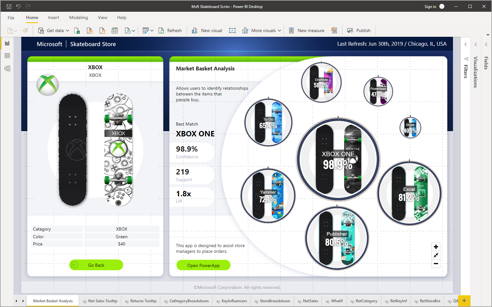

Du kan også se videoen [Introduktion til Power BI Desktop](https://www.youtube.com/watch?v=Qgam9M8I0xA) og downloade Excel-projektmappen [Financial Sample](https://go.microsoft.com/fwlink/?LinkID=521962) for at følge med videoen.

## Sådan fungerer Power BI Desktop
Med Power BI Desktop kan du:
1. Opret forbindelse til data, herunder flere datakilder.
1. Form dataene med forespørgsler, der bygger indsigtsfulde og overbevisende datamodeller.
1. Brug datamodeller til at oprette visualiseringer og rapporter. 
1. Del dine rapportfiler, så andre kan udnytte dem, bygge videre på dem og dele dem. Du kan dele Power BI Desktop *PBIX-filer* på samme måde som andre filer, men den mest overbevisende metode er at overføre dem til [Power BI-tjenesten](https://preview.powerbi.com/). 

Power BI Desktop integrerer veldokumenterede Microsoft Query Engine-, datamodel- og visualiseringsteknologier. Dataanalytikere og andre kan oprette samlinger af forespørgsler, dataforbindelser, modeller og rapporter og nemt dele dem med andre. Ved hjælp af kombinationen af Power BI Desktop og Power BI-tjenesten kan nye indsigter fra dataverdenen være nemmere at udforme, opbygge, dele og udvide.

I Power BI Desktop centraliseres, forenkles og strømlines det, der ellers kan være en spredt, usammenhængende og besværlig proces til design og oprettelse af business intelligence-lagre og -rapporter.
Er du klar til at prøve? Lad os komme i gang.

> [!NOTE]
> Der er også en separat og specialiseret version af Power BI kaldet [Power BI-rapportserver](../report-server/get-started.md), hvis data og rapportering skal forblive i det lokale miljø. Power BI-rapportserver bruger en separat og specialiseret version af Power BI Desktop kaldet Power BI Desktop til Power BI-rapportserver, som kun fungerer sammen med rapportserver-versionen af Power BI. I denne artikel beskrives den almindelige Power BI Desktop.

## Installér og kør Power BI Desktop
Hvis du vil downloade Power BI Desktop, skal du gå til [siden til download af Power BI Desktop](https://powerbi.microsoft.com/desktop) og vælge **Download gratis**. Du kan også finde indstillinger for hentning ved at vælge [Se download eller sprogindstillinger](https://www.microsoft.com/download/details.aspx?id=58494). 

Du kan også hente Power BI Desktop fra Power BI-tjenesten. Vælg ikonet **Download** på den øverste menulinje, og vælg derefter **Power BI Desktop**.

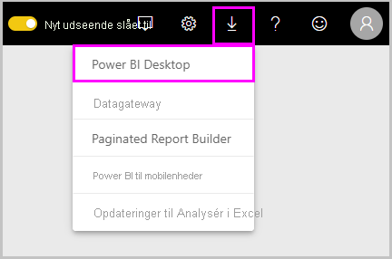

På siden Microsoft Store skal du vælge **Hent** og følge vejledningen for at installere Power BI Desktop på din computer. Start Power BI Desktop fra menuen **Start** i Windows eller fra ikonet på proceslinjen i Windows.

Første gang Power BI Desktop starter, vises **velkomstskærmen**.

På **velkomstskærmen** kan du **hente data**, se de **seneste kilder**, åbne de seneste rapporter, **åbne andre rapporter** eller vælge andre links. Du kan også vælge, om du altid vil have vist **velkomstskærmen** ved start. Vælg ikonet for luk for at lukke **velkomstskærmen**.

I venstre side af Power BI Desktop kan du få vist ikoner for de tre Power BI Desktop-visninger: **Rapport**, **Data** og **Relationer** (oppefra og ned). Den aktuelle visning er angivet af den gule søjle til venstre, og du kan ændre visning ved at vælge et af ikonerne. 

Visningen **Rapport** er standardvisningen. 

Power BI Desktop indeholder også **Power Query-editor**, som åbnes i et separat vindue. I **Power Query-editor** kan du oprette forespørgsler og transformere data. Derefter indlæser du denne tilpassede datamodel i Power BI Desktop og opretter rapporter.

## Opret forbindelse til data
Når Power BI Desktop er installeret, er du klar til at oprette forbindelse til en verden af data, der konstant udvides. Hvis du vil se de mange typer datakilder, der er tilgængelige, skal du vælge **Hent data** > **Mere** under fanen **Hjem** i Power BI Desktop og rulle gennem listen over **alle** datakilder i vinduet **Hent data**. Som en del af denne hurtige præsentation opretter vi forbindelse til et par forskellige **web**datakilder.

Forestil dig, at du er en dataanalytiker, der arbejder for en solbrilleforhandler. Du vil gerne hjælpe din solbrilleforhandler med at målrette salget efter, hvor der er mest solskin. Bankrate.coms side [Best and worst states for retirement](https://www.bankrate.com/retirement/best-and-worst-states-for-retirement/) har interessante data om dette emne.

På fanen **Hjem** i Power BI Desktop skal du vælge **Hent data** > **Web** for at oprette forbindelse til en webdatakilde. 

I dialogboksen **Fra web** skal du indsætte adressen *https:\//www.bankrate.com/retirement/best-and-worst-states-for-retirement/* i feltet **URL-adresse** og vælge **OK**. 

Hvis du bliver bedt om det, skal du på skærmbilledet **Få adgang til webindhold** vælge **Opret forbindelse** for at bruge anonym adgang. 

Funktionen Forespørgsel i Power BI Desktop begynder at arbejde og kontakter webressourcen. I vinduet **Navigator** returneres det, der blev fundet på websiden, i dette tilfælde en tabel med navnet **Ranking of best and worst states for retirement** og et dokument. Vi er interesseret i tabellen, så vi vælger den for at få vist et eksempel.

På dette tidspunkt kan du vælge **Indlæs** for at indlæse tabellen eller **Transformer data** for at foretage ændringer i tabellen, før du indlæser den.

Når du vælger **Transformer data**, starter Power Query-editor med en repræsentativ visning af tabellen. Ruden **Forespørgselsindstillinger** er til højre, eller du kan altid få den vist ved at vælge **Forespørgselsindstillinger** på fanen **Vis** i Power Query-editor. 

Du kan finde flere oplysninger om oprettelse af forbindelse til data under [Opret forbindelse til data i Power BI Desktop](../connect-data/desktop-connect-to-data.md).

## Form data
Nu, hvor vi har oprettet forbindelse til en datakilde, kan du justere dataene, så de opfylder dine behov. Hvis du vil *forme* data, skal du give Power Query-editor trinvise instruktioner i justering af dataene, samtidig med at de indlæses og præsenteres. Formningen påvirker ikke den oprindelige datakilde. Det er kun denne bestemte visning af dataene. 

> [!NOTE]
> De tabeldata, der bruges i denne vejledning, kan blive ændret med tiden. Derfor kan de trin, du skal følge, være forskellige, og du kan derfor være nødt til at være kreativ med, hvordan du justerer trinene eller resultaterne – hvilket alt sammen er med til at gøre det sjovt at lære. 

Formning kan betyde at *transformere* dataene, f.eks. omdøbning af kolonner eller tabeller, fjernelse af rækker eller kolonner eller ændring af datatyper. Power Query-editor henter disse trin sekventielt under **Anvendte trin** i ruden **Forespørgselsindstillinger**. Hver gang denne forespørgsel opretter forbindelse til datakilden, udføres disse trin, så dataene altid formes på den måde, du angiver. Denne proces foregår, når du bruger forespørgslen i Power BI Desktop eller når andre bruger den delte forespørgsel, f.eks. i Power BI-tjenesten. 

Bemærk, at **Anvendte trin** i **Forespørgselsindstillinger** allerede indeholder nogle få trin. Du kan vælge hvert enkelt trin for at se resultatet i Power Query-editor. Først har du angivet en webkilde, og derefter får du vist tabellen i vinduet **Navigator**. I det tredje trin **Ændret type** genkendte Power BI heltalsdata, da de blev importeret og ændrede automatisk den oprindelige **datatype** *Tekst* til **Heltal**. 

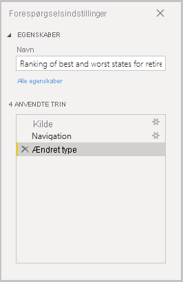

Hvis du har brug for at ændre en datatype, skal du vælge den eller de kolonner, der skal ændres. Hold **Skift** nede for at markere flere tilstødende kolonner eller **Ctrl** for at markere kolonner, der ikke støder op til hinanden. Du kan enten højreklikke på en kolonneoverskrift, vælge **Rediger type** og vælge en ny datatype i menuen eller på rullelisten ud for **Datatype** i gruppen **Transformér** under fanen **Hjem** og vælge en ny datatype.

> [!NOTE]
> Power Query-editoren i Power BI Desktop bruger båndet eller genvejsmenuer til tilgængelige opgaver. De fleste af de opgaver, du kan vælge på fanen **Hjem** eller **Transformér**, er også tilgængelige, hvis du højreklikker på et element og vælger i den viste menu.

Nu kan du anvende dine egne ændringer og transformationer på dataene og få dem vist i **Anvendte trin**. 

I forbindelse med salg af solbriller er du f.eks. mest interesseret i rangering af vejret, du beslutter derfor at sortere tabellen efter kolonnen **Vejr** i stedet for **Samlet rangering**. Vælg rullepilen ud for overskriften **Vejr**, og vælg **Sortér stigende**. Dataene vises nu sorteret efter vejrrangering, og trinnet **Sorterede rækker** vises i **Anvendte trin**. 

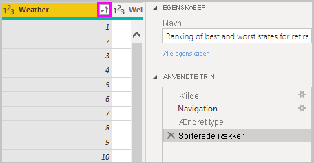

Du er ikke ret interesseret i at sælge solbrille til stater med det værst tænkelige vejr, så du beslutter dig for at fjerne dem fra tabellen. I gruppen **Reducer rækker** på fanen **Hjem** skal du vælge **Fjern rækker** > **Fjern de nederste rækker**. Skriv **10** i dialogboksen *Fjern de nederste rækker*, og vælg derefter **OK**. 

De nederste 10 værste rækker fjernes fra tabellen, og trinnet **Fjernede nederste rækker** vises i **Anvendte trin**.

Du beslutter, at tabellen har for mange ekstra oplysninger til dine behov og vil derfor fjerne kolonnerne **Prisbillighed**, **Kriminalitet**, **Kultur** og **Wellness**. Vælg overskriften for hver kolonne, du vil fjerne. Hold **Skift** nede for at markere flere tilstødende kolonner eller **Ctrl** for at markere kolonner, der ikke støder op til hinanden. 

Vælg **Fjern kolonner** i gruppen **Administrer kolonner** på fanen **Hjem**. Du kan også højreklikke på en af de markerede kolonneoverskrifter og vælge **Fjern kolonner** i menuen. De markerede kolonner fjernes, og trinnet **Fjernede kolonner** vises i **Anvendte trin**.

Ved nærmere eftertanke kan **Prisbillighed** være relevant for solbrillesalget alligevel. Du vil derfor gerne have denne kolonne tilbage. Du kan nemt fortryde det sidste trin i ruden **Anvendte trin** ved at vælge sletteikonet **X** ud for trinnet. Gentag derefter trinnet, og vælg kun de kolonner, du vil slette. Du kan få større fleksibilitet ved at slette hver kolonne som et separat trin. 

Du kan højreklikke på et hvilket som helst trin i ruden **Anvendte trin** og vælge at slette trinnet, omdøbe det, flytte det op eller ned i sekvensen eller tilføje eller slette trin efter det pågældende trin. Hvis du vil udføre mellemliggende trin advarer Power BI Desktop dig, hvis ændringen kan påvirke senere trin og ødelægge forespørgslen.  

Hvis du f.eks. ikke længere vil sortere tabellen efter **Vejr**, kan du prøve at slette trinnet **Sorterede rækker**. Power BI Desktop advarer dig om, at sletningen af dette trin kan medføre, at forespørgslen ødelægges. Du har fjernet de nederste 10 rækker, efter at du har sorteret efter vejret, så hvis du fjerner sorteringen, fjernes de forskellige rækker. Du modtager også en advarsel, hvis du vælger trinnet **Sorterede rækker** og prøver at tilføje et nyt mellemliggende trin på dette tidspunkt.  

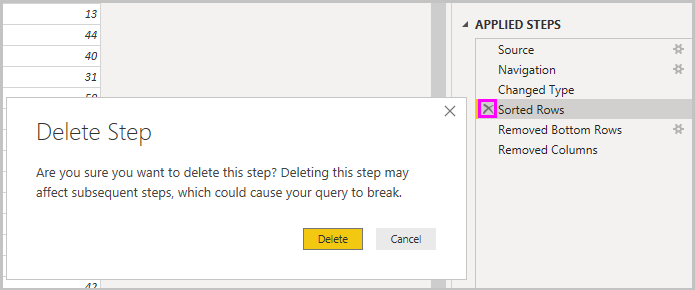

Til sidst skal du ændre tabeltitlen, så den handler om salg af solbriller i stedet for pension. Udskift den gamle titel med **De bedste stater til salg af solbriller** under **Egenskaber** i ruden *Forespørgselsindstillinger*.

Den færdige forespørgsel for dine formede data ser ud på følgende måde:

Du kan finde flere oplysninger om formning af data under [Form og kombiner data i Power BI Desktop](../connect-data/desktop-shape-and-combine-data.md).

## Kombiner data
Dataene for de forskellige stater er interessante og nyttige til at skabe yderligere analyser og forespørgsler. Men der er et problem: De fleste data anvender forkortelser på to bogstaver for statskoder og ikke statens fulde navn. Vi skal bruge en måde at knytte forkortelserne for staterne til deres navne på for at benytte dataene.

Du er heldig. Disse data er mulige at finde i en anden offentlig datakilde, men dataene kræver en masse udformning, før du kan *kombinere* dem med solbrilletabellen.

Hvis du vil importere forkortelser for stater til Power Query-editor, skal du vælge **Ny kilde** > **Web** i gruppen **Ny forespørgsel** på fanen **Hjem** på båndet. 

I dialogboksen **Fra web** skal du angive URL-adressen til webstedet med forkortelser for stater: *https:\//en.wikipedia.org/wiki/List_of_U.S._state_abbreviations*.

I vinduet **Navigator** skal du vælge tabellen **Codes and abbreviations for U.S. states, federal district, territories, and other regions** og derefter vælge **OK**. Tabellen åbnes i Power Query-editor.

Fjern alle kolonner med undtagelse af **Name and status of region**, **Name and status of region2** og **ANSI**. Hvis du kun vil beholde disse kolonner, skal du holde **Ctrl** nede og vælge kolonnerne. Derefter skal du enten højreklikke på en af kolonneoverskrifterne og vælge **Fjern andre kolonner**eller vælge **Fjern andre kolonner** i gruppen **Administrer kolonner** under fanen **Hjem**. 

Klik på rullepilen ud for kolonneoverskriften **Name and status of region2**, og vælg **Filtre** > **er lig med**. I dialogboksen **Filtrer rækker** skal du klikke på rullepilen ud for feltet **Angiv eller vælg en værdi** ved siden af **er lig med** og vælge **Stat**. 

Vælg **Eller**, og vælg **Stat ("Commonwealth")** ud for det andet felt **er lig med**. Vælg **OK**. 

Nu hvor de ekstra værdier som f.eks. **Federal district** og **island** er blevet fjernet, har du en liste med 50 stater og deres officielle forkortelser på to bogstaver. Du kan omdøbe kolonnerne, så de giver mere mening, f.eks. **Navn på stat**, **Status** og **Forkortelse** ved at højreklikke på kolonneoverskrifterne og vælge **Omdøb**.

Bemærk, at alle disse trin er registreret under **Anvendte trin** i ruden **Forespørgselsindstillinger**.

Din formede tabel ser nu ud på følgende måde:

Giv tabellen den nye titel *Statskoder* i feltet **Egenskaber** for **Forespørgselsindstillinger**. 

Nu, hvor tabellen **Statskoder** er formet, kan du *kombinere* disse to tabeller til én. Eftersom de tabeller, du nu har, er et resultat af de forespørgsler, du har anvendt på dataene, kaldes de også for *forespørgsler*. Der er to primære måder at kombinere forespørgsler på: *fletning* og *tilføjelse*. 

Når du har en eller flere kolonner, som du vil føje til en anden forespørgsel, skal du *flette* forespørgslerne. Når du har flere rækker med data, som du vil føje til en eksisterende forespørgsel, skal du *tilføje* forespørgslen.

I dette tilfælde skal du *flette* forespørgslen **Statskoder** til forespørgslen **De bedste stater til salg af solbriller**. Hvis du vil flette forespørgslerne, skal du skifte til forespørgslen **De bedste stater til salg af solbriller** ved at vælge den i ruden **Forespørgsler** i venstre side af Power Query-editor. Vælg derefter **Flet forespørgsler** i gruppen**Kombiner** på fanen **Hjem** på båndet.

I vinduet **Flet** skal du klikke på rullepilen for at vælge **Statskoder** fra de andre tilgængelige forespørgsler. Vælg den kolonne, der skal sammenlignes, fra hver tabel, i dette tilfælde **Stat** fra forespørgslen **De bedste stater til salg af solbriller** og **Navn på stat** fra forespørgslen **Statskoder**. 

Hvis du får vist en dialogboks med **Beskyttelsesniveauer**, skal du vælge **Ignorer kontrol af beskyttelsesniveauer for denne fil** og derefter vælge **Gem**. Vælg **OK**. 

Der vises en ny kolonne med navnet **Statskoder** til højre for tabellen **De bedste stater til salg af solbriller**. Den indeholder den statskodeforespørgsel, du har flettet med forespørgslen om de bedste stater til salg af solbriller. Alle kolonner fra den flettede tabel komprimeres til kolonnen **Statskoder**. Du kan *udvide* den flettede tabel og kun inkludere de ønskede kolonner. 

Hvis du vil udvide den flettede tabel og vælge, hvilke kolonner der skal inkluderes, skal du vælge ikonet for **Udvid** i kolonneoverskriften. I dialogboksen **Udvid** skal du kun vælge kolonnen **Forkortelse**. Fjern markeringen i **Brug oprindeligt kolonnenavn som præfiks**, og vælg derefter **OK**. 

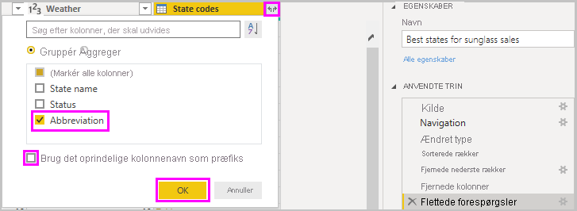

> [!NOTE]
> Du kan forsøge at få tabellen **Statskoder** med på forskellige måder. Du kan eksperimentere lidt, og hvis du ikke kan lide resultatet, skal du bare slette dette trin på listen **Anvendte trin** i ruden **Forespørgselsindstillinger**. Du har mulighed for at prøve det af, så mange gange du har lyst, indtil udvidelsesprocessen ser ud, som den skal.

Du kan se en mere detaljeret beskrivelse af formningen og kombinationen af datatrin under [Form og kombiner data i Power BI Desktop](../connect-data/desktop-shape-and-combine-data.md).

Du har nu en enkelt forespørgsel (tabel), hvor to datakilder er kombineret, som hver især er blevet formet efter dine behov. Denne forespørgsel kan fungere som udgangspunkt for mange ekstra, interessante dataforbindelser – f.eks. demografi, velstandsniveauer og rekreative muligheder i en vilkårlig stat.

Nu har du nok data til at oprette et par interessante rapporter i Power BI Desktop. Da dette er en milepæl, kan du anvende ændringerne i **Power Query-editor** og indlæse dem i Power BI Desktop ved at vælge **Luk og anvend** på fanen **Hjem** på båndet. Du kan også nøjes med at vælge **Anvend** for at holde forespørgslen åben i Power Query-editor, mens du arbejder i Power BI Desktop. 

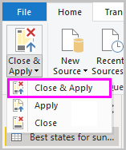

Du kan foretage flere ændringer af en tabel, når den er indlæst i Power BI Desktop, og indlæse modellen igen for at anvende de ændringer, du foretager. Hvis du vil genåbne **Power Query-editor** fra Power BI Desktop, skal du vælge **Rediger forespørgsler** på fanen **Hjem** på båndet i Power BI Desktop. 

## Opret rapporter
I visningen **Rapport** i Power BI Desktop kan du begynde at oprette visualiseringer og rapporter. Visningen **Rapport** har seks hovedområder:

1. Båndet, som viser almindelige opgaver, der er knyttet til rapporter og visualiseringer.
2. Lærredet i midten, hvor visualiseringer oprettes og arrangeres.
3. Faneområdet Sider langs bunden, hvor du kan vælge eller tilføje rapportsider.
4. Ruden **Filtre**, hvor du kan filtrere datavisualiseringer.
5. Ruden **Visualiseringer**, hvor du kan tilføje, ændre eller tilpasse visualiseringer og anvende detaljeadgang.
6. Ruden **Felter**, som viser de tilgængelige felter i dine forespørgsler. Du kan trække disse felter til lærredet, ruden **Filtre** eller ruden **Visualiseringer** for at oprette eller redigere visualiseringer.

Du kan udvide og skjule **Filtre**, **Visualiseringer** og **Felter** ved at vælge pilene øverst i ruden. Når du skjuler ruderne, får du mere plads på lærredet til at skabe flotte visualiseringer. 

Hvis du vil oprette en simpel visualisering, skal du blot vælge et felt på listen Felter eller trække feltet fra listen **Felter** til lærredet. Du kan f.eks. trække feltet **Stat** fra **De bedste stater til salg af solbriller** hen på lærredet og se, hvad der sker.

Se her ... Power BI Desktop genkendte, at feltet **Stat** indeholdt geoplaceringsdata og oprettede automatisk en kortbaseret visualisering. Visualiseringen viser datapunkter for de 40 stater fra din datamodel. 

I ruden **Visualiseringer** vises oplysninger om visualiseringen, og du har mulighed for at ændre den. 

1. Ikonerne viser den type visualisering, der er oprettet. Du kan ændre typen af en valgt visualisering ved at vælge et andet ikon eller oprette en ny visualisering ved at vælge et ikon, hvor der ikke er valgt en eksisterende visualisering. 
2. Med indstillingen **Felter** i ruden **Visualisering** kan du trække datafelter til **Forklaring** og andre felter i ruden. 
3. Indstillingen **Format** giver dig mulighed for at anvende formatering og andre kontrolelementer til visualiseringer. 

De indstillinger, der er tilgængelige i områderne **Felter** og **Format**, afhænger af den type visualisering og de data, du har.

Du vil gerne have, at din kortvisualisering kun skal vise de øverste 10 stater med godt vejr. Hvis du kun vil have vist de øverste 10 stater, skal du i ruden **Filtre** holde markøren over **Stat er (Alle)** og udvide den pil, der vises. Klik på rullepilen ud for **Filtertype**, og vælg **Top N**. Vælg **Bund** under **Vis elementer**, da du vil have elementerne med den laveste numeriske rangering, og indtast *10* i det næste felt.

Træk feltet **Vejr** fra ruden **Felter** til feltet **Efter værdi**, og vælg derefter **Anvend filter**. 

Nu kan du kun se de 10 øverste stater med godt vejr i kortvisualiseringen. 

Giv visualiseringen en anden titel ved at vælge ikonet **Format** i ruden **Visualisering**, vælge **Titel** og skrive *De øverste 10 stater med godt vejr* under **Titeltekst**. 

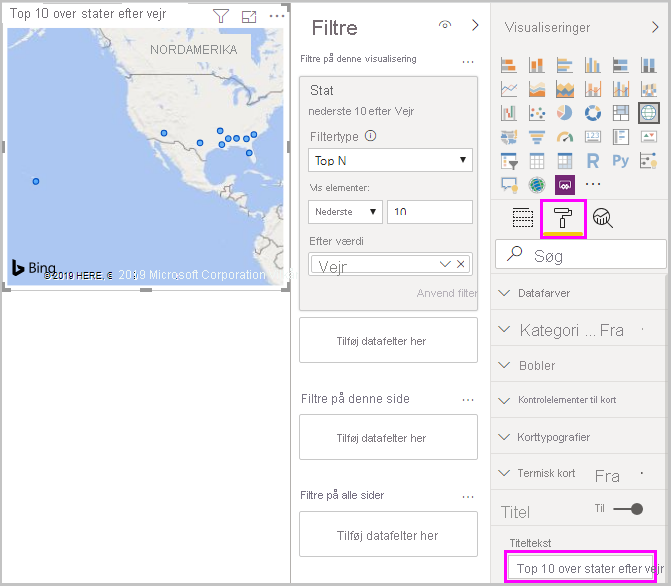

Hvis du vil tilføje en visualisering, der viser navnene på de øverste 10 stater med godt vejr og deres rangering fra 1 til 10, skal du vælge et tomt område på lærredet og derefter vælge ikonet **Søjlediagram** i ruden **Visualisering**. Vælg **Stat** og **Vejr** i ruden **Felter**. Et søjlediagram viser de 40 stater i din forespørgsel rangeret fra højeste til laveste numeriske placering eller fra det værste til det bedste vejr. 

Hvis du vil ændre rækkefølgen af rangeringen, så nummer 1 vises først, skal du vælge ellipsen **Flere indstillinger** øverst til højre i visualiseringen og vælge **Sorter stigende** i menuen. 

Hvis du vil begrænse tabellen til de øverste 10 stater, skal du anvende det samme filter Nederste 10, som du gjorde for kortvisualiseringen. 

Omdøb visualiseringen på samme måde som for kortvisualiseringen. I afsnittet **Format** i ruden **Visualisering** kan du desuden ændre **Y-akse** > **Aksetitel** fra **Vejr** til *Vejrrangering* for at gøre den lettere forståelig. Slå vælgeren for **Y-aksen** til **Fra**, og omdan derefter **Datanavne** til **Til**.

Nu vises de øverste 10 stater med godt vejr i rækkefølge efter deres numeriske rang.

Du kan oprette lignende eller andre visualiseringer for felterne **Prisbillighed** og **Overordnet rangering**, eller du kan kombinere flere felter til én visualisering. Du kan oprette alle mulige forskellige interessante rapporter og visualiseringer. Visualiseringerne **Tabel** og **Kurvediagram og grupperet søjlediagram** viser de øverste 10 stater med godt vejr sammen med deres prisbillighed og overordnede rangering:

Du kan få vist forskellige visualiseringer på forskellige rapportsider. Hvis du vil tilføje en ny side, skal du vælge symbolet **+** ud for de eksisterende sider på sidepanelet eller vælge **Indsæt** > **Ny side** på fanen **Hjem** på båndet. Hvis du vil omdøbe en side, skal du dobbeltklikke på sidens navn på sidepanelet eller højreklikke på siden og vælge **Omdøb side**og derefter skrive det nye navn. Du går til en anden side i rapporten ved at vælge siden i sidepanelet. 

Du kan føje tekstfelter, billeder og knapper til rapportsiderne fra gruppen **Indsæt** på fanen **Hjem**. Hvis du vil angive formateringsindstillinger for visualiseringer, skal du vælge en visualisering og derefter vælge ikonet **Format** i ruden **Visualiseringer**. Hvis du vil konfigurere sidestørrelser, baggrunde og andre sideoplysninger, skal du vælge ikonet **Format**, uden at der er valgt nogen visualisering.

Når du er færdig med at oprette dine sider og visualiseringer, skal du vælge **Fil** > **Gem** og gemme din rapport. 

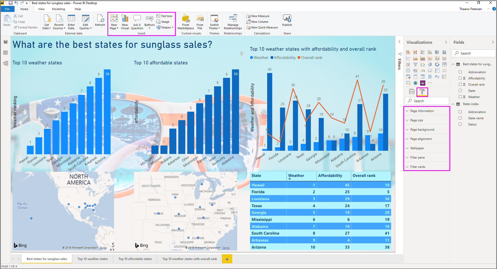

Du kan finde flere oplysninger om rapporter under [Rapportvisning i Power BI Desktop](../create-reports/desktop-report-view.md).

## Del dit arbejde
Nu, hvor du har en Power BI Desktop-rapport, kan du dele den med andre. Der er et par forskellige måder at dele dit arbejde på. Du kan distribuere *PBIX-filen* som enhver anden fil, du kan uploade *PBIX-filen* fra Power BI-tjenesten, eller du kan udgive den direkte fra Power BI Desktop til Power BI-tjenesten. Du skal have en Power BI-konto for at kunne publicere eller uploade rapporter til Power BI-tjenesten. 

Hvis du vil publicere til **Power BI-tjenesten** fra Power BI Desktop, skal du vælge **Publicer** på båndet **Hjem**.

Du bliver muligvis bedt om at logge på Power BI eller at vælge en destination.

Når publiceringsprocessen er gennemført, får du vist den følgende dialogboks:

Når du vælger linket for at åbne rapporten i Power BI, åbnes din rapport på Power BI-webstedet under **Mit arbejdsområde** > **Rapporter**. 

Du kan også dele dit arbejde ved at indlæse de fra **Power BI**-tjenesten. Gå til *https:\//app.powerbi.com* for at åbne Power BI i en browser. Vælg **Hent data** på **startsiden** i Power BI for at starte indlæsningen af din Power BI Desktop-rapport.

Vælg **Hent** i afsnittet **Filer** på den næste side.

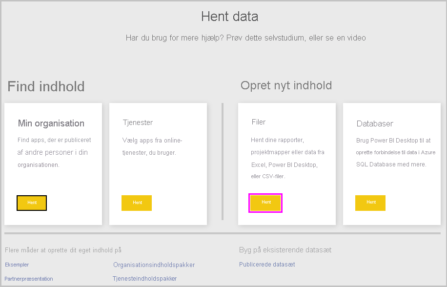

Vælg **Lokal fil** på den næste side. Gå til og vælg din *PBIX-fil* fra Power BI Desktop, og vælg **Åbn**. 

Når filen er importeret, kan du se den under **Mit arbejdsområde** > **Rapporter** i venstre rude i Power BI-tjenesten.

Når du vælger filen, vises den første side i rapporten. Du kan vælge forskellige sider under fanerne til venstre i rapporten. 

Du kan foretage ændringer af en rapport i **Power BI-tjenesten** ved at vælge **Flere indstillinger** > **Rediger** øverst på lærredet. Vælg **Gem en kopi** for at gemme dine ændringer.

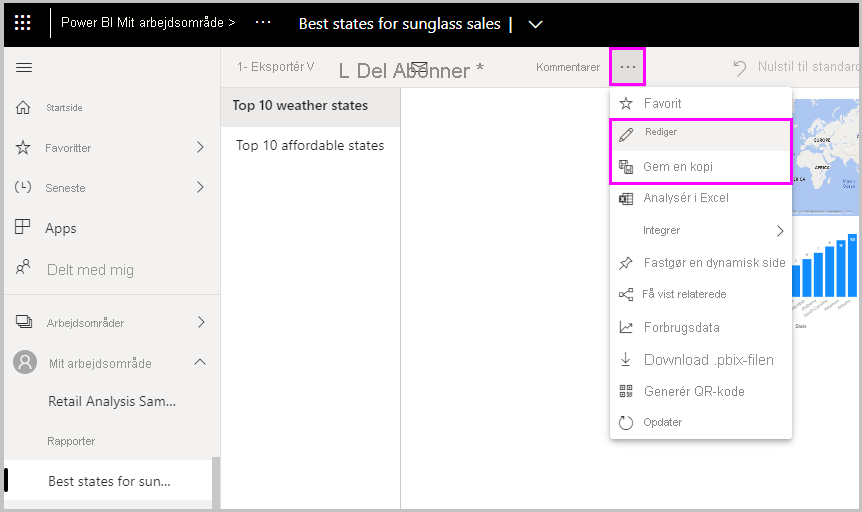

Der er alle mulige forskellige interessante visualiseringer, du kan oprette i **Power BI-tjenesten** på baggrund af din rapport og fastgøre til et *dashboard*. Du kan få mere at vide om dashboards i **Power BI-tjenesten** under [Tip til design af et fantastisk dashboard](../create-reports/service-dashboards-design-tips.md). Du kan finde flere oplysninger om oprettelse, deling og ændring af dashboards under [Del et dashboard](../collaborate-share/service-share-dashboards.md).

Hvis du vil dele en rapport eller et dashboard, skal du vælge **Del** øverst i den åbne rapport eller på den åbne dashboardside eller vælge ikonet **Del** ud for rapport- eller dashboardnavnet i **Mit arbejdsområde** > **Rapporter** eller **Mit arbejdsområde** > **Dashboards**.

Fuldfør **deling af rapporten** eller **deling af dashboardet** for at sende en mail eller få et link til deling af din rapport eller dit dashboard med andre. 

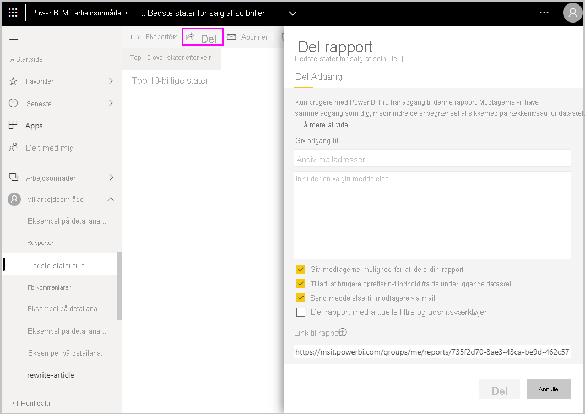

Der er mange forskellige overbevisende datarelaterede miks og visualiseringer, du kan oprette vha. Power BI Desktop og Power BI-tjenesten. 

## Næste trin
Power BI Desktop understøtter, at der oprettes forbindelse til en port til diagnosticering. Med porten til diagnosticering kan andre værktøjer oprette forbindelse til og udføre sporing til diagnosticering. Når porten til diagnosticering benyttes, *understøttes ændring af modellen ikke. Ændringer i modellen vil muligvis beskadige data eller medføre tab af data.*

Du kan finde flere oplysninger om Power BI Desktop og dets mange egenskaber i følgende ressourcer:

* [Oversigt over forespørgsler i Power BI Desktop](../transform-model/desktop-query-overview.md)
* [Datakilder i Power BI Desktop](../connect-data/desktop-data-sources.md)
* [Opret forbindelse til data i Power BI Desktop](../connect-data/desktop-connect-to-data.md)
* [Selvstudium: Udform og kombiner data med Power BI Desktop](../connect-data/desktop-shape-and-combine-data.md)
* [Almindelige forespørgselsopgaver i Power BI Desktop](../transform-model/desktop-common-query-tasks.md)   
