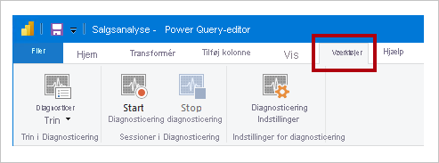

# <a name="monitor-report-performance-in-power-bi"></a>Overvåg rapportens ydeevne i Power BI

Overvåg rapportens ydeevne i Power BI Desktop ved hjælp af [Effektivitetsanalyse](../create-reports/desktop-performance-analyzer.md), og overvåg ydeevnen af det indhold, der er udrullet i din organisations Power BI Premium-kapacitet, ved hjælp af [Power BI Premium Metrics-appen](../admin/service-premium-metrics-app.md). Få mere at vide om, hvor flaskehalsene er, og få mere at vide om, hvordan du forbedrer rapportens ydeevne.

Overvågning af ydeevne er relevant i følgende situationer:

- Opdateringen af importdatamodellen er langsom.
- Dine DirectQuery-eller Live Connection-rapporter er langsomme.
- Dine modelberegninger er langsomme.

Langsomme forespørgsler eller rapportvisualiseringer bør være omdrejningspunktet for fortsat optimering.

## <a name="use-query-diagnostics"></a>Brug af forespørgselsdiagnosticering

Brug [forespørgselsdiagnosticering](/power-query/QueryDiagnostics) i Power BI Desktop til at afgøre, hvad der sker i Power-forespørgsel, når du får vist eksempler på eller anvender forespørgsler. Du kan desuden bruge funktionen _Diagnosticer trin_ til at registrere detaljerede evalueringsoplysninger for hvert forespørgselstrin. Resultaterne er tilgængelige i en Power-forespørgsel, og du kan anvende transformationer, så du bedre kan forstå udførelsen af forespørgsler.

> [!NOTE]
> Forespørgselsdiagnosticering er i øjeblikket en funktion i prøveversion, og du skal derfor aktivere den i _Indstillinger_. Når den er aktiveret, er kommandoerne tilgængelige i vinduet Power-forespørgselseditor under fanen **Værktøjer** på båndet.



## <a name="use-performance-analyzer"></a>Brug Effektivitetsanalyse

Brug [Ydeevneanalyse](../create-reports/desktop-performance-analyzer.md) i Power BI Desktop for at finde ud af, hvordan ydeevnen er for alle dine rapportelementer, f.eks. visualiseringer og DAX-formler. Det er især nyttigt at afgøre, om det er forespørgslen eller gengivelsen af visualiseringen, der bidrager til ydeevneproblemer.

## <a name="use-sql-server-profiler"></a>Brug af SQL Server Profiler

Du kan også bruge [SQL Server Profiler](/sql/tools/sql-server-profiler/sql-server-profiler) til at identificere forespørgsler, der er langsomme.

> [!NOTE]
> SQL Server Profiler fås som del af [SQL Server Management Studio](/sql/ssms/download-sql-server-management-studio-ssms).

Brug SQL Server Profiler, når din datakilde er enten:

- SQL Server
- SQL Server Analysis Services
- Azure Analysis Services

> [!CAUTION]
> Power BI Desktop understøtter, at der oprettes forbindelse til en port til diagnosticering. Med porten til diagnosticering kan andre værktøjer oprette forbindelse til og udføre sporing til diagnosticering. Det understøttes ikke at ændre Power BI Desktop-modellen. Ændringer i modellen vil muligvis beskadige data eller medføre tab af data.

Følg disse instruktioner for at oprette en SQL Server Profiler-sporing:

1. Åbn Power BI Desktop-rapporten (så det er nemt at finde porten i næste trin). Luk alle andre åbne rapporter.
1. Hvis du vil finde ud af, hvilken port der bruges af Power BI Desktop, skal du i PowerShell (med administratorrettigheder) eller i kommandoprompten angive følgende kommando:
    ```powershell
    netstat -b -n
    ```
    Outputtet bør være en liste over programmer og de tilhørende åbne porte. Søg efter porten, der bruges af **msmdsrv.exe**, og udskriv til senere brug. Det er din forekomst af Power BI Desktop.
1. Sådan opretter du forbindelse mellem SQL Server Profiler og Power BI Desktop-rapporten:
    1. Åbn SQL Server Profiler.
    1. Vælg _Ny sporing_ i menuen _Filer_ i SQL Server Profiler.
    1. Vælg **Analysis Services** for _Servertype_.
    1. Indtast **localhost:[port recorded earlier]** i _Servernavn_.
    1. Klik på _Kør_ – nu er SQL Server Profiler-sporingen i gang med at undersøge Power BI Desktop-forespørgsler.
1. Når Power BI Desktop-forespørgsler udføres, kan du se deres respektive varigheder og CPU-tider. Afhængigt af datakildetypen kan du se andre hændelser, der angiver, hvordan forespørgslen blev udført. Du kan bruge disse oplysninger til at finde ud af, hvilke forespørgsler der er flaskehalse.

En fordel ved at bruge SQL Server Profiler er, at det er muligt at gemme et SQL Server-databasespor (relationsdatabase). Sporingen kan blive et input til [Optimeringsrådgivning til databaseprogram](/sql/relational-databases/performance/start-and-use-the-database-engine-tuning-advisor). På denne måde kan du få anbefalinger til, hvordan du tilpasser din datakilde.

## <a name="monitor-premium-metrics"></a>Overvåg Premium-målepunkter

I forbindelse med Power BI Premium-kapaciteter kan du bruge appen **Power BI Premium Metrics** til at administrere dit Power BI Premium-abonnements tilstand og kapacitet. Du kan finde flere oplysninger under [Power BI Premium-appen](../admin/service-premium-metrics-app.md).

## <a name="next-steps"></a>Næste trin

Du kan finde flere oplysninger om denne artikel i følgende ressourcer:

- [Forespørgselsdiagnosticering](/power-query/QueryDiagnostics)
- [Effektivitetsanalyse](../create-reports/desktop-performance-analyzer.md)
- [Fejlfind rapportens ydeevne i Power BI](report-performance-troubleshoot.md)
- [Appen Power BI Premium Metrics](../admin/service-premium-metrics-app.md)
- Har du spørgsmål? [Prøv at spørge Power BI-community'et](https://community.powerbi.com/)
- Forslag? [Få ideer til at forbedre Power BI](https://ideas.powerbi.com/)
