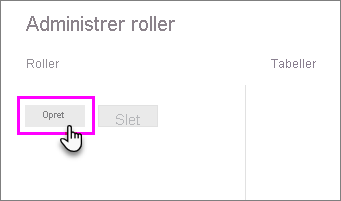

## <a name="define-roles-and-rules-in-power-bi-desktop"></a>Definer roller og regler i Power BI Desktop
Du kan definere roller og regler i Power BI Desktop. Når du publicerer til Power BI, publiceres rolledefinitionerne også.

Følg disse trin for at definere sikkerhedsroller.

1. Importér data til din Power BI Desktop-rapport, eller konfigurer en DirectQuery-forbindelse.
   
   > [!NOTE]
   > Du kan ikke definere roller i Power BI Desktop for direkte forbindelser til Analysis Services. Det skal du gøre i Analysis Services-modellen.
   > 
   > 
2. Vælg **Administrer roller** på fanen **Udformning**.
   
   
3. Vælg **Opret** i vinduet **Administrer roller**.
   
   
4. Angiv et navn for rollen under **Roller**. 
5. Vælg den tabel, hvor du vil anvende en DAX-regel, under **Tabeller**.
6. I feltet **Tabelfilter for DAX-udtryk** skal du angive DAX-udtrykkene. Dette udtryk returnerer værdien true eller false. For eksempel: ```[Entity ID] = “Value”```.
      
   

   > [!NOTE]
   > Du kan bruger *username()* i udtrykket. Vær opmærksom på, at *username()* har formatet *DOMÆNE\brugernavn* i Power BI Desktop. I Power BI-tjenesten og Power BI-rapportserver har det format som brugerens eget hovednavn. Du kan også bruge *userprincipalname()* , som altid returnerer brugeren i samme format som brugerens hovednavn *brugernavn\@contoso.com*.
   > 
   > 

7. Når du har oprettet DAX-udtrykket, kan du markere afkrydsningsfeltet over udtryksfeltet for at validere udtrykket.
      
   
   
   > [!NOTE]
   > I dette udtryksfelt bruger du kommaer til at adskille argumenter for DAX-funktionen, selvom du bruger en landestandard, der normalt bruger semikolon som separator (f.eks. fransk eller tysk). 
   >
   >
   
8. Vælg **Gem**.

Du kan ikke tildele brugere til en rolle i Power BI Desktop. Dem tildeler du i Power BI-tjenesten. Du kan aktivere dynamisk sikkerhed i Power BI Desktop ved at bruge DAX-funktionen *username()* eller *userprincipalname()* og have konfigureret de relevante relationer. 

