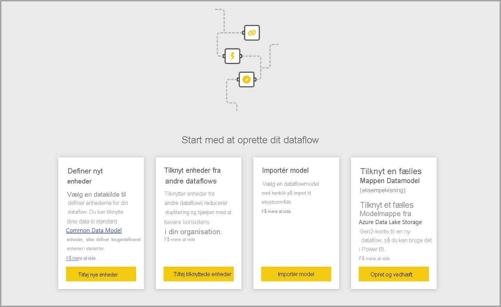
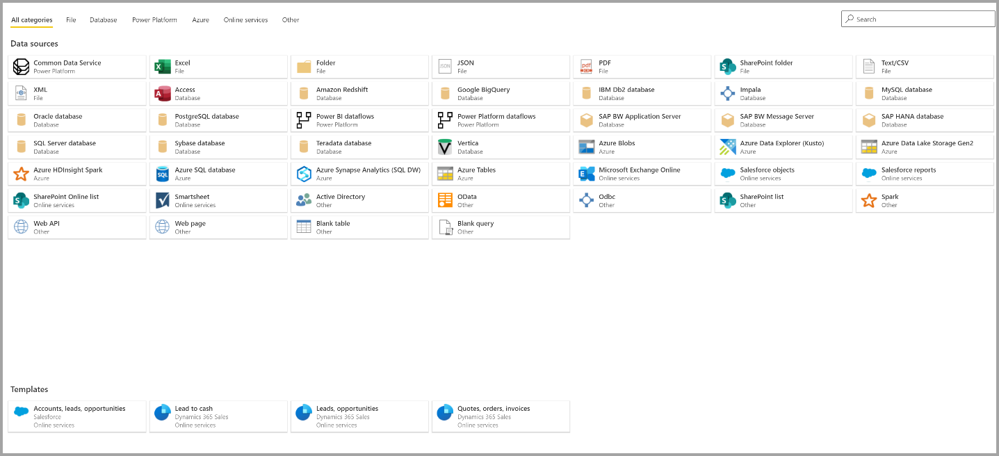
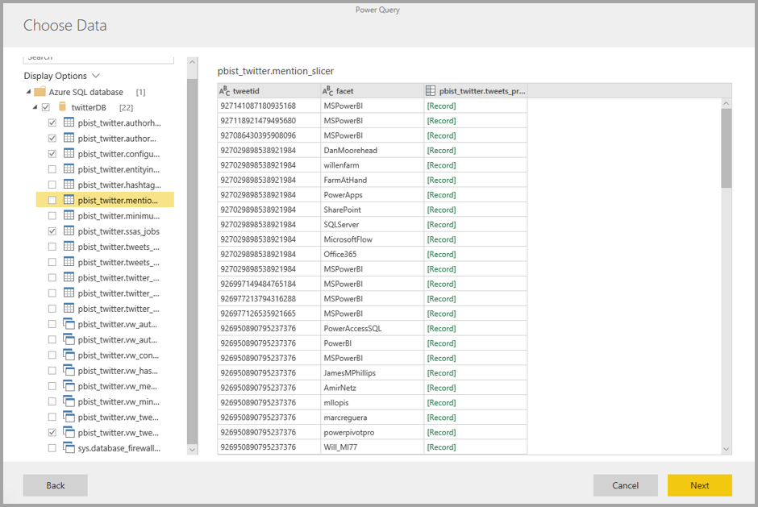
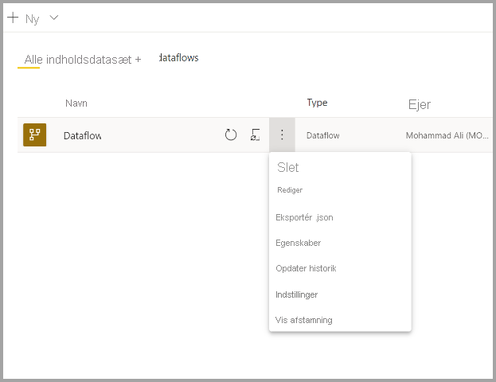

# Oprettelse af et dataflow
Et **dataflow** er en samling af objekter (objekter er ligesom tabeller), der oprettes og administreres i arbejdsområder i Power BI-tjenesten. En **enhed/tabel** er et sæt felter, der bruges til at lagre data på samme måde som en tabel i en database. Du kan tilføje og redigere enheder/tabeller i dataflowet samt administrere tidsplaner for opdatering af data direkte fra det arbejdsområde, hvor dataflowet er oprettet.

Du opretter et dataflow ved at starte Power BI-tjenesten i en browser og derefter vælge et **arbejdsområde** i navigationsruden til venstre, som vist på følgende skærm. Dataflow er ikke tilgængelige i *Mit arbejdsområde* i Power BI-tjenesten. Du kan også oprette et nyt arbejdsområde, hvor du kan oprette dit nye dataflow.

Der er flere måder at oprette eller bygge oven på et nyt dataflow på:

* [Opret et dataflow ved hjælp af Definer nye enheder](#create-a-dataflow-using-define-new-entities)
* [Opret et dataflow ved hjælp af sammenkædede enheder](#create-a-dataflow-using-linked-entities)
* [Opret et dataflow ved hjælp af en beregnet enhed](#create-a-dataflow-using-a-computed-entity)
* [Opret et dataflow ved hjælp af Importér/Eksportér](#create-a-dataflow-using-importexport)

I de følgende afsnit kan du se flere detaljer om, hvordan du opretter et dataflow.

## Opret et dataflow ved hjælp af Definer nye enheder

Når du bruger indstillingen Definer nye enheder, kan du definere en ny enhed/tabel og oprette forbindelse til en ny datakilde.

Når du vælger en datakilde, bliver du bedt om at angive forbindelsesindstillingerne, herunder den konto, der skal bruges, når du opretter forbindelse til datakilden, som vist på følgende billede.

Når du har forbindelse, kan du vælge, hvilke data der skal bruges til dit objekt. Når du vælger data og en kilde, opretter Power BI forbindelse til datakilden igen for at holde data i dataflowet opdateret med den hyppighed, som du vælger senere i konfigurationsprocessen.

Når du vælger data til brug i objektet, kan du anvende datafloweditoren til at forme eller transformere disse data til det format, der er nødvendigt til brug i dit dataflow. 

## Opret et dataflow ved hjælp af sammenkædede enheder

Når du opretter en data flow ved hjælp af sammenkædede enheder, kan du henvise til et eksisterende objekt, der er defineret i et andet dataflow, på en skrivebeskyttet måde. På følgende liste beskrives nogle af årsagerne til at vælge denne fremgangsmåde:

* Hvis du vil genbruge en enhed på tværs af flere dataflow, f. eks. et datoobjekt eller en statisk opslagstabel, skal du oprette en enhed én gang og derefter referere til den på tværs af andre dataflow.

* Hvis du vil undgå at oprette flere opdateringer af en datakilde, er det bedre at bruge sammenkædede enheder til at gemme dataene, og de fungerer også som en cache. Det gør det muligt for alle efterfølgende forbrugere at udnytte denne enhed, hvilket reducerer belastningen af den underliggende datakilde.

* Hvis du har brug for at udføre en fletning mellem to enheder.

> [!NOTE]
> Sammenkædede enheder er kun tilgængelige med Power BI Premium.

## Opret et dataflow ved hjælp af en beregnet enhed

Når du opretter en dataflow ved hjælp af en beregnet enhed, kan du referere til en sammenkædet enhed og udføre handlinger oven på den på en skrivebeskyttet måde. Resultatet er en ny enhed, som er en del af dataflowet. Hvis du vil konvertere en sammenkædet enhed til en beregnet enhed, kan du enten oprette en ny forespørgsel fra en flettehandling, eller, hvis du vil redigere eller transformere enheden, oprette en reference til eller en dublet af enheden.

### Sådan opretter du beregnede objekter

Når du har et dataflow med en liste over objekter, kan du udføre beregninger af disse objekter.
I værktøjet til oprettelse af dataflow i Power BI-tjenesten skal du vælge **Rediger objekter**, derefter højreklikke på det objekt, du vil bruge som udgangspunkt for dit beregnede objekt, og som du vil udføre beregninger af. I genvejsmenuen skal du vælge **Reference**.
Du skal markere indstillingen **Aktivér indlæsning**, som vist på nedenstående billede, for at objektet kan vælges som beregnet objekt. Højreklik på objektet for at få vist denne genvejsmenu.

Når du markerer **Aktivér indlæsning**, opretter du et nyt objekt, hvor kilden er det refererede objekt. Ikonet ændres, og ikonet **beregnet** vises, som det fremgår af følgende billede.

Alle de transformationer, du udfører i forbindelse med det nyligt oprettede objekt, køres ved hjælp af de data, der allerede findes i Power BI-dataflowlageret. Det betyder, at forespørgslen ikke køres i forhold til den eksterne datakilde, som dataene blev importeret fra (f.eks. den SQL-database, dataene blev hentet fra), men i stedet udføres på de data, der er placeret i dataflowlageret.

**Eksempel på use cases** Hvilken type transformationer kan udføres vha. beregnede objekter? Alle transformationer, du normalt angiver vha. transformationsbrugergrænsefladen i Power BI eller M-editoren, understøttes, når du udfører i lager-beregninger.

Se følgende eksempel: Du har et *Account*-objekt, der indeholder rådata for alle kunderne fra dit Dynamics 365-abonnement. Du har også rådata om *ServiceCalls* fra Service Center med data fra supportopkald, der blev udført fra den anden konto hver dag hele året.

Forestil dig, at du vil forbedre *Account*-objektet med data fra disse *ServiceCalls*.
Først skal du samle dataene fra *ServiceCalls* for at beregne antallet af supportopkald, der blev udført for hver konto i det seneste år.

Derefter vil du flette *Account*-objektet med *ServiceCallsAggregated*-objektet for at beregne den forbedrede *Account*-tabel.

Derefter kan du se resultaterne, der vises som *EnrichedAccount* på følgende billede.

Og det er det – transformationen er udført vha. dataene i det dataflow, der er placeret i dit Power BI Premium-abonnement, og ikke på kildedataene.

> [!NOTE]
> Beregnede enheder er kun en Premium-funktion

## Opret et dataflow ved hjælp af en CDM-mappe

Når du opretter en data flow ud fra en CDM-mappe, kan du referere til en enhed, der er skrevet af et andet program i CDM-format (Common Data model). Du bliver bedt om at angive den fulde sti til CDM-formatfilen, der er gemt i ADLS Gen 2.

 

Der er et par krav til oprettelse af dataflow fra CDM-mapper, som beskrevet på følgende liste:

* ADLS Gen 2-kontoen skal have de relevante tilladelser konfigureret, så det er muligt for PBI at få adgang til filen

* ADLS Gen 2-kontoen skal være tilgængelig for den bruger, der forsøger at oprette dataflowet

* Oprettelse af dataflow fra CDM-mapper er kun tilgængelig i den nye arbejdsområdeoplevelse

* URL-adressen skal være en direkte filsti til JSON-filen og bruge ADLS Gen 2-slutpunktet. blob.core understøttes ikke

## Opret en dataflow ved hjælp af Importér/Eksportér

Når du opretter en data flow ved hjælp af Importér/Eksportér, kan du importere et dataflow fra en fil. Det er nyttigt, hvis du vil gemme en dataflowkopi offline eller flytte et dataflow fra ét arbejdsområde til et andet. 

Hvis du vil eksportere et dataflow, skal du vælge det dataflow, du har oprettet, og vælge menupunktet **Mere** (ellipsen) for at udvide indstillingerne og derefter vælge **export.JSON**. Du bliver bedt om at gå i gang med at downloade dataflowet, der repræsenteres i CDM-format.

Hvis du vil importere et dataflow, skal du markere feltet Importér og uploade filen. Power BI opretter dataflow for dig og gør det muligt for dig at gemme dataflowet, som det er, eller til at udføre yderligere transformationer.

## Næste trin

Når du opretter et dataflow, kan du bruge Power BI Desktop og Power BI-tjenesten til at oprette datasæt, rapporter, dashboards og apps, der er baseret på de data, som du placerer i Power BI-dataflow, og dermed få indsigt i dine forretningsaktiviteter. I de følgende artikler kommer vi nærmere ind på almindelige forbrugsscenarier for dataflows:

* [Introduktion til dataflow og selvbetjent dataforberedelse](dataflows-introduction-self-service.md)
* [Konfigurer og brug et dataflow](dataflows-configure-consume.md)
* [Konfiguration af dataflowlager til brug af Azure Data Lake Gen 2](dataflows-azure-data-lake-storage-integration.md)
* [Premium-funktioner for dataflow](dataflows-premium-features.md)
* [AI med dataflow](dataflows-machine-learning-integration.md)
* [Begrænsninger og overvejelser i forbindelse med dataflow](dataflows-features-limitations.md)
* [Bedste praksis i forbindelse med dataflow](dataflows-best-practices.md)