# AI med dataflow

I denne artikel diskuterer vi, hvordan du kan bruge kunstig intelligens (AI) sammen med dataflow. De områder, der er beskrevet i denne artikel, er følgende:

* Cognitive Services
* Automatiseret maskinel indlæring
* Integration af Microsoft Azure Machine Learning

## Cognitive Services i Power BI

Med Cognitive Services i Power BI kan du anvende forskellige algoritmer fra [Azure Cognitive Services](https://azure.microsoft.com/services/cognitive-services/) til forbedre dine data i den selvbetjente dataforberedelse til dataflow.

De tjenester, der understøttes i dag, er [Synspunktsanalyse](/azure/cognitive-services/text-analytics/how-tos/text-analytics-how-to-sentiment-analysis), [Udtrækning af nøglesætninger](/azure/cognitive-services/text-analytics/how-tos/text-analytics-how-to-keyword-extraction), [Registrering af sprog](/azure/cognitive-services/text-analytics/how-tos/text-analytics-how-to-language-detection) og [Billedmarkering](/azure/cognitive-services/computer-vision/concept-tagging-images). Transformationerne udføres i Power BI-tjenesten og kræver ikke et Azure Cognitive Services-abonnement. Denne funktion kræver Power BI Premium.

### **Aktivering af AI-funktioner**

Cognitive Services understøttes i forbindelse med Premium-kapacitetsnoder EM2, A2 eller P1 og højere. En separat AI-arbejdsbelastning i kapaciteten bruges til at køre Cognitive Services. Denne arbejdsbelastning er som standard deaktiveret i den offentlige prøveversion (før juni 2019). Før du bruger Cognitive Services i Power BI, skal AI-arbejdsbelastningen være aktiveret i indstillingerne for kapaciteten på administrationsportalen. Du kan slå AI-arbejdsbyrden til i afsnittet for arbejdsbelastninger og definere den maksimale hukommelsesmængde, denne opgave må forbruge. Den anbefalede hukommelsesgrænse er 20 %. En overskridelse af denne grænse medfører, at forespørgslen bliver langsommere.

### **Introduktion til Cognitive Services i Power BI**

Cognitive Services-transformationer er en del af den [selvbetjente dataforberedelse til dataflow](https://powerbi.microsoft.com/blog/introducing-power-bi-data-prep-wtih-dataflows/). Hvis du vil forbedre dine data vha. Cognitive Services, kan du begynde med at redigere et dataflow.

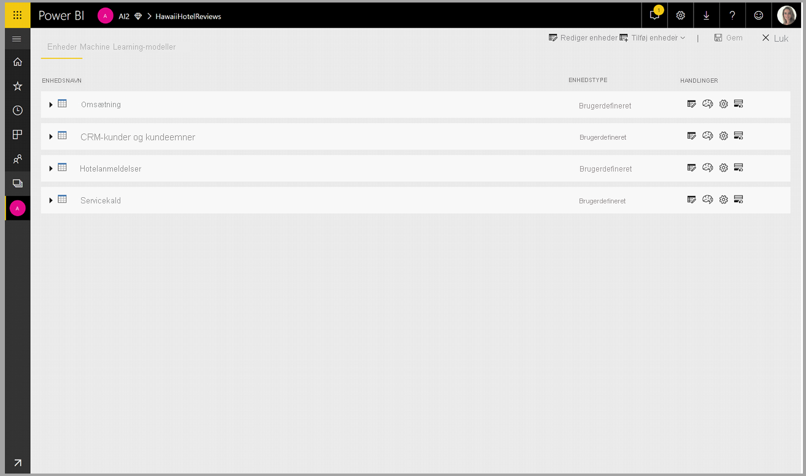

Tryk på knappen **AI Insights** på båndet øverst i Power-forespørgselseditor.

I pop op-vinduet skal du vælge den funktion, du vil bruge, og de data du vil transformere. I dette eksempel scorer jeg synspunktet for en kolonne, der indeholder tekst til gennemsyn.

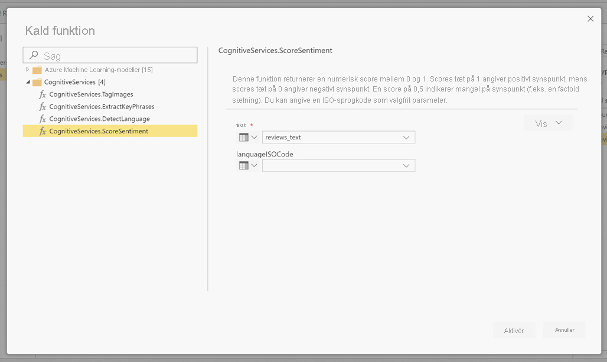

**Kulturinfo** er et valgfrit input til at angive sproget i teksten. Dette felt forventer en ISO-kode. Du kan bruge en kolonne som input til Kulturinfo eller et statisk felt. I dette eksempel er sproget angivet som engelsk (en) for hele kolonnen. Hvis du ikke udfylder dette felt, registrerer Power BI automatisk sproget, inden funktionen anvendes. Derefter skal du vælge **Aktivér.**

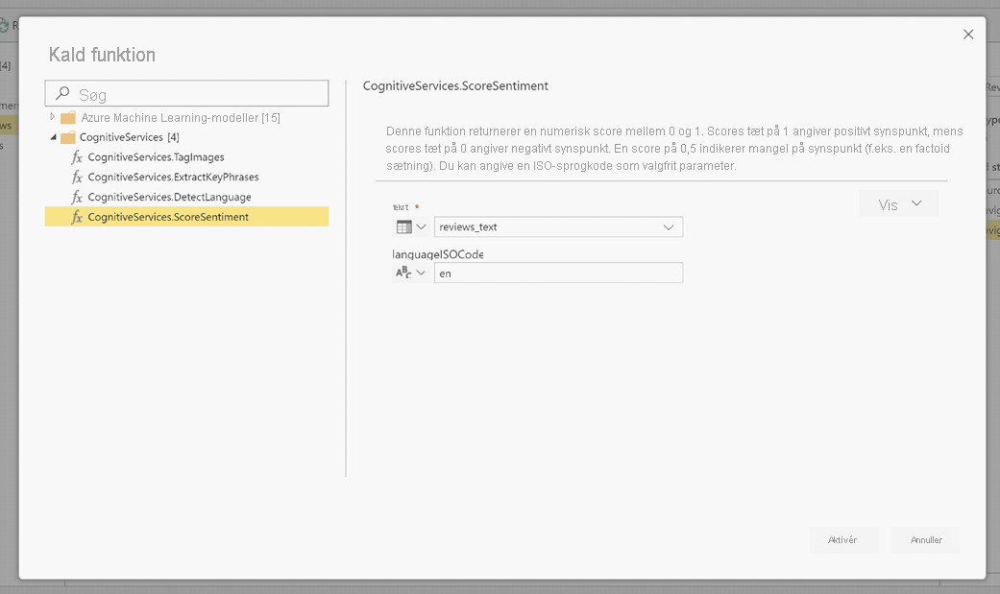

Når funktionen er aktiveret, tilføjes resultatet som en ny kolonne i tabellen. Transformationen tilføjes også som et anvendt trin i forespørgslen.

Hvis funktionen returnerer felter med flere output, vil en aktivering af funktionen tilføje en ny kolonne med en post for felterne med flere output.

Brug indstillingen Udvid til at tilføje en eller begge værdier som kolonner til dine data.

### **Tilgængelige funktioner**

I dette afsnit beskrives de tilgængelige funktioner i Cognitive Services i Power BI.

#### **Registrer sprog**

Funktionen til sprogregistrering evaluerer tekstinput og returnerer sprognavn og ISO-id for hvert felt. Denne funktion er nyttig for datakolonner, der indsamler vilkårlig tekst, hvor sproget er ukendt. Funktionen forventer data i tekstformat som input.

Tekstanalyse genkender op til 120 sprog. Du kan finde flere oplysninger under [understøttede sprog](/azure/cognitive-services/text-analytics/text-analytics-supported-languages).

#### **Udtræk af nøgleudtryk**

Funktionen til **udtræk af nøgleudtryk** evaluerer ustruktureret tekst og returnerer en liste over nøgleudtryk for hvert enkelt tekstfelt. Funktionen kræver et tekstfelt som input og accepterer et valgfrit input for **Kulturinfo**. (Se afsnittet **Introduktion** tidligere i denne artikel).

Udtræk af nøgleudtryk fungerer bedst, når du giver større tekstdele at arbejde med. Dette er det modsatte fra analyse af synspunkter, som fungerer bedre med mindre tekstdele. Hvis du vil have de bedste resultater fra begge handlinger, bør du derfor overveje at omstrukturere input.

#### **Scor synspunkt**

Funktionen til **scoring af synspunkt** evaluerer tekstinput og returnerer en synspunktsscore for hvert dokument, der spænder fra 0 (negativ) til 1 (positiv). Denne funktion er nyttig i forbindelse med registrering af positive og negative synspunkter på sociale medier, i kundeanmeldelser og debatforummer.

Tekstanalyse bruger en maskinel indlæringsklassificeringsalgoritme til at generere en synspunktscore mellem 0 og 1. Scorer tæt på 1 indikerer et positivt synspunkt, mens scorer tæt på 0 indikerer et negativt synspunkt. Modellen er oplært ved hjælp af en omfattende tekstmængde med tilknyttede synspunkter. Det er i øjeblikket ikke muligt at få dine egne træningsdata. Modellen bruger en kombination af teknikker under tekstanalyse, herunder tekstbehandling, ordklasseanalyse, ordplacering og ordassociationer. Du kan få flere oplysninger om algoritmen under [Introduktion til Tekstanalyse](/archive/blogs/machinelearning/machine-learning-and-text-analytics).

Analyser af synspunkter udføres på hele inputfeltet i modsætning til udtræk af synspunkter for et bestemt objekt i teksten. I praksis er der en tendens til, at scoringsnøjagtigheden forbedres, når dokumenter indeholder en eller to sætninger i stedet for en stor tekstmængde. Under objektivitetsvurderingen bestemmer modellen, om et inputfelt som helhed er objektivt eller indeholder et synspunkt. Et inputfelt, der primært er objektivt fortsætter ikke til synspunktsregistreringsfasen, hvilket resulterer i en score på 0,50 uden yderligere behandling. I forbindelse med inputfelter, der fortsætter i pipelinen, genererer den næste fase en score over eller under 0,50, afhængigt af, hvordan synspunktet registreres i inputfeltet.

I øjeblikket understøtter synspunktsanalysen engelsk, tysk, spansk og fransk. Andre sprog er tilgængelig som prøveversion. Du kan få flere oplysninger under [Understøttede sprog](/azure/cognitive-services/text-analytics/text-analytics-supported-languages).

#### **Tag billeder**

Funktionen **Tag billeder** returnerer tags baseret på mere end 2.000 genkendelige objekter, levende væsener, landskaber og handlinger. Når tags er tvetydige eller ikke er almen viden, giver outputtet "tip", der tydeliggør betydningen af tagget i forbindelse med en kendt kontekst. Tags ikke er organiseret som en taksonomi, og der findes ingen nedarvningshierarkier. En samling af indholdstags udgør fundamentet for en "billedbeskrivelse", der vises som sprog i hele sætninger, der kan læses af mennesker.

Når et billede er uploadet, eller en URL-adresse til et billede er angivet, genereres tags af Computer Vision-algoritmer baseret på de objekter, levende væsener og handlinger, der er identificeret på billedet. Tagging er ikke begrænset til det primære emne, f.eks. en person i forgrunden, men det indeholder også omgivelserne (indendørs eller udendørs), møbler, værktøjer, planter, dyr, tilbehør, gadgets og osv.

Denne funktion kræver en URL-adresse til billedet eller et abase 64-felt som input. I øjeblikket understøtter billedtagging engelsk, spansk, japansk, portugisisk og kinesisk (forenklet). Du kan få flere oplysninger under [Understøttede sprog](/rest/api/cognitiveservices/computervision/tagimage/tagimage#uri-parameters).

## Automatiseret Machine Learning i Power BI

Automatiseret maskinel indlæring (AutoML) til dataflow giver forretningsanalytikere mulighed for at oplære, validere og aktivere modeller til maskinel indlæring (ML) direkte i Power BI. Versionen indeholder en enkel funktion til oprettelse af en ny ML-model, hvor analytikere kan bruge deres dataflows til at angive inputdataene til oplæring af modellen. Tjenesten udtrækker automatisk de mest relevante funktioner, vælger en passende algoritme og finjusterer og validerer ML-modellen. Når en model er oplært, genererer Power BI automatisk en rapport, der indeholder resultaterne af valideringen. Modellen kan derefter aktiveres på alle nye eller opdaterede data i dataflowet.

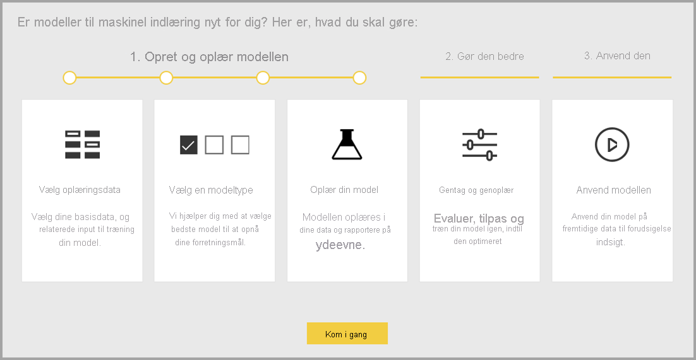

Automatiseret maskinel indlæring er kun tilgængelig for de dataflows, der er hostet i Power BI Premium- og Embedded-kapaciteter.

### Arbejde med AutoML

Dataflow omfatter selvbetjent dataforberedelse af big data. AutoML er integreret i dataflow og giver dig mulighed for at gøre brug af din indsats i forbindelse med dataforberedelse til at skabe modeller til maskinel indlæring direkte i Power BI.

AutoML i Power BI gør det muligt for dataanalytikere at bruge dataflows til at bygge modeller til maskinel indlæring med en forenklet oplevelse udelukkende ved hjælp af Power BI-færdigheder. Det meste af datavidenskaben bag oprettelsen af ML-modellerne er automatiseret i Power BI. Der er retningslinjer, som sikrer, at den skabte model er af god kvalitet og giver synlighed i den proces, der blev brugt til at skabe ML-modellen.

AutoML understøtter oprettelsen af **modeller til binær forudsigelse**, **klassificering** og **regression** til dataflow. Dette er overvågede tekniktyper til maskinel indlæring, hvilket betyder, at de lærer fra kendte resultater af tidligere observationer for at forudsige resultatet af andre observationer. Inputdatasættet til oplæring af en AutoML-model er et sæt poster, der er **mærket** med de kendte resultater.

AutoML i Power BI integrerer [automatiseret maskinel indlæring](/azure/machine-learning/service/concept-automated-ml) fra [Azure Machine Learning](/azure/machine-learning/service/overview-what-is-azure-ml) for at oprette dine modeller til maskinel indlæring. Du behøver dog ikke et Azure-abonnement for at bruge AutoML i Power BI. Processen til oplæring og hosting af ML-modeller administreres udelukkende af Power BI-tjenesten.

Når en ML-model er oplært, genererer AutoML automatisk en Power BI-rapport, der forklarer den sandsynlige ydeevne for din ML-model. AutoML lægger vægt på forklaringsdelen ved at fremhæve nøglefaktorer fra det input, der påvirker de forudsigelser, som returneres af modellen. Rapporten indeholder også vigtige målepunkter for modellen.

Andre sider i den genererede rapport viser den statistiske oversigt over modellen og detaljer om oplæringen. Den statistiske oversigt er interessant for de brugere, der gerne vil se de datavidenskabelige standardmålinger for modellens ydeevne. Detaljerne om oplæringen opsummerer alle de gentagelser, der blev kørt for at oprette din model, med de tilknyttede modelparametre. De beskriver også, hvordan hvert enkelt input blev brugt til at oprette ML-modellen.

Du kan derefter anvende din ML-model på dine data for at få et resultat. Når dataflowet opdateres, opdateres dine data med forudsigelser fra ML-modellen. Power BI indeholder også en individuel forklaring til hver specifikke forudsigelse, som ML-modellen frembringer.

### Oprettelse af en model til maskinel indlæring

Dette afsnit indeholder en beskrivelse af, hvordan du opretter en AutoML-model.

#### Forberedelse af data til oprettelse af en ML-model

Hvis du vil oprette en model til maskinel indlæring i Power BI, skal du først oprette et dataflow til dataene, som indeholder de historiske resultatoplysninger, der bruges til oplæring af ML-modellen. Du skal også tilføje beregnede kolonner for alle forretningsmålepunkter, der kan være effektive forudsigelser for det resultat, du forsøger at forudsige. Du kan finde flere oplysninger om, hvordan du konfigurerer dit dataflow, under [Konfigurer og brug et dataflow](dataflows-configure-consume.md).

AutoML har specifikke datakrav til oplæring af en model til maskinel indlæring. Disse krav er beskrevet i nedenstående afsnit ud fra de respektive modeltyper.

#### Konfiguration af ML-modelinput

Hvis du vil oprette en AutoML-model, skal du vælge ML-ikonet i kolonnen **Handlinger** på dataflowenheden og vælge **Tilføj en model til maskinel indlæring**.

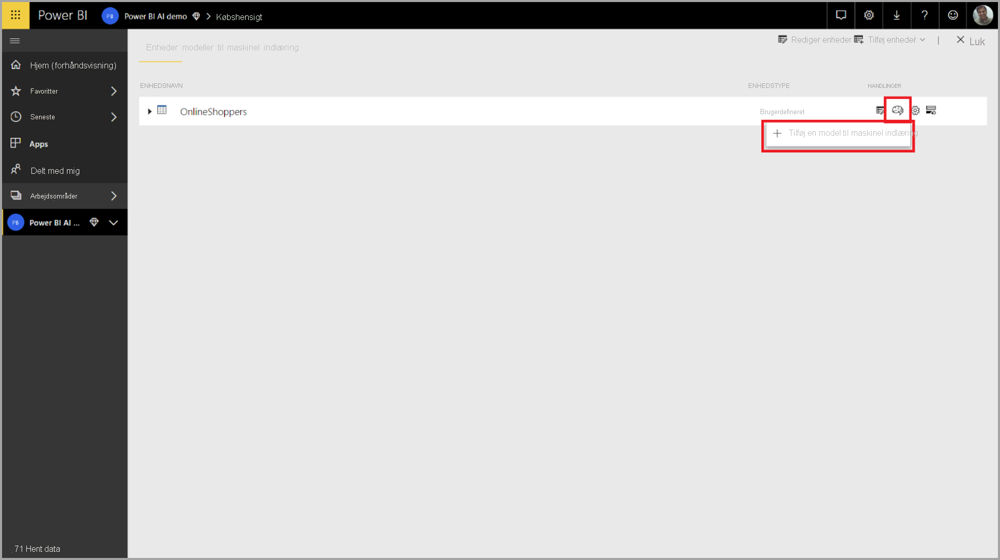

En forenklet proces igangsættes, der består af en guide, som hjælper dig med at oprette en ML-model. Guiden indeholder følgende enkle trin.

**1. Vælg enheden med de historiske data og det resultatfelt, du vil have en forudsigelse for**

Resultatfeltet identificerer mærkatattributten for oplæring af ML-modellen, som vist på følgende billede.

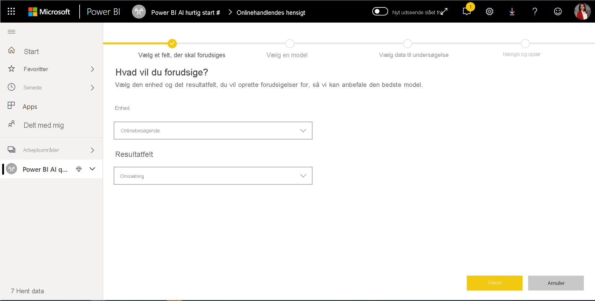

**2. Vælg en modeltype**

Når du angiver resultatfeltet, analyserer AutoML mærkatdataene for at anbefale den mest sandsynlige ML-modeltype, som kan oplæres. Du kan vælge en anden modeltype som vist nedenfor ved at klikke på "Vælg en anden model".

> [!NOTE]
> Visse modeltyper understøttes muligvis ikke for de valgte data og vil derfor være deaktiveret. I ovenstående eksempel er regression deaktiveret, da en tekstkolonne er valgt som resultatfeltet.

**3. Vælg de input, som modellen skal bruge som forudsigende signaler**

AutoML analyserer en stikprøve af den valgte enhed for at komme med forslag til input, der kan bruges til at oplære ML-modellen. Der er forklaringer ved siden af felter, som ikke er markeret. Det anbefales ikke, at et bestemt felt indeholder for mange forskellige værdier eller kun én værdi, eller lav eller høj korrelation med outputfeltet.

Input, der er afhængige af resultatfeltet (eller mærkatfeltet), bør ikke bruges til at oplære ML-modellen, da de påvirker modellens ydeevne. Sådanne felter er markeret med "mistænkelig høj korrelation med outputfelt". Indsættelse af disse felter i oplæringsdataene medfører udslip af mærkater, hvor modellen yder godt i forhold til validerings- eller testdataene, men ikke kan matche denne ydeevne, når den bruges i produktion til angivelse af score. Udslip af mærkater kan være en reel bekymring i AutoML-modeller, når modellens ydeevne er for god til at være sand.

Denne anbefaling til funktioner er baseret på en stikprøve af data, så du bør gennemgå de anvendte input. Du har mulighed for at ændre valgene, så de kun omfatter de felter, du ønsker, at modellen skal undersøge. Du kan også vælge alle felter ved at markere afkrydsningsfeltet ud for navnet på enheden.

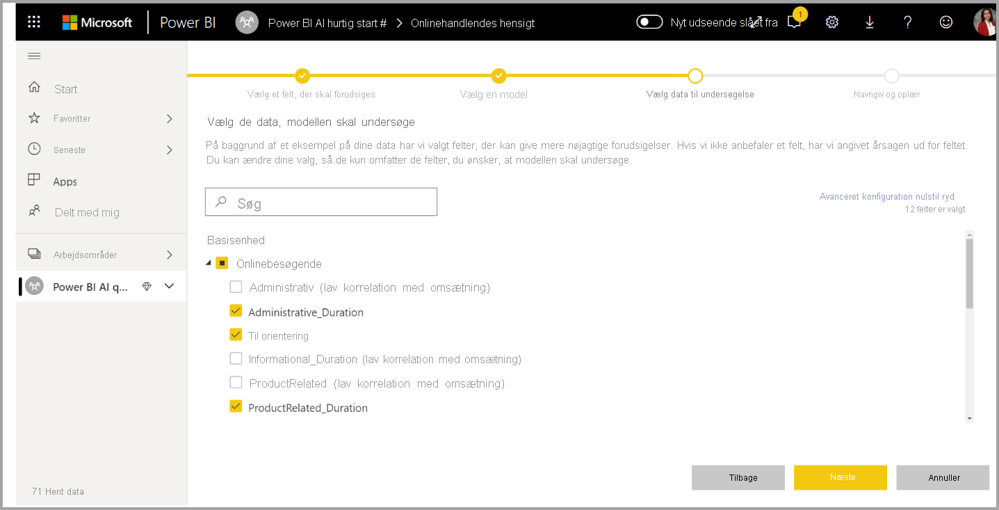

**4. Navngiv din model, og gem konfigurationen**

I det sidste trin kan du navngive modellen og vælge Gem og oplær, hvorved oplæringen af ML-modellen starter. Du kan vælge at reducere oplæringstiden for at få vist resultater hurtigt eller øge den tid, der bruges på oplæringen, så du får den bedste model.

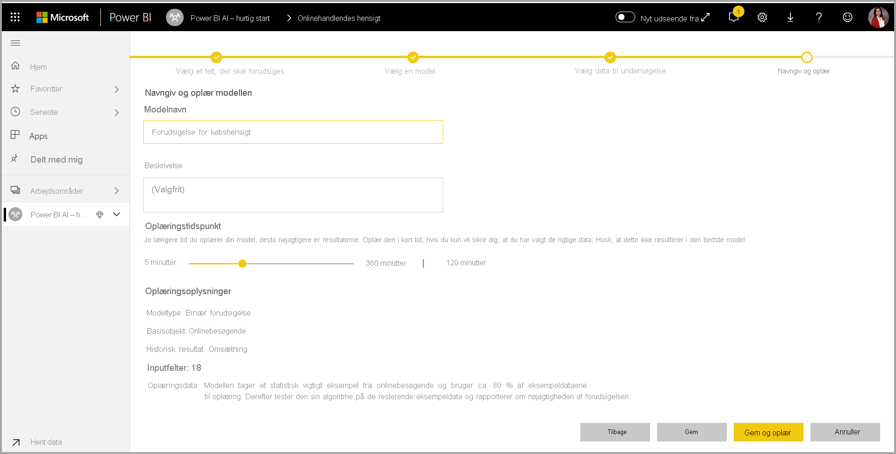

#### Oplæring af ML-model

Oplæring af AutoML-modeller er en del af dataflowopdateringen. AutoML klargør først dine data til oplæring.
AutoML opdeler de angivne historiske data i datasæt til oplæring og test. Testdatasættet er et testsæt, der bruges til at validere modellens ydeevne efter oplæringen. Disse vises som enheder til **oplæring og test** i dataflowet. AutoML bruger krydsvalidering til modelvalideringen.

Derefter analyseres hvert inputfelt, og der foretages en sammenligning, hvor manglende værdier erstattes. AutoML benytter et par forskellige metoder til at foretage udledninger. I forbindelse med inputattributter, der behandles som numeriske funktioner, bruges middelværdien i kolonneværdierne til udledning. I forbindelse med inputattributter, der behandles som kategoriske funktioner, bruger AutoML tilstanden for kolonneværdierne til udledning. Middelværdien og tilstanden for værdier, der bruges til udledning, beregnes af AutoML Framework på baggrund af det underdatasæt til oplæring, der er udtaget til stikprøve.

Derefter anvendes stikprøvetagning og normalisering for dataene, som nødvendigt. I forbindelse med klassificeringsmodeller kører AutoML inputdataene gennem lagdelt stikprøvetagning og balancerer klasserne for at sikre, at rækkeantallet er ens for alle.

AutoML anvender flere transformationer på hvert valgte inputfelt på baggrund af feltets datatype og dets statistiske egenskaber. AutoML bruger disse transformationer til at udtrække funktioner, som kan bruges til oplæring af din ML-model.

Oplæringsprocessen for AutoML-modeller består af op til 50 gentagelser med forskellige modelalgoritmer og indstillinger for hyperparametre for at finde modellen med den bedste ydeevne. Oplæringen kan slutte tidligt med færre gentagelser, hvis AutoML bemærker, at der ikke er nogen forbedring af ydeevnen. Ydeevnen for hver af disse modeller vurderes ved hjælp af validering med testdatasættet. I løbet af dette oplæringstrin opretter AutoML flere pipelines til oplæring og validering af disse gentagelser. Processen med at vurdere modellernes ydeevne kan tage alt lige fra adskillige minutter til et par timer op til den oplæringstid, der er konfigureret i guiden, afhængigt af størrelsen af datasættet og de tilgængelige kapacitetsressourcer.

I nogle tilfælde kan den endelige model, der genereres, bruge Ensemble Learning, hvor der bruges flere modeller til at levere en bedre forudsigelsesydeevne.

#### Forklaringsdelen af AutoML-modellen

Når modellen er blevet oplært, analyserer AutoML relationen mellem inputfunktionerne og modeloutputtet. Størrelsen af ændringen af modeloutputtet for testdatasættet for hver inputfunktion vurderes. Dette kaldes _funktionsprioritet_. Dette sker som en del af opdateringen, når oplæringen er fuldført. Derfor kan opdateringen tage længere tid end den oplæringstid, der er konfigureret i guiden.

#### AutoML-modelrapport

AutoML genererer en Power BI-rapport, der opsummerer modellens ydeevne under validering, sammen med den overordnede funktionsprioritet. Du kan få adgang til denne rapport fra fanen Model til maskinel indlæring efter en vellykket opdatering af dataflowet. Rapporten opsummerer resultaterne i forhold til anvendelse af ML-modellen på testdataene og sammenligner forudsigelserne med de kendte resultatværdier.

Du kan gennemse modelrapporten for at forstå dens ydeevne. Du kan også validere, at nøglefaktorerne for modellen passer til den forretningsmæssige indsigt vedrørende de kendte resultater.

De diagrammer og målinger, der bruges til at beskrive modellens ydeevne i rapporten, afhænger af modeltypen. Disse diagrammer og målinger over ydeevne er beskrevet i følgende afsnit.

Yderligere sider i rapporten kan beskrive statistiske målinger om modellen fra et datavidenskabeligt perspektiv. Rapporten med **binære forudsigelser** indeholder f.eks. et resultatdiagram og ROC-kurven for modellen.

Rapporterne omfatter også siden **Oplæringsoplysninger**, der indeholder en beskrivelse af, hvordan modellen blev oplært, og et diagram, der beskriver modellens ydeevne for hver af de enkelte kørte gentagelser.

I et andet afsnit på denne side beskrives den registrerede type af inputfelt og den udledningsmetode, der bruges til at udfylde manglende værdier. Det indeholder også de parametre, der bruges af den endelige model.

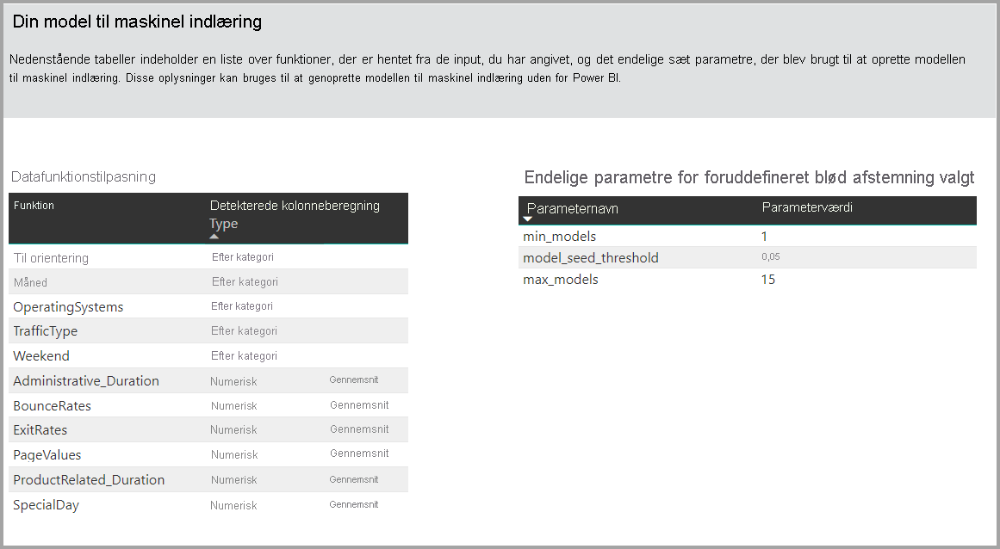

Hvis den skabte model bruger ensembleoplæring, indeholder siden **Oplæringsoplysninger** også et diagram, der beskriver vægtningen af hver komponentmodel i ensemblet samt de tilhørende parametre.

### Anvendelse af AutoML-modellen

Hvis du er tilfreds med ydeevnen i den ML-model, der er blevet oprettet, kan du anvende den på nye eller opdaterede data, når dit dataflow opdateres. Du kan gøre dette fra modelrapporten ved at vælge knappen **Anvend** i øverste højre hjørne eller knappen Anvend ML-model under Handlinger på fanen Model til maskinel indlæring.

Hvis du vil anvende ML-modellen, skal du angive navnet på den enhed, som modellen skal anvendes for, og et præfiks for de kolonner, der føjes til denne enhed for modeloutputtet. Standardpræfikset for kolonnenavnene er modelnavnet. Funktionen _Anvend_ omfatter muligvis yderligere parametre, der er specifikke for modeltypen.

Når du anvender ML-modellen, oprettes der to nye dataflowenheder, som indeholder forudsigelser og individuelle forklaringer for hver række, som den angiver scorer for, i outputenheden. Hvis du f.eks. anvender modellen _PurchaseIntent_ for enheden _OnlineShoppers_, genererer outputtet enhederne **OnlineShoppers enriched PurchaseIntent** og **OnlineShoppers enriched PurchaseIntent explanations**. For hver række i den forbedrede enhed er **forklaringerne** opdelt i flere rækker i de forbedrede forklaringer baseret på inputfunktionen. **ExplanationIndex** hjælper med at knytte rækkerne fra enheden med forbedrede forklaringer til rækken i den forbedrede enhed.

Du kan også anvende en Power BI AutoML model til enheder i et hvilket som helst dataflow i samme arbejdsområde ved hjælp af Brug kunstig intelligens i PQO-funktionsbrowseren. På denne måde kan du bruge modeller, der er oprettet af andre, i det samme arbejdsområde uden nødvendigvis at være ejer af det dataflow, der har modellen. Power Query registrerer alle Power BI-modeller til maskinel indlæring i arbejdsområdet og viser dem som dynamiske Power Query-funktioner.  Du kan kalde disse funktioner ved at oprette adgang til dem fra båndet i Power Query-editor eller ved at aktivere funktionen M direkte. Denne funktionalitet understøttes i øjeblikket kun for Power BI dataflows, og for Power Query Online i Power BI-tjenesten. Bemærk, at dette er meget anderledes end anvendelse af modeller til maskinel indlæring i et dataflow ved hjælp af guiden AutoML. Der oprettes ikke noget forklaringsobjekt ved hjælp af denne metode, og medmindre du er ejer af dataflowet, kan du ikke få adgang til modeltræningsrapporter eller træne modellen igen. Hvis kildemodellen redigeres (der tilføjes eller fjernes inputfelter), eller hvis modellen eller kildedataflowet slettes, afbrydes dette afhængige dataflow.

Når du har anvendt modellen, holder AutoML altid dine forudsigelser ajour, når dataflowet opdateres.

Hvis du vil bruge indsigt og forudsigelser fra ML-modellen i en Power BI-rapport, kan du oprette forbindelse til outputenheden fra Power BI Desktop ved hjælp connectoren **dataflows**.

### Binære forudsigelsesmodeller

Binære forudsigelsesmodeller, der mere formelt er kendt som **binære klassifikationsmodeller**, bruges til at klassificere et datasæt i to grupper. De bruges til at forudsige hændelser, der kan have et binært resultat. For eksempel om en salgsmulighed vil blive konverteret, om en kunde falder fra, om en faktura betales til tiden, om en transaktion er falsk osv.

Outputtet af den binære forudsigelsesmode er en sandsynlighedsscore, som identificerer sandsynligheden for, at det ønskede resultat opnås.

#### Oplæring af en binær forudsigelsesmodel

Forudsætninger:

- Der kræves mindst 20 rækker historiske data for hver klasse af resultater

Oprettelsesprocessen for en binær forudsigelsesmodel følger de samme trin som andre AutoML-modeller, der er beskrevet i afsnittet **Konfiguration af ML-modelinput** ovenfor. Den eneste forskel er i trinnet "Vælg en model", hvor du kan vælge værdien for det ønskede resultat, som du er mest interesseret i. Du kan også angive brugervenlige mærkater for de resultater, der skal bruges i den rapport, der genereres automatisk, og som opsummerer resultaterne af modelvalideringen.

#### Rapport over binær forudsigelsesmodel

Den binære forudsigelsesmodel frembringer som et resultat en sandsynlighed for, at en post vil opnå det ønskede resultat. Rapporten indeholder et udsnit for tærsklen for sandsynlighed, der påvirker, hvordan scorerne over og under tærsklen for sandsynlighed fortolkes.

I rapporten beskrives modellens ydeevnen i forhold til _ægte positive, falske positive, ægte negative og falske negative_. Ægte positive og ægte negative er korrekt forudsagte resultater for de to klasser i resultatdataene. Falske positive er poster, hvor det ønskede resultat blev forudsagt, men hvor det rent faktisk ikke forekom. Omvendt er falske negative poster, hvor det ønskede resultat faktisk forekom, men blev forudsagt til ikke at forekomme.

Målinger, f.eks. præcision og genkaldelse, beskriver effekten af tærsklen for sandsynlighed for de forudsagte resultater. Du kan bruge udsnitsværktøjet for tærsklen for sandsynlighed til at vælge en tærskel, der opnår et balanceret kompromis mellem præcision og genkaldelse.

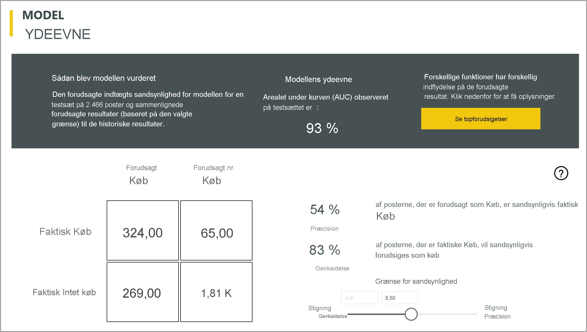

Rapporten indeholder også et værktøj til cost-benefit-analyse, der hjælper med at identificere en delmængde af befolkningen, som man bør være målrettet mod for at få det højeste overskud. Formålet med en cost-benefit-analyse er at maksimere overskuddet ud fra estimerede enhedsomkostninger for målretning og enhedsfordele ved at opnå det ønskede resultat. Du kan bruge dette værktøj til at vælge sandsynlighedstærsklen ud fra maksimumpunktet i grafen for at maksimere overskuddet. Du kan også bruge grafen til at beregne overskuddet eller omkostningerne for dit valg af sandsynlighedstærskel.

Siden **Nøjagtighedsrapport** i modelrapporten omfatter diagrammet _Akkumulerede gevinster_ og ROC-kurven for modellen. Dette er statistiske målinger af modellens ydeevne. Rapporterne indeholder beskrivelser af de viste diagrammer.

#### Anvendelse af en binær forudsigelsesmodel

Hvis du vil anvende en binær forudsigelsesmodel, skal du angive data for den enhed, du vil anvende forudsigelserne fra ML-modellen på. Andre parametre omfatter outputkolonnens navnepræfiks og tærsklen for sandsynlighed til klassificering af det forudsagte udfald.

Når der anvendes en binær forudsigelsesmodel, føjes der fire outputkolonner til den forbedrede outputenhed: **Outcome**, **PredictionScore**, **PredictionExplanation** og **ExplanationIndex**. Der angives et præfiks for kolonnenavnene i enheden, når modellen anvendes.

**PredictionScore** er en procentdel, der identificerer sandsynligheden for, at det ønskede resultat opnås.

Kolonnen **Outcome** indeholder mærkaten for det forudsagte resultat. Det forudsiges, at poster, hvor sandsynligheden overskrider tærsklen, sandsynligvis vil opnå det ønskede resultatet, og de er forsynet med mærkaten Sand. Det forudsiges, at poster under tærsklen sandsynligvis ikke vil opnå resultatet, og de er forsynet med mærkaten Falsk.

Kolonnen **PredictionExplanation** indeholder en forklaring af den bestemte indvirkning, som inputfunktionerne havde på **PredictionScore**.

### Klassificeringsmodeller

Klassificeringsmodeller bruges til at klassificere et datasæt i flere grupper eller klasser. De bruges til at forudsige hændelser, der kan have ét af flere mulige resultater. For eksempel om en kunde sandsynligvis har en meget høj, høj, mellem eller lav levetidsværdi, om risikoen for manglende betaling er høj, moderat, lav eller meget lav. osv.

Outputtet af en klassificeringsmodel er en sandsynlighedsscore, der identificerer sandsynligheden for, at en post opfylder kriterierne for en bestemt klasse.

#### Oplæring af en klassificeringsmodel

Den inputenhed, der indeholder dine oplæringsdata for en klassificeringsmodel, skal have et felt med en streng eller et heltal som resultatfelt, der identificerer de tidligere kendte resultater.

Forudsætninger:

- Der kræves mindst 20 rækker historiske data for hver klasse af resultater

Oprettelsesprocessen for en klassificeringsmodel følger de samme trin som andre AutoML-modeller, der er beskrevet i afsnittet **Konfiguration af ML-modelinput** ovenfor.

#### Rapport over klassificeringsmodel

Klassificeringsmodelrapporten oprettes ved at anvende ML-modellen på testdata og sammenligne den forudsagte klasse for en post med den faktiske kendte klasse.

Modelrapporten indeholder et diagram, der indeholder en opdeling af de korrekt og forkert klassificerede poster for de enkelte kendte klasser.

En yderligere klassespecifik detailudledning gør det muligt at analysere, hvordan forudsigelserne for en kendt klasse distribueres. Dette viser de andre klasser, hvor poster for den kendte klasse sandsynligvis klassificeres forkert.

Modelforklaringen i rapporten indeholder også de vigtigste forudsigelser for hver klasse.

Klassificeringsmodelrapporten omfatter også siden Oplæringsoplysninger, der minder om siderne for andre modeltyper, som beskrevet i afsnittet **AutoML-modelrapport** tidligere i denne artikel.

#### Anvendelse af en klassificeringsmodel

Hvis du vil anvende en klassificerings-ML-model, skal du angive inputdata for enheden og præfikset for outputkolonnens navn.

Når der anvendes en klassificeringsmodel, føjes der fem outputkolonner til den forbedrede outputenhed: **ClassificationScore**, **ClassificationResult**, **ClassificationExplanation**, **ClassProbabilities** og **ExplanationIndex**. Der angives et præfiks for kolonnenavnene i enheden, når modellen anvendes.

Kolonnen **ClassProbabilities** indeholder listen over sandsynlighedsscorer for posten for hver af de mulige klasser.

**ClassificationScore** er en procentdel, der identificerer sandsynligheden for, at en post opfylder kriterierne for en bestemt klasse.

Kolonnen **ClassificationResult** indeholder den mest sandsynlige forudsagte klasse for posten.

Kolonnen **ClassificationExplanation** indeholder en forklaring af den bestemte indvirkning, som inputfunktionerne havde på **ClassificationScore**.

### Regressionsmodeller

Regressionsmodeller bruges til at forudsige en numerisk værdi. For eksempel: den omsætning, der sandsynligvis realiseres fra en salgsaftale; en kundes levetidsværdi; beløbet for en faktura, der sandsynligvis bliver betalt; den dato, hvor en faktura muligvis betales osv.

Outputtet for en regressionsmodel er den forudsagte værdi.

#### Oplæring af en regressionsmodel

Den inputenhed, der indeholder dine oplæringsdata for en regressionsmodel, skal have et numerisk felt som resultatfelt, der identificerer de tidligere kendte værdier.

Forudsætninger:

- Der kræves mindst 100 rækker historiske data for en regressionsmodel.

Oprettelsesprocessen for en regressionsmodel følger de samme trin som andre AutoML-modeller, der er beskrevet i afsnittet **Konfiguration af ML-modelinput** ovenfor.

#### Regressionsmodelrapport

På samme måde som med andre AutoML-modelrapporter er regressionsrapporten baseret på resultaterne fra anvendelsen af modellen på testdata.

Modelrapporten indeholder et diagram, der sammenligner de forudsagte værdier med de faktiske værdier. I dette diagram angiver afstanden fra diagonalen fejlen i forudsigelsen.

Diagrammet over residualfejl viser fordelingen af procentdelen for gennemsnitlige fejl for forskellige værdier i testdatasættet. Den vandrette akse repræsenterer gennemsnittet af den faktiske værdi for gruppen, hvor størrelsen af boblen viser frekvensen eller antallet af værdier inden for det pågældende område. Den lodrette akse er de gennemsnitlige residualfejl.

Regressionsmodelrapporten omfatter også siden Oplæringsdetaljer, der minder om siderne for andre modeltyper, som beskrevet i afsnittet **AutoML-modelrapport** ovenfor.

#### Anvendelse af en regressionsmodel

Hvis du vil anvende en regressions-ML-model, skal du angive inputdata for enheden og præfikset for outputkolonnens navn.

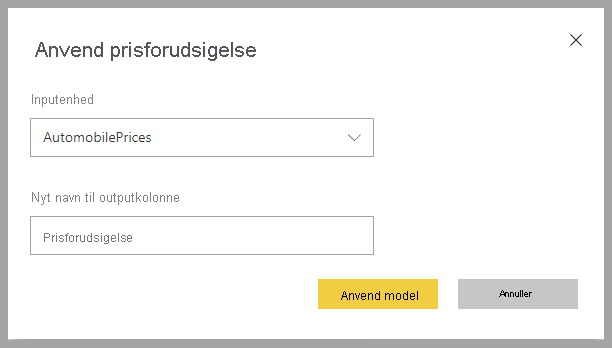

Når der anvendes en regressionsmodel, føjes der tre outputkolonner til den forbedrede outputenhed: **RegressionResult**, **RegressionExplanation** og **ExplanationIndex**. Der angives et præfiks for kolonnenavnene i enheden, når modellen anvendes.

Kolonnen **RegressionResult** indeholder den forudsagte værdi for posten baseret på inputfelterne. Kolonnen **RegressionExplanation** indeholder en forklaring af den bestemte indvirkning, som inputfunktionerne havde på **RegressionResult**.

## Integrering af Azure Machine Learning i Power BI

Mange organisationer bruger **Machine Learning**-modeller for at få større indsigt i deres virksomhed og dens fremtidige udvikling. Muligheden for at visualisere og aktivere indsigt fra disse modeller i dine rapporter og dashboards og andre analyser kan hjælpe med at udbrede denne indsigt til de forretningsbrugere, der har størst behov for den.  Power BI gør det nu nemt at integrere indsigt fra modeller, der hostes i Azure Machine Learning, ved hjælp af enkle peg og klik-håndbevægelser.

For at gøre det muligt at bruge denne funktion kan en dataspecialist ganske enkelt give BI analytikeren adgang til Azure Machine Learning-modellen ved hjælp af Microsoft Azure-portal.  I starten af hver session finder Power-forespørgsel derefter alle de Azure Machine Learning-modeller, brugeren har adgang til, og viser dem som dynamiske funktioner i Power-forespørgsel.  Brugeren kan derefter aktivere disse funktioner ved at oprette adgang til dem på båndet i editoren i Power-forespørgsel, eller ved at aktivere funktionen M direkte. For at opnå en bedre ydeevne samler Power BI også automatisk anmodninger om adgang i bundter, når Azure Machine Learning-modellen aktiveres for et sæt af rækker.

Denne funktionalitet understøttes i øjeblikket kun for Power BI dataflows, og for Power-forespørgsel online i Power BI-tjenesten.

Du kan få mere at vide om dataflow under [Introduktion til dataflow og selvbetjent dataforberedelse](dataflows-introduction-self-service.md).

Du kan få mere at vide om Azure Machine Learning i:

- Oversigt:  [Hvad er Azure Machine Learning?](/azure/machine-learning/service/overview-what-is-azure-ml)
- Hurtig start- og selvstudier til Azure Machine Learning:  [Azure Machine Learning-dokumentation](/azure/machine-learning/)

> [!NOTE]
> Der kræves et Power BI Premium-abonnement for at bruge Azure Machine Learning-integration.

### Tildeling af adgang til Azure Machine Learning-modellen til en Power BI-bruger

For at få adgang til en Azure Machine Learning-model fra Power BI, skal brugeren have adgangen **Læs** til Azure-abonnementet.  Derudover gælder følgende:

- For modeller af typen Machine Learning Studio (klassisk): adgangen **Læs** til webtjenesten Machine Learning Studio (klassisk)
- For modeller af typen Machine Learning Studio: adgangen **Læs** til Machine Learning Studio-arbejdsområdet

Trinnene i denne artikel beskriver, hvordan du tildeler en Power BI-bruger adgang til en model, der er hostet i Azure Machine Learning-tjenesten, så brugeren kan få adgang til denne model som en funktion i Power-forespørgsel.  Du kan få flere oplysninger i [Administrer adgang ved hjælp af RBAC og Microsoft Azure-portal](/azure/role-based-access-control/role-assignments-portal).

1. Log på [Azure Portal](https://portal.azure.com).

2. Gå til siden **Abonnementer**. Du finder siden **Abonnementer** via listen **Alle tjenester** i navigationsmenuen i Microsoft Azure-portal.

    

3. Vælg dit abonnement.

    

4. Vælg **Adgangskontrol (IAM)** , og vælg derefter knappen **Tilføj**.

    

5. Vælg **Læser** som rollen. Vælg den Power BI-bruger, du vil give adgang til Azure Machine Learning-modellen.

    

6. Vælg **Gem**.

7. Gentag trin tre til seks for at tildele brugeren adgangen **Læser** for den specifikke webtjeneste af typen Machine Learning Studio (klassisk) *eller* det Machine Learning-arbejdsområde, der hoster modellen.

### Skemasøgning for modeller til maskinel indlæring

Dataspecialister bruger primært Python til at udvikle og endda udrulle deres modeller til maskinel indlæring til Machine Learning.  I modsætning til Machine Learning Studio (klassisk), som hjælper med at automatisere oprettelse af en skemafil til modellen, skal dataspecialisterne eksplicit generere skemafilen ved hjælp af Python, når det drejer sig om Machine Learning.

Denne skemafil skal inkluderes i den udrullede webtjeneste for modeller til maskinel indlæring. Hvis du vil generere skemaet for webtjenesten automatisk, skal du angive et eksempel på inputtet/outputtet i postscriptet for den udrullede model. Se underafsnittet om [(Valgfri) Automatisk generering af Swagger-skema i dokumentationen Udrul modeller med Azure Machine Learning](/azure/machine-learning/how-to-deploy-and-where#optional-define-model-web-service-schema) Service. Linket inkluderer eksemplet på postscriptet med sætninger for generering af skemaet. 

Funktionerne *\@input_schema* og *\@output_schema* i postscriptet refererer specifikt til eksempelformaterne for input og output i variablerne *input_sample* og *output_sample* og bruger disse eksempler til at generere en OpenAPI-specifikation (Swagger) for webtjenesten under udrulningen.

Disse instruktioner til generering af skemaet ved opdatering af postscriptet skal også anvendes for modeller, der er oprettet via automatiserede eksperimenter for maskinel indlæring veds hjælp af SDK'et til Azure Machine Learning.

> [!NOTE]
> Modeller, der er oprettet ved hjælp af den visuelle brugergrænseflade i Azure Machine Learning, understøtter i øjeblikket ikke generering af skemaer, men det vil de i efterfølgende udgaver. 

### Aktivering af Azure Machine Learning-modellen i Power BI

Du kan kalde en hvilken som helst Azure Machine Learning-model, som du har fået adgang til, direkte fra editoren i Power-forespørgsel i dit dataflow. For at få adgang til Azure Machine Learning-modeller, skal du vælge knappen **Rediger** for den enhed, du vil forbedre med indsigt fra din Azure ML-model, som vist på følgende billede.

Når knappen **Rediger** vælges, åbnes Power-forespørgselseditoren for enhederne i dit dataflow.

Vælg knappen **AI-indsigt** på båndet, og vælg derefter mappen _Azure Machine Learning-modeller_ i navigationsruden. Alle de Azure Machine Learning-modeller, du har adgang til, er angivet her som funktioner i Power-forespørgsel. Inputparametrene for Azure Machine Learning-modellen er også automatisk tilknyttet som parametre for den tilsvarende funktion i Power-forespørgsel.

For at aktivere en Azure Machine Learning-model kan du angive en af den valgte enheds kolonner som input på rullelisten. Du kan også angive en konstant værdi, der skal bruges som input, ved at slå kolonneikonet til venstre for inputdialogboksen til og fra.

[ 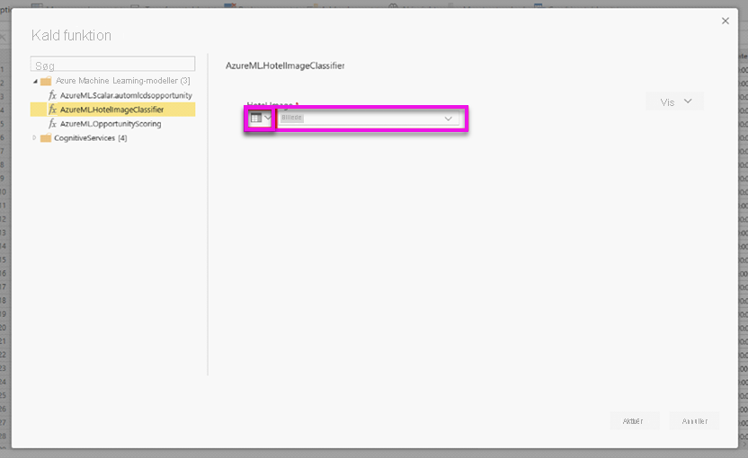 ](media/service-machine-learning-integration/machine-learning-integration-07.png#lightbox)

Vælg **Aktivér** for at få vist Azure Machine Learning-modellens output som en ny kolonne i enhedstabellen. Du får også modelaktiveringen som et anvendt trin for forespørgslen.

Hvis modellen returnerer flere outputparametre, er de grupperet som en post i outputkolonnen. Du kan udvide kolonnen for at oprette individuelle outputparametre i separate kolonner.

Når du gemmer dit dataflow, aktiveres modellen automatisk, når dataflowet opfriskes, for alle nye eller opdaterede rækker i enhedstabellen.

## Næste trin

Denne artikel indeholder en oversigt over automatiseret maskinel indlæring til dataflows i Power BI-tjenesten. Følgende artikler kan også være nyttige.

- [Selvstudium: Skab en model til maskinel indlæring i Power BI ](../../connect-data/service-tutorial-build-machine-learning-model.md)
- [Selvstudium: Brug af Cognitive Services i Power BI](../../connect-data/service-tutorial-use-cognitive-services.md)
- [Selvstudium: Aktivér en model af typen Machine Learning Studio (klassisk) i Power BI (prøveversion)](../../connect-data/service-tutorial-invoke-machine-learning-model.md)

Du kan finde flere oplysninger om dataflow og Power BI i følgende artikler:

* [Introduktion til dataflow og selvbetjent dataforberedelse](dataflows-introduction-self-service.md)
* [Oprettelse af et dataflow](dataflows-create.md)
* [Konfigurer og brug et dataflow](dataflows-configure-consume.md)
* [Konfiguration af dataflowlager til brug af Azure Data Lake Gen 2](dataflows-azure-data-lake-storage-integration.md)
* [Premium-funktioner for dataflow](dataflows-premium-features.md)
* [Begrænsninger og overvejelser i forbindelse med dataflow](dataflows-features-limitations.md)
* [Bedste praksis i forbindelse med dataflow](dataflows-best-practices.md)