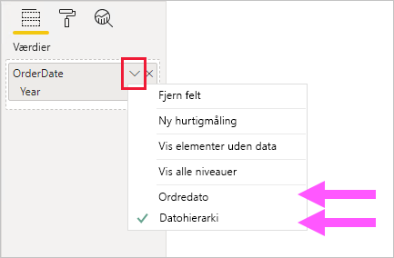
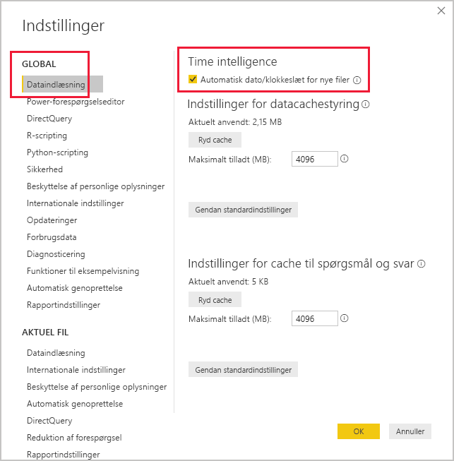

# <a name="apply-auto-datetime-in-power-bi-desktop"></a>Anvend automatisk dato/klokkeslæt i Power BI Desktop

Denne artikel henvender sig til dataudviklere af importmodeller og sammensatte modeller i Power BI Desktop. Den indeholder en introduktion til og en beskrivelse af indstillingen _Automatisk dato/klokkeslæt_.

Automatisk dato/klokkeslæt er en indstilling for dataindlæsning i Power BI Desktop. Formålet med denne indstilling er at understøtte praktisk time intelligence-rapportering, der er baseret på datokolonner, som er indlæst i en model. Det giver især forfattere af rapporter, der bruger din datamodel, mulighed for at filtrere, gruppere og foretage detailudledning ved hjælp af kalenderens tidsperioder (år, kvartaler, måneder og dage). Det er vigtigt, at du ikke behøver at udvikle disse time intelligence-funktioner eksplicit.

Når indstillingen er aktiveret, opretter Power BI Desktop en skjult tabel for automatisk dato/klokkeslæt for de enkelte datokolonner, forudsat at følgende forhold er til stede:

- Tabellens lagringstilstand er Import
- Kolonnens datatype er dato eller dato/klokkeslæt
- Kolonnen er ikke "mange"-siden i en modelrelation

## <a name="how-it-works"></a>Sådan fungerer det

Alle tabeller med automatisk dato/klokkeslæt er i realiteten en [beregnet tabel](desktop-calculated-tables.md), der genererer rækker med data ved hjælp af DAX-funktionen [CALENDAR](/dax/calendar-function-dax). De enkelte tabeller omfatter også seks beregnede kolonner: **Day**, **MonthNo**, **Month**, **QuarterNo**, **Quarter** og **Year**.

> [!NOTE]
> Kolonnenavnene og værdierne oversættes og formateres i Power BI i henhold til [modelsproget](../fundamentals/supported-languages-countries-regions.md#choose-the-language-for-the-model-in-power-bi-desktop). Hvis modellen f. eks. blev oprettet ved hjælp af engelsk, viser den stadig månedsnavne osv. på engelsk, også selvom den vises med en koreansk klient.

I Power BI Desktop oprettes der også en relation mellem kolonnen **Date** i tabellen med automatisk dato/klokkeslæt og kolonnen med modeldatoen.

Tabellen med automatisk dato/klokkeslæt indeholder hele kalenderår, som omfatter alle datoværdier, der er gemt i kolonnen med modeldatoen. Hvis den tidligste værdi i en datokolonne f.eks. er 20. marts 2016, og den seneste værdi er 23. oktober 2019, indeholder tabellen 1.461 rækker. Det repræsenterer én række for hver dato i de fire kalenderår 2016 til 2019. Når Power BI opdaterer modellen, opdateres hver tabel med automatisk dato-/klokkeslæt også. På denne måde indeholder modellen altid datoer, der omfatter værdierne i datokolonnen.

Hvis det var muligt at se rækkerne i en tabel med automatisk dato/klokkeslæt, ville de se sådan ud:


> [!NOTE]
> Tabellerne med automatisk dato/klokkeslæt er skjult permanent, også for udviklere. De kan ikke ses i ruden **Felter** eller i diagramvisningen for modellen, og rækkerne kan ikke ses i datavisning. Desuden kan der ikke refereres direkte til tabellen og den tilhørende kolonne fra DAX-udtryk.
>
> Det er heller ikke muligt at arbejde med dem, når du bruger [Analysér i Excel](../collaborate-share/service-analyze-in-excel.md) eller opretter forbindelse til modellen ved hjælp af rapportdesignere, der ikke er i Power BI.

Tabellen definerer også et hierarki, der giver visuelle elementer med en detailudledningssti, der går fra niveauerne for år, kvartal, måned og dag.

Hvis det var muligt at se en tabel med automatisk dato/klokkeslæt i diagramvisning for modellen, ville den se sådan ud (relaterede kolonner er fremhævet):


## <a name="work-with-auto-datetime"></a>Arbejd med automatisk dato/klokkeslæt

Når der findes en tabel med automatisk dato/klokkeslæt for en datokolonne (og den pågældende kolonne er synlig), kan rapportens forfattere ikke se kolonnen som et felt i ruden **Felter**. De finder i stedet et objekt, der kan udvides, som har samme navn som datokolonnen. Du kan let finde den, da den er angivet med et kalenderikon. Når rapportens forfattere udvider kalenderobjektet, finder de et hierarki med navnet **Datohierarki**. Når hierarkiet er udvidet, finder de fire niveauer: **Year**, **Quarter**, **Month** og **Day**.


Det oprettede hierarki til automatisk dato/klokkeslæt kan bruges til at konfigurere en visualisering på præcis samme måde, som almindelige hierarkier kan bruges. Du kan enten konfigurere visualiseringer ved at bruge hele hierarkiet **Datohierarki** eller specifikke niveauer i hierarkiet.

Der er dog tilføjet én funktion, der ikke understøttes af almindelige hierarkier. Når hierarkiet for automatisk dato/klokkeslæt – eller et niveau fra hierarkiet – føjes til en visualisering, kan rapportens forfattere skifte mellem at bruge hierarkiet og datokolonnen. Denne fremgangsmåde giver mening for nogle visuals, når det eneste, de har brug for, er datokolonnen, ikke hierarkiet og dets niveauer. De starter med at konfigurere visualfeltet (højreklik på visualfeltet, eller klik på pil ned) og bruger derefter genvejsmenuen til at skifte mellem datokolonnen og datohierarkiet.



Endelig kan modelberegninger, der skrives i DAX, _direkte_ referere til en datokolonne eller _indirekte_ til de skjulte tabelkolonner med automatisk dato/klokkeslæt.

En formel, der er skrevet i Power BI Desktop, kan referere til en datokolonne på normal vis. Der skal dog refereres til tabelkolonnerne med automatisk dato/klokkeslæt ved hjælp af en særlig udvidet syntaks. Du starter med først at referere til datokolonnen, som dernæst skal efterfølges af et punktum (.). Via automatisk fuldførelse af formellinjen kan du derefter vælge en kolonne fra tabellen med automatisk dato/klokkeslæt.

![Eksempel på indtastning af et DAX-målingsudtryk i formellinjen. Indtil videre står der Date Count = COUNT(Sales[OrderDate] i formlen. og en liste med automatisk fuldførelse præsenterer alle syv kolonner fra den skjulte tabel med automatisk dato/klokkeslæt. Disse kolonner er: Date, Day, Month, MonthNo, Quarter, QuarterNo og Year.](media/desktop-auto-date-time/auto-date-time-dax-auto-complete.png)

I Power BI Desktop kan et gyldigt målingsudtryk være:

```dax
Date Count = COUNT(Sales[OrderDate].[Date])
```

> [!NOTE]
> Dette målingsudtryk er gyldigt i Power BI Desktop, men det er ikke den korrekte DAX-syntaks. Internt omdanner Power BI Desktop dit udtryk til at henvise til den sande (skjulte) tabelkolonne med automatisk dato/klokkeslæt.

## <a name="configure-auto-datetime-option"></a>Konfigurer indstillingen for automatisk dato/klokkeslæt

Automatisk dato/klokkeslæt kan konfigureres _globalt_ eller for den _aktuelle fil_. Indstillingen Global gælder for nye Power BI Desktop-filer, og den kan til enhver tid slås til eller fra. Hvis du har en ny installation af Power BI Desktop, er begge indstillinger som standard slået til.

Indstillingen Aktuel fil kan også når som helst slås til eller fra. Når indstillingen er slået til, oprettes der tabeller med automatisk dato/klokkeslæt. Når indstillingen er slået fra, fjernes alle tabeller med automatisk dato/klokkeslæt fra modellen.

> [!CAUTION]
> Vær forsigtig, når du slår indstillingen for aktuel fil fra, da det vil fjerne tabellerne med automatisk dato/klokkeslæt. Sørg for at løse eventuelle problemer med brudte rapportfiltre eller visuelle elementer, der er konfigureret til at bruge dem.

I Power BI Desktop skal du vælge _Filer > Indstillinger > Indstillinger_ og derefter enten vælge siden **Global** eller **Aktuel fil**. På begge sider findes indstillingen i sektionen **Time Intelligence**.



## <a name="next-steps"></a>Næste trin

Du kan finde flere oplysninger, der er relateret til denne artikel, i følgende ressourcer:

- [Vejledning til automatisk dato/klokkeslæt i Power BI Desktop](../guidance/auto-date-time.md)
- [Opret datotabeller i Power BI Desktop](../guidance/model-date-tables.md)
- [Angiv og brug datotabeller i Power BI Desktop](desktop-date-tables.md)
- Har du spørgsmål? [Prøv at spørge Power BI-community'et](https://community.powerbi.com/)
- Forslag? [Få ideer til at forbedre Power BI](https://ideas.powerbi.com/)
