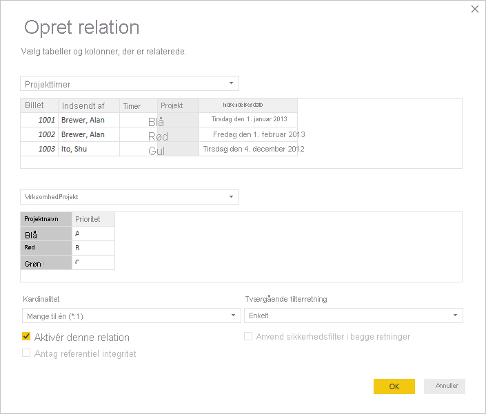
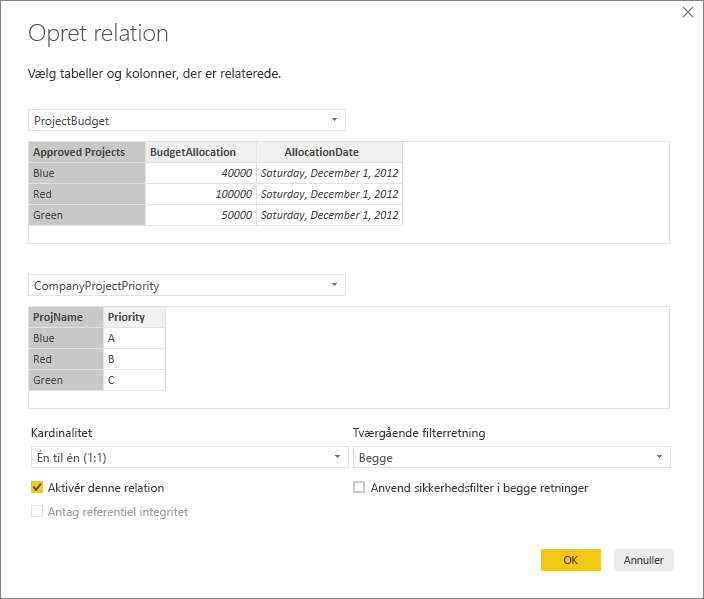
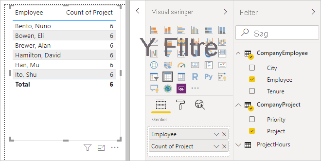
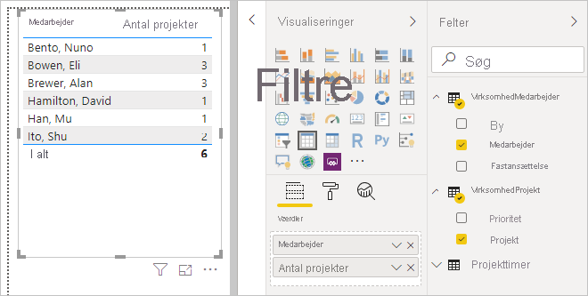
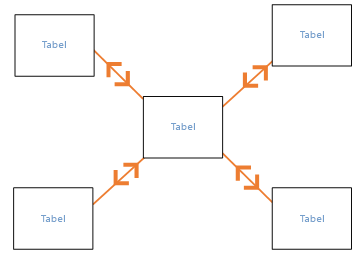
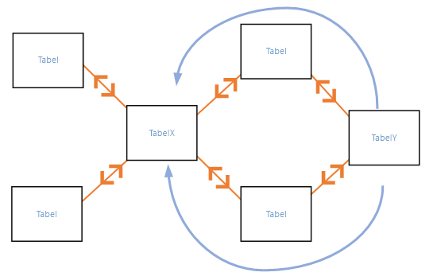
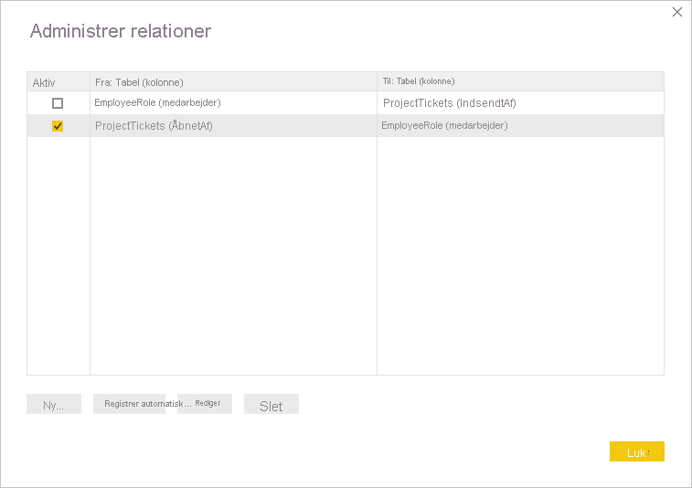
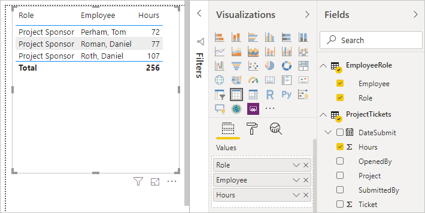
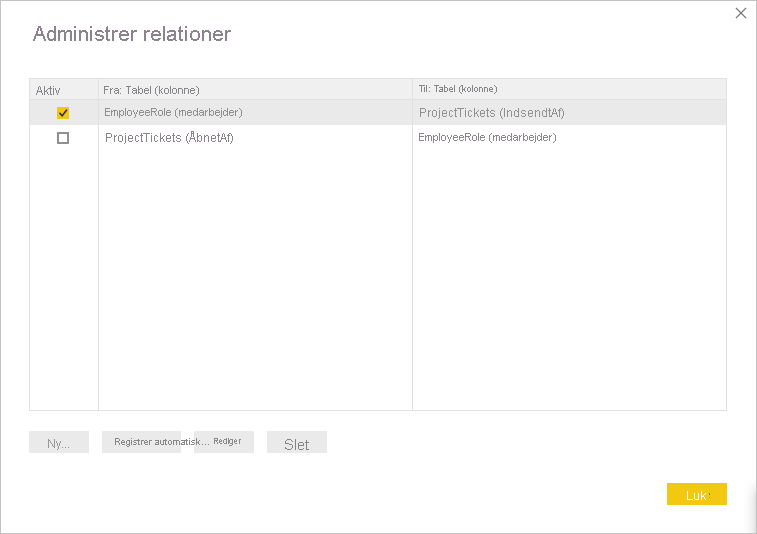

# Opret og administrer relationer i Power BI Desktop
Når du importerer flere tabeller, er det muligt, at du skal udføre analyser ved hjælp af data fra alle disse tabeller. Der skal være relationer mellem disse tabeller, før du kan beregne præcise resultater og vise korrekte oplysninger i dine rapporter. I Power BI Desktop er det nemt at oprette disse relationer. I de fleste tilfælde behøver du faktisk ikke at foretage dig noget – funktionen Registrer automatisk gør det for dig. Men nogle gange skal du muligvis selv oprette relationer, eller du skal muligvis foretage ændringer i en relation. I begge tilfælde er det vigtigt at forstå relationer i Power BI Desktop, og hvordan du opretter og redigerer dem.

## Registrer automatisk under indlæsning
Hvis du forespørger to eller flere tabeller på én gang, når der indlæses data, forsøger Power BI Desktop at finde og oprette relationer for dig. Relationsindstillingerne **Kardinalitet**, **Tværgående filterretning** og **Gør denne relation aktiv** indstilles automatisk. Power BI Desktop kigger på kolonnenavne i de tabeller, som du forespørger, for at se, om der er mulige relationer. Hvis der er, oprettes disse relationer automatisk. Hvis Power BI Desktop ikke med stor sandsynlighed kan afgøre, om der er et match, oprettes relationen ikke. Du kan dog stadig bruge dialogboksen **Administrer relationer** til at oprette eller redigere relationer manuelt.

## Opret en relation med automatisk registrering
Under fanen **Hjem** skal du vælge **Administrer relationer** \> **Automatisk registrering**.

## Opret en relation manuelt
1. Under fanen **Hjem** skal du vælge **Administrer relationer** \> **Ny**.

2. I dialogboksen **Opret relation** skal du vælge en tabel på rullelisten for den første tabel. Vælg den kolonne, du vil bruge i relationen.

3. Vælg den anden tabel, du vil bruge i relationen, på rullelisten for den anden tabel. Vælg den anden kolonne, du vil bruge, og vælg derefter **OK**.

   

Power BI Desktop konfigurerer som standard automatisk egenskaberne **Kardinalitet** (retning), **Tværgående filterretning** og **Gør denne relation aktiv** for din nye relation. Du kan dog ændre disse indstillinger, hvis det er nødvendigt. Du kan finde flere oplysninger under [Om yderligere indstillinger](#understanding-additional-options).

Hvis ingen af de tabeller, der er valgt for relationen, har entydige værdier, får du vist følgende fejl: *En af kolonnerne skal have entydige værdier*. Mindst én tabel i en relation *skal* have en særskilt og entydig liste over nøgleværdier, som er et almindeligt krav for alle relationsdatabaseteknologier. 

Hvis du får vist denne fejl, er der et par forskellige måder, du kan rette problemet på:

* Brug **Fjern identiske rækker** til at oprette en kolonne med entydige værdier. Ulempen ved denne metode er, at du kan miste oplysninger, når dublerede rækker fjernes, og der er ofte en god grund til, at en nøgle (række) er dubleret.
* Tilføj en mellemliggende tabel, der består af listen over særskilte nøgleværdier i modellen, som derefter knyttes til begge de oprindelige kolonner i relationen.

Du kan finde flere oplysninger om dette i dette [blogindlæg](https://blogs.technet.microsoft.com/cansql/2016/12/19/relationships-in-power-bi-fixing-one-of-the-columns-must-have-unique-values-error-message/).

## Rediger en relation
1. Under fanen **Hjem** skal du vælge **Administrer relationer**.

2. I dialogboksen **Administrer relationer** skal du vælge relationen og derefter vælge **Rediger**.

## Konfigurer yderligere indstillinger
Når du opretter eller redigerer en relation, kan du konfigurere yderligere indstillinger. Power BI Desktop konfigurerer automatisk yderligere indstillinger baseret på det bedste gæt, hvilket kan være forskelligt for hver relation, afhængigt af dataene i kolonnerne.

### Kardinalitet
Indstillingen **Kardinalitet** kan have en af følgende indstillinger:

**Mange til én (\*:1)** : En mange-til-en-relation er den mest almindelige, standardtype af relationer. Det betyder, at kolonnen i en given tabel kan have mere end én forekomst af en værdi, og at den anden relaterede tabel, der ofte kaldes opslagstabellen, kun har én forekomst af en værdi.

**Én til én (1:1)** : I en relation af typen én til én har kolonnen i én tabel kun én forekomst af en bestemt værdi, og den anden relaterede tabel har kun én forekomst af en bestemt værdi.

**Én til mange (1:*)** : I en relation af typen én til mange har kolonnen i én tabel kun én forekomst af en bestemt værdi, og den anden relaterede tabel kan have mere end én forekomst af en værdi.

**Mange til mange (\*:\*)** : Med sammensatte modeller kan du oprette mange til mange-relationer mellem tabeller, hvilket fjerner kravene til entydige værdier i tabeller. Tidligere midlertidige løsninger, f.eks. introduktion af nye tabeller kun for at oprette relationer, fjernes også. Du kan finde flere oplysninger under [Relationer med mange til mange-kardinalitet](https://docs.microsoft.com/power-bi/desktop-many-to-many-relationships). 

Du kan finde flere oplysninger om, hvornår du skal ændre kardinaliteten, under [Om yderligere indstillinger](#understanding-additional-options).

### Tværgående filterretning
Indstillingen **Tværgående filterretning** kan have én af følgende indstillinger:

**Begge**: Begge tabeller behandles i forbindelse med filtrering, som om de er en enkelt tabel. Indstillingen **Begge** fungerer fint sammen med en enkelt tabel, der har flere opslagstabeller, som omgiver den. Et eksempel kan være en tabel med faktiske salgsværdier med en opslagstabel for afdelingen. Denne konfiguration kaldes også en stjerneskemakonfiguration (en central tabel med flere opslagstabeller). Men hvis du har to eller flere tabeller, der også har opslagstabeller (hvor nogle af dem er fælles), er det ikke en god ide at bruge indstillingen **Begge**. Hvis vi fortsætter med eksemplet, skal du i dette tilfælde også have en budgetsalgstabel, der registrerer målbudgettet for hver afdeling. Og afdelingstabellen er knyttet til både salgs- og budgettabellen. Undgå indstillingen **Begge** for denne form for konfiguration.

**Enkelt**: Den mest almindelige standardretning, hvilket betyder, at filtreringsindstillinger i tilknyttede tabeller fungerer i den tabel, hvor værdierne samles. Hvis du importerer en datamodel fra Power Pivot i Excel 2013 eller tidligere, har alle relationer en enkelt retning. 

Du kan finde flere oplysninger om, hvornår du skal ændre den tværgående filterretning, under [Om yderligere indstillinger](#understanding-additional-options).

### Aktivér denne relation
Når denne indstilling er markeret, fungerer relationen som den aktive standardrelation. I de tilfælde, hvor der er mere end én relation mellem to tabeller, gør den aktive relation det muligt for Power BI Desktop automatisk at oprette visualiseringer, der inkluderer begge tabeller.

Du kan få flere oplysninger om, hvornår du skal gøre en bestemt relation aktiv, under [Om yderligere indstillinger](#understanding-additional-options).

## Om relationer
Når du har knyttet to tabeller til en relation, kan du arbejde med dataene i begge tabeller, som om de var en enkelt tabel. På den måde undgår du at skulle bekymre dig om relationsdetaljer, og du behøver ikke at fladgøre disse tabeller til en enkelt tabel, før du importerer dem. I mange situationer kan Power BI Desktop automatisk oprette relationer for dig. Men hvis Power BI Desktop ikke med en høj grad af sikkerhed kan afgøre, om der findes en relation mellem to tabeller, oprettes relationen ikke automatisk. Hvis det er tilfældet, skal du gøre det. 

Lad os gennemgå et hurtigt selvstudie, så vi bedre kan vise dig, hvordan relationer fungerer i Power BI Desktop.

>[!TIP]
>Du kan selv udføre denne lektion: 
>
> 1. Kopiér følgende tabel **ProjectHours** til et Excel-regneark (undtagen titlen), vælg alle cellerne, og vælg derefter **Indsæt** \> **Tabel**. 
> 2. I dialogboksen **Opret tabel** skal du vælge **OK**. 
> 3. Vælg en tabelcelle, vælg **Tabeldesign** \> **Tabelnavn**, og åbn derefter *ProjectHours*. 
> 4. Gør det samme for tabellen **CompanyProject**. 
> 5. Importér dataene ved hjælp af **Hent data** i Power BI Desktop. Vælg de to tabeller som datakilde, og vælg derefter **Indlæs**.

Den første tabel, **ProjectHours**, er en oversigt over arbejdsanmodninger, der registrerer antallet af timer, som en person har arbejdet på et bestemt projekt. 

**ProjectHours**

| **Ticket** | **SubmittedBy** | **Hours** | **Project** | **DateSubmit** |
| ---:|:--- | ---:|:--- | ---:|
| 1001 |Brewer, Alan |22 |Blå |1/1/2013 |
| 1002 |Brewer, Alan |26 |Red |2/1/2013 |
| 1003 |Ito, Shu |34 |Yellow |12/4/2012 |
| 1004 |Brewer, Alan |13 |Orange |1/2/2012 |
| 1005 |Bowen, Eli |29 |Purple |1/10/2013 |
| 1006 |Bento, Nuno |35 |Grøn |2/1/2013 |
| 1007 |Hamilton, David |10 |Yellow |1/10/2013 |
| 1008 |Han, Mu |28 |Orange |1/2/2012 |
| 1009 |Ito, Shu |22 |Purple |2/1/2013 |
| 1010 |Bowen, Eli |28 |Grøn |10/1/2013 |
| 1011 |Bowen, Eli |9 |Blå |10/15/2013 |

Den anden tabel, **CompanyProject**, er en liste over projekter med en tildelt prioritet: A, B eller C. 

**CompanyProject**

| **ProjName** | **Priority** |
| --- | --- |
| Blå |A |
| Red |B |
| Grøn |C |
| Yellow |C |
| Purple |B |
| Orange |C |

Bemærk, at de enkelte tabeller har en projektkolonne. De hedder noget forskelligt, men værdierne ser ud til at være de samme. Det er vigtigt, og det vender vi tilbage til om lidt.

Nu, hvor vi har importeret vores to tabeller til en model, skal vi oprette en rapport. Det første, vi ønsker at gøre, er at få antallet af timer sendt efter projektprioritet, så vi vælger **Prioritet** og **Timer** i ruden **Felter**.

Hvis vi kigger på vores tabel på rapportlærredet, kan du se, at antallet af timer er 256 for de enkelte projekter, hvilket også er totalen. Det tal er helt klart ikke korrekt. Hvorfor? Det skyldes, at vi ikke kan beregne en sumtotal af værdier fra én tabel (**Timer** i tabellen **Projekt**) opdelt efter værdier i en anden tabel (**Prioritet** i tabellen **CompanyProject**), hvis der ikke findes en relation mellem disse to tabeller.

Så lad os oprette en relation mellem disse to tabeller.

Kan du huske de kolonner, vi så i begge tabeller med et projektnavn men med værdier, der ser ens ud? Vi vil bruge disse to kolonner til at oprette en relation mellem vores tabeller.

Hvorfor disse kolonner? Hvis vi ser på kolonnen **Project** i tabellen **ProjectHours**, kan vi se værdier som Blue, Red, Yellow, Orange osv. Vi kan faktisk se flere rækker, der indeholder den samme værdi. Vi har mange farveværdier for **Project**.

Hvis vi kigger på kolonnen **ProjName** i tabellen **CompanyProject**, kan vi se, at der kun er én af hver farveværdi for projektnavnet. Hver farveværdi i denne tabel er entydig, og det er vigtigt, da vi kan oprette en relation mellem disse to tabeller. I dette tilfælde en mange til en-relation. I en mange til en-relation skal mindst én kolonne i en af tabellerne indeholde entydige værdier. Der er nogle yderligere indstillinger for nogle relationer, som vi kigger på senere. Nu kan vi oprette en relation mellem projektkolonnerne i hver af vores to tabeller.

### Sådan opretter du en ny relation
1. Vælg **Administrer relationer** under fanen **Hjem**.
2. I **Administrer relationer** skal du vælge **Ny** for at åbne dialogboksen **Opret relationer**, hvor vi kan vælge de tabeller, kolonner og eventuelle yderligere indstillinger, vi vil bruge til vores relation.
3. I den første rulleliste skal du vælge **ProjectHours** som den første tabel og derefter vælge kolonnen **Project**. Dette er *mange*-siden i vores relation.
4. På den anden rulleliste er **CompanyProject** forudvalgt som den anden tabel. Vælg kolonnen **ProjName**. Denne side er *én*-siden i vores relation. 
5. Acceptér standardværdierne for relationsindstillingerne, og vælg derefter **OK**.

   

6. I dialogboksen **Administrer relationer** skal du vælge **Luk**.

Vi kan nu afsløre, at du lige har oprettet denne relation på den svære måde. Du kunne bare have valgt knappen **Registrer automatisk** i dialogboksen **Administrer relationer**. Registrer automatisk ville faktisk have oprettet relationerne automatisk for dig, da du indlæste dataene, hvis begge kolonner havde det samme navn. Men det er der jo ingen udfordringer i!

Lad os nu se på tabellen på vores rapportlærred igen.

Den ser meget bedre ud, gør den ikke?

Når vi opsummerer timer efter **Prioritet**, søger Power BI Desktop efter hver forekomst af de entydige farveværdier i opslagstabellen **CompanyProject** og søger derefter efter hver forekomst af hver af disse værdier i tabellen **ProjectHours**. Derefter beregnes en samlet sum for hver enkelt værdi.

Det var nemt. Med Registrer automatisk behøver du måske slet ikke at gøre så meget.

## Om yderligere indstillinger
Når der oprettes en relation enten vha. Registrer automatisk, eller ved at du opretter den manuelt, konfigurerer Power BI Desktop automatisk yderligere indstillinger på baggrund af dataene i tabellerne. Disse yderligere indstillinger for relationer befinder sig i den nederste del af dialogboksen **Opret relation** og **Rediger relation**.

 

Power BI angiver som regel disse automatisk, og du behøver ikke at justere dem. Men der er mange situationer, hvor det kan være en god idé at konfigurere disse indstillinger selv.

## Automatisk opdatering af relationer

Du kan administrere den måde, som Power BI behandler og automatisk justerer relationer på i dine rapporter og modeller. Hvis du vil angive, hvordan Power BI skal håndtere indstillinger for relationer, skal du vælge **Filer** > **Indstillinger** > **Indstillinger** fra Power BI Desktop og derefter vælge **Dataindlæsning** i ruden til venstre. Indstillingerne for **Relationer** vises.

   

Der er tre indstillinger, som kan vælges og aktiveres: 

- **Importér relationer fra datakilder ved første indlæsning**: Denne indstilling er valgt som standard. Når den er valgt, søger Power BI efter relationer, der er defineret i din datakilde, f.eks. relationer for referencenøgle/primær nøgle i dit data warehouse. Hvis sådanne relationer findes, afspejles de i Power BI-datamodellen, første gang du indlæser dataene. Med denne indstilling kan du hurtigt begynde at arbejde med din model, i stedet for at du selv skal finde og definere disse relationer.

- **Opdater eller slet relationer ved opdatering af data**: Denne indstilling er fravalgt som standard. Hvis du vælger den, søger Power BI efter ændringer i relationerne i datakilden, når datasættet opdateres. Hvis disse relationer ændres eller fjernes, afspejler Power BI disse ændringer i sin egen datamodel og opdaterer eller sletter dem for at sikre et match.

   > [!WARNING]
   > Hvis du bruger sikkerhed på rækkeniveau, som er baseret på de definerede relationer, anbefaler vi ikke, at du vælger denne indstilling. Hvis du fjerner en relation, som sikkerhed på rækkeniveau er afhængig af, bliver din model muligvis mindre sikker. 

- **Registrer automatisk nye relationer, når data er indlæst**: Denne indstilling er beskrevet i [Registrer automatisk under indlæsning](#autodetect-during-load). 

## Fremtidige opdateringer af dataene kræver en anden kardinalitet
Power BI Desktop kan som regel automatisk se, hvad der er den bedste kardinalitet for relationen. Hvis du vil tilsidesætte den automatiske indstilling, fordi du ved, at dataene ændres i fremtiden, kan du vælge det i funktionen **Kardinalitet**. Lad os se på et eksempel, hvor vi skal vælge en anden kardinalitet.

I tabellen **CompanyProjectPriority** kan du se en liste over alle virksomhedens projekter og deres prioritet. Tabellen **ProjectBudget** indeholder de projekter, hvor budgettet er blevet godkendt.

**CompanyProjectPriority**

| **ProjName** | **Priority** |
| --- | --- |
| Blå |A |
| Red |B |
| Grøn |C |
| Yellow |C |
| Purple |B |
| Orange |C |

**ProjectBudget**

| **Godkendte projekter** | **BudgetAllocation** | **AllocationDate** |
|:--- | ---:| ---:|
| Blå |40,000 |12/1/2012 |
| Red |100,000 |12/1/2012 |
| Green |50.000 |12/1/2012 |

Hvis vi opretter en relation mellem kolonnen **Godkendte projekter** i tabellen **ProjectBudget** og kolonnen **ProjectName** i tabellen **CompanyProjectPriority**, indstiller Power BI automatisk **Kardinalitet** til **Én til én (1:1)** og **Tværgående filterretning** til **Begge**. 

 

Årsagen til, at Power BI foretager disse indstillinger, er, at for Power BI Desktop er den bedste kombination af de to tabeller som følger:

| **ProjName** | **Priority** | **BudgetAllocation** | **AllocationDate** |
|:--- | --- | ---:| ---:|
| Blue |A |40,000 |12/1/2012 |
| Red |B |100.000 |12/1/2012 |
| Grøn |C |50,000 |12/1/2012 |
| Yellow |C |  |  |
| Purple |B |  |  |
| Orange |C |  |  |

Der er en én til én-relation mellem vores to tabeller, fordi der ikke er gentagne værdier i kolonnen **ProjName** i den kombinerede tabel. Kolonnen **ProjName** er entydig, fordi de enkelte værdier kun optræder én gang, så rækkerne fra de to tabeller kan kombineres direkte uden dubletter.

Men lad sige, at du ved, at dataene ændres, næste gang du opdaterer dem. En opdateret version af tabellen **ProjectBudget** har nu ekstra rækker for projekterne Blue og Red:

**ProjectBudget**

| **Godkendte projekter** | **BudgetAllocation** | **AllocationDate** |
| --- | ---:| ---:|
| Blå |40,000 |12/1/2012 |
| Red |100,000 |12/1/2012 |
| Green |50.000 |12/1/2012 |
| Blå |80,000 |6/1/2013 |
| Red |90,000 |6/1/2013 |

 Disse yderligere rækker betyder, at den bedste kombination af de to tabeller nu ser ud som følger: 

| **ProjName** | **Priority** | **BudgetAllocation** | **AllocationDate** |
| --- | --- | ---:| ---:|
| Blue |A |40,000 |12/1/2012 |
| Red |B |100.000 |12/1/2012 |
| Grøn |C |50,000 |12/1/2012 |
| Yellow |C |  |  |
| Purple |B |  |  |
| Orange |C |  |  |
| Blå |A |80000 |6/1/2013 |
| Red |B |90000 |6/1/2013 |

I denne nye kombinerede tabel indeholder kolonnen **ProjName** gentagne værdier. De to oprindelige tabeller har ikke en en til en-relation, når tabellen er opdateret. Da vi i dette tilfælde ved, at disse fremtidige opdateringer vil medføre, at kolonnen **ProjName** får dubletter, vil vi angive **Kardinalitet** til at være **Mange til én (\*:1)** , med *mange*-siden på **ProjectBudget** og *én*-siden på **CompanyProjectPriority**.

## Juster den tværgående filterretning for at få et avanceret sæt tabeller med relationer
For de fleste relationer er den tværgående filterretning angivet til **Begge**. I mere sjældne tilfælde kan det dog være nødvendigt at angive denne indstilling til andet end standardværdien, f.eks. hvis du importerer en model fra en ældre version af Power Pivot, hvor hver relation er angivet til en enkelt retning. 

Indstillingen **Begge** gør det muligt for Power BI Desktop at behandle alle aspekter af de tilknyttede tabeller, som om de var en enkelt tabel. Der kan dog være situationer, hvor Power BI Desktop ikke kan angive en relations tværgående filterretning til **Begge** og samtidig sørge for, at et entydigt sæt standarder er tilgængeligt for rapportering. Hvis en relations tværgående filterretning ikke er angivet til **Begge**, skyldes det som regel, at det ville medføre tvetydighed. Hvis standardindstillingen for tværgående filtrering ikke virker for dig, kan du prøve at angive den til en bestemt tabel eller **Begge**.

Tværgående filtrering i én retning fungerer i mange situationer. Hvis du har importeret en model fra Power Pivot i Excel 2013 eller tidligere, angives alle relationer faktisk til én retning. Enkelt retning betyder, at filtreringsindstillinger i tilknyttede tabeller fungerer i den tabel, hvor værdierne aggregeres. Nogle gange kan det være vanskeligt at forstå tværgående filtrering, så lad os se på et eksempel.

Hvis du angiver tværgående filtrering i én retning, og du opretter en rapport, der indeholder en oversigt over projektets timer, kan du vælge at opsummere (eller filtrere) efter tabellen **CompanyProject** og kolonnen **Prioritet** eller tabellen **CompanyEmployee** og kolonnen **By**. Men hvis du vil tælle antallet af medarbejdere pr. projekt (et mindre almindeligt spørgsmål), fungerer det ikke. Du får vist en kolonne med værdier, som alle er ens. I følgende eksempel er begge relationers tværgående filterretning angivet til en enkelt retning: mod tabellen **ProjectHours**. I **Værdier** er feltet **Projekt** angivet til **Count**:

 

Filterspecifikationen overføres fra **CompanyProject** til **ProjectHours** (som vist på følgende billede), men den overføres ikke til **CompanyEmployee**. 

 

Men hvis du angiver den tværgående filterretning til **Begge**, fungerer det. Med indstillingen **Begge** kan filterspecifikationen føres op til **CompanyEmployee**.

 

Hvis den tværgående filterretning er angivet til **Begge**, ser vores rapport nu korrekt ud:

 

Tværgående filtrering i begge retninger fungerer godt for et mønster af tabelrelationer som mønsteret ovenfor. Dette skema kaldes ofte et stjerneskema som dette:

 

Tværgående filterretning kan ikke bruges sammen med et mere generelt mønster, der ofte findes i databaser, som i dette diagram:

 

Hvis du har et tabelmønster med løkker som i dette eksempel, kan tværgående filtrering oprette et tvetydigt sæt af relationer. Hvis du f.eks. opsummerer et felt fra TableX og derefter vælger at filtrere efter et felt i TableY, er det ikke tydeligt, i hvilken retning filteret skal gå – fra øverste tabel eller nederste tabel. Et almindeligt eksempel på denne form for mønster er, at TableX er en salgstabel med faktiske data, og at TableY indeholder budgetdata. Tabellerne i midten er opslagstabeller, som begge tabeller bruger, f.eks. division eller region. 

Som med aktive/inaktive relationer tillader Power BI Desktop ikke, at en relation angives til **Begge**, hvis det medfører tvetydighed i rapporter. Der er flere forskellige måder, hvorpå du kan håndtere denne situation. Her er de to mest almindelige:

* Slet eller markér relationer som inaktive for at reducere tvetydighed. Derefter kan du muligvis angive en relations tværgående filtrering til **Begge**.
* Hent en tabel to gange (med et andet navn den anden gang) for at fjerne løkker. Når du har gjort det, ligner mønsteret af relationer et stjerneskema. I et stjerneskema kan alle relationer angives til **Begge**.

## Forkert aktiv relation
Når Power BI Desktop automatisk opretter relationer, støder den nogle gange på mere end én relation mellem to tabeller. Når denne situation forekommer, er det kun én af relationerne, der kan angives som aktiv. Den aktive relation fungerer som standardrelationen, så hvis du vælger felter fra to forskellige tabeller, kan Power BI Desktop automatisk oprette en visualisering for dig. I nogle tilfælde kan den relation, der vælges automatisk, dog være den forkerte. Brug dialogboksen **Administrer relationer** til at angive en relation som aktiv eller inaktiv, eller angiv den aktive relation i dialogboksen **Rediger relation**. 

Hvis du vil sikre, at der er en standardrelation, kan Power BI Desktop kun have en enkelt aktiv relation mellem to tabeller på et givent tidspunkt. Derfor skal du først angive den aktuelle relation som inaktiv og derefter angive den relation, der skal være aktiv.

Lad os se på et eksempel. Den første tabel er **ProjectTickets**, og den anden tabel er **EmployeeRole**.

**ProjectTickets**

| **Ticket** | **OpenedBy** | **SubmittedBy** | **Hours** | **Project** | **DateSubmit** |
| ---:|:--- |:--- | ---:|:--- | ---:|
| 1001 |Perham, Tom |Brewer, Alan |22 |Blå |1/1/2013 |
| 1002 |Roman, Daniel |Brewer, Alan |26 |Red |2/1/2013 |
| 1003 |Roth, Daniel |Ito, Shu |34 |Yellow |12/4/2012 |
| 1004 |Perham, Tom |Brewer, Alan |13 |Orange |1/2/2012 |
| 1005 |Roman, Daniel |Bowen, Eli |29 |Purple |1/10/2013 |
| 1006 |Roth, Daniel |Bento, Nuno |35 |Grøn |2/1/2013 |
| 1007 |Roth, Daniel |Hamilton, David |10 |Yellow |1/10/2013 |
| 1008 |Perham, Tom |Han, Mu |28 |Orange |1/2/2012 |
| 1009 |Roman, Daniel |Ito, Shu |22 |Purple |2/1/2013 |
| 1010 |Roth, Daniel |Bowen, Eli |28 |Grøn |10/1/2013 |
| 1011 |Perham, Tom |Bowen, Eli |9 |Blå |10/15/2013 |

**EmployeeRole**

| **Employee** | **Role** |
| --- | --- |
| Bento, Nuno |Projektstyring |
| Bowen, Eli |Projektkundeemne |
| Brewer, Alan |Projektstyring |
| Hamilton, David |Projektkundeemne |
| Han, Mu |Projektkundeemne |
| Ito, Shu |Projektkundeemne |
| Perham, Tom |Projektsponsor |
| Roman, Daniel |Projektsponsor |
| Roth, Daniel |Projektsponsor |

Der er faktisk to relationer her:
- Mellem **Employee** i tabellen **EmployeeRole** og **SubmittedBy** i tabellen **ProjectTickets**.
- Mellem **OpenedBy** i tabellen **ProjectTickets** og **Employee** i tabellen **EmployeeRole**.

 

Hvis vi føjer begge relationer til modellen (**OpenedBy** først), viser dialogboksen **Administrer relationer**, at **OpenedBy** er aktiv:

 

Hvis vi nu opretter en rapport, der bruger felterne **Role** og **Employee** fra **EmployeeRole** og feltet **Hours** fra **ProjectTickets** i en tabelvisualisering på rapportlærredet, ser vi kun projektsponsorer, da det kun er dem, der har åbnet en projektanmodning.

 

Vi kan ændre den aktive relation og hente **SubmittedBy** i stedet for **OpenedBy**. I **Administrer relationer** skal du fjerne markeringen af **ProjectTickets(OpenedBy)** til relationen **EmployeeRole(Employee)** og derefter fjerne **EmployeeRole(Employee)** til relationen **Project Tickets(SubmittedBy)** .

## Se alle dine relationer i relationsvisning
Nogle gange indeholder din model flere tabeller, og der kan være komplekse relationer mellem dem. I visningen **Relation** i Power BI Desktop vises alle relationerne i din model, deres retning og kardinaliteten i et diagram, der er let at forstå, og som kan tilpasses. 

Du kan få mere at vide under [Arbejde med relationsvisning i Power BI Desktop](desktop-relationship-view.md).

