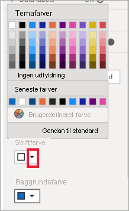
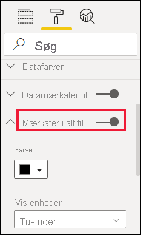
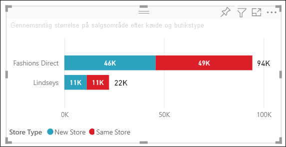

# Tilpas titler, baggrunde, mærkater og signaturforklaringer i visualiseringer

[!INCLUDE[consumer-appliesto-nyyn](../includes/consumer-appliesto-nyyn.md)]    

I dette selvstudium lærer du, hvordan du kan tilpasse dine visualiseringer, på flere måder. Du har mange muligheder for at tilpasse dine visualiseringer. Den bedste måde, du kan lære om dem alle på, er at udforske ruden **Format** (vælg malerrulleikonet). For at hjælpe dig i gang kan du i denne artikel se, hvordan du tilpasser en titel, en signaturforklaring, en baggrund og en mærkat samt tilføjer et tema i en visualisering.

Du kan ikke tilpasse alle visualiseringer. Se den [komplette liste](#visualization-types-that-you-can-customize) over visualiseringer for at få flere oplysninger.

## Forudsætninger

- Power BI-tjenesten eller Power BI Desktop

- Rapporten Retail Analysis Sample

> [!NOTE]
> Når du deler din rapport med en Power BI-kollega, kræves det, at I begge har individuelle Power BI Pro-licenser, eller at rapporten er gemt i en Premium-kapacitet. Se [deling af rapporter](../collaborate-share/service-share-reports.md).

## Tilpas titler på visualiseringer i rapporter

Hvis du vil følge med, skal du logge på Power BI Desktop og åbne rapporten [Retail Analysis Sample](../create-reports/sample-datasets.md).

> [!NOTE]
> Når du fastgør en visualisering på et dashboard, bliver den til et dashboardfelt. Du kan også tilpasse selve felterne med [nye titler og undertitler, links og tilpasning af størrelsen](../create-reports/service-dashboard-edit-tile.md).

1. Gå til siden **New Stores** i rapporten **Retail Analysis Sample**.

1. Vælg det grupperede søjlediagram **Open Store Count by Open Month and Chain**.

1. I ruden **Visualiseringer** skal du vælge ikonet med malerrullen for at få vist formateringsindstillingerne.

1. Vælg **Titel** for at udvide den sektion.

   

1. Flyt skyderen **Titel** til **Til**.

1. Hvis du vil ændre titlen, skal du skrive **Store count by month opened** i feltet *Titeltekst*.

    

1. Ret **Skriftfarve** til hvid og **Baggrundsfarve** til blå.    

    a. Vælg rullelisten, og vælg en farve fra **Temafarver**, **Seneste farver** eller **Brugerdefineret farve**.
    
    

    b. Vælg rullelisten for at lukke farvevinduet.

1. Øg tekststørrelsen til **16 pt**.

1. Den sidste tilpasning, du skal foretage af diagramtitlen, er at justere placeringen, så den står midt i visualiseringen.

    

    På dette tidspunkt i selvstudiet ser titlen på dit grupperede søjlediagram nogenlunde sådan ud:

    

Gem de ændringer, du har foretaget, og gå til næste sektion.

Hvis du vil genindlæse alle ændringerne, skal du vælge **Vend tilbage til standard** nederst i tilpasningsruden **Titel**.

## Tilpas baggrunden i en visualisering

Udvid indstillingerne under **Baggrund** i det samme grupperede søjlediagram.

1. Flyt skyderen **Baggrund** til **Til**.

1. Vælg rullelisten, og vælg en grå farve.

1. Ret **Gennemsigtighed** til **74 %** .

På dette tidspunkt i selvstudiet ser baggrunden på dit grupperede søjlediagram nogenlunde sådan ud:

Gem de ændringer, du har foretaget, og gå til næste sektion.

Hvis du vil genindlæse alle ændringerne, skal du vælge **Vend tilbage til standard** nederst i tilpasningsruden **Baggrund**.

## Tilpas forklaringer i en visualisering

1. Åbn rapportsiden **Overview**, og vælg diagrammet **Total Sales Variance by FiscalMonth and District Manager**.

1. Under fanen **Visualiseringer** skal du vælge malerrulleikonet for at åbne ruden Formatering.

1. Udvid indstillingerne under **Forklaring**:

    

1. Flyt skyderen **Forklaring** til **Til**.

1. Flyt forklaringen til venstre side af visualiseringen.

1. Føj en titel til forklaringen ved at slå **Titel** **Til**.

1. Skriv *Manager* i feltet **Navn på forklaring**.

1. Vælg sort under **Farve**.

Gem de ændringer, du har foretaget, og gå til næste sektion.

Hvis du vil genindlæse alle ændringerne, skal du vælge **Vend tilbage til standard** nederst i tilpasningsruden **Forklaring**.

## Tilpas totalmærkater for stablede visualiseringer
Der kan vises datamærkater og totalmærkater i stablede visualiseringer. I et stablet søjlediagram identificerer datamærkater værdien for hver del af en søjle. Totalmærkater viser totalværdien for hele den samlede søjle. 

Se, hvordan Rien føjer totalmærkater til et stablet diagram, og følg derefter trinnene herunder for at prøve det selv.

> [!VIDEO https://www.youtube.com/embed/OgjX-pFGgfM]

1. Åbn rapportsiden **Oversigt**, og vælg det liggende søjlediagram **Gennemsnitlig størrelse af salgsområde efter kæde og butikstype**.

1. Under fanen **Visualisering** skal du vælge  for at konvertere dette liggende søjlediagram til et stablet liggende søjlediagram. Bemærk, at visualiseringen bevarer sine datamærkater. 

    

1. Under fanen **Visualiseringer** skal du vælge malerrulleikonet for at åbne ruden Formatering.

1. Flyt skyderen **Totalmærkater** til **Til**. 

    

1. Alternativt kan du formatere totalmærkaterne. I dette eksempel har vi ændret farven til sort, øget skriftstørrelsen og valgt at vise værdierne som **tusinder**.

    

## Tilpas farver ved hjælp af et tema

Med rapporttemaer kan du anvende designændringer på hele rapporten, f.eks. bruge virksomhedsfarver, ændre ikonsæt eller anvende ny visualstandardformatering. Når du anvender et rapporttema, anvendes farver og formatering fra det valgte tema på alle visuals i rapporten.

Hvis du vil anvende et tema på din rapport, skal du vælge **Skift tema** fra menulinjen. Vælg et tema.  I rapporten nedenfor bruges temaet **Sollys**.

 

## Visualiseringstyper, du kan tilpasse

Her er en liste over de visualiseringer og tilpasningsindstillinger, der er tilgængelige for de enkelte:

| Visualisering | Titel | Baggrund | Forklaring | Totalmærkater
|:--- |:--- |:--- |:--- |:--- |
| Område | ja | ja |ja | ja  |
| Liggende søjle | ja | ja |ja | ja |
| Kort | ja | ja |i/t | i/t |
| Kort med flere rækker | ja | ja | i/t | i/t |
| Kolonne | ja | ja | ja |  ja |
| Kombinationsdiagram | ja | ja | ja | ja |
| Krans | ja | ja | ja | i/t |
| Kartogram | ja | ja | ja |i/t |
| Tragt | ja | ja | i/t |i/t |
| Måler | ja | ja | i/t |i/t |
| Nøgleinfluencer | ja | ja | i/t |i/t |
| KPI | ja | ja | i/t |i/t |
| Linje | ja | ja | ja |i/t |
| Kort | ja | ja | ja |i/t |
| Matrix | ja | ja | i/t |ja |
| Cirkel | ja | ja | ja |i/t |
| Spørgsmål og svar | ja | ja | i/t |i/t |
| Punktdiagram | ja | ja | ja |i/t |
| Form | ja | ja | ja |i/t |
| Udsnit | ja | ja | i/t |i/t |
| Tabel | ja | ja | i/t |ja |
| Tekstfelt | nej | ja | i/t |i/t |
| Træstruktur | ja | ja | ja |i/t |
| Vandfaldsdiagram | ja | ja | ja |i/t |

## Næste trin

- [Tilpas egenskaberne for X- og Y-aksen](power-bi-visualization-customize-x-axis-and-y-axis.md)

- [Introduktion til farveformatering og akseegenskaber](service-getting-started-with-color-formatting-and-axis-properties.md)

Har du flere spørgsmål? [Prøv at spørge Power BI-community'et](https://community.powerbi.com/)

