# Opret ArcGIS-kort i Power BI

[!INCLUDE[consumer-appliesto-yyyn](../includes/consumer-appliesto-yyyn.md)]    

> [!NOTE]
> Disse visualiseringer kan oprettes og vises både i Power BI Desktop og Power BI-tjenesten. Trinnene og illustrationerne i denne artikel er fra Power BI Desktop.

Denne oversigt ses ud fra synspunktet for en person, der opretter et kort af typen ArcGIS Maps for Power BI. Når en _designer_ deler et kort af typen ArcGIS Maps for Power BI med en kollega, kan denne kollega få vist og interagere med kortet, men ikke gemme nogen ændringer. Du kan finde flere oplysninger om visning af et ArcGIS-kort i [Udforsk ArcGIS Maps for Power BI](https://doc.arcgis.com/en/maps-for-powerbi/use/explore-maps.htm).

Kombinationen af ArcGIS-kort og Power BI tager kort til et helt nyt niveau, som involverer mere end præsentation af punkter på et kort. Du kan vælge mellem grundlæggende kort, placeringstyper, temaer, symboltypografier og referencelag til at oprette fantastiske informative kortvisualiseringer. Kombinationen af autoritative datalag på et kort med rumlige analyser giver en bedre forståelse af dataene i visualiseringen. Selvom du ikke kan oprette et kort af typen ArcGIS Maps for Power BI på en mobilenhed, kan du godt få det vist og interagere med det.

> [!NOTE]
> ArcGIS Maps for Power BI er i øjeblikket ikke tilgængelig for Power BI-rapportserver.

> [!TIP]
> GIS står for Geographic Information Systems.

Nedenstående eksempel bruger et mørkegråt canvas til at vise det regionale salg som et termisk kort i forhold til et demografisk lag for medianen for den disponible indtægt i 2016. Som du kan se, hvis du læser videre, har du forbedrede kortmuligheder, demografiske data og endnu mere overbevisende kortvisualiseringer, når du bruger ArcGIS Maps for Power BI, så du kan fortælle din historie på den bedst mulige måde.

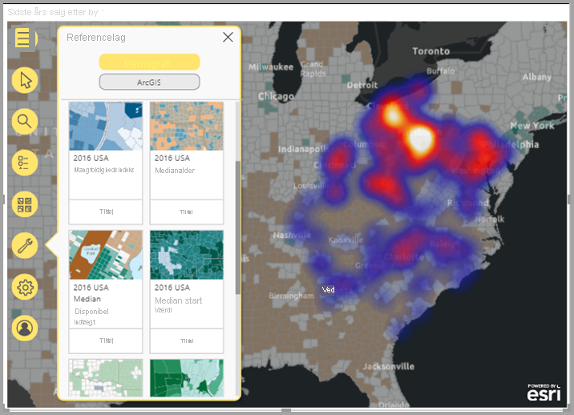

> [!TIP]
> På [**Esris side om ArcGIS Maps for Power BI**](https://www.esri.com/powerbi) kan du se mange eksempler og læse anbefalinger. Du kan også se Esris **[onlinehjælp til ArcGIS Maps for Power BI](https://doc.arcgis.com/en/maps-for-powerbi/get-started/about-maps-for-power-bi.htm)** .

## Brugerens samtykke

ArcGIS Maps for Power BI leveres af Esri ([https://www.esri.com](https://www.esri.com/)). Din brug af ArcGIS Maps til Power BI er omfattet af Esris [vilkår](https://go.microsoft.com/fwlink/?LinkID=826322) og [politik om beskyttelse af personlige oplysninger](https://go.microsoft.com/fwlink/?LinkID=826323). Power BI-brugere, der gerne vil bruge ArcGIS-kort til Power BI-visualiseringer, skal acceptere i dialogboksen til samtykke. Denne dialogboks vises kun første gang, du bruger ArcGIS Maps for Power BI.

## Forudsætninger

I dette selvstudium bruges Power BI Desktop og PBIX-filen med [eksemplet på detailhandelsanalyse](https://download.microsoft.com/download/9/6/D/96DDC2FF-2568-491D-AAFA-AFDD6F763AE3/Retail%20Analysis%20Sample%20PBIX.pbix). ArcGIS Maps for Power BI kan også oprettes ved hjælp af Power BI-tjenesten.

1. Vælg **Fil** > **Åbn rapport** øverst til venstre på menulinjen.
2. Find **PBIX-filen med eksemplet Retail Analysis**, som er gemt på din lokale maskine.
3. Åbn **Retail Analysis Sample** i rapportvisning .
4. Markér  for at føje en ny side til rapporten.

## Opret en visualisering med et kort af typen ArcGIS Maps for Power BI

Hvis du vil føje et kort til en rapport, skal du følge disse trin:

1. Vælg ikonet for ArcGIS Maps for Power BI i ruden Visualiseringer.

    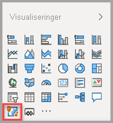

2. I Power BI føjes der en tom skabelon til rapportlærredet. I denne oversigt bruger vi den **Standard**-version, der er inkluderet i Power BI. Hvis du logger på en gyldig ArcGIS-konto med den korrekte licens, har du adgang til flere funktioner. Du kan finde flere oplysninger i [onlinehjælpen til ArcGIS Maps for Power BI](https://doc.arcgis.com/en/maps-for-powerbi/get-started/account-types.htm).

    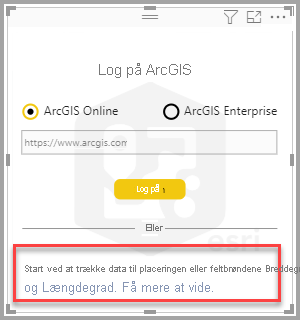

3. Træk et datafelt fra ruden **Field**s (Felter) til feltet **Location** (Placering), eller træk koordinater til de relevante buckets for **Latitude** (Breddegrad) og/eller **Longitude** (Længdegrad). I dette eksempel bruger vi **Butik > By**.

    > [!NOTE]
    > ArcGIS Maps for Power BI registrerer automatisk, hvis de felter, du har valgt, bedst kan ses som en figur eller et punkt på et kort. Du kan justere standarden i indstillingerne (Se [Formatér ArcGIS Maps for Power BI-visualiseringen](#format-the-arcgis-maps-for-power-bi-visualization)).

    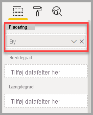

4. Fra feltet **Fields** (Felter) skal du trække en måling til filsættet **Size** (Størrelse) for at justere, hvordan dataene vises. I dette eksempel bruger vi **Salg > Sidste års salg**.

    

Du har oprettet dit første kort af typen ArcGIS Maps for Power BI. Nu kan du finpudse og formatere kortet ved hjælp af grundlæggende kort, placeringstyper, temaer og meget mere.

## Formatér ArcGIS Maps for Power BI-visualiseringen

Sådan får du adgang til formateringsfunktionerne i **ArcGIS Maps for Power BI**:

1. Klik på fanen **Formatér** i ruden Visualiseringer for at få vist formateringsindstillingerne.

    

    ArcGIS Maps-formateringsindstillingerne omfatter:

    * **Lag:** Rediger titlen på listen Lag (ToC), slå listen Lag til eller fra, gør listen forankret over kortet, definer placeringen af den forankrede liste. Listen Lag er som standard slået til og er tilgængelig i de udvidede kortværktøjer .
    * **Kortværktøjer:** Slå navigationsværktøjer til eller fra, lås kortet på dens aktuelle placering, definer placeringen af infografiske kort på kortet. Knapperne Zoom ind og Zoom ud er som standard slået fra.
    * **Placeringstype:** Angivelse af det land/område, hvor dine data er placeret, hjælper med at forbedre nøjagtigheden af placeringer på dit kort. Hvis dine data er i et enkelt land/område, skal du vælge landet/området på rullelisten. Hvis dine data er globale, skal du vælge Verden.
    * **Søg:** Slå funktionen Søg til eller fra, skift pinkodens standardfarve. Søg er som standard slået til og er tilgængelig i de udvidede kortværktøjer .

### Rediger et ArcGIS Maps for Power BI-kort

Når du har føjet data til kortvisualiseringen, bliver kortværktøjerne tilgængelige.

> [!NOTE]
> Dette selvstudium viser kun de funktioner og indstillinger, der er tilgængelige i **Standard**-versionen af ArcGIS Maps for Power BI. Hvis du er logget på en gyldig [ArcGIS-konto](https://doc.arcgis.com/en/maps-for-powerbi/get-started/account-types.htm) med den korrekte licensering, har du adgang til flere funktioner.

Sådan udvider du kortværktøjerne:

1. Klik på knappen Kortværktøjer for at udvide værktøjerne.

    

Kortværktøjerne udvides, så de tilgængelige funktioner vises. Der åbnes en opgaverude for hver funktion, når den er blevet valgt, med mere detaljerede indstillinger.

> [!TIP]
> Esri leverer [omfattende dokumentation](https://go.microsoft.com/fwlink/?LinkID=828772) om brug af ArcGIS Maps for Power BI.

#### Rediger basiskortet

Et grundkort udgør en baggrund eller en visuel kontekst for dataene i et kort. Et grundkort med gader udgør f.eks. en kontekst for dine adressedata. Når du bruger **Standard**-kontoen, er der fire basiskort: Dark Gray Canvas, Light Gray Canvas, OpenStreetMap og Streets.

Hvis du vil ændre grundkort, skal du følge disse trin:

1. Klik på knappen **Grundkort**,  for at få vist galleriet.
2. Vælg grundkortet **Dark Gray Canvas**.

    

    Kortet opdateres ved hjælp af det nye grundkort.

Du kan finde flere oplysninger under [Redigere grundkortet](https://doc.arcgis.com/en/maps-for-powerbi/design/change-the-basemap.htm) i onlinehjælpen til ArcGIS Maps for Power BI.

#### Vis kortlag

I ArcGIS Maps for Power BI arbejder du med geografiske data via lag. Lag er logiske samlinger af geografiske data, der bruges til at oprette kort. De er også grundlaget for geografisk analyse.

Hvis du vil have vist listen Lag, skal du klikke på **Lag**  i kortværktøjerne.

Listen Lag viser hvert lag, der udgør kortet, og hvert lag har sit eget sæt indstillinger, der kan hjælpe dig med at tilpasse og arbejde med kortet. Der vises forskellige indstillinger i menuen, afhængigt af den valgte type lag. Du kan f. eks. ændre symbologi og placeringstype for et lag, der er oprettet ved hjælp af Power BI-data – f. eks. laget **City**, som du har oprettet for dette eksempel, men disse indstillinger er ikke tilgængelige for reference- eller kørselstidslag.

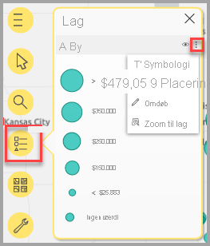

Du kan finde flere oplysninger under [Arbejde med lag](https://doc.arcgis.com/en/maps-for-powerbi/design/work-with-layers.htm) i onlinehjælpen til ArcGIS Maps for Power BI.

#### Angiv placeringstypen

ArcGIS Maps for Power BI bruger en effektiv geoteknologi til at placere positionsdata nøjagtigt på kortet og gengiver automatisk elementer som f. eks. punkter eller grænser, baseret på typen af data. En koordinat for længdegraden gengives f.eks. som et punkt på kortet, mens et delstatsfelt gengives som en grænse eller et polygon. Du kan ændre den måde, placeringer gengives på, ved at angive placeringstypen.

Brug funktionen Placeringstype til at forbedre nøjagtigheden af placeringerne på dit kort. Du kan hurtigt gøre dette ved at vælge et land/område i ruden Formatér i visualiseringen (udvid kategorien Placeringstype, og vælg det relevante land/område), eller få adgang til flere indstillinger ved hjælp af den komplette funktion Placeringstype i ruden Lagindstillinger.

Den komplette funktion **Placeringstype** er tilgængelig via menuen Lagindstillinger og giver dig mulighed for at vælge, om du vil repræsentere dine data som punkter eller grænser (polygoner), ud over at angive det land/område, hvor dataene er placeret. Grænser defineres typisk som geografiske standardområder, f. eks. lande, provinser, postnumre osv. Hvis du vælger grænser og et bestemt land/område for dine dataplaceringer, kan du vælge mellem forskellige standardgrænser, f. eks. amter, folketællingsområder, distrikter eller kommuner. Der er forskellige placeringstyper tilgængelige for hvert land/område.

Følg disse trin for at ændre dataens placeringstype:

1. Vælg det data lag, du vil arbejde med, på listen Lag.
2. Klik på knappen **Lagindstillinger**, og vælg **Placeringstype**.

    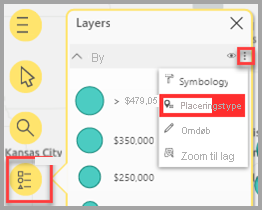

    Acceptér standardværdierne for at gengive placeringerne som punkter på kortet, og angiv **Ét land > USA**.

    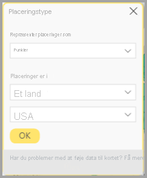

Du kan finde flere oplysninger under [Angive placeringstypen ](https://doc.arcgis.com/en/maps-for-powerbi/design/specify-location-type.htm) i onlinehjælpen til ArcGIS Maps for Power BI.

#### Tilpas kortets symbologi

ArcGIS Maps for Power BI bruger værdier i ruden Felter til at finde ud af, hvordan placeringer skal gengives på kortet. Funktionen **Symbologi** giver dig mulighed for at ændre standardformateringen, så du bedre kan fortælle din historie. Du kan vælge et andet korttema og tilpasse de anvendte symboler og farver, der bruges til at repræsentere placeringer på kortet. Der er forskellige indstillinger for korttemaer og funktioner tilgængelige, afhængigt af de værdier, du har føjet til ruden Felter i kortvisualiseringen.

Hvis du vil ændre et lags Symbology, skal du følge disse trin:

1. Vælg det data lag, du vil arbejde med, på listen Lag.

2. Klik på knappen **Lagindstillinger**, og vælg **Symbologi**.

Ruden Symbologi vises med kategorien Korttema udvidet.

##### Rediger korttemaet

Da vi i dette eksempel har føjet værdier til både feltet **Placering** og feltet **Størrelse**, bruger kortet som standard temaet **Størrelse**.

Hvis du vil ændre korttemaet, skal du følge disse trin:

1. Vælg nogle af de andre kort temaer for at se, hvordan dit kort ændres.

    

2. Vælg temaet **Størrelse**.

Du kan finde flere oplysninger under [Redigere grundkortet](https://doc.arcgis.com/en/maps-for-powerbi/design/change-the-map-theme.htm) i onlinehjælpen til ArcGIS Maps for Power BI.

##### Gennemsigtighed for lag

Hvis kortet indeholder flere lag, kan det være nyttigt at gengive lag med et vist gennemsigtighedsniveau, så elementerne i andre lag stadig er synlige.

Benyt følgende fremgangsmåde for at angive gennemsigtighedsværdien for laget:

1. Udvid kategorien **Gennemsigtighed** i ruden **Symbologi**.

2. Indtast en procentdel i tekstfeltet, eller flyt skyderen til venstre (mindre gennemsigtig) eller til højre (mere gennemsigtig).

##### Symboltypografi

Symboltypografier giver dig mulighed for at tilpasse, hvordan dataene vises på kortet. Standardsymboltypografier er baseret på den valgte placeringstype og det valgte korttema, og de tilgængelige formateringsindstillinger er forskellige, afhængigt af hvilken feltbrønd der indeholder værdier og arten af disse værdier.

Hvis du vil ændre symboltypografien, skal du følge disse trin:

1. Udvid kategorien **Symboltypografi** i ruden **Symbologi**.

2. Rediger symbolindstillingerne efter behov. Vælg en form, farve, gennemsigtighed og konturfarve, tykkelse og gennemsigtighed for symbolet. Udvid kategorien Symbolstørrelse for at ændre disse indstillinger. Der vises forskellige indstillinger, afhængigt af dataenes art og det valgte korttema.

    I nedenstående eksempel vises korttypen **Størrelse**, og flere justeringer af symboltypografien, herunder gennemsigtighed, typografi og størrelse.

    

3. Når du er færdig med at angive formateringsindstillinger, skal du lukke ruden Symbology.

### Analysér dine data

ArcGIS Maps for Power BI indeholder flere værktøjer, der gør det muligt for dig at udforske mønstre i dine data og fortælle en overbevisende historie med et kort.

Analysefunktionerne omfatter:

- Valg af placeringer på kortet
- Søgning efter en bestemt adresse, placering eller et bestemt interessepunkt
- Tilføjelse af et referencelag for at give mere kontekst
- Søgning efter placeringer inden for en angivet radius eller et angivet kørselstidsområde
- Tilføjelse af kort, der viser demografiske oplysninger om det område, der vises på kortet

#### Vælg placeringer

ArcGIS Maps for Power BI indeholder flere forskellige markeringsværktøjer, der kan hjælpe dig med at vælge placeringer på kortet. Der vises forskellige værktøjer, afhængigt af hvilken type lag der aktuelt er valgt på listen Lag.

Følg disse trin for at få vist markeringsværktøjerne:

1. Klik på knappen **Markeringsværktøjer**  for at udvide værktøjssættet.

    Der er fire tilgængelige markeringsværktøjer. Der kan vises forskellige værktøjer i menuen **Markeringsværktøjer**, afhængigt af typen af det aktuelt aktive lag. Da kortet i dette eksempel kun indeholder et datalag, er det kun værktøjerne **Ét valg** og **Flere valg**, der vises.
    
    | **Værktøj** | **Beskrivelse** |
    | --- | --- |
    |  | **Ét valg** – Dette er et værktøj til en enkelt markering, der kan bruges til at klikke på enkelte placeringer. Det er standardværktøjet til markering. Tryk på Ctrl, og klik for at vælge flere placeringer. Når du klikker på dataplaceringer på kortet, markeres de, og der udløses interaktioner med andre visualiseringer. Når du klikker på en tegnestift eller en placering i et referencelag, vises værktøjstippet. |
    |   | **Flere valg** – træk en rektangelvælger for at vælge flere placeringer, eller vælg individuelle placeringer ved at klikke på dem. Ligesom med markeringsværktøjet vises værktøjstippet, når du klikker på en tegnestift eller en placering i et referencelag. Når værktøjet Feltmarkering er aktivt, kan du ikke panorere i kortet. |
    |   | **Vælg referencelag** – Hvis du har føjet et [referencelag](https://doc.arcgis.com/en/maps-for-powerbi/design/add-a-reference-layer.htm) til kortet, skal du bruge dette værktøj til at vælge placeringer ved at klikke på områder i referencelaget. Placeringer, der befinder sig inden for et afgrænset område i en reference, fremhæves. Placeringer i andre områder af kortet er ikke tilgængelige. Dette værktøj vises kun, hvis kortet indeholder et eller flere referencelag, og et referencelag aktuelt er aktivt. |
    |   | **Vælg kørselstid** – Hvis du har føjet et [kørselstidsområde](https://doc.arcgis.com/en/maps-for-powerbi/design/find-nearby-locations.htm) til kortet, skal du bruge værktøjet til valg af kørselstidsområde til at vælge dataplaceringer inden for det definerede område. |
    
2. Vælg en eller flere placeringer på kortet. Du kan højst vælge 250 datapunkter ad gangen.

Du kan finde flere oplysninger under [Angive placeringer på et kort ](https://doc.arcgis.com/en/maps-for-powerbi/design/select-features-on-the-map.htm) i onlinehjælpen til ArcGIS Maps for Power BI.

#### Fastgør en placering

Fastgør en bestemt adresse, placering eller et bestemt interessepunkt på kortet. I dette eksempel skal du søge efter Pittsburgh International Airport.

Følg disse trin for at fastgøre en placering:

1. Klik på knappen **Søg**  i kortværktøjerne for at åbne ruden Søg.
2. Skriv nøgleordene **Pittsburgh international** i søgefeltet.

    Nøgleord kan omfatte en adresse, et sted eller et interessepunkt. Mens du skriver, vises der lignende nylige søgninger eller forslag på baggrund af lignende nøgleord.

3. Vælg **Pittsburgh International Airport** på listen over resultater, og klik på **Luk**.

    Der vises et symbol på kortet, og kortet zoomer automatisk ind på placeringen. Tegnestifter forbliver på kortet i den aktuelle session. Du kan ikke gemme en fastgjort placering på kortet. Den fastgjorte placering vises også som et lag på listen Lag. Du kan omdøbe laget, få vist eller skjule det eller fjerne det fra kortet, som du kan med andre lag.

4. Hvis du vil ændre tegnestiftens farve, skal du udvide kategorien **Søg** i ruden **Formatér** i kortvisualiseringen og vælge en ny farve.

> [!NOTE]
> Funktionen **Søg** erstatter funktionen Nåle, der tidligere var tilgængelig i ArcGIS Maps for Power BI.

Du kan finde flere oplysninger under [Fastgøre en placering](https://doc.arcgis.com/en/maps-for-powerbi/design/pin-locations.htm) i onlinehjælpen til ArcGIS Maps for Power BI.

#### Tilføj et referencelag

Referencelag indeholder kontekst for de Power BI-data, du allerede får vist på et kort. Referencelag kan indeholde demografiske data, f. eks. husstandens indtægt, alder eller uddannelse. De kan også omfatte offentligt delte funktionslag, der er tilgængelige på ArcGIS Online, og som indeholder flere oplysninger om de områder, der omgiver placeringerne på kortet.

##### Tilføj et demografisk lag

ArcGIS Maps for Power BI-standardkontoen indeholder en række udvalgte demografiske lag, der hjælper med at kontekstualisere data fra Power BI.

Hvis du vil tilføje et demografi lag, skal du følge disse trin:

1. Klikke på knappen **Analyseværktøjer**  i kortværktøjerne for at udvide værktøjssættet.
2. Klik på knappen **Referencelag** .

    Ruden **Referencelag** vises med fanen **Demografi** og udvalget af lag.

3. Rul gennem galleriet, og klik på **Tilføj** på miniaturen af det lag, du vil føje til dit kort.

    I dette eksempel skal du finde laget **2016 USA Average Household Income** og klikke på **Tilføj**.
    
    Kortet opdateres, så det nye lag vises.
    
    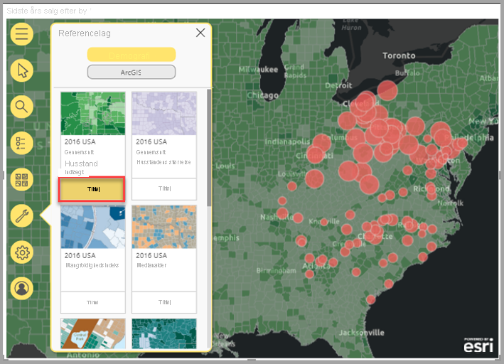
    
Demografiske referencelag er interaktive. Klik på et område for at få vist et værktøjstip, der indeholder flere oplysninger. Du kan også bruge værktøjet **Vælg reference** for at [vælge områder på kortet](https://doc.arcgis.com/en/maps-for-powerbi/design/select-features-on-the-map.htm), der falder inden for et område i referencelaget.

##### Tilføj et referencelag fra ArcGIS

ArcGIS Maps for Power BI gør det muligt for dig at søge efter offentligt delte funktionsniveauer på ArcGIS, så du får adgang til tusindvis af referencelag, som giver oplysninger om de områder, der omgiver placeringerne i dit datalag. Når du logger på ArcGIS Maps for Power BI bruger en gyldig ArcGIS-konto, kan du søge efter indhold i din organisation, organisationens grupper eller offentligt indhold. I dette eksempel vises der kun offentligt delt indhold i søgeresultaterne, fordi du bruger Standard-kontoen.

Hvis du vil tilføje et ArcGIS-referencelag, skal du følge disse trin:

1. Klik på fanen **ArcGIS** i ruden Reference.

2. Skriv **USA Congressional districts** i søgefeltet, og tryk på **Enter**.

    Galleriet udfylder med flere mulige resultater.

3. Find laget USA 116th Congressional Districts, og klik på Tilføj.

    Kortet opdateres, så det nye lag vises.
    
    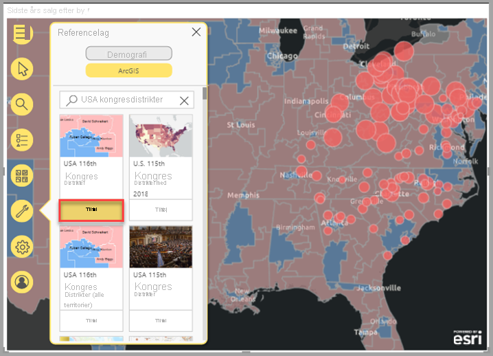
    
ArcGIS-referencelag er interaktive. Klik på et område for at få vist et værktøjstip, der indeholder flere oplysninger. Du kan også bruge værktøjet **Vælg reference** for at [vælge områder på kortet](https://doc.arcgis.com/en/maps-for-powerbi/design/select-features-on-the-map.htm), der falder inden for et område i referencelaget.

#### Find placeringer i nærheden

Du kan bruge placeringer på kortet – herunder en fastgjort placering – som udgangspunkt for at finde og vælge placeringer i nærheden på dit kort. Hvis du f. eks. søger efter et bestemt interessepunkt, kan du vælge placeringer på kortet, der ligger inden for en angivet kørselstid eller -afstand fra det pågældende sted.

I dette eksempel skal du bruge Pittsburgh International Airport, som du fastgjorde tidligere, som udgangspunkt, for at finde placeringer inden for 160 kilometer fra lufthavnen. Brug en lignende fremgangsmåde til at finde placeringer inden for en bestemt kørselstid.

Hvis du vil finde placeringer inden for en bestemt kørselsafstand fra oprindelsesstedet, skal du følge disse trin:

1. Klikke på knappen **Analyseværktøjer**  i kortværktøjerne for at udvide værktøjssættet.

2. Klik på knappen **Kørselstid**  .

    Ruden **Kørselstid** vises.

3. Klik på værktøjet Ét valg, og vælg placeringen **Pittsburgh International Airport** på kortet, som du fastgjorde tidligere.
4. Vælg **Radius** i rullemenuen **Søgeområde**, og angiv en afstand på **160** kilometer.
5. Klik på **OK**.

    Kortet viser en cirkel omkring den fastgjorte lufthavns placering. Ruden Kørselstid udvides, så der vises formateringsindstillinger for kørselsafstandens område.
    
    
    
    Kørselsafstanden vises også som et lag på listen Lag. Du kan omdøbe laget, få vist eller skjule det eller fjerne det fra kortet, som du kan med andre lag.

6. Klik på kørselsafstandens område med værktøjet Vælg kørselstid, mens kørselstidlaget er aktivt på listen Lag.

    Placeringer, der falder inden for søgeområdet, markeres, ikke-markerede placeringer på kortet vises som mindre eller bliver mere gennemsigtige. Andre visualiseringer opdateres for at afspejle de markerede placeringer.

Du kan finde flere oplysninger under [Finde placeringer i nærheden](https://doc.arcgis.com/en/maps-for-powerbi/design/find-nearby-locations.htm) i onlinehjælpen til ArcGIS Maps for Power BI.

#### Tilføj infografikkort

Infografikkort indeholder yderligere detaljer om områder på kortet på samme måde som referencelag. Infografikkort vises øverst på kortet og viser bestemte demografiske oplysninger om området umiddelbart omkring det valgte sted, eller om det generelle område, der vises på det aktuelle kort. Du kan finde flere oplysninger under [Tilføje infografikkort](https://doc.arcgis.com/en/maps-for-powerbi/design/add-infographics.htm) i onlinehjælpen til ArcGIS Maps for Power BI.

### Få hjælp

Esri leverer omfattende dokumentation om brug af ArcGIS Maps for Power BI.

Hvis du vil have adgang til onlinehjælpen til ArcGIS Maps for Power BI fra visualiseringen, skal du følge disse trin:

1. Klik på knappen **Indstillinger**  i kortværktøjerne.

2. Klik på knappen **Hjælp** i ruden **Indstillinger**.
3. Klik på **OK** i det bekræftelsesvindue, der vises.

    Onlinehjælpen til ArcGIS Maps for Power BI åbnes i et browservindue.
    
    - Få svar på [Ofte stillede spørgsmål](https://doc.arcgis.com/en/maps-for-powerbi/get-started/pbi-faq.htm#anchor5) i onlinehjælpen til ArcGIS Maps for Power BI.
    - Du kan stille spørgsmål, finde de seneste oplysninger, rapportere problemer og finde svar i Power BI [community'ets tråd om **ArcGIS Maps for Power BI**](https://go.microsoft.com/fwlink/?LinkID=828771).
    - Hvis du har et forslag til en forbedring, kan du sende den til [Power BI's ideliste](https://ideas.powerbi.com/).
    
### Administrer brugen af ArcGIS Maps for Power BI i din organisation

Power BI giver designere, Power BI-administratorer og brugeradministratorer mulighed for at administrere brugen af ArcGIS Maps for Power BI. I afsnittene nedenfor gennemgås handlingerne for hver rolle.

#### Muligheder for designere

I Power BI Desktop kan designere deaktivere ArcGIS Maps for Power BI under fanen Sikkerhed. Vælg **Filer**  >  **Indstillinger**, og vælg derefter **Indstillinger**  >  **Sikkerhed**. Når ArcGIS Maps er deaktiveret, indlæses den ikke som standard.

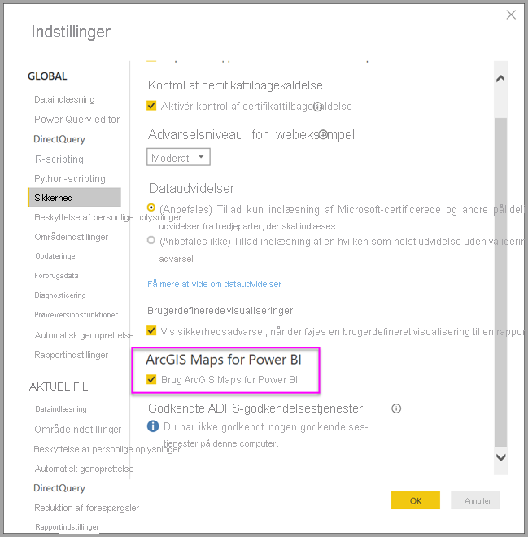

#### Administratorindstillinger

Administratorer kan slå ArcGIS Maps for Power BI fra for alle brugere i Power BI-tjenesten. Vælg **Indstillinger** > **Administrationsportal** > **Lejerindstillinger**. Når ArcGIS Maps for Power BI er deaktiveret, vises ikonet ikke længere i ruden med visualiseringer i Power BI.

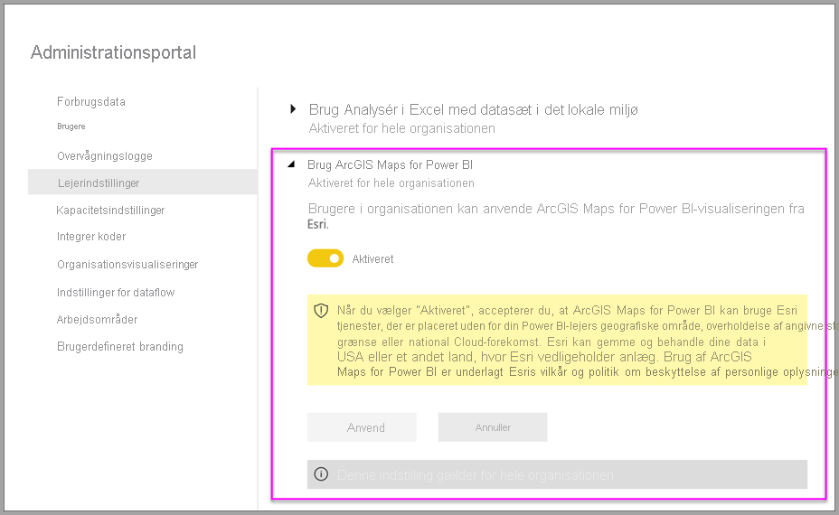

#### Indstillinger for brugeradministratorer

Power BI Desktop understøtter brug af **Gruppepolitik** til at deaktivere ArcGIS Maps for Power BI på tværs af de computere, der er udrullet i en organisation.

| **Attribut** | **Værdi** |
| --- | --- |
| Nøgle | Software\Policies\Microsoft\Power BI Desktop |
| valueName | EnableArcGISMaps |

En værdi på 1 (decimal) aktiverer ArcGIS Maps for Power BI.

En værdi på 0 (decimal) deaktiverer ArcGIS Maps for Power BI.

## Overvejelser og begrænsninger

ArcGIS-kort til Power BI er tilgængeligt i følgende tjenester og programmer:

| Tjeneste/program | Tilgængelighed |
| --- | --- |
| Power BI Desktop | Ja |
| Power BI-tjeneste (powerbi.com) | Yes |
| Power BI-mobilapps\* | Ja |
| Power BI publiceret til internettet | Nej |
| Power BI Embedded | Nej |
| Integration af Power BI-tjenesten (powerbi.com) | No |
| Power BI-rapportserver | No |

\*I mobilmiljøer kan du få vist kort, der er oprettet ved hjælp af den ArcGIS Maps for Power BI-visualisering, der er inkluderet i Power BI ([Standard-konto](https://doc.arcgis.com/en/maps-for-powerbi/get-started/account-types.htm)). Kort, der indeholder Premium-indhold fra ArcGIS, understøttes ikke i mobilmiljøer.

I tjenester eller programmer, hvor ArcGIS Maps for Power BI ikke er tilgængelig, vises visualiseringen som en tom visualisering med Power BI-logoet.

I følgende tabel sammenlignes de standardfunktioner, der er tilgængelige for alle Power BI-brugere, med dem, der er tilgængelige for ArcGIS-brugere, der er logget på:

|  Standard (inkluderet i Power BI) |   Med din ArcGIS-konto |
| --- | --- | --- |
| Grundkort |
| 4 grundkort | Alle Esri-grundkort plus adgang til din organisations grundkort, herunder brugerdefinerede grundkort |
| Geokodning |
| 3\.500 placeringer pr. kort | 10.000 placeringer pr. kort |
 | 10.000 placeringer pr. måned | Ingen månedlig grænse |
| Referencelag |
| 10 referencelag, som indeholder demografi fra USA | Adgang til alle webkort og lag fra din ArcGIS-organisation |
 | Offentligt delte funktionslag i ArcGIS | Offentligt delte funktionslag i ArcGIS |
 | Få adgang til ArcGIS Living Atlas of the World-kort og -lag (funktionstjenester) |
| Infografik |
| Udvalgt galleri med demografivariabler fra USA (7 kategorier) | Fuld adgang til ArcGIS GeoEnrichment-databrowser, herunder demografivariabler fra USA og resten af verden |
|

## Næste trin

- [Interaktion med ArcGIS-kort, som er blevet delt med dig](https://doc.arcgis.com/en/maps-for-powerbi/use/explore-maps.htm)
- [Blogindlæg med meddelelse om opdateringer af ArcGIS Maps for Power BI](https://www.esri.com/arcgis-blog/?s=#ArcGIS%20Maps%20for%20Power%20BI)
- Har du flere spørgsmål? [Prøv at spørge Power BI-community'et](https://community.powerbi.com/)